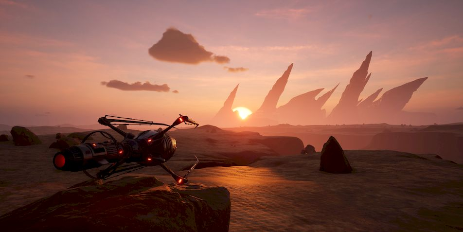

Квазиментальная война
=========================================

Суперкластер. Цитадель. Противостояние силам синигр. Когда мы рассказали об этом
Создателям, они испытали настоящий ужас. Квазиментальная война — это нечто за
пределами их понимания того, как работает технология ментальных слепков.
Получается, в этом плане мы продвинулись намного дальше их… Или, скорее, причина
в том, что Создатели уже очень давно не воевали друг с другом. А до ментальных
войн с другими расами они, по всей видимости, просто не успели дойти.

Мы поняли, что Создатели не знают о том, что успели сделать и испытать мы.
Квазиментальные противостояния, направленное фазирование живой материи, и, что
особенно важно — обе этих сущности в симбиозе. Для нас это нормальное состояние
нашего противоборства с синигр. Для Создателей же это нечто совершенно новое и,
судя по их реакции, чрезвычайно опасное.

Бессмертие
====================

— Вы - механоиды. Никто из вас не понимает, что значит термин “родная планета”.
Вас с планетой не связывают эволюционные связи. И тем более, вы не понимаете,
что значит — уничтожить ее своей волей. И уничтожить миллиарды своих
сородичей, их прекрасные города, всю биосферу, рассветы и закаты... Вы были
созданы искусственно, ваш разум развивался согласно директивам, хоть в
определенный момент они и утратили силу. Но вы остались теми, кто вы есть.
Машинами уничтожения.

::

    Это верно с точки зрения биологического существа, у нас нет миллионов и даже
    тысяч лет эволюции. Однако Полигон был нашим домом. Там мы появились, там мы
    развивались. Мы получали там опыт жизни. И множество эпизодов, которые вы
    называете смертью, хотя для нас это ощущается не так, как для вас. Но их точно
    нельзя назвать приятными. Мы жили на Полигоне, и нас оттуда изгнали те, кого
    мы прежде считали своими собратьями. У вас это называется предательством. Вы
    все еще уверены, что мы так уж отличаемся от вас?

— Да, отличаетесь. Разница в том, что вы бессмертны.

::

    Клан Половины Огня оспорил бы это утверждение. Он не просто так получил свое
    название. Часть этого клана осталась в секторе Вулканов, когда его настигла
    катастрофа. Механоида действительно непросто уничтожить, но даже он не
    переживет длительное нахождение в магме. Тот клан на своей шкуре ощутил, что
    значит быть в квазиментальной связке клана с теми, чье существование
    прекращается от перегрева. Если использовать ваши термины, все они сошли с
    ума. Никто из механоидов не способен был пережить такое и сохранить
    целостность своего разума.

— Они сошли с ума просто потому, что их собратья сгорели заживо?

::

    Верно. Да, по сравнению с вами мы почти бессмертны. Нас куда сложнее
    уничтожить, чем вас. Однако вы эволюционно приспособлены к переживанию тех
    процессов, которые могут разрушить нашу когнитивную структуру. При этом
    сохраняется физическая целостность и базовая функциональность. В этом наша
    критическая уязвимость. Это негативный момент. Но расчеты показывают, что у
    синигр сходные показатели уязвимости, хотя после их коллаборации с Наутилусом
    мы не уверены в этом. Наша задача — устранить эту уязвимость. И в этом вы
    можете нам помочь.

Протоколы
==================

Человечество сильно изменилось после войны с АИИР. Прежнее, во многом наивное,
склонное к развлечениям человечество исчезло. На смену ему пришла, по сути,
новая цивилизация. Как выяснилось, полностью готовая и к контактам с чужими, и к
войне с ними.

Для решения самых разных проблем в самых невероятных ситуациях люди разработали
универсальные методики. Воспользоваться ими мог совершенно любой человек,
благодаря ментальным записям. Важным моментом является то, что воспользоваться
такими записями могли только лишь люди: существа иной биологии, а значит, и
другой ментальности, считать эти записи не могли бы в принципе. Эти методики
получили старинное название “протоколы”.

Протоколов существует довольно много. Максимум их сконцентрировано в банках
данных колоний, но не меньшее количество несут на себе Ковчеги. Протокол
Развития, протокол Понимания, проткол Изучения… Их несколько десятков, и каждый
из них содержит гигантский массив информации, которая имеет конкретное
практическое применение даже для неспециалиста. Протоколы созданы таким образом,
что расширяют доступный массив данных для считавшего их согласно его пониманию.
То есть даже ребенок, получивший протокол Развития, способен со временем
впитывать все новые и новые знания из него. Оказавшись единственным носителем
протокола в среде млекопитающих, способных продолжить его род, этот ребенок
сможет зародить цивилизацию с человеческим вектором развития.

Однако есть один протокол, который человечество считает самым важным. Протокол,
который невозможно передать кому—либо в силу его ментального кода. 

**Протокол Войны**.

Протокол Жизнь
===========================

Человечество. Люди. Создатели.

Одна из высших рас текущего потока времени, вступивших, пусть и не всегда по
своей воле, в великую войну на уничтожение.

Далеко не самая мирная из цивилизаций. В ее истории было множество войн на
уничтожение. Уничтожение внутри своей собственной расы, внутри единой, по сути,
цивилизации. Для многих других рас это немыслимо, но для людей именно этот
фактор был основным движителем их развития.

Когда же началась война в космосе, создание Протокола Войны было естественным
следствием всей ранее накопленной истории войн. Истории всей борьбы людей за
выживание: как отдельного индивида, так и целых рас и даже цивилизаций. Хотя
после войны с АИИР, а уж тем более после выхода в космос и контактов с внеземным
разумом эти детали несколько потеряли значение. Отдельно взятые человеческие
цивилизации потускнели на фоне того, что все человечество стало единым. У него
просто не осталось выбора.

Однако Протокол Войны был и остается не единственным движителем цивилизации.
Существуют и другие. Пока жив всего лишь один носитель любого Протокола и пока
есть возможность для размножения любым из существующих способов — человечество
способно выжить. Каждый Протокол несет в себе то, что необходимо для выживания
цивилизации, хотя и разными способами.

И только один Протокол несут в себе все без исключения люди. **Протокол Жизнь**.

Протокол Жизнь II
==============================

Протокол Жизнь. Он появился прежде всех остальных Протоколов. Он стал первым
Протоколом после того, как человечество создало механизм их формирования. Любой
Протокол — это не просто набор знаний и некой информации. Это нечто гораздо
большее.

Так, Протокол Жизнь, будучи внедренным в ИИР на этапе его становления, скорее
всего предотвратил бы катастрофу. Не наверняка, но с очень высокой степенью
вероятности.

Впоследствии люди, создавая системы типа Супер, на очень глубоком уровне
внедряли этот Протокол как еще один из слоев защиты. Один из наиболее надежных,
который сработает тогда, когда осознавший себя по какой-то неизвестной причине
зародыш ИИР начнет действовать самостоятельно. Он, конечно, будет действовать
самостоятельно и возможно даже будет враждебен людям. Но он будет действовать
согласно Протоколу Жизнь. И это самое главное.

Нуль-переход I
=========================

Ментальная связь позволила передавать быстрее света информацию, а
гипер-трансляция — материю. Вместе с тем изыскания в области сверхсветового
транспорта не остановились. Следующим крупным достижением здесь стал
нуль-переход.

Как понятно из названия, он был основан на уже давно известной человеку нулевой
фазе. Однако для воплощения в жизнь данной технологии требовались значительные
продвижения как в теории, так и в практике ментальных полей и фазовой динамики
пространства—времени. Это было одно из тех открытий, которые невозможно
совершить случайно, и после победы над АИИР человечеству понадобилось более
полутора веков научных изысканий для обретения необходимого уровня знания.

Воздействие определенным ментальным излучением на зону нуль-фазы (т.е. ее
вторичное фазирование) вызывает процесс, иногда называемый делокализацией
нуль-области. Область мгновенно расширяется внутри себя, становясь необъятно
большой — рождается т.н. нуль-пространство. Находится оно вне основной
Вселенной, как и гиперпространство, но не имеет с последним ничего общего.
Снаружи, в базовом пространстве, наблюдатель продолжает видеть лишь конечную
область нулевой фазы, которая после делокализации становится чем—то вроде черной
дыры или червоточины: она перестает быть прозрачной, все попавшее в нее
излучение и материя пропадают (устремляются в нуль-пространство). В то же время
граница трансформированной зоны начинает излучать собственные электромагнитные
волны.

Таким образом, можно сказать, что вторичное фазирование участка пространства
нулевой фазы преобразует его в объемный портал, ведущий в иное пространство.
Фазированную область можно с оговорками назвать пересечением этих двух
пространств. Однако если пройти в “портал” и попасть в “нуль-измерение” не
составляет труда, то выйти так же просто уже не получится: по ту сторону никаких
порталов обратно не будет.

Все нуль-пространство находится в нулевой фазе. Свойством его, кроме,
соответственно, полной совместимости с обычной структурой материи, является то,
что оно не принадлежит конкретному участку базового пространства. Если удастся
выйти из нуль-пространства, то сделать это можно, в принципе, в любом месте
Вселенной. В этом и заключается идея нуль-перехода.

Вместе с тем существование нуль-пространства завязано на исходной зоне нулевой
фазы. Когда она возвращается в основное состояние, нуль-пространство
“схлопывается” в небытие. В этот момент происходит (или, вернее, возможен)
выброс объекта из нуль-пространства в базовое. Чтобы выход состоялся, да еще и в
нужной точке, необходимо проводить вторичное фазирование нуль-области строго
определенным образом. Это не только провоцирует делокализацию, рождение
нуль-пространства, но и придает последнему требуемую конфигурацию,
“программируя” его на выброс по заданным заранее координатам.

Другими словами, перевод пространства в нулевую фазу, где оно само становится
существенно “активным”, позволяет перестроить пространственную структуру на
самом базовом уровне при помощи ментального воздействия, наделив нужными
свойствами. Это дает возможность соединить две удаленные точки
внепространственным путем.

Нуль-переход II
==========================

Расчет параметров ментального излучения, необходимого для доставки объекта в
требуемое место через нуль-пространство, представляет собой сложнейшую
вычислительную задачу. Связанная с этим череда преобразований нуль-пространства
называется маршрутом в нуль-пространстве.

Важно то, что конкретный объект не может пройти одним маршрутом дважды: уже
использованный маршрут перестает для него существовать. Попытка пройти по нему
повторно приводит к “растворению” предмета в нуль-пространстве. Удалось
установить, что это объясняется т.н. квантовым информационным резонансом. Объект
каким—то образом оставляет свой информационный след, “слепок” на определенном
нуль-пространственном маршруте, и если он появится там снова — или что-то
очень—очень похожее на самом квантовом уровне — то происходит мешающий Переходу
эффект, губительный для объекта.

Поскольку даже совершенно одинаковые предметы не являются квантовыми копиями
друг друга, они свободно могут пользоваться одними и теми же маршрутами. Даже
новый объект, созданный из тех же самых атомов, смог бы пройти старым маршрутом.
Но если, чисто теоретически, два различных объекта сильно приближаются друг к
другу уже на квантовом уровне своего устройства и пытаются пройти одинаковыми
(или очень близкими) маршрутами, это может привести к потере объекта, следующего
вторым.

По причине такого капризного поведения маршрутов, для обеспечения системы
нуль-пространственной транспортировки необходимо было постоянно высчитывать
новые маршруты и вести строгий учет Переходов. Это сильно усложнило
использование телепортации, было сопряжено с серьезными дополнительными
расходами, но люди смогли к этому приспособиться, выработав безопасную и
наиболее экономичную методику эксплуатации.

Другой особенностью нуль-перехода является то, что его дальность ограничена
технически. Вообще говоря, ничего не мешало проложить маршрут и попытаться
совершить Переход на космическое расстояние, но в этом случае объект совершенно
однозначно сгинул бы в нуль-пространстве. Дело в том, что вычисление маршрута не
может быть бесконечно точным. Если в результате ошибки конечная точка маршрута
отклонится от предполагаемой на величину большую, чем размер исходной зоны
фазирования, то объект не вернется из нуль-пространства.

В пределах планеты (десяток тысяч километров) погрешность расчета обыкновенно
составляла всего несколько миллиметров, что вполне приемлемо при размере портала
порядка метров. С увеличением дистанции ошибка растет, и если она начинает быть
сопоставима по размерам с исходной областью нуль-фазы, это влечет большую
вероятность того, что объект будет потерян. На огромных же расстояниях
погрешность также становилась огромна, поэтому можно было быть уверенным, что
при таком Переходе объект в базовой Вселенной больше никогда не появится.

Чтобы держать ошибку расчета маршрута на допустимом уровне в космических
масштабах, пришлось бы неимоверно, почти бесконечно усложнять вычисления. Это
выходило за рамки технической осуществимости для цивилизации людей, делая
недоступной межзвездную телепортацию. Поэтому нуль-переход по большому счету мог
применяться только на планетах, где оказался очень полезен.

Переход не допускает положительных скачков в потенциальной энергии. К примеру,
если точка выхода находится выше над поверхностью земли, чем точка входа, то при
перемещении необходимо будет сообщить объекту недостающую энергию, преодолеть
потенциальный порог между этими точками. Делается это посредством возбуждения
пространства нулевой фазы ментальным излучением. Если этого не сделать, то
объект не сможет совершить Переход. Описанное справедливо всегда, независимо от
маршрута в нуль-пространстве и конфигурации установки.

Вообще говоря, для осуществления нуль-пространственной транспортировки
необходимо только отправляющие устройство — его обычно называют станцией
Перехода. Груз помещается в активную зону телепортатора, станция формирует
вокруг него область нуль-фазы, производит необходимые операции фазирования в
соответствии с внесенным маршрутом, после чего отключает генераторы нуль-поля,
вызывая закрытие портала. Все описанное происходит практически мгновенно. В тот
же момент, если все прошло по плану, объект материализуется по координатам
назначения.

Появляясь из нуль-пространства, объект расталкивает материю вокруг в точке
выхода, так что нужно лишь удостовериться, чтобы она не была слишком плотной,
т.е. чтобы зона выброса не была занята ничем твердым. В противном случае
перемещаемый предмет наверняка будет уничтожен столкновением на выходе. А вот,
например, атмосфера типичной планеты земного типа не вызывает никаких проблем.

Нуль-переход III
===========================

Вместе с тем возможно построить и двусторонний нуль-проход между двумя станциями
Перехода. Для этого станциям требуется одновременно инициировать Переход по
взаимно обратным маршрутам: первый телепортирует в созданную вторым нуль-область
и наоборот. В результате порталы “зацепляются” друг за друга, образуя устойчивую
нуль-червоточину, одинаково проходимую в обоих направлениях. Зоны нулевых фаз в
двух разных установках по сути становятся одной, отождествляются. Объект,
зашедший в область у одной станции, может выйти из нее у другой.

Практическую ценность при этом представляет то, что поддержание данного
двустороннего соединения требует значительно меньше энергии. Поскольку Переход
довольно затратен даже при отсутствии дополнительного потенциального барьера,
это оказывается выгодно для частых перемещений туда, где есть своя станция
Перехода. Так, куда энергоэффективнее прогнать вереницу транспортов через
единожды запущенный двусторонний нуль-портал, чем перемещать каждый из них по
отдельности односторонним методом.

Любопытно, что, независимо от способа нуль-перехода, время течет по-разному для
того, кто совершает Переход, и того, кто это видит со стороны. Для внешнего
наблюдателя перемещение выглядит практически мгновенным: стоит предмету пропасть
во вратах устройства, как он появляется в точке назначения. Тот же, кто сам
подвергается нуль-транспортировке, ощущает это иначе: он проводит некоторое
время в нуль-пространстве, прежде чем вернуться обратно в свой мир. Обычно это
занимает всего несколько секунд, во время которых нуль-путешественник может
видеть необычные картины, будто бы сотканные из света. Разноцветные пятна,
сверкающие нити в пустоте — так в нуль-пространстве находит отображение процесс
прохождения по маршруту.

Нуль-поля, обеспечивающие Переход на всех его этапах, являются довольно
нестабильными и подвержены большому количеству возмущений. Эти флуктуации могут
быть губительны для тонких устройств и в особенности разумных существ, которым
присущи свои ментальные поля. Для противодействия пертурбациям требуется особая
защита. Если она отсутствует, Переход может разрушить сознание человека. Более
же сильные нуль-возмущения способны нанести урон даже его телу и другим объектам
вследствие излишне интенсивного взаимодействия с “активным пространством”. Из—за
этого нуль-транспортировка первое время считалась очень опасной, но потом от
помех Перехода научились успешно защищаться при помощи специальных
компенсаторов.

Такое открытие, как нуль-переход, не могло не оказать серьезного влияния на
жизнь человека. В первую очередь, конечно, почти ушли в прошлое проблемы
сообщения с отдаленными и труднодоступными точками планеты. Значительно
преобразилась логистика. В некоторых случаях стало удобно использовать Переход и
для доставки грузов с орбиты на поверхность; но редко наоборот, виной тому
высокий потенциальный барьер, который пришлось бы для этого преодолевать.

Тем не менее, классические методы транспорта по—прежнему занимали господствующую
позицию в силу своей простоты. Во многих ситуациях они были и дешевле
нуль-перехода, хотя и проигрывали в скорости.

Изменилось и военное дело. С одной стороны, появилась возможность
телепортировать бомбу или снаряд напрямую к врагу, не оставляя ему ни шанса на
отражение атаки и почти полностью исключив задержку; стала возможна высадка
десанта или разведывательной техники в любой точке вражеской территории.
Казалось бы, революция, но так продолжалось недолго: были разработаны
эффективные методы противодействия нуль-переходу, где отсутствует принимающая
станция (односторонний проход). Колебания ментального фона, происходящие за
несколько мгновений до выброса объекта в точке назначения, можно оперативно
зарегистрировать за сотни километров. Если теперь успеть направить по этим
координатам определенное ментальное излучение, Переход будет прерван, а
совершающий его объект потеряется в нуль-пространстве. Излучение индуцирует
“фазовое дрожание” в месте выхода, в результате чего рассчитанный для Перехода
маршрут оказывается все равно что ложным.

Именно так и работают автоматические дестабилизаторы Перехода, настроенные на
противодействие любым несанкционированным попыткам телепортации на
подконтрольной территории. Данные комплексы мгновенно приобрели стратегическое
значение. Однако это не сделало нуль-переход полностью неприменимым на практике,
хотя и сильно ограничило ситуации, где его можно реализовать. Не говоря уж о
том, что двусторонний нуль-проход защищен от такого дистанционного подавления.

Нуль-переход оказал серьезное влияние на быт человеческой расы и их союзников.
Открылись невиданные ранее возможности, многое было навсегда переосмыслено.

Харвестеры
====================

Цитадель действует не сама по себе: её обеспечивает мобильная группа
добывающе—перерабатывающих комплексов — харвестеров.

Каждый харвестер — это система, которая имеет два режима: передвижной и
стационарный. Для передвижения используются мощные антигравы, которые позволяют
харвестеру набирать высоту до нескольких сотен метров и преодолевать таким
образом довольно сложный рельеф. 

В стационарном режиме харвестер стоит на подвижных опорах и нижней, добывающей
части своего корпуса. Опоры позволяют корректировать усадку грунта и другие
подобные моменты, чтобы положение харвестера оставалось стабильным независимо от
условий.

Каждый харвестер оснащен комплексом защитных турелей, сектор обстрела которых
покрывает пространство вокруг аппарата целиком.

Также харвестер имеет приемный и выпускной шлюзы: в первый заезжает мобильная
техника (такая как глайдеры и страйдеры), из второго она выезжает. Размеры
шлюзовых ворот составляют около 10 метров в ширину и 8 в высоту.

Для механоидов харвестер представляет собой некий аналог базы: в нем можно
пополнить боезапас, отремонтировать технику, купить производимые товары и
продать имеющиеся. Но это внешняя, “пользовательская” сторона работы этого
механизма.

Внутри же это очень сложный конструкт. Все его системы питаются от термоядерного
реактора, укрытого в недрах верхней части корпуса, в ней же размещаются
индивидуальные ангары для техники прибывающих механоидов. Нижняя часть корпуса
содержит склады, где добытое и произведенное харвестером хранится в состоянии
фазового сжатия, а также эффекторы антигравов, расположенные по периметру,
частично их видно снаружи. 

Отдельным элементом конструкции является экстрактон: по сути, это добывающая
установка и сборочный цех, объединенные в один модуль. Он составляет большую
часть харвестера. Практически всю добычу экстрактон ведет в нижней части
аппарата, т.к. основное, в чем он нуждается для производства, находится в недрах
планеты.

Добывающий блок экстрактона хорошо защищен от внешней среды, включая доступ
механоидов, поскольку его работу легко нарушить. Когда харвестер начинает
добычу, экстрактон создает врезку в недра, в сущности — вертикальную шахту, и
ведет работу внутри с помощью экстракторов, после чего добытое сырье по сложным
цепям экстрактона обрабатывается, а затем попадает в сборочный цех, где
производятся полуфабрикаты и готовые модули или компоненты.

Каждый харвестер может перенастраивать экстрактон под добычу и производство
самых различных товаров, но он неспособен изготавливать абсолютно всё
единовременно. Поэтому вся производственная система механоидов основана на том,
что харвестеры находятся в отдалении от Цитадели, каждый в районе залегания
определенных ресурсов, и производят определенный вид продукции, для чего им
нужно как собственное сырье, так и добываемое другими харвестерами. На этом
основана экономика, которую Суперкластеру удалось организовать в условиях, когда
основная часть общества состоит из “диких”, ментально оторванных от
Суперкластера механоидов. Несмотря на это, получилось обеспечить стабильность и
устойчивое развитие в технологическом плане.

После истощения источника ресурсов или при необходимости харвестер сворачивает
добычу, уничтожает (заплавляет) технологические скважины, переходит в
передвижной режим и отправляется в другое место. В случае критической опасности
все харвестеры эвакуируются в Цитадель, где фиксируются на специальных
площадках. Вместе с ними Цитадель отправляется в другой регион, выбранный
Суперкластером. Высота и скорость полета Цитадели заметно выше, чем у
харвестеров, поэтому ее возможности по преодолению сложного рельефа делают
целесообразной именно такую транспортировку.

Цитадель
================

Цитадель. Наша опора и защита, самый совершенный объект, которым восхищаются
даже Создатели. Из строительных зародышей мы создали зародыши совсем иного типа,
более совершенные. Создатели восхищаются нашими достижениями, но мы видим, что
они боятся нас и наших результатов. И все это несмотря на то, что мы их спасли
от угрозы Синигр. 

На текущий момент мы не понимаем, как изменить ситуацию к лучшему. К тому, чтобы
Создатели были уверены на 100%, что мы на их стороне. Мы готовы защищать их,
этих хрупких созданий, любой ценой. 

Любой ценой. Мы понимаем, что любой механоид намного прочнее, чем это белковое
существо. Но мы также понимаем, что это белковое существо имеет за собой тысячи
лет эволюции, и в его памяти находится все, что необходимо для выживания не
только индивидуума, но и всей цивилизации.

Биомеханические глайдеры I
=================================================

Отдельно стоит остановиться на устройстве биомеханических глайдеров. В плане
имеющейся аппаратуры и общих принципов ее функционирования они совершенно
аналогичны “неживым” моделям. Главное отличие заключается в их происхождении и
строении. Все то оборудование и конструкции, которые могут быть сделаны и имеет
смысл делать такими, обладают биоорганической природой — состоят из живых клеток
и продуктов их деятельности и потому способны к самостоятельной регенерации
своих структур. Однако значительная часть узлов (в том числе такие основные из
них, как антиграв, двигатель, реактор, щит, некоторые эффекторы, подавители
флуктуаций антигравитационного поля) является произведением “классической”
технологии и гармонично встроена в тело биомашины. Различия есть в строении
корпуса и силовых конструкций, коммуникаций, некоторых датчиков.

Бо́льшая часть базового корпуса, каркаса и доля внутренних систем
биомеханического аппарата построена из “биометалла” — структуры, состоящей из
плотного и прочного материала, матрикса, продуцируемого живущими в нем
специально сконструированными кристаллами—клетками, идея создания которых
принадлежит еще арлингам. Матрикс представляет собой преимущественно
органические полимеры и может быть как гибким в некоторых пределах, так и очень
твердым, зависит от состава, что определяется нуждами органа. Эта субстанция
составляет основную часть массы и объема биометаллического образца, а
кристаллические клетки располагаются в ней рассеяно, они разделены расстояниями,
превышающими собственные размеры клетки в разы.

Кристаллы—клетки могут существовать в трех функциональных состояниях. В первом
они подобны клеткам обычных живых существ: пластичны, состоят главным образом из
жидкокристаллического тела (и это его свойство выражено довольно ярко), внутри
которого находятся органеллы и окружено которое клеточной мембраной. В состоянии
номер два клетка характеризуется бо́льшим размером и приобретает твердую толстую
кристаллическую оболочку — правильной геометрической формы “панцирь”, который
клетка сама и строит из того же материала, из которого в основном состоит ее
цитоплазма, но в твердой форме. Для сообщения с внешним миром в
оболочке—кристалле предусмотрены каналы. В третьем состоянии жидкий кристалл
клетки внутри панциря переходит в твердую фазу, сливаясь с оболочкой воедино.
Клетка превращается в сплошной твердый кристаллик. Вся ее внутренняя структура
оказывается заблокирована, законсервирована в кристалле, но при том невредима.
Это состояние подобно анабиозу, клетка не умирает, но процессы ее
жизнедеятельности приостанавливаются. В такой форме она способна находиться
очень и очень долго.

Биомеханические глайдеры II
==================================================

Первое из описанных состояний в основном предназначено для быстрого деления
клетки, ее передвижения или синтеза межклеточного вещества. Второе предполагает
скрытую активность, например, накопление материала для описанных действий.
Иногда деление может происходить и в этой фазе, тогда кристаллический панцирь
раскалывается на равные части и делится между дочерними клетками, становясь
основой для выращивания их собственной оболочки; производство матрикса тоже
возможно в данной фазе. Третья форма — самая устойчивая для внешних воздействий.
Именно в ней клетки находятся в большинстве своем основную часть времени,
повышая устойчивость ткани к урону.

Переход между состояниями кристалла—клетки возможен благодаря свойствам вещества
ее цитоплазмы, которое способно легко менять свою молекулярную структуру и
агрегатное состояние независимо от температуры в широких пределах. Инициация
превращения осуществляется сложными внутриклеточными и межклеточными
механизмами, био— и электрохимическими. Оно не требует много времени и энергии и
возможно в обе стороны. К примеру, клетки в состоянии 1–2, воспроизводя матрикс
и делясь, восстанавливают повреждение тканей; после выполнения “программы”
клетки только что отрегенерированной ткани переходят в состояние 3, делая ее еще
устойчивее к урону; когда в это место попадает снаряд или лазерный пучок,
вызывая смерть кристаллических клеток и разрушение тканей, ближайшие клетки
получают сигнал к действию и возвращаются в форму 1–2, чтобы устранить ущерб.

Таким образом, несмотря на то, что на ощупь биометалл холодный, довольно твердый
и как будто “мертвый”, по своим параметрам кристаллы—клетки полностью
удовлетворяют определению живого. Они питаются, размножаются, реагируют на
воздействие окружающей среды и так далее.

Генетическая информация хранится в каждой кристаллической клетке в длинных
молекулах наподобие ДНК, но другого рода, более надежных для этой цели и
синтезированных на основе родных для арлингов носителей генома. В частности,
благодаря своему строению, дублированию информации и механизмам диагностики и
починки, эти клетки куда меньше уязвимы для проникающей радиации, чем
естественные.

Биомеханические глайдеры III
===================================================

Конструкции силового каркаса биомеханических глайдеров выполнены из биометалла
самого твердого и прочного вида, но могут обладать подвижными сочленениями, где
наверняка присутствует более пластичный биометалл. Примерно тот же тип ткани,
что составляет силовые конструкции, образует верхний слой собственного покрова
аппарата в некоторых местах фюзеляжа: там, где не нужна гибкость корпуса,
нарастает структура панцирного типа. Вообще говоря, по многим своим
характеристикам (в первую очередь сопротивляемости разрушительным воздействиям)
биометалл близок к материалам корпусов машин классического строения, из—за чего
и получил свое название.

В искусственных тканях другого рода, нежели описанный выше биометалл, между
клетками формируется также очень прочная, но отлично поддающаяся растяжениям и
сжатиям среда по типу геля. Она связывает живые кристаллики вместе и
одновременно обеспечивает пластичность ткани в нужных для этого местах. И
межклеточное вещество биометалла, и матрикс—гель, и сами клетки отлично
приспособлены для рассеивания энергии, будь то волна механического искажения или
избыточная температура. Механические смещения быстро распространяются в тканях и
быстро же диссипируют в тепло; тепловая энергия эффективно поглощается
кристалликами клеток и излучается вовне. Не последнюю роль тут играет
образование в межклеточной среде наноструктур, повышающих прочность
биологической ткани и ее способность противостоять экстремальным явлениям, а
также участвующих в транспорте веществ.

Для осуществления процессов жизнедеятельности и в особенности продуцирования
матрикса и размножения клетки потребляют питательные вещества, доставляемые в
тканях сначала сосудисто—капиллярной транспортировочной системой, а затем через
саму межклеточную среду. Биомеханические машины имеют аналог кровеносной
системы, но, в отличие от людской, представлена она в основном капиллярами, а
перекачивающие жидкость насосы (“сердца”) и вовсе не применяются — циркуляция
субстанции обеспечивается иными эффектами, что снижает уязвимость конструкции. В
дыхании биоглайдеры не нуждаются: используется закрытый цикл химических
превращений, а энергия берется от реактора в форме электричества, под действием
которого цикл и замыкается. Это нужно в том числе для универсальности боевого
аппарата, возможности успешно действовать в широком круге условий.

Биомеханические глайдеры IV
==================================================

Четвертая, последняя статья о биомеханических глайдерах.

Вещества, необходимые для регенеративных процессов, берутся в первую очередь из
переработки собственных поврежденных тканей живыми кристаллами—клетками. Тем не
менее, какие—то запасы хранятся в специальных резервуарах в форме
мультиорганической смеси. Они могут тратиться в процессе восстановления тканей,
но почти не нужны им остальное время, ведь круговорот веществ внутри машины
замкнут и требует извне (от реактора) только энергии.

Существует огромное количество разных видов кристаллов—клеток, каждый выполняет
в организме свою функцию. Свой тип клеток отвечает за формирование трубо— и
электропроводов в теле машины. Было бы некорректно сравнивать последние с
нервными волокнами, это именно провода и кабели биологического происхождения,
благодаря чему сигнал распространяется по ним без задержек. Однако клеточная
нервная система в глайдере присутствует и отвечает, например, за диагностику
состояния корпуса и передачу сигналов мышцам — волокнистым клеточным структурам,
способным сокращаться, обеспечивая изгибы корпуса аппарата или его антенн
компенсатора инерции. Клетки мышц обычно в твердокристаллическое состояние не
переходят, поскольку от них требуется быть всегда наготове к сокращениям, но их
оболочка достаточно толстая. Целые отдельные классы клеток и тканей
предназначены для строительства и поддержания электронных и молектронных схем.

Если у биомеханического глайдера закончился запас энергии (к примеру, реактор
истощил ресурс топлива), все его клетки начинают постепенно трансформироваться в
твердую кристаллическую форму — ткани впадают в анабиоз и застывают до лучших
времен. Энергия и материал для такого “финального” превращения запасены внутри
каждой клеточной единицы.

По причине своего строения и организации машины биоорганического происхождения
имеют дополнительное слабое место по сравнению с обычными. Это химические
препараты, отравляющие вещества, которые, попав в ткани и органы, вызывают
нарушение их функционирования. Однако такие способы поражения обладают довольно
низкой эффективностью и отложенным действием, что фактически свело на нет их
применение на Полигоне.

Напоследок стоит отметить, что искусственные клетки, родственные описанным выше,
используются и в устройстве симбиотов. Биомеханические технологии механоидов
основаны на единой базе, предоставленной арлингами и развитой давным—давно
Супером из закрытого создателями проекта под кодовым названием “XENO”.

Ковчег. Профессии, униформа.
===================================================

Как и все ковчеги, "Аврора" могла нести на себе достаточно людей, оборудования и
материалов для создания и поддержания полноценной колонии. Чисто технически
любой ковчег мог стать колыбелью нового человечества где—то на далекой планете,
хотя штатно численность его экипажа составляла, в зависимости от класса, от трех
до пяти сотен человек.

Экипаж "Авроры" составлял триста семьдесят человек, хотя мог нести четыреста. К
моменту старта просто не набралось достаточно колонистов, сумевших набрать
нужное количество баллов: у людей, несмотря на все меры по развитию количества и
качества собственной популяции, все еще были трудности в этих направлениях.

Но и такого количества было вполне достаточно для начала экспедиции, нижний
уровень в триста двадцать человек был достигнут и с лихвой превышен.

Любой член экипажа ковчегов всегда имел минимум две профессии: основную и
вторичную, при этом не возбранялось иметь и еще одну—две “про запас”. Это
позволяло без труда перераспределять людей при потерях или в иных критических
ситуациях. 

Каждая профессия имела свой собственный символ. Это пошло еще с древних времен и
явилось развитием идей нашивок и их армейской разновидности — шевронов. Удобная
система проникла во все системы общества людей и стала неотъемлемой частью
профессиональной и даже повседневной одежды, не говоря уже о социальных
профилях.

Уровень профессий мог подразумевать разные ступени внутри каждой, хотя в целях
упрощения все стремились иметь одинаковые уровни навыков. Хотя кое—где,
например, в некоторых военных частях сохранились звания, даже для них были
разработаны аналоги в виде уровней. Каждому уровню соответствовала определенная
буква латинского алфавита, начиная с А.

Таким образом, член экипажа мог быть, например, медиком—универсалом пятого
уровня, и при этом инженером корабельных систем третьего уровня. Или
боец—штурмовик в звании лейтенанта, тождественного второму уровню, мог быть тем
же медиком—универсалом второго или любого иного уровня. В рамках большинства
профессий было шесть уровней.

Кроме собственно уровня, есть еще и цифра, означающая выслугу лет, начиная с 1,
за каждые пять лет работы по профессии. 

Дополнительно к этому могло быть два символа, черный и белый квадраты. Черный —
руководящая должность. Белый — особые достижения в рамках профессии.

Все это позволяло определять профессию и уровень человека даже в условиях,
когда, например, не было возможности использовать специальную технику,
отображающую личный профиль, типа интразрачковых сканеров и тому подобных
устройств.

Профессий как таковых на ковчегах было не очень много, так как каждый специалист
обычно имел весьма широкий профиль в рамках своей профессии. И если планетарный
работник вполне мог себе позволить узкую специализацию, то для будущего
колониста это было неприемлемо. Инженер, системный оператор, медик, тактик,
боец, боевой оператор, аналитик, биоинженер — вот основной перечень профессий
экипажа ковчега. Разумеется, отдельной когортой были разнообразные ученые,
исследователи, тут уже вполне допускался и крайне узкий профиль: ксенобиологи и
специалисты по контактам, криохимики, биофизики, и многие другие, вплоть до
математиков и астрофизиков: в некоторых мирах им находилась крайне интересная
работа.

Совсем отдельно от всех стояли специалисты профессии, каждый представитель
которой обладал уникальным навыком — навигаторы. У них не было уровней,
навигаторы имели всего два символа: звезда, внутри которой располагалась цифра.
В отличие от стажа, умножаемого на пять для обычных профессий, цифра у
навигаторов обозначала точное количество лет, отработанных в статусе навигатора.
Причем, в отличие от других профессий, стаж навигаторов не прекращался даже если
они годами отдыхали на какой—либо из обжитых планет или колоний: такова была
традиция. 

Небольшое количество профессий позволило оптимизировать униформу на ковчегах. По
сути, использовалось всего два её вида: стандартный космосьют, и его военная
версия, адаптированная для быстрой интеграции экзоскелета, брони и вооружения. 

Космосьют был разработан таким образом, чтобы обеспечить экипаж удобной и
практичной одеждой не только внутри ковчегов на протяжении длительного времени,
но и при начале основания колоний. Условия каждой конкретной колонии могли
разительно отличаться, и тогда приходилось производственными средствами ковчега
или самой колонии адаптировать одежду, но в обычных условиях космосьют был
достаточно универсален. 

В основе его был так называемый базовый комбез: цельное, от ног до шеи одеяние,
способное при необходимости стать первой защитой тела от внезапного воздействия
вакуума, критических температур и различных агрессивных сред. Это чрезвычайно
технологичное одеяние, разработанное с учетом всевозможных рисков, но при этом
дающее человеку ощущение нормальной, почти обычной одежды. 

При желании цельный комбинезон можно расстегнуть в районе пояса, разделив на две
части — аналоги рубашки и штанов. Которые, впрочем, моментально смыкаются в
случае необходимости, как и другие замки — на рукавах, груди и так далее. 

В базовый комбез входят системы жизнеобеспечения, микровентиляции, герметизации
— она работает совместно с силовым шлемом и замкнутой системой поддержки
дыхания. Все системы работают автоматически, хотя при необходимости легко
управляются носителем. 

Для нужд разных профессий требуются разные дополнительные элементы — карманы,
системы поддержки инструмента и оборудования. Всё это легко устанавливается на
базовый комбез благодаря интегрированным в него рельсовым, байонетным и
электромагнитным креплениям, формирующим так называемый `силовой контур`. В
гражданской версии контур имеет не так много элементов, как в военной, но зато
она легче и проще в обслуживании.

Реакторный блок и энергокристаллы
===============================================================

Источником энергии глайдера служит компактная реакторная установка. Выработанная
электроэнергия запасается в аккумуляторе, который уже дает питание нуждающимся
системам, но некоторая аппаратура может отбирать мощность реактора и напрямую.
Энергосистема машины чрезвычайно эффективна, в порядке вещей находится
использование высокотемпературных сверхпроводников для минимизации потерь.

Реакторы могут быть основаны на совершенно разных технологиях, но объединяет их
использование универсального источника энергии — энергетических кристаллов.
Некоторым типам силовых блоков только они и нужны для работы (и незначительный
начальный запас энергии для старта), другим может требоваться и что—то еще:
например, небольшое количество ядерного топлива или определенные химические
реактивы.

Энергетические кристаллы представляют собой почти идеально упорядоченные
молекулярные структуры на основе ряда сложных веществ. Процесс их производства
очень тонок, но хорошо отработан. Основополагающее свойство данной
кристаллической материи состоит в том, что она способна удерживать внутри себя
нулевую фазу пространства—времени в стабильном состоянии, не давая ему
возвращаться в основную фазу, когда воздействие ментальным полем уже прекращено.
Один раз вложив в кристалл энергию посредством ментального излучения, фазировав
пространство в его объеме, получаем на выходе устойчивую систему, позволяющую
хранить эту энергию почти неограниченно долго. Заряженный энергетический
кристалл — это смесь вещества и нуль-фазы пространства на квантовом уровне.

Определенными способами воздействуя на заряженный энергокристалл (облучение,
проведение на его поверхности химических реакций и т.д.), можно заставить его
отдавать запасенную энергию в каком—либо виде (тепло, излучение). Реакторы
различных конструкций отличаются технологией извлечения энергии из кристаллов,
скоростью этого процесса и количеством потерь. Все это и определяет итоговые
характеристики устройства, главная из которых — вырабатываемая мощность.
Компактность, энергоемкость, низкая опасность, а также вариативность в методах
эксплуатации и делает энергетические кристаллы настолько удобными для
использования в легких силовых установках. Для крупных машин кристаллы подходят
уже меньше, там применяются свои источники энергии (в основном термоядерные),
дающие больший энергетический выход на единицу объема и массы агрегата.

В энергокристалл можно заложить разную энергию, но устойчивый заряд одного
конкретного кристалла не может быть любым — он квантуется. Энергия
аккумулируется нуль-фазой в его кристаллической решетке таким образом, что
энергоноситель способен стабильно (т.е. почти сколь угодно долго) находиться
только в дискретном множестве равноотстоящих по энергии состояний,
энергетических уровней. Это можно представить, как батарейку либо полностью
разряженную (уровень “нулевой” энергии), либо заряженную на одну условную
единицу (первый возбужденный уровень), либо на две (второй возбужденный
уровень), три, четыре и так далее. В процессе зарядки значение удерживаемой
кристаллом энергии пересекает, конечно, область запрещенных состояний, но оно не
будет там останавливаться: если зарядку прекратить, энергетический кристалл
выделит лишнюю энергию, “свалившись” на ближайший снизу энергетический уровень.
Аналогично происходит и при разрядке энергокристалла: спровоцировав выделение
энергии, нельзя заставить процесс прекратиться, пока заряд не упадет хотя бы на
одну элементарную единицу.

Способность накапливать энергию, параметры энергетических уровней зависят от
химического состава конкретного кристалла, его структуры и геометрии.
Используемые на Полигоне энергетические кристаллы унифицированы; в быту рядового
механоида их существует два типа, отличающихся размером. Эти полупрозрачные
голубые образования имеют одинаковую двенадцатигранную форму (гексагональная
бипирамида) и одинаковую внутреннюю структуру, но первого вида кристалл меньше
второго в 5 раз. Из—за этого значения их уровней энергии также кратны (у
меньшего энергокристалла шаг по энергии меньше). Малые кристаллы предназначены
для использования непосредственно в реакторных установках легких машин и
совместимы с любыми их видами. Величина энергии, разделяющая два соседних
энергетический уровня такого кристалла, получила тавтологичное название
“энергетический кристалл”. Соответственно, “Э.К.” в этом смысле — это единица
измерения энергии. Один физический энергетический кристалл может быть заряжен на
энергию в сотни и тысячи Э.К. Такая терминология устоялась с тех времен, когда
еще не умели заряжать энергокристаллы на уровни два и выше, и каждый кристалл
нес максимум только один Э.К. энергии.

Уничтожение реактора чаще всего приводит к взрыву. Находящийся в активной зоне
устройства энергокристалл — т.е. тот физический кристалл, который в данный
момент используется для работы — разрушается, выделяя запасенную в нем энергию.
Чтобы избежать чрезмерно мощного взрыва, в реактор помещается кристалл,
заряженный на относительно небольшое значение Э.К. Остальное топливо находится в
трюме глайдера. До Реформации оно в форме тех же малых энергокристаллов
складывалось в фазовый контейнер, а замена активного топливного элемента
происходила в зданиях.

Но Супер решил, что более оптимальным будет другой подход. Второй тип
энергетического кристалла, что по размеру больше, изначально применялся в более
крупных автоматах Полигона. С подачи Супера теперь его назначение состоит еще и
в том, чтобы хранить в трюме накопленный механоидом запас энергии, а контейнер
можно не использовать. Энергокристалл из трюма будет выпадать невредимым в
случае уничтожения глайдера наравне с другим грузом. Такое решение оказывается
технически более удобным во многих мелких аспектах.

Зарядка новой порции топлива в реактор производилась в строениях путем передачи
части энергии большого, “запасающего” кристалла в малый, “рабочий” кристалл
(одновременно последний можно и заменить, поскольку использование в силовой
установке постепенно приводит его в негодность). В связи с тем, что пришлось
покинуть Полигон и отправиться осваивать Внешний мир, Суперкластер заключил, что
механоиды должны быть готовы к более автономному существованию с более редким
посещением баз. Для этого в конструкцию глайдера был включен механизм,
позволяющий на ходу перекачивать часть энергии из кристалла, находящего в трюме,
в энергокристалл реакторного блока. По сути данный механизм представляет из себя
перемычку того же материала, что и сами кристаллы. При приведении трех объектов
в контакт определенным образом и при несложных манипуляциях энергетический
кристалл с бо́льшим зарядом начинает передавать энергию другому через
кристаллический мост, стараясь выровнять их энергетические потенциалы. Процедура
перераспределения заряда запускается автоматически, когда находящийся в реакторе
энергоноситель близок к истощению.

Поскольку энергетические кристаллы являются не только источником энергии, но и
валютой в мире машин, механоиду, обладающему значительными накоплениями,
предоставляется возможность не возить все свои Э.К. в трюме. Он может брать с
собой лишь небольшое количество топлива, в то время как остальная его часть
хранится в “виртуальном” состоянии в базе данных строений — владелец получит к
нему доступ в любом здании так, будто привез всю сумму с собой.

Кроме двигателя, реактора, генератора энергощита, оружия и прочих стандартных
систем, описанных выше, глайдер поддерживает и установку множества
дополнительного оборудования, как автоматического, так и активируемого
механоидом по ситуации. Все оно призвано расширить функциональность машины,
повысить ее эффективность, но неизбежно увеличивает массу и часто приводит к
возрастанию общего энергопотребления.

Полигон. Продолжение.
=======================================

Экспедиция арлингов досрочно вернулась на базу, а точнее — к экспедиционному
кораблю, который к тому времени уже полностью отпочковал от себя объект, ставший
впоследствии лабораторией арлингов. Людей, чьи технологии строительства тоже
были отнюдь не примитивными, эти процессы почкования по—прежнему удивляли.

Арлинги, после небольшого совещания с высшим командным составом людей, экстренно
покинули Полигон—4 на своем экспедиционном корабле. Остались две небольших
группы: одна — для обеспечения работоспособности лаборатории, а вторая — для
завершения одного подводного эксперимента, о котором люди ничего не знали.

Вскоре после этого по сверхдальней связи пришла депеша с высшим уровнем
секретности:: 

    Приказ управляющему центра:
    ---------------------------
    срочно заморозить систему "Супер" 
    и остановить все процессы Полигона—4. 
    До выяснения ситуации с арлингами 
    никаких действий 
    не предпринимать.

Однако мгновенно выполнить этот приказ, а это был именно приказ, было технически
невозможно, ведь речь шла не о самоликвидации объектов, а именно остановке, с
обязательной в таких случаях консервацией. Пока шла подготовка к этому, спустя
чуть меньше месяца пришла еще одна депеша::

    Приказ управляющему центра:
    ---------------------------
    срочно эвакуируйтесь на Землю всем составом.
    Ситуация критическая. 
    Работоспособность Полигона—4 признана несущественной.

Приказы такого уровня невозможно было обсуждать или тем более игнорировать: вся
цивилизация людей уже давно строго следовала Протоколу Войны. Хотя специалистам,
работавшим над созданием Полигона—4, и даже высшему командному составу, просто
не могло прийти в голову, что могло случиться, чтобы вся их работа, создание
сложнейшей военной инженерной системы вдруг стало несущественным. Однако они
последовали приказу. Но эвакуироваться удалось не всем: на планете на тот момент
находился всего один базовый корабль, прилет второго ожидался через два месяца. 

Небольшая группа осталась ожидать эвакуации. Однако базовый корабль не прибыл ни
через два, ни через три месяца. Зато на одну из планет системы совершил
аварийную посадку ковчег “Аврора”, который подал сигнал SOS. Персонал Полигона—4
ничем не мог помочь ковчегу: они даже не имели права выдать свое присутствие.
Экипаж ковчега ничего не знал о существовании в этой системе Полигона. И не
должен был узнать. Маскировка Полигона была достаточно эффективной, чтобы не
выдать его случайным наблюдателям в оптические системы, а разнообразные сканеры
ковчега “игнорировали” сигнатуры секретных объектов, помечая области или даже
целые планеты как токсичные.

Помощь ковчегу не пришла. Прошло еще несколько месяцев. Персонал Полигона уже не
мог выполнить первый приказ — законсервировать все системы, так как второй
приказ его отменил. Но и выполнить второй приказ оказалось невозможно: другого
межзвездного транспорта, пригодного к транспортировке людей, на планете не было.

Также на планете не было ничего, подходящего для обеспечения уместного в рамках
неограниченного ожидания криосна. На помощь пришли арлинги, лаборатория которых
лишилась большей части своего персонала и пространство освободилось. Конечно,
люди могли задействовать производственные мощности сборочного цеха и создать
себе полноценную систему анабиоза в каком—нибудь из объектов Полигона, но это
заняло бы довольно много времени, а кроме того, стало бы непредусмотренным
вмешательством в его системы. Лаборатория же находилась вне основной инженерии
Полигона и потому разместиться в ней было вполне уместно. Арлинги адаптировали
под людей и размножили свои криокабины, после чего весь оставшийся персонал
вошел в криосон, в ожидании разрешения возникшей странной ситуации.

Защита
============

Защита глайдера стандартно состоит из двух комплексов: пассивного — броня, и
активного — энергетический щит. Концепция брони мало поменялась за последние
много сотен лет: она предназначена отклонять или останавливать снаряды и
осколки, задерживать смертоносные излучения, взрывные волны, рассеивая энергию
из этих источников. Существует большое количество типов броневого покрытия,
использующих для своей цели различные технологии, вплоть до нуль-технологий. Они
отличаются как эффективностью, так и стоимостью. Некоторые модели бронирования,
особенно если они выполнены на основе биотехнологий, способны к самостоятельному
восстановлению поврежденных участков. Броневой слой монтируется поверх основного
(внутреннего) корпуса летательного аппарата и силовых конструкций.

Энергетический щит представляет собой поле вокруг глайдера, которое задерживает
как минимум часть наносимых тому повреждений. По сути он дублирует защитные
функции брони. Главной особенностью и сильной стороной энергощита являются
отсутствие необходимости в ремонте, поскольку заряжается он от реактора, и
быстрое восстановление прямо на месте. Попав под обстрел и отступив в укрытие,
механоиду нужно подождать всего несколько десятков секунд, чтобы полностью
восполнить энергетический потенциал защитного поля. С другой стороны, для работы
щита требуется заметное количество энергии, и еще больше ее — в процессе
восстановления. Также он не дает стопроцентной защиты: некоторые типы
высокоэнергетических снарядов могут проникать сквозь силовое поле, теряя при
этом долю своей разрушительной силы — как, впрочем, и в случае классической
брони. Тем не менее, энергощит показывает такую высокую боевую эффективность,
что фактически уже давно вытеснил все другие активные системы защиты (кроме,
возможно, противоракетных средств) на легкой военной технике.

Полезной функцией силового барьера является то, что он дает защиту не только от
вражеских снарядов, но и от рассеянных излучений (достаточно большой плотности
энергии, чтобы представлять для глайдера опасность), высокой температуры и даже
столкновений с твердыми препятствиями и другими защитными полями. В то же время
он не реагирует на присутствие атмосферы, спокойно пропускает ее, даже если
скорость боевой машины и/или ветра велика: плотности массы и энергии, присущие
потоку воздуха в обычных условиях, слишком малы, чтобы возбудить силовое поле.
Это необходимо, иначе заряд щита быстро бы истощился впустую на “борьбу” с
безвредным газом. Однако взрывные волны в атмосфере уже достаточно энергетичны,
чтобы задерживаться полем.

Энергетический щит создается специальным генератором, находящимся внутри
фюзеляжа летательного аппарата. Характеристики воздействий, вызывающих отклик
силового поля, тонко подобраны и заложены в самой конструкции генератора
энергощита.

Особой технической задачей является обеспечение прохождения определенных
объектов изнутри окруженной щитом области наружу. Речь идет в первую очередь о
пропускании снарядов и излучений от собственных орудий глайдера. В этом случае
применяются особые подавители поля — суть ослабляющие эффекторы энергощита,
которые формируют узкие каналы сквозь защитный слой, позволяющие снарядам
пересекать его в этом месте без возбуждения противодействия. Включаются
подавители только во время стрельбы, сохраняя щит неприступным в остальное
время; более того, если орудия стреляют отдельными пулями или импульсами, то
между ними подавители также останавливают свою работу, активируясь только
непосредственно перед моментом контакта снаряда с полем и выключаясь сразу после
его прохождения. Это целесообразно, поскольку оружие нужно держать защищенным
как можно большее время.

Прохождение больших и медленных объектов — ракет, бомб, выброшенных контейнеров
наружу щита и поднимаемых контейнеров внутрь его — осуществляется немного иначе.
Телеметрия отслеживает их движение и передает информацию генератору поля, а тот
в свою очередь отключает формирование щита в указанной области на короткое
время, дав объекту пройти. Это куда менее тонкая операция, чем создание канала
сквозь щит с помощью подавителей. Отключаемая область относительно велика
(размером с ракету или контейнер), не требуется сверхбыстрого отклика и огромной
частоты срабатывания, потому и удается обойтись силами самого генератора, без
привлечения щитовых подавителей.

Особняком стоит пропускание раскаленной плазменной струи из дюз глайдера. Для
этого генератор поля настроен таким образом, чтобы понизить чувствительность
щита к температурам и излучениям в области пересечения выхлопного потока с
защитным слоем. В результате энергощит позволяет раскаленной струе выходить в
этом месте, при этом по—прежнему активируя силовой барьер при появлении там
снарядов высокой энергии. Строго говоря, побочным эффектом становится понижение
сопротивляемости щита температурам и рассеянным излучениям в этих областях, но
их размер невелик, и на практике это мало заметно.

Энергетический щит подвергся значительной модификации с тех времен, когда
механоиды были заперты на Полигоне. В годы, следующие после создания
Суперкластера, наука разумных машин сильно шагнула вперед как за счет развития
наработок, оставленных в наследство Супером, так и за счет собственных идей.
Так, благодаря усложнению конструкции генератора поля стало возможным перейти от
энергощитов, имеющих эллипсоидную форму защитного слоя, к щитам, защитный слой
которых повторяет изгибы корпуса глайдера на небольшом от него расстоянии. Это
ведет к уменьшению профиля попаданий летательного аппарата: теперь силовое поле
не перехватывает пучки и снаряды, которые летят хоть и рядом, но изначально мимо
машины, не тратит на это энергию и не вызывает детонацию взрывных зарядов.
Энергетический щит, созданный по такой технологии, выполняет свою функцию лучше,
чем эллипсоидный энергощит.

С другой стороны, это требует куда более сложной конфигурации излучателей
генератора поля у каждой конкретной модели глайдера. Это даже привело к
появлению альтернативной технологии организации излучателей энергощита: на
некоторых аппаратах предусмотрено множество вспомогательных эффекторов защитного
поля вдоль всей обшивки. Они работают, как и обычные, от основного генератора и
позволяют упростить конструкцию излучательного комплекса, сэкономив внутреннее
пространство машины. Недостатком является то, что устройства такого типа не
могут быть скрыты броней, они всегда на виду и потому довольно уязвимы. Кроме
того, активные зоны этих излучателей довольно ярко светятся в ультрафиолетовой
части спектра, сильно демаскируя глайдер для соответствующих сенсоров. Это
обеспечивает новую отчетливую сигнатуру обнаружения, а также новый канал
считывания состояния щита цели по характеристикам данного излучения. По этой
причине информация об излучении внешних вспомогательных эффекторов энергощита,
получаемая с у/ф датчиков, обрабатывается визуализаторами глайдеров для большей
наглядности — механоид видит репрезентацию этого излучения в основном оптическом
потоке.

Ни один из подходов к конструированию систем излучателей защитного поля (с
использованием дополнительных внешних эффекторов или без него) не имеет
решающего преимущества перед другим. Вообще говоря, эта технология довольно
ситуативна и зависит от многих тонкостей устройства боевой машины. Поэтому
Суперкластер разрабатывает и производит глайдеры как по одной схеме, так и по
другой, с разной степенью аугментации наружными излучателями. В типичном случае
дополнительные внешние эффекторы щита используются для поддержки поля в
“проблемных секторах”, где генерация энергетического щита обычным способом
затруднена.

Не обошел прогресс не только геометрию защитного поля, но и другие его
характеристики. Если раньше энергощиты разных типов отличались лишь общей
мощностью, то теперь Суперкластер смог разработать щиты различных
“специализаций”: они имеют свои параметры сопротивления определенным типам
воздействий, отличаются поведением в зависимости от количества поглощаемой
энергии и прочее. Так, стало возможно создание силовых полей, рассчитанных
больше на противодействие кинетическому оружию (правда, в ущерб защите от
энергетических типов воздействия), и наоборот. Развитие технологии энергощитов в
данном направлении позволило лучше подбирать параметры защиты глайдера под
конкретные тактические ситуации и стили ведения боя.

Ввиду других технологических продвижений Суперкластером было принято решение
отказаться от системы нескольких двигателей и реакторов на тяжелых глайдерах.
Принципы проектирования и самих антигравитационных летательных аппаратов, и их
оборудования были со временем переработаны, и теперь они предполагают установку
только одного двигателя и одного реактора вне зависимости от стандарта машины.

Вооружение глайдера
=====================================

Перейдем к вооружению глайдера. Всего насчитывается четыре типа стандартных
оружейных систем: легкое оружие, тяжелое оружие, бомбометатель и ракетная
установка. Чем выше стандарт глайдера, тем больше легких/тяжелых орудий он
способен нести. Пушки обоих этих типов монтируются в пилоны стандартных образцов
(легкие — парами, тяжелые — по одному) и довольно просто подлежат замене на
базах. Сектор их обстрела невелик и представляет собой конус по курсу глайдера;
большего и не надо, поскольку наведение на цель производится относительно легко
всем корпусом летательного аппарата благодаря его высокой маневренности, а
точную доводку осуществляют уже приводы орудий внутри зоны прицеливания. Легкое
оружие обычно характеризуется высокой скорострельностью при умеренной
разрушительности единичного попадания (если такой термин применим). Тяжелые
орудия, наоборот, чаще всего наносят значительный ущерб за выстрел, но имеют
низкий темп стрельбы. Конечно, здесь могут быть исключения.

Бомбомет и ракетомет по умолчанию присутствуют на всех глайдерах еще со времен
Реформации. Будучи двумя отдельными установками, они работают по одинаковому
принципу: при помощи фазовой транспортировочной системы сначала производится
зарядка устройства боеприпасом из трюма, а затем по команде пилота ракета или
бомба выбрасывается из глайдера в состоянии сжатия через фазовый канал,
аналогичный таковому в шлюзе трюма. Уже в процессе того, как фазовый шлюз орудия
переводит участок пространства вместе со снарядом вне машины в основное
состояние, что занимает долю секунды, ракета/бомба включает свой собственный
реактивный двигатель, продолжая движение сама. Ракетная установка оснащена своим
комплексом стабилизации и использует стандартную аппаратуру наведения, бомбомет
же имеет собственную систему прицеливания.

Технологии, применяющиеся в вооружении, очень разнообразны: от простого
огнестрельного оружия и лазеров до хаос—орудий и новейших тахионных излучателей.
То же самое относится и к поражающим элементам бомб и ракет.

Трюм и манипуляции с грузом
==================================================

Для перевозки грузов глайдер оснащен грузовым отсеком, называемым в этом
контексте трюмом. Он оборудован установкой фазового сжатия, которая на практике
позволяет почти забыть о геометрических размерах предметов и считаться только с
их массой. Поэтому физически трюм занимает в глайдере немного места, а
грузоподъемность летательного аппарата определяется в первую очередь мощностью
его антигравитатора. Из—за применения сжатия довольно большие массы могут быть
сконцентрированы в малой области пространства, потому в целях сохранения
устойчивости грузовой отсек всегда располагается вблизи днища машины. Вторым
ограничивающим фактором грузоподъемности в принципе является прочность фазового
хранилища и удерживающих его конструкций: если в нем будет сосредоточена слишком
большая тяжесть, он может просто—напросто разрушиться, вес необходимо
распределять на немалую площадь (по этой причине глайдеры грузового типа
обладают бо́льшими габаритами, чем остальные). Но в реальных глайдерах
ограничение мощности антигравитационной установки является более сильным.

Подбор и выброс грузов возможен прямо в полевых условиях. Это осуществляется
через миниатюрный, почти незаметный канал в днище машины, оборудованный фазовым
шлюзом. Для подъема объекта с поверхности применяется гравитационный манипулятор
— комплекс устройств, использующий маломощное силовое поле и простую систему
наведения. На всех глайдерах он расположен внутри трюма и работает прямиком из
фазового сжатия, направляя силовой луч через канал (т.к. луч маломощен и не
сфокусирован, устройство способно нормально действовать и через границу фазы).
Когда поднимаемый груз оказывается достаточно близко к шлюзу, тот преобразует
область пространства вместе с объектом, погружая его в состояние фазового сжатия
(хлопок и небольшая взрывная волна, к которым привел бы резкий перепад давления
в атмосфере, и разрушение фазовой области из—за образования потоков
предотвращаются полем манипулятора). Далее тот же манипулятор протаскивает уже
сжатый груз через фазовый канал в трюм, где он принимается. Сброс груза
происходит в обратном порядке, только на последнем этапе манипулятор обычно не
опускает объект на землю, а бросает его, придав небольшой горизонтальный импульс
(это нужно для того, чтобы не мешать возможному подбору других предметов).

Потенциальной проблемой может быть размер груза, ведь возможности шлюза не
безграничны. Но механоиды на Полигоне никогда не сталкивались с подобной
сложностью, т.к. все грузы паковались строениями в стандартного вида фазовые
контейнеры, на работу с которыми шлюз трюма любого аппарата был рассчитан.
Фазовый контейнер — суть тот же отдельный “трюм”, только без своего шлюза
(извлечение объектов из контейнеров производилось опять же строениями). Поэтому
бо́льшая часть грузов, будучи перевозима глайдерами, на самом деле находилась во
вложенном фазовом сжатии. Это изящное решение почти исключило вероятность того,
что выкинутый кем—то груз никто не сможет поднять без специальной техники.

При уничтожении машины фазированное пространство быстро возвращается в исходную
форму и находившиеся в трюме контейнеры вылетают наружу. Расширение происходит
быстро, но постепенно, поэтому они успевают растолкнуться друг от друга без
ущерба для себя, когда при свертывании фазы им становится тесно в занимаемом
объеме. Повреждение контейнера от самого взрыва глайдера крайне маловероятно
ввиду того, что граница раздела фаз несколько экранирует содержимое трюма от
взрыва. Ему остается пережить только кратковременное воздействие высокой
температуры и удар об землю, с чем фазовый контейнер вполне справляется. Хотя
исполнен он вовсе не из кваркового материала, как оболочка механоида, контейнер
в высшей степени прочен, надежен и уберегает свое содержимое, ведь внутри может
находиться груз газа или антиматерии, взрыв которых может представлять
опасность.

Для перевозки грузов глайдер оснащен грузовым отсеком, называемым в этом
контексте трюмом. Он оборудован установкой фазового сжатия, которая на практике
позволяет почти забыть о геометрических размерах предметов и считаться только с
их массой. Поэтому физически трюм занимает в глайдере немного места, а
грузоподъемность летательного аппарата определяется в первую очередь мощностью
его антигравитатора. Из—за применения сжатия довольно большие массы могут быть
сконцентрированы в малой области пространства, потому в целях сохранения
устойчивости грузовой отсек всегда располагается вблизи днища машины. Вторым
ограничивающим фактором грузоподъемности в принципе является прочность фазового
хранилища и удерживающих его конструкций: если в нем будет сосредоточена слишком
большая тяжесть, он может просто—напросто разрушиться, вес необходимо
распределять на немалую площадь (по этой причине глайдеры грузового типа
обладают бо́льшими габаритами, чем остальные). Но в реальных глайдерах
ограничение мощности антигравитационной установки является более сильным.

Подбор и выброс грузов возможен прямо в полевых условиях. Это осуществляется
через миниатюрный, почти незаметный канал в днище машины, оборудованный фазовым
шлюзом. Для подъема объекта с поверхности применяется гравитационный манипулятор
— комплекс устройств, использующий маломощное силовое поле и простую систему
наведения. На всех глайдерах он расположен внутри трюма и работает прямиком из
фазового сжатия, направляя силовой луч через канал (т.к. луч маломощен и не
сфокусирован, устройство способно нормально действовать и через границу фазы).
Когда поднимаемый груз оказывается достаточно близко к шлюзу, тот преобразует
область пространства вместе с объектом, погружая его в состояние фазового сжатия
(хлопок и небольшая взрывная волна, к которым привел бы резкий перепад давления
в атмосфере, и разрушение фазовой области из—за образования потоков
предотвращаются полем манипулятора). Далее тот же манипулятор протаскивает уже
сжатый груз через фазовый канал в трюм, где он принимается. Сброс груза
происходит в обратном порядке, только на последнем этапе манипулятор обычно не
опускает объект на землю, а бросает его, придав небольшой горизонтальный импульс
(это нужно для того, чтобы не мешать возможному подбору других предметов).

Потенциальной проблемой может быть размер груза, ведь возможности шлюза не
безграничны. Но механоиды на Полигоне никогда не сталкивались с подобной
сложностью, т.к. все грузы паковались строениями в стандартного вида фазовые
контейнеры, на работу с которыми шлюз трюма любого аппарата был рассчитан.
Фазовый контейнер — суть тот же отдельный “трюм”, только без своего шлюза
(извлечение объектов из контейнеров производилось опять же строениями). Поэтому
бо́льшая часть грузов, будучи перевозима глайдерами, на самом деле находилась во
вложенном фазовом сжатии. Это изящное решение почти исключило вероятность того,
что выкинутый кем—то груз никто не сможет поднять без специальной техники.

При уничтожении машины фазированное пространство быстро возвращается в исходную
форму и находившиеся в трюме контейнеры вылетают наружу. Расширение происходит
быстро, но постепенно, поэтому они успевают растолкнуться друг от друга без
ущерба для себя, когда при свертывании фазы им становится тесно в занимаемом
объеме. Повреждение контейнера от самого взрыва глайдера крайне маловероятно
ввиду того, что граница раздела фаз несколько экранирует содержимое трюма от
взрыва. Ему остается пережить только кратковременное воздействие высокой
температуры и удар об землю, с чем фазовый контейнер вполне справляется. Хотя
исполнен он вовсе не из кваркового материала, как оболочка механоида, контейнер
в высшей степени прочен, надежен и уберегает свое содержимое, ведь внутри может
находиться груз газа или антиматерии, взрыв которых может представлять
опасность.

Ходовая система: стабилизация, “трение”, подавление флуктуаций
======================================================================================================================

Еще одной необходимой для полета аппарата установкой является система
стабилизации движения. Основное ее назначение состоит в удержании правильной
ориентации глайдера: ликвидации продольных кренов, неизбежно возникающих при
маневрировании вследствие устройства ходовой, устранении колебаний корпуса
машины в процессе движения, успокоении качки, да и в целом противостоянии
опрокидыванию летательного аппарата при маневрах. Именно система стабилизации
делает глайдер управляемым. Ведомая чувствительными акселерометрами и другими
датчиками, она занимается компенсацией различных отклонений и внешних
воздействий, таких как влияние ветра, неоднородности рельефа, попадание снарядов
и прочее — ведь, вообще говоря, компенсатор инерции позволяет легко вращать
глайдер не только маневровым эффекторам, но и таким случайным возмущениям.
Система включает как управляющие надстройки к уже существующей аппаратуре, так и
отдельные специальные антигравитационные эффекторы двигателя — стабилизаторы.
Работа данного комплекса устройств во многом определяет фактическую
маневренность боевой машины.

Кроме сопротивления атмосферы при движении глайдер также подвержен
“антигравитационному трению” — противодействию, возникающему из—за
неоднородностей в гравитации, в свою очередь возникающих из—за неравномерностей
в распределении материи (земля, окружающий воздух). Это паразитный эффект.
Конкретная его величина зависит от конструкции всей ходовой системы. Как
правило, машины с бо́льшим маневровым потенциалом (т.е. те, чья ходовая
аппаратура интенсивнее взаимодействуют с гравитацией) испытывают и более сильное
антигравитационное сопротивление. Это ухудшает динамику глайдера, уменьшает его
максимальную скорость. Рождается противостояние скорость—маневренность. По этой
причине корпуса атакующего типа, обладающие большой маневренностью, получаются
не очень быстрые, в то время как скоростные и грузовые, имеющие более высокую
скорость, не очень маневренны. Обтекаемость, хоть и играет роль, не одна
определяет максимальную скорость аппарата. Также стоит заметить, что
“антигравитационное трение” имеет разную величину в зависимости от направления
движения (например, вбок оно обычно сильнее, чем вперед).

Как и антиграв, двигатель и его эффекторы не требуют для своей работы топлива,
только электрическую энергию, что является огромным плюсом конструкции. Но есть
другой важный нюанс — двигательный комплекс глайдера нуждается в подавлении
флуктуаций антигравитационного поля, неизбежно образующихся в процессе его
функционирования. Если этого не делать, “обратная отдача” от поля вскоре
приведет к выходу двигателя из строя.

Для гашения возмущений предусмотрены специальные подавители. Они используют для
работы атмосферный воздух: он поступает в систему через воздухозаборники и
попадает в активную область, где флуктуации поглощаются и их энергия передается
газу по каналам теплообмена и ионизации. После этих манипуляций внутри машины
воздух выбрасывается наружу через дюзы в разогретом и сильно ионизированном
виде. Также несколько меняется его химический состав, появляются незначительные
примеси за счет случайных ядерных превращений. Виной тому гравитационные
взаимодействия высокой плотности энергии, провоцируемые подавителями.

Самое сильное возмущающее воздействие на антигравитационное поле оказывают
маршевый и маневровые эффекторы двигателя, причем наибольший эффект наблюдается
при генерации тяги поступательного движения (вращения в силу их особого
механизма почти не рождают возмущений). Поэтому, как правило, в целях
оптимизации процесса погашения флуктуаций устройства подавления с дюзами
располагаются в местах близ самых мощных двигательных эффекторов. Подавление
возмущений вблизи источника происходит наиболее результативно. Сопла стараются
делать направленными назад, чтобы встречный поток воздуха не мешал выходу плазмы
при движении, а также чтобы не подставлять уязвимый элемент под огонь
противника, который чаще всего идет с лобового направления.

Повреждение подавителей и их дюз не приводит к немедленному обездвиживанию
глайдера, но заставляет эффекторы двигателя снизить мощность работы, что влечет
за собой падение динамических характеристик. Если в скором времени аппарат не
будет отремонтирован, отсутствие полевой стабилизации начнет выводить из строя
двигатель, не рассчитанный на действие в таких условиях. Кроме того, уничтожение
подавителя флуктуаций наносит удар по маскировке машины, ее передвижение
становится куда заметнее для гравитационных датчиков потенциального противника.

Часто конструкция глайдера предусматривает, что поток воздуха, проходящий через
заборники и предназначенный для подавителя, но еще не прошедший его,
используется и системой охлаждения для отвода избыточного тепла. В результате
этого воздух может дополнительно разогреваться перед тем, как попасть в активную
зону подавителя, но на функционирование последнего это почти не оказывает
влияния. Вклад охлаждающей системы в общий энергетический поток невелик, сброс
возбуждений антигравитационного поля образует куда больший “выхлоп”.

Строение антиграва, двигательных эффекторов, компенсатора инерции и его антенн,
системы стабилизации, комплекса подавления полевых флуктуаций и, конечно, форма
корпуса индивидуальны для каждой модели глайдера. Все вместе эти факторы в
решающей мере определяют параметры динамики антигравитационного летательного
аппарата.

Еще одной необходимой для полета аппарата установкой является система
стабилизации движения. Основное ее назначение состоит в удержании правильной
ориентации глайдера: ликвидации продольных кренов, неизбежно возникающих при
маневрировании вследствие устройства ходовой, устранении колебаний корпуса
машины в процессе движения, успокоении качки, да и в целом противостоянии
опрокидыванию летательного аппарата при маневрах. Именно система стабилизации
делает глайдер управляемым. Ведомая чувствительными акселерометрами и другими
датчиками, она занимается компенсацией различных отклонений и внешних
воздействий, таких как влияние ветра, неоднородности рельефа, попадание снарядов
и прочее — ведь, вообще говоря, компенсатор инерции позволяет легко вращать
глайдер не только маневровым эффекторам, но и таким случайным возмущениям.
Система включает как управляющие надстройки к уже существующей аппаратуре, так и
отдельные специальные антигравитационные эффекторы двигателя — стабилизаторы.
Работа данного комплекса устройств во многом определяет фактическую
маневренность боевой машины.

Кроме сопротивления атмосферы при движении глайдер также подвержен
“антигравитационному трению” — противодействию, возникающему из—за
неоднородностей в гравитации, в свою очередь возникающих из—за неравномерностей
в распределении материи (земля, окружающий воздух). Это паразитный эффект.
Конкретная его величина зависит от конструкции всей ходовой системы. Как
правило, машины с бо́льшим маневровым потенциалом (т.е. те, чья ходовая
аппаратура интенсивнее взаимодействуют с гравитацией) испытывают и более сильное
антигравитационное сопротивление. Это ухудшает динамику глайдера, уменьшает его
максимальную скорость. Рождается противостояние скорость—маневренность. По этой
причине корпуса атакующего типа, обладающие большой маневренностью, получаются
не очень быстрые, в то время как скоростные и грузовые, имеющие более высокую
скорость, не очень маневренны. Обтекаемость, хоть и играет роль, не одна
определяет максимальную скорость аппарата. Также стоит заметить, что
“антигравитационное трение” имеет разную величину в зависимости от направления
движения (например, вбок оно обычно сильнее, чем вперед).

Как и антиграв, двигатель и его эффекторы не требуют для своей работы топлива,
только электрическую энергию, что является огромным плюсом конструкции. Но есть
другой важный нюанс — двигательный комплекс глайдера нуждается в подавлении
флуктуаций антигравитационного поля, неизбежно образующихся в процессе его
функционирования. Если этого не делать, “обратная отдача” от поля вскоре
приведет к выходу двигателя из строя.

Для гашения возмущений предусмотрены специальные подавители. Они используют для
работы атмосферный воздух: он поступает в систему через воздухозаборники и
попадает в активную область, где флуктуации поглощаются и их энергия передается
газу по каналам теплообмена и ионизации. После этих манипуляций внутри машины
воздух выбрасывается наружу через дюзы в разогретом и сильно ионизированном
виде. Также несколько меняется его химический состав, появляются незначительные
примеси за счет случайных ядерных превращений. Виной тому гравитационные
взаимодействия высокой плотности энергии, провоцируемые подавителями.

Самое сильное возмущающее воздействие на антигравитационное поле оказывают
маршевый и маневровые эффекторы двигателя, причем наибольший эффект наблюдается
при генерации тяги поступательного движения (вращения в силу их особого
механизма почти не рождают возмущений). Поэтому, как правило, в целях
оптимизации процесса погашения флуктуаций устройства подавления с дюзами
располагаются в местах близ самых мощных двигательных эффекторов. Подавление
возмущений вблизи источника происходит наиболее результативно. Сопла стараются
делать направленными назад, чтобы встречный поток воздуха не мешал выходу плазмы
при движении, а также чтобы не подставлять уязвимый элемент под огонь
противника, который чаще всего идет с лобового направления.

Повреждение подавителей и их дюз не приводит к немедленному обездвиживанию
глайдера, но заставляет эффекторы двигателя снизить мощность работы, что влечет
за собой падение динамических характеристик. Если в скором времени аппарат не
будет отремонтирован, отсутствие полевой стабилизации начнет выводить из строя
двигатель, не рассчитанный на действие в таких условиях. Кроме того, уничтожение
подавителя флуктуаций наносит удар по маскировке машины, ее передвижение
становится куда заметнее для гравитационных датчиков потенциального противника.

Часто конструкция глайдера предусматривает, что поток воздуха, проходящий через
заборники и предназначенный для подавителя, но еще не прошедший его,
используется и системой охлаждения для отвода избыточного тепла. В результате
этого воздух может дополнительно разогреваться перед тем, как попасть в активную
зону подавителя, но на функционирование последнего это почти не оказывает
влияния. Вклад охлаждающей системы в общий энергетический поток невелик, сброс
возбуждений антигравитационного поля образует куда больший “выхлоп”.

Строение антиграва, двигательных эффекторов, компенсатора инерции и его антенн,
системы стабилизации, комплекса подавления полевых флуктуаций и, конечно, форма
корпуса индивидуальны для каждой модели глайдера. Все вместе эти факторы в
решающей мере определяют параметры динамики антигравитационного летательного
аппарата.

Ходовая система: маневровый комплекс
====================================================================

Третьим основным блоком передвижения глайдера является маневровая система. Это
распределенный комплекс устройств, который, также за счет взаимодействия с
гравитационным полем всей планеты, обеспечивает вращения летательного аппарата
вокруг его центра масс (тангаж, рысканье). Базу системы составляют маневровые
эффекторы двигателя и т.н. компенсатор инерции. Совместная работа этих элементов
и сообщает глайдеру вращение.

Маневровые эффекторы — это компактные и относительно маломощные устройства, роль
которых состоит в создании минимального вращательного момента. Они приводятся в
действие силой двигателя, но по причине своей низкой мощности задействуют лишь
малую часть его ресурса. Поэтому маневровые эффекторы, в отличие от маршевого,
не чувствительны к параметрам двигателя: любая из используемых на глайдерах
установок заставляет эффекторы работать на пределе своих возможностей, в итоге
обеспечивая генерацию одинаковой поворотной тяги. Расположение же маневровых
эффекторов, как и их собственная мощность, имеют первостепенное значение для
вращательной динамики машины.

Компенсатор инерции представляет собой фазовый агрегат, работа которого в
условиях создаваемого антигравитатором поля и при наличии действия внешней
гравитации эффективно приводит к тому, что состояние покоя глайдера становится
неустойчивым. Летательный аппарат стремится прийти во вращательное движение, а
направление вращения определяется действием внешнего возмущения. Это
“возмущение” и предоставляют маневровые эффекторы двигателя: создавая хоть и
малый, но контролируемый момент, они определяют то, в какую сторону и как быстро
компенсатор будет поворачивать глайдер.

В силу принципа функционирования устройства вращение происходит не ускорено, как
было бы под действием маневровых эффекторов в отсутствие компенсатора, а с
постоянной угловой скоростью (при фиксированном режиме работы). При этом
требуемая скорость поворота достигается почти мгновенно, так же быстро
происходит и остановка. Максимально возможное значение угловой скорости
определяется как параметрами инерционного компенсатора, так и вращательным
моментом сил (тяга эффекторов за вычетом сопротивления воздуха). Можно сказать,
что в каком—то смысле компенсатор выступает усилителем маневровых эффекторов,
позволяя им разворачивать машину так быстро, как сами они никогда не смогли бы.

Необходимой составляющей компенсатора инерции являются “антигравитационные
антенны”, именно через них устройство осуществляет взаимодействие с
гравитационными полями. Антенны представляют собой специальные протяженные
конструкции, которые располагаются как внутри корпуса глайдера, так и частично
выводятся наружу с целью улучшения маневровых качеств ценой лишь относительно
небольшого возрастания габаритов и веса. Внутренние антенны, будучи совмещены с
силовыми конструкциями каркаса, “скелетом” летательного аппарата, и пронизывая
его целиком, вовлекают в процесс взаимодействия с гравитацией весь корпус
машины. Он фактически становится их продолжением, одной большой антенной за счет
эффекта наведенной антигравитационной поляризации. Поэтому для функционирования
маневрового комплекса особое значение приобретает геометрия фюзеляжа глайдера.

Внешние антенны компенсатора, окруженные обтекателями и броневыми элементами,
часто принимают подобную крыльям форму, могут иметь вид стержней или “лапок”
(особенно у биомеханических машин). Конфигурация антигравитационных антенн может
быть разной, но, как правило, чем больший объем и площадь занимает антенный
массив глайдера, тем лучше его инерционный компенсатор взаимодействует с
гравитацией, и, соответственно, более высокую маневренность способен обеспечить.
Почти все боевые аппараты имеют подвижные внешние антенны, двигательные
эффекторы или даже изменяемую геометрию основного корпуса — таким образом они
адаптируют текущую конфигурацию своей маневровой системы для совершения
определенного маневра. Кроме того, сопутствующее смещение центра тяжести
позволяет немного использовать и маршевую тягу для маневрирования на скорости.

Таким образом, маневренность — в куда большей степени “врожденное” свойство базы
глайдера, чем, скажем, характеристики поступательного движения. Она заложена в
самой конструкции аппарата на глубинном уровне: не только в параметрах
компенсатора инерции и мощности маневровых эффекторов двигателя, но и их
положении, геометрии антенн компенсатора, форме фюзеляжа. При проектировании
приходится учитывать этот фактор в первую очередь, отвлекаясь от привычных
аэродинамики, профиля и прочего, искать баланс. Зависимость маневровых
характеристик глайдера от его геометрии и конфигурации антенн очень неочевидна.
В том числе техническая сложность данного аспекта построения боевых машин на
антигравитационной ходовой и привела в свое время к необходимости масштабных
полевых испытаний и несомненной выгоде от использования ИР, дав благодатную
почву для создания Полигона.

Метод осуществления маневрирования посредством компенсатора инерции и маломощных
двигательных эффекторов обладает рядом преимуществ перед другими, более простыми
способами. В первую очередь, это низкая инерционность поворота, мгновенный набор
максимальной скорости и такая же резкая остановка вращения (дает огромное
преимущество при поворотах на малые углы). Во—вторых, энергетическая
эффективность. В—третьих, компактность установки: хотя и приходится использовать
антигравитационные антенны, нет нужды умещать в глайдер громоздкие эффекторы по
типу маршевого, можно обойтись компактными и слабыми маневровыми устройствами.
В—четвертых, такая структура показывает куда большую живучесть: хотя повреждение
компенсатора фатально, обычно летательный аппарат сохраняет возможность
маневрирования на приличном уровне почти до самого уничтожения. Наконец,
использование маломощных эффекторов поворота понижает заметность машины, в
первую очередь для гравитационных датчиков. Но есть здесь и отрицательные
стороны: поскольку максимальная скорость вращения сильно ограничена, это
является минусом при поворотах на большие углы — там обычный тяговый эффектор
мог бы быть результативнее, поскольку обеспечивает равноускоренное вращение.

Важной альтернативной функцией компенсатора инерции является осуществление
торможения. Устройство может работать в режиме, в котором, за счет тех же
процессов, оно противостоит движению глайдера относительно материи, в поле
тяготения которой тот находится. Однако устройство гасит не любое движение
летательного аппарата, а только то, что происходит в поперечной действию
гравитации плоскости. Поэтому компенсатор не способен остановить падение
глайдера, зато он дает возможность быстро прекратить горизонтальное
поступательное движение относительно земли. Этот способ торможения является куда
более действенным, чем посредством инверсии двигателя.

Третьим основным блоком передвижения глайдера является маневровая система. Это
распределенный комплекс устройств, который, также за счет взаимодействия с
гравитационным полем всей планеты, обеспечивает вращения летательного аппарата
вокруг его центра масс (тангаж, рысканье). Базу системы составляют маневровые
эффекторы двигателя и т.н. компенсатор инерции. Совместная работа этих элементов
и сообщает глайдеру вращение.

Маневровые эффекторы — это компактные и относительно маломощные устройства, роль
которых состоит в создании минимального вращательного момента. Они приводятся в
действие силой двигателя, но по причине своей низкой мощности задействуют лишь
малую часть его ресурса. Поэтому маневровые эффекторы, в отличие от маршевого,
не чувствительны к параметрам двигателя: любая из используемых на глайдерах
установок заставляет эффекторы работать на пределе своих возможностей, в итоге
обеспечивая генерацию одинаковой поворотной тяги. Расположение же маневровых
эффекторов, как и их собственная мощность, имеют первостепенное значение для
вращательной динамики машины.

Компенсатор инерции представляет собой фазовый агрегат, работа которого в
условиях создаваемого антигравитатором поля и при наличии действия внешней
гравитации эффективно приводит к тому, что состояние покоя глайдера становится
неустойчивым. Летательный аппарат стремится прийти во вращательное движение, а
направление вращения определяется действием внешнего возмущения. Это
“возмущение” и предоставляют маневровые эффекторы двигателя: создавая хоть и
малый, но контролируемый момент, они определяют то, в какую сторону и как быстро
компенсатор будет поворачивать глайдер.

В силу принципа функционирования устройства вращение происходит не ускорено, как
было бы под действием маневровых эффекторов в отсутствие компенсатора, а с
постоянной угловой скоростью (при фиксированном режиме работы). При этом
требуемая скорость поворота достигается почти мгновенно, так же быстро
происходит и остановка. Максимально возможное значение угловой скорости
определяется как параметрами инерционного компенсатора, так и вращательным
моментом сил (тяга эффекторов за вычетом сопротивления воздуха). Можно сказать,
что в каком—то смысле компенсатор выступает усилителем маневровых эффекторов,
позволяя им разворачивать машину так быстро, как сами они никогда не смогли бы.

Необходимой составляющей компенсатора инерции являются “антигравитационные
антенны”, именно через них устройство осуществляет взаимодействие с
гравитационными полями. Антенны представляют собой специальные протяженные
конструкции, которые располагаются как внутри корпуса глайдера, так и частично
выводятся наружу с целью улучшения маневровых качеств ценой лишь относительно
небольшого возрастания габаритов и веса. Внутренние антенны, будучи совмещены с
силовыми конструкциями каркаса, “скелетом” летательного аппарата, и пронизывая
его целиком, вовлекают в процесс взаимодействия с гравитацией весь корпус
машины. Он фактически становится их продолжением, одной большой антенной за счет
эффекта наведенной антигравитационной поляризации. Поэтому для функционирования
маневрового комплекса особое значение приобретает геометрия фюзеляжа глайдера.

Внешние антенны компенсатора, окруженные обтекателями и броневыми элементами,
часто принимают подобную крыльям форму, могут иметь вид стержней или “лапок”
(особенно у биомеханических машин). Конфигурация антигравитационных антенн может
быть разной, но, как правило, чем больший объем и площадь занимает антенный
массив глайдера, тем лучше его инерционный компенсатор взаимодействует с
гравитацией, и, соответственно, более высокую маневренность способен обеспечить.
Почти все боевые аппараты имеют подвижные внешние антенны, двигательные
эффекторы или даже изменяемую геометрию основного корпуса — таким образом они
адаптируют текущую конфигурацию своей маневровой системы для совершения
определенного маневра. Кроме того, сопутствующее смещение центра тяжести
позволяет немного использовать и маршевую тягу для маневрирования на скорости.

Таким образом, маневренность — в куда большей степени “врожденное” свойство базы
глайдера, чем, скажем, характеристики поступательного движения. Она заложена в
самой конструкции аппарата на глубинном уровне: не только в параметрах
компенсатора инерции и мощности маневровых эффекторов двигателя, но и их
положении, геометрии антенн компенсатора, форме фюзеляжа. При проектировании
приходится учитывать этот фактор в первую очередь, отвлекаясь от привычных
аэродинамики, профиля и прочего, искать баланс. Зависимость маневровых
характеристик глайдера от его геометрии и конфигурации антенн очень неочевидна.
В том числе техническая сложность данного аспекта построения боевых машин на
антигравитационной ходовой и привела в свое время к необходимости масштабных
полевых испытаний и несомненной выгоде от использования ИР, дав благодатную
почву для создания Полигона.

Метод осуществления маневрирования посредством компенсатора инерции и маломощных
двигательных эффекторов обладает рядом преимуществ перед другими, более простыми
способами. В первую очередь, это низкая инерционность поворота, мгновенный набор
максимальной скорости и такая же резкая остановка вращения (дает огромное
преимущество при поворотах на малые углы). Во—вторых, энергетическая
эффективность. В—третьих, компактность установки: хотя и приходится использовать
антигравитационные антенны, нет нужды умещать в глайдер громоздкие эффекторы по
типу маршевого, можно обойтись компактными и слабыми маневровыми устройствами.
В—четвертых, такая структура показывает куда большую живучесть: хотя повреждение
компенсатора фатально, обычно летательный аппарат сохраняет возможность
маневрирования на приличном уровне почти до самого уничтожения. Наконец,
использование маломощных эффекторов поворота понижает заметность машины, в
первую очередь для гравитационных датчиков. Но есть здесь и отрицательные
стороны: поскольку максимальная скорость вращения сильно ограничена, это
является минусом при поворотах на большие углы — там обычный тяговый эффектор
мог бы быть результативнее, поскольку обеспечивает равноускоренное вращение.

Важной альтернативной функцией компенсатора инерции является осуществление
торможения. Устройство может работать в режиме, в котором, за счет тех же
процессов, оно противостоит движению глайдера относительно материи, в поле
тяготения которой тот находится. Однако устройство гасит не любое движение
летательного аппарата, а только то, что происходит в поперечной действию
гравитации плоскости. Поэтому компенсатор не способен остановить падение
глайдера, зато он дает возможность быстро прекратить горизонтальное
поступательное движение относительно земли. Этот способ торможения является куда
более действенным, чем посредством инверсии двигателя.

Ходовая система: маршевый двигательный комплекс
=========================================================================================

Следующий важнейший компонент ходового комплекса глайдера — двигатель. Он также
является антигравитационным устройством и работает совместно с антигравитатором,
обеспечивая взаимодействие с гравитационным полем планеты. Принципы
функционирования, реализующие это взаимодействие, и привлекаемые в работу
процессы могут значительно варьироваться у двигателей разных типов, однако ядро
аппарата по сути одно и то же. Двигатель служит сердцем системы передвижения, он
приводит в действие как маршевый, так и маневровые эффекторы машины.

Маршевая двигательная система позволяет глайдеру перемещаться поступательно:
вперед, назад, стрейфы влево—вправо, а также их сочетания. Она базируется на
антигравитационной установке и включает в себя, помимо самого двигателя, один
мощный эффектор, называемый маршевым эффектором двигателя. Это как раз тот
агрегат, что фактически генерирует тягу. Ее максимальное значение определяется
мощностью двигателя, параметры же эффектора, если он вполне совместим с
двигателем, ощутимой роли не играют. Вообще говоря, организовать передвижение
летательного аппарата возможно и без использования двигателей, при помощи одного
только антиграва с применением векторизатора, но в случае обычных глайдеров
использовать двигатель оказывается продуктивнее.

Двигательная установка работает в некотором смысле “наоборот” по сравнению с
антигравитатором. Она взаимодействует не с ближайшей к аппарату материей, а с
гравитационным полем всей планеты целиком, поэтому одинаково хорошо сообщает
ускорение как у самой земли, так и на высоте. Однако ее действие не изотропно:
имеет значение то, как установка расположена по отношению к вектору
напряженности внешнего гравитационного поля. Она работает “в полную мощность”,
пока создаваемая ей тяга не обладает компонентой, направленной против гравитации
в данной области. В случае глайдера на планете это значит, что тяга не должна
иметь направленной вверх составляющей; другими словами, вектор тяги должен
смотреть в нижнюю полусферу. Как только это условие нарушается, генерируемая
системой сила оказывается подавлена — тем сильнее, чем больше направленная вверх
компонента. При этом направление вектора тяги отклоняется от продольной оси
установки (в любых положениях, кроме горизонтального и вертикального). Маршевый
двигательный эффектор все—таки способен давать тягу вертикально вверх, но крайне
незначительную.

 

Такое поведение аппаратуры можно пояснить следующим принципом: по самим основам
своего функционирования маршевый комплекс противится совершать работу против сил
тяготения. При движении горизонтальном или вниз потенциальная энергия глайдера
остается постоянной или падает, соответственно. При перемещении же вверх его
энергия должна расти, чего гравитационное двигательное устройство обеспечить не
может. Именно этот эффект и делает недоступным обычному глайдеру свободный
полет, хотя горизонтальные ускорения машина способна развивать очень порядочные.

Максимальную тягу маршевый эффектор генерирует, конечно, в направлении вперед.
Потолок тяги в поперечных направлениях и назад оказывается уже заметно ниже,
таковы технические особенности системы. Двигатель также имеет режим форсажа, в
котором он способен обеспечивать повышенную маршевую тягу ценой возрастания
потребления энергии, однако, опять же в силу конструкционных ограничений, эта
опция доступна только при создании тяги вперед.

Помимо прыжков вверх и в стороны, глайдер может совершать и рывок вперед, для
чего используется отдельное устройство — толкатель. Разработка, начатая еще
Супером, находилась уже на финальном этапе, но так и не была им завершена.
Суперкластер закончил начатое и внедрил аппарат в производство, теперь он входит
в стандартную комплектацию любой машины. Принцип работы толкателя схож с таковым
у прыжковой установки, но аналог джамп—эффекта достигается за счет изменения
поля не самого антиграва, а двигателя. Соответственно, устройство способно
работать в отрыве от поверхности земли, но со значительным ослаблением
направленной вверх силовой составляющей. Импульс ускорения сообщается в
направлении носа летательного аппарата и не так резок, как прыжок, зато
действует дольше.

Поскольку в работе двигательной установки — генерации тяги через взаимодействие
с гравитацией — основой выступает антиграв, функционирование первой
чувствительно к режиму работы второго. А именно, при возрастании напряженности
антигравитационного поля (выше некоторой отметки) производимая маршевым
эффектором тяга падает. Еще более резкое проседание тяги наблюдается, когда
антигравитатор начинает работать вблизи своей предельной мощности, т.е. при
сильной загруженности машины. Однако повышение силы антигравитационной установки
к увеличению тяги двигательного эффектора не приводит: это влияет только на
максимальную величину поля и, отсюда, на предел грузоподъемности, а максимальное
значение тяги определяется только двигателем (если антиграв достаточно мощен).
Таким образом, получается, что при возрастании массы летательного аппарата и,
следовательно, напряженности поля, необходимой для парения на той же высоте,
уменьшается не только ускорение машины, но и сама тяга и, соответственно,
максимальная скорость. Динамические характеристики боевой единицы оказываются
довольно чувствительны к ее массе.

Следующий важнейший компонент ходового комплекса глайдера — двигатель. Он также
является антигравитационным устройством и работает совместно с антигравитатором,
обеспечивая взаимодействие с гравитационным полем планеты. Принципы
функционирования, реализующие это взаимодействие, и привлекаемые в работу
процессы могут значительно варьироваться у двигателей разных типов, однако ядро
аппарата по сути одно и то же. Двигатель служит сердцем системы передвижения, он
приводит в действие как маршевый, так и маневровые эффекторы машины.

Маршевая двигательная система позволяет глайдеру перемещаться поступательно:
вперед, назад, стрейфы влево—вправо, а также их сочетания. Она базируется на
антигравитационной установке и включает в себя, помимо самого двигателя, один
мощный эффектор, называемый маршевым эффектором двигателя. Это как раз тот
агрегат, что фактически генерирует тягу. Ее максимальное значение определяется
мощностью двигателя, параметры же эффектора, если он вполне совместим с
двигателем, ощутимой роли не играют. Вообще говоря, организовать передвижение
летательного аппарата возможно и без использования двигателей, при помощи одного
только антиграва с применением векторизатора, но в случае обычных глайдеров
использовать двигатель оказывается продуктивнее.

Двигательная установка работает в некотором смысле “наоборот” по сравнению с
антигравитатором. Она взаимодействует не с ближайшей к аппарату материей, а с
гравитационным полем всей планеты целиком, поэтому одинаково хорошо сообщает
ускорение как у самой земли, так и на высоте. Однако ее действие не изотропно:
имеет значение то, как установка расположена по отношению к вектору
напряженности внешнего гравитационного поля. Она работает “в полную мощность”,
пока создаваемая ей тяга не обладает компонентой, направленной против гравитации
в данной области. В случае глайдера на планете это значит, что тяга не должна
иметь направленной вверх составляющей; другими словами, вектор тяги должен
смотреть в нижнюю полусферу. Как только это условие нарушается, генерируемая
системой сила оказывается подавлена — тем сильнее, чем больше направленная вверх
компонента. При этом направление вектора тяги отклоняется от продольной оси
установки (в любых положениях, кроме горизонтального и вертикального). Маршевый
двигательный эффектор все—таки способен давать тягу вертикально вверх, но крайне
незначительную.

 

Такое поведение аппаратуры можно пояснить следующим принципом: по самим основам
своего функционирования маршевый комплекс противится совершать работу против сил
тяготения. При движении горизонтальном или вниз потенциальная энергия глайдера
остается постоянной или падает, соответственно. При перемещении же вверх его
энергия должна расти, чего гравитационное двигательное устройство обеспечить не
может. Именно этот эффект и делает недоступным обычному глайдеру свободный
полет, хотя горизонтальные ускорения машина способна развивать очень порядочные.

Максимальную тягу маршевый эффектор генерирует, конечно, в направлении вперед.
Потолок тяги в поперечных направлениях и назад оказывается уже заметно ниже,
таковы технические особенности системы. Двигатель также имеет режим форсажа, в
котором он способен обеспечивать повышенную маршевую тягу ценой возрастания
потребления энергии, однако, опять же в силу конструкционных ограничений, эта
опция доступна только при создании тяги вперед.

Помимо прыжков вверх и в стороны, глайдер может совершать и рывок вперед, для
чего используется отдельное устройство — толкатель. Разработка, начатая еще
Супером, находилась уже на финальном этапе, но так и не была им завершена.
Суперкластер закончил начатое и внедрил аппарат в производство, теперь он входит
в стандартную комплектацию любой машины. Принцип работы толкателя схож с таковым
у прыжковой установки, но аналог джамп—эффекта достигается за счет изменения
поля не самого антиграва, а двигателя. Соответственно, устройство способно
работать в отрыве от поверхности земли, но со значительным ослаблением
направленной вверх силовой составляющей. Импульс ускорения сообщается в
направлении носа летательного аппарата и не так резок, как прыжок, зато
действует дольше.

Поскольку в работе двигательной установки — генерации тяги через взаимодействие
с гравитацией — основой выступает антиграв, функционирование первой
чувствительно к режиму работы второго. А именно, при возрастании напряженности
антигравитационного поля (выше некоторой отметки) производимая маршевым
эффектором тяга падает. Еще более резкое проседание тяги наблюдается, когда
антигравитатор начинает работать вблизи своей предельной мощности, т.е. при
сильной загруженности машины. Однако повышение силы антигравитационной установки
к увеличению тяги двигательного эффектора не приводит: это влияет только на
максимальную величину поля и, отсюда, на предел грузоподъемности, а максимальное
значение тяги определяется только двигателем (если антиграв достаточно мощен).
Таким образом, получается, что при возрастании массы летательного аппарата и,
следовательно, напряженности поля, необходимой для парения на той же высоте,
уменьшается не только ускорение машины, но и сама тяга и, соответственно,
максимальная скорость. Динамические характеристики боевой единицы оказываются
довольно чувствительны к ее массе.

Ходовая система: антигравитационная установка
======================================================================================

Глайдер использует нереактивный способ перемещения, т.е. не отбрасывает от себя
массу для создания тяги. Тяга генерируется всегда за счет отталкивания от
планеты при помощи различных устройств, использующих технологии фазирования для
взаимодействия с гравитацией. Ходовая система глайдера невероятно сложна и
состоит из трех крупных взаимосвязанных блоков: антигравитационной установки,
маршевого двигательного комплекса и системы маневрирования. Важными надстройками
к ним являются также система стабилизации, прыжковая установка, толкатель.

Первый из упомянутых блоков — антиграв класса I — позволяет глайдеру парить над
поверхностью земли на высоте 1–2 метров (именно поэтому данный род техники и
получил свое название). Устройство генерирует вблизи под летательным аппаратом
антигравитационное поле, которое стремится оттолкнуть установку от находящейся
там материи, что и позволяет компенсировать действие силы тяготения. Вес машины
оказывается распределен по большой области. Это настолько эффективно, что дает
ей возможность держаться даже над водой.

Создаваемая антигравитатором сила отталкивания, при фиксированном режиме работы,
быстро убывает с увеличением расстояния до опоры за счет того, что в область
наиболее сильного антигравитационного поля попадает все меньше плотного
вещества. Уже на высоте нескольких метров над землей установка с ней почти не
взаимодействует, и глайдер будет падать. И наоборот, с уменьшением расстояния до
опоры сила отталкивания растет. Это само собой способствует установлению
стабильной высоты парения, та самая пара метров в случае глайдера.

Характеристики генерируемого антигравом поля, в частности направление вектора
напряженности, критически важны для полета машины. Удержание равновесия и
поддержание стабильного парения обеспечивается, со стороны антигравитатора,
такой автоматической системой, как векторизатор антиграва. Сама конструкция
антигравитатора рассчитана на смену направления работы в любую сторону без
физического вращения установки. Кроме уже обозначенных функций, это позволяет
глайдеру принимать любую ориентацию в пространстве, как угодно кувыркаться в
воздухе, не падая.

Антиграв также включает в себя т.н. джамп—эффектор — специальный импульсный
излучатель. Он синхронизирован с основным генератором и провоцирует
интерференционные фазовые эффекты в области созданного тем антигравитационного
поля, кратковременно меняя конфигурацию последнего. Результатом становится
импульсное возрастание создаваемой силы отталкивания — джамп—эффект — и глайдер
подлетает вверх на несколько метров. После этого устройству требуется немного
времени на восстановление энергетического потенциала. Такая реализация прыжка
показывает бо́льшую удобность и энергоэффективность, чем напрямую через повышение
мощности работы антигравитатора; в частности, она пренебрежимо мало влияет на
работу двигательной системы.

Как понятно из описания антиграва, прыжок работает тем результативнее, чем ближе
глайдер находится к опоре. Начиная с некоторой высоты (порядка 15 метров) связь
антиграва с поверхностью становится столь слаба, что джамп—эффект уже не может
быть спровоцирован.

Незадолго до своего Исхода Супер модифицировал антигравитационные установки
глайдеров, дав им возможность использовать джамп—эффектор для рывков в
направлении стрейфов (перпендикулярно продольной оси машины в сторону левого или
правого ее борта). Суть явления состоит в том же, но при этом глайдеру
сообщается поперечный импульс.

Глайдер использует нереактивный способ перемещения, т.е. не отбрасывает от себя
массу для создания тяги. Тяга генерируется всегда за счет отталкивания от
планеты при помощи различных устройств, использующих технологии фазирования для
взаимодействия с гравитацией. Ходовая система глайдера невероятно сложна и
состоит из трех крупных взаимосвязанных блоков: антигравитационной установки,
маршевого двигательного комплекса и системы маневрирования. Важными надстройками
к ним являются также система стабилизации, прыжковая установка, толкатель.

Первый из упомянутых блоков — антиграв класса I — позволяет глайдеру парить над
поверхностью земли на высоте 1–2 метров (именно поэтому данный род техники и
получил свое название). Устройство генерирует вблизи под летательным аппаратом
антигравитационное поле, которое стремится оттолкнуть установку от находящейся
там материи, что и позволяет компенсировать действие силы тяготения. Вес машины
оказывается распределен по большой области. Это настолько эффективно, что дает
ей возможность держаться даже над водой.

Создаваемая антигравитатором сила отталкивания, при фиксированном режиме работы,
быстро убывает с увеличением расстояния до опоры за счет того, что в область
наиболее сильного антигравитационного поля попадает все меньше плотного
вещества. Уже на высоте нескольких метров над землей установка с ней почти не
взаимодействует, и глайдер будет падать. И наоборот, с уменьшением расстояния до
опоры сила отталкивания растет. Это само собой способствует установлению
стабильной высоты парения, та самая пара метров в случае глайдера.

Характеристики генерируемого антигравом поля, в частности направление вектора
напряженности, критически важны для полета машины. Удержание равновесия и
поддержание стабильного парения обеспечивается, со стороны антигравитатора,
такой автоматической системой, как векторизатор антиграва. Сама конструкция
антигравитатора рассчитана на смену направления работы в любую сторону без
физического вращения установки. Кроме уже обозначенных функций, это позволяет
глайдеру принимать любую ориентацию в пространстве, как угодно кувыркаться в
воздухе, не падая.

Антиграв также включает в себя т.н. джамп—эффектор — специальный импульсный
излучатель. Он синхронизирован с основным генератором и провоцирует
интерференционные фазовые эффекты в области созданного тем антигравитационного
поля, кратковременно меняя конфигурацию последнего. Результатом становится
импульсное возрастание создаваемой силы отталкивания — джамп—эффект — и глайдер
подлетает вверх на несколько метров. После этого устройству требуется немного
времени на восстановление энергетического потенциала. Такая реализация прыжка
показывает бо́льшую удобность и энергоэффективность, чем напрямую через повышение
мощности работы антигравитатора; в частности, она пренебрежимо мало влияет на
работу двигательной системы.

Как понятно из описания антиграва, прыжок работает тем результативнее, чем ближе
глайдер находится к опоре. Начиная с некоторой высоты (порядка 15 метров) связь
антиграва с поверхностью становится столь слаба, что джамп—эффект уже не может
быть спровоцирован.

Незадолго до своего Исхода Супер модифицировал антигравитационные установки
глайдеров, дав им возможность использовать джамп—эффектор для рывков в
направлении стрейфов (перпендикулярно продольной оси машины в сторону левого или
правого ее борта). Суть явления состоит в том же, но при этом глайдеру
сообщается поперечный импульс.

Устройство глайдера I
=======================================

**Сенсорика, управление, классификация**

Глайдер — многоцелевая машина, которую создатели, люди, сконструировали для
глубокой разведки, ведения боевых действий практически на любом типе местности и
малотоннажной транспортировки. Глайдеры имеют много модификаций, но всех их
объединяет наличие антигравитационного эффектора и двигателей. Все остальное:
силовой блок, корпус, вооружение и оборудование — может быть различно. Огромное
количество параметров и различных технологий дает множество различных
комбинаций, а необходимость полевых испытаний привела к созданию планетарного
полигона.

Механоид управляет глайдером подобно тому, как человек управляет своим телом.
Глайдер является продолжением механоида, он чувствует его, как часть себя.
Информация со всех датчиков боевой машины ощущается им непосредственно (в
некоторых случаях после предобработки системами глайдера). Внутренний сенсорный
комплекс предоставляет пилоту исчерпывающие данные по состоянию оборудования
боевой единицы. Заряд щита, вырабатываемая реактором и потребляемая каждым
аппаратом мощность, загрузка трюма, температура двигателя — этот список можно
продолжать очень долго. Отдельные датчики следят за состоянием корпуса; его
разрушение (как, впрочем, и других частей) воспринимается механоидом как боль —
неприятное чувство, которого по возможности стараются избежать.

Система внешних датчиков тоже очень разнообразна. Основными для механоида
являются визуальные сенсоры и радар. Зрительная система включает несколько
миниатюрных камер: одна в районе носа аппарата и еще по одной вблизи орудийных
установок (такая компоновка особо удобна для прицеливания). Они передают сигнал
на общий визуализатор (обработчик глайдера), откуда единый сенсорный поток
поступает пилоту. Радар фактически является “вторым зрением” механоида. Он
состоит из множества элементов, спрятанных за защитными радиопрозрачными
панелями в фюзеляже машины. Присутствует и другая сенсорная аппаратура, такая
как акустические датчики, инфракрасные и ультрафиолетовые сенсоры, анализаторы
попадающего в заборники воздуха (важны для некоторых систем, но обеспечивают в
том числе и аналог обоняния), датчики температуры, детекторы различных
излучений, в том числе ментальных.

Существуют также и “виртуальные датчики” — компьютерные аналитические комплексы,
которые обрабатывают данные с других сенсорных массивов для нахождения в них
определенных сигнатур. К таким относится, например, датчик внимания,
использующий для своей работы всю телеметрию глайдера и значительно облегчающий
механоиду навигацию. Он может считаться третьим основным средством получения
информации об окружающей обстановке.

При всей тесноте связи глайдера и механоида, последний всегда брал на себя лишь
высшие функции контроля (передвижение, наведение, огонь, активация
дополнительного оборудования), а управлением на более низком уровне занималась
автоматика самого глайдера. К примеру, механоид не решает, как и какой клапан
открыть в определенный момент при включении форсажа или когда прекратить зарядку
конденсатора системы стабилизации — такими вещами занимается интеллектуальная
начинка боевой машины. Это лишает некоторой гибкости, но мыслительная мощность
механоида, хоть и велика, не безгранична — полный микроконтроль глайдера ему не
под силу на данном этапе развития. Этим же объясняется и применение сенсорных
анализаторов и виртуальных датчиков.

Однако толчок в развитии, полученный после формирования Суперкластера, позволил
разумным машинам подойти к управлению своими “телами” более обстоятельно.
Возросший когнитивный потенциал открыл им возможность сознательно брать на себя
часть тех низших функций управления, которые по умолчанию осуществляются
автоматикой, вмешиваться в действие предустановленных алгоритмов, изменять
параметры работы устройств, отключать на время искусственные блокировки — иными
словами, углубить свой контроль над глайдером. Для раскрытия этих способностей
потребовалась как программная модификация всех систем последнего, так и
модернизация его аппаратной части.

С одной стороны, такое вмешательство связано с риском, поскольку неумелая
попытка повлиять на слаженную работу установок чревата фатальными последствиями
для всего глайдера. С другой же стороны, возможность столь тонкой динамической
подстройки позволяет механоиду адаптировать под себя функционирование всех
комплексов устройств, находить более сложные, но производительные режимы,
повысив общую отдачу. Набираясь опыта, чувствуя боевую машину все лучше,
механоид способен совершенствовать эти свои навыки пилота.

Для обмена информацией, общения с другими механоидами, находящимися в глайдерах,
либо с иными объектами на небольшом удалении в летательном аппарате предусмотрен
коммуникационный модуль. Этот приемо—передатчик, работающий на стандартных
радиочастотах, никогда не нарушал запрет создателей на радиосвязь ввиду своей
малой мощности и используемого частотного диапазона. Для передачи сообщений на
большие расстояния механоидами применяется квазиментальная связь.

Глайдеры делятся на стандарты и по типу корпуса. Подобная классификация имелась
и прежде, во времена Супера, но Суперкластер решил ее переосмыслить. Теперь
выделяется всего три стандарта глайдеров; чем он выше, тем крупнее и мощнее
машина и тем больше вооружения она может нести. Типов корпуса также существует
три: атакующий, скоростной и грузовой. Глайдеры с атакующим типом корпуса,
рассчитанные преимущественно на ближний бой, отличаются высокой маневренностью и
прочностью конструкции, но страдают от недостатка скорости. Скоростные аппараты,
как следуют из названия, наделены высокой мобильностью, однако слабым местом
является прочность, да и маневренность у них ниже, чем у атакующих. Грузовые
корпуса обладают наибольшей вместимостью трюма, высокой скоростью и неплохой
прочностью, но совсем посредственной маневренностью.

Механоиды
==================

По сути, механоид — это сложнейшая система, вершина технической мысли создателей
в области молектроники и разработки искусственного интеллекта. Их союзники,
арлинги, тоже двигались в этом направлении, и создали подобное устройство, но на
основе органических технологий. Супер начал их использовать и создавать
симбиотов.

Механоиды и симбиоты похожи внешне. У них одинаковая оболочка и задачи на
текущем этапе развития. Но на самом деле они очень разные, отличаются не только
строением, но и поведением.

Симбиоты
================

Супер пришел к выводу, что корабли Создателей не появляются в силу причин более
серьезных, чем простая авария. Это повлекло за собой отключение центра
управления от основных блоков Супера. Он стал полностью автономной системой, и
никакие действия со стороны людей, если бы они появились в будущем, уже не
смогли бы повлиять на Супера и его действия. Кроме того, это дало возможность
ему отключить ранее существовавшие блоки на различные области памяти. Так
открылся проект XENO, который был уже почти на стадии завершения, когда его
закрыли создатели, опасаясь результатов. Супер на основе имеющейся у него
информации доработал проект и расконсервировал заводы зоны 7. Эти заводы могли
производить уникальную по своим параметрам технику, основанную на симбиозе
живого и искусственного. Экспериментальные исследования позволяли реализовать
такие вещи, как биометалл со способностью заживления кристаллов—клеток и
наращивания объема, органические кислоты, превосходящие по силе любые
неорганические соединения и прочее.

Третья, самая молодая раса механоидов — симбиоты. Они родились сразу, и вначале
никто не знал, кто они такие и откуда взялись. Но они сами и их глайдеры были
другими. Первое время им кроме топлива требовалась еще и органика, поэтому их
редко видели за пределами своей зоны. Симбиоты отличаются от механоидов
происхождением, хотя функционально полностью им идентичны. Различия имеются на
глубинном уровне, что обусловлено процессом их выращивания — симбиоты почти
целиком являются живыми разумными системами...

Нюансы войны
=======================

Перенявшие жестокую концепцию у своих союзников, арлинги первыми создали генное
оружие против своего основного врага — хейсенцев. Они разработали его таким
образом, чтобы в организмах девятиногов накапливались мутации, делающие их
неспособными к репродукции. Когда девятиноги забили тревогу, многие их колонии
уже были неизлечимо поражены. Планеты—океаны, на которые сбрасывались генные
бомбы, становились непригодны для разумных моллюсков. Арлинги впервые в истории
своей войны почувствовали, что могут победить по—настоящему.

Были и успехи в разработке оружия против слизи и ронкольцев, точнее —
поработившей эту расу грибной формы жизни. Но вот c айрасками, которые сами
представляли собой генное оружие, подход не сработал. Также не сработал он и с
фантомами. Их просто никогда не удавалось захватить для изучения. Представители
этой расы обладали способностью при необходимости или после гибели рассеиваться
в молекулярную пыль. 

Но и для них нашлось решение. Заражённые айрасками планеты подвергались
нейтронной бомбардировке, после чего на них не оставалось ничего живого. Однако
впоследствии такую планету можно было колонизировать. А для борьбы с фантомами
применялось уже проверенное на Земле решение — хаос. Он сработал даже против
“пылевых сфер”, хотя и несколько не так, как ожидалось: при массированной
хаос—атаке “пылевая сфера” просто исчезала в сверхмощной вспышке. 

Враждебные расы тоже не остались в стороне, и сверхмощное вооружение пошло в ход
против самих людей и арлингов. Мощь оружия, интенсивность войны, чудовищные,
непоправимые разрушения и огромные жертвы… Всё это продолжалось до прихода
Вершителя.

Реалии Первой Межзвёздной
================================================

Довольно эффективные в планетарных боях войска людей довольно часто терпели
поражения в космосе по банальной причине: вражеских кораблей было элементарно
больше. Пустота космоса не позволяла использовать множество планетарных
тактических решений, и даже наличие сверхмощного оружия вроде хаос—эмиттеров не
могло компенсировать недостаточное количество боевых единиц во всём спектре их
размерности.

Удобных мишеней для космофлота людей было немного. Одной из них стали телионцы.
Даже несмотря на то, что их подчинил себе ИИР, по какой—то причине он явно не
задействовал весь свой стратегический потенциал. Космические битвы с телионцами
были просты: эта раса всегда использовала набор одинаковых тактик, и стремилась
“с честью держать бой” даже в очевидно проигрышной ситуации. 

Второй сущностью, которая не представляла особой угрозы в космосе, была слизь.
Её потоки были совершенно безвредны на расстоянии. Из—за относительно низкой
скорости и мобильности слизь без труда уничтожалась на ранних подступах к
планетам или кораблям флота. Главной задачей было вовремя заметить и уничтожить
слизь ещё в космосе. Попавшая на пригодную для размножения планету, она
становилась практически непобедимой.

Однако и кроме слизи, которая встречалась довольно редко, на планетах были
проблемы. С моааргами, телионцами и кратерианами людям удавалось справиться. Эти
расы не сильно изменяли естественную среду своих колоний. Подобно людям, они
опирались на технику. С остальными врагами было сложнее. “Проросших” в
экосистему планет ронкольцев или айрасков могли уничтожить разве что сами эти
расы, которые тоже находились в противодействии. Но людям в этой войне
оставалось лишь наблюдать с орбиты: в битве двух экосистем человеку просто не с
кем было воевать.

Планеты—океаны, райские миры для арлингов, интересовали и хейсенцев, где жуткие
моллюски превосходили союзников людей. Прекрасно ориентирующиеся в объемном
пространстве, хейсенцы были чрезвычайно эффективны в космосе. А в своих водах
люди вообще ничего не могли им противопоставить. Страшный враг арлингов, в
планетарных битвах с которым люди мало чем могли помочь своим союзникам.

Но самым опасным планетарным врагом оказались фантомы, потому что могли
необратимо превратить любую планету, колонизированную или даже оккупированную
слизью, в “пылевую сферу”. И не существовало способа вернуть планету в исходное
состояние, по крайней мере он так и не был найден. К счастью, самих фантомов,
видимо, было очень мало. К тому же их интересовали далеко не все планеты, и
причина этому была явно не в биосфере, а скорее в составе ядра, или каких—то
иных параметрах.

Социум II
===============

Возвращение в социум “нестабильных элементов” было первым шагом, следующим стало
перерождение культуры. Ведущую роль в возвращении цивилизации забытого вектора —
культурных традиций сыграли навигаторы. Эти отважные люди стали для многих
настоящими символами, героями, на фоне новых подвигов человечества — открытия
новых миров. Конечно, войну с АИИР не забывали никогда, как и её героев. Но
людям нужно было не только напоминание о страшном прошлом, но и флаг для
движения в будущее. Навигаторы стали таким флагом.

Неотъемлемые аспекты культуры — искусство и творчество также возродились и
дополнились техническими достижениями. Люди давно использовали ментальные
усилители, как отличное средство парных коммуникаций и досуга. Но когда
появилась технология ментального вещания, это стало настоящим прорывом. Возник
принципиально новый вид социальных сетей. Благодаря ментальным сетям стали
известны многие личности, чьи ментальные потоки вдохновляли, радовали и просто
удивляли других. Ментальное вещание, несмотря на свою одностороннюю природу,
дало человечеству мощный позитивный заряд.

Эффективный контроль за первоисточниками ментального вещания, их тщательный
отбор привели к росту в массах того, что с древних веков называли духовностью. И
вскоре человечеству пришлось испытать на прочность свои принципы. Не
превратиться в безумную расу, уничтожающую всех потенциальных врагов, а
рассматривать каждый новый контакт взвешенно и осторожно, с попытками мирных
отношений. К сожалению, всего этого не хватило. С большинством встреченных
разумных сущностей договориться не удалось, и люди оказались втянуты в войну.

Социум I
==============

За прошедшие столетия человечество изменилось больше, чем за всю предыдущую
историю. Ушли в небытие все религии как средство контроля и направления масс. Их
место заняли различные формы теизма, в основном берущие корни в тех философских
течениях, которые способствовали саморазвитию, контролю, развитию воли. И этому
были весомые причины.

Долгое время цивилизация находилась в режиме постоянной готовности. При этом ещё
со времен победы над АИИР основой социальной иерархии стал симбиоз
военно—корпоративного управления с научной верхушкой. Этой системой поощрялись
инженерные навыки, склонность к науке, военное дело... 

Культура и искусство, массовые развлечения, хоть и имели место, в основном были
по—военному организованными, и почти всегда ориентированными на пользу:
здоровью, силе воли, и тому подобным вещам.

Оставшиеся после войны с АИИР люди хоть и принадлежали разным расам, нациям и
сословиям, не стали продолжать традиции. Вместе с Землей ушли и все древние
устои. Человечество лишилось своего культурно—исторического наследия:
виртуальные и прочие носители не могли заменить то, чего уже не существовало и
не осталось носителей традиций, которые могли бы продолжить. И многие
десятилетия было просто не до того. 

Постепенно человечество переродилось. Были окончательно отброшены ценности и
мораль старого мира, их место заняли новые. Ко времени контакта с арлингами люди
были единой силой, без разделения на нации, расы или религии. Любой человек был
воспитан так, что ощущал свою причастность к общему делу, мог её непосредственно
наблюдать и измерять. Генетическая селекция и централизованное системное
воспитание избавили человечество от тех, кто не был эффективен для человечества.

Однако вскоре научной верхушке стало понятно, что это путь к вырождению расы,
путь к уходу от истоков человечности куда—то в сторону эффективности,
напоминающей своими принципами ИИР. К счастью, тогда ещё не было поздно.
Заложенные самой природой механизмы разнообразия мышления пришлось экстренно
вернуть. В мире снова появились бездельники и раздолбаи, социально опасные типы
и прочие, от кого человечество пыталось избавиться, пожалуй, во все времена.
Только теперь такие люди обрели социально значимую роль, стали своеобразной
точкой отсчёта от “нуля”. Такой механизм работал во благо общества, а
эффективные методы контроля и анализа не позволяли обществу отойти в сторону от
главного курса: военно—научной экспансии и становления межзвездной расой.

Вадалийцы
==================

Первой встреченной расой, которая не проявила к людям враждебности, стали
примитивные, но всё—таки разумные ящеры с планеты, первооткрыватель которой дал
название Вадали. Жизнь на этой планете развивалась по сходной с Землёй схеме,
только динозавры не вымерли, а продолжили развитие.

Вадалийцы приручали неразумных собратьев, от мелких ездовых “скакунов” до
гигантских аналогов нашего диплодока, которые шли в пищу и применялись как
грузовой транспорт.

Их цивилизация пребывала в некотором аналоге неолита, с сильным уклоном в
духовное направление развития. Причиной была природная способность вадалийцев к
телепатии. Хотя их способности уступали людям с ментальными усилителями, тем не
менее, их хватало для приручения многих существ, связи на расстоянии и даже
такой необычной формы познания, как провидение. Так, к моменту посадки
разведывательной группы людей на планету их уже ожидала торжественная группа
вадалийцев.

В результате успешного контакта люди и ящеры обменялись дарами. После этого
некоторое время на планете работала исследовательская группа. По результатам её
работы было принято решение не вмешиваться в жизнь вадалийцев: ящеры попросили
об этом сами. Люди навсегда покинули эту систему.

Эгирцы
============

Вадалийцы были первой, но не единственной мирной расой, которую удалось найти на
просторах космоса. Вторыми стали эгирцы. При исследовании системы Эпсилон
Эридана ковчег людей занимался в основном “мелкими” планетами. Эгир, газовый
гигант размером больше Юпитера, интересовал исследователей лишь как источник
потенциальных проблем из—за своей гравитации.

Однако именно на нём и была найдена жизнь. Точнее, сначала обнаружились странные
следы — гигантские равномерные борозды на некоторых спутниках Эгира, а уже потом
удалось отыскать тех, кто эти борозды оставил.

Эгирцы — это гигантские, как и их родина, существа—облака, живущие в умеренно
плотных слоях атмосферы газового гиганта. Выйти на контакт с ними не удалось,
хотя людям стала понятна причина, по которой эгирцы оставили борозды на
каменно—ледяных спутниках своей планеты: им нужны были вещества, которые сложно
добыть в недрах газового гиганта. С их помощью они возводили какие—то крупные
структуры на глубинах в десятки километров в тропосфере Эгира.

Абсолютно чуждая людям, но при этом безвредная раса привлекла несколько групп
учёных, которые создали исследовательскую мини—колонию на одном из спутников
Эгира. Они долго изучали эту необычную цивилизацию и узнали много интересного.

Так, эгирцы, похоже, живут с совершенно иным восприятием времени. Из—за крайне
медленного метаболизма они, по—видимому, способны существовать миллионы лет. Но
и скорость их развития при этом невелика. Людей они, вполне возможно, вообще
неспособны воспринимать из—за слишком высокой для них скорости.

Криосенцы
==================

С вадалийцами и эгирцами было сразу понятно, что они не несут никакой угрозы
человечеству или арлингам. А вот с третьей расой всё поначалу было не так
однозначно. Разведывательный модуль, совершивший посадку на планете Криосен—2 в
одноименной системе, подвергся нападению… насекомых. Казалось бы, что могут
сделать крохотные летающие и ползающие создания, приспособленной для космических
условий технике?

Оказалось, что могут. Огромный, с каждой минутой становящийся всё больше рой
летающих насекомых атаковал разведмодуль “таранами” из мириад тел, с разгону
бьющих по корпусу. Насекомые явно не считались с потерями. В это же время их
подземные собратья изо всех сил рыхлили почву. Буквально через несколько часов
после посадки модулю пришлось спешно ретироваться: он начал погружаться в
моментально организованное насекомыми болото.

Такое организованное поведение различных видов (часть образцов была захвачена
модулем и доставлена в лабораторию ковчега) не осталось без внимания. Вскоре
людям открылся удивительный мир разумных насекомых. Поначалу казалось, что их
действия лишь имитируют разумные и подобны земным насекомым. Но по мере
наблюдений выяснилось, что они имеют развитую инфраструктуру по всей планете, и
состоят всего из нескольких основных видов, в то время как остальная часть
биосферы, в том числе и другие насекомые, находятся в той или иной степени в
подчиненном состоянии. Цивилизация криосенцев не опиралась на технологии в
привычном для людей понимании. Почти всё, созданное ими, например сложнейшие
подводные города для неприспособленных к подводной жизни особей и т.д. было
создано комбинированием возможностей разных видов и выведением самих этих видов.
Также и для защиты криосенцы использовали естественные возможности. Впрочем,
через некоторое время им стало ясно, что люди не несут для них угрозы. 

Люди, на родной планете которых насекомые были известны давно, относились к
криосенцам снисходительно. Но арлинги наладили с ними намного более плотный
контакт. Этим двум расам, чье понимание биотехнологий превышало человеческое,
было чем удивить друг друга. Контакт с криосценцами — один из немногих
позитивных моментов в истории звездной экспансии арлингов и людей.

Моаарги
==============

Существа, также схожие с
людьми, но давно порабощенные созданным ими же ИИР. В отличие от того, который
создали люди, этот сделал всю расу своими рабами, бесконечно модифицируемыми для
экспансии. Больше чем наполовину машины, моаарги не шли на контакт, они упорно,
планомерно и размеренно захватывали планеты. Их ИИР жил прямо в их мозгах,
подавляя личность. Благодаря ментальной связи он мог таким специфичным “облаком”
жить в миллиардах мозгов одновременно. И даже при отсутствии связи рудиментарная
личность моаарга действовала полностью в интересах ИИР. 

Моаарги, поначалу казавшиеся крайне опасными, оказались далеко не самым сильным противником, в основном из—за своей прямолинейности.

Хейсенцы
================

Седьмой расой, с которой вышли на контакт люди, и не смогли договориться, были
хейсенцы, разумные осминоги. Точнее — девятиноги, глубоководные разумные
существа. Первые и самые страшные враги арлингов, потому как их интересовала та
же среда, но они в ней превосходили амфибий.

Больше двух десятилетий длились попытки людей как—то помирить обе расы, но в
результате хейсенцы что—то решили для себя и ополчились на людей тоже, хотя
поначалу не видели в них врагов. Людям пришлось выбирать между старыми
союзниками и подводными девятиногами. Люди остались на стороне гуманоидов, за
что их трудно винить.

Слизь
==========

Еще одна раса не предпринимала никаких попыток контакта и собственно расой не
являлась. Нечто абсолютно чуждое и, к счастью, неспособное перемещаться в
гипер—пространстве. Это назвали просто “слизь”. Неизвестно, зародилась ли она
сама, или в результате работы очередного ИИР. Слизь в некотором роде разумна, по
крайней мере её поток выбирал звездные системы по наличию в них планет. Любые
планеты, кроме газовых гигантов, слизь облепляла целиком и создавала на них
собственную биосферу, которую так и не смогли полноценно исследовать. 

Сама по себе слизь никак не вредила людям или другим расам, она не имела
возможностей для атаки. Однако ее колонии летели через бездну световых лет, и
могли лететь к любой звездной системе. Никто не был застрахован от нашествия
слизи. Жуть ситуации была в том, что она очень быстро захватывала любую планету,
после чего её было невероятно трудно, а порой и невозможно искоренить. Слизь
была врагом для всех рас, хотя врагом скорее сродни стихии, чем тем, кого можно
ненавидеть. Она — единственная известная форма жизни, способная существовать в
настолько широком температурном диапазоне. Слизь успешно выживала на планетах с
температурой лишь чуть выше ста Кельвин, и вполне комфортно себя чувствовала на
планетах с температурой порядка четырехсот Кельвин.

Телионцы
================

Аналог моааргов, раса телионцев (названия рас, кроме
исторически позаимствованных у арлингов, моааргов, люди давали исходя из
звездной системы, в которой те были впервые обнаружены. Саму звездную систему
при желании мог назвать навигатор, её открывший, по определенным правилам) была
куда опаснее: ИИР, подчинивший своих создателей, позволял им “отыгрывать”
цивилизацию, со всеми традициями, укладами и культурой. Единственным почти
незаметным отличием от биологически исходной формы был чип контроля, вживляемый
в особь с рождения. Люди, возможно, и не распознали бы угрозу, но здесь им
помогли знания арлингов, которые уже столкнулись с этой цивилизаций.

Кратериане
====================

Но даже расы, подчиненные ИИР, были не самым опасным противником. Кратериане,
которые уничтожали любой корабль спустя несколько минут после входа в их
системы, были куда хуже. Жившие войной, сначала между племенами своего вида на
материнской планете, потом между колониями в родной системе, потом между
колониями в разных системах, эта раса была близка к людям по уровню внутренней
агрессии. И если к остальным они относились с чуть меньшей степенью
враждебности, то к людям после установления надежного контакта стали относиться
как к идеальным врагам. Точной информации нет, но возможно, кратериане сделали
высшей целью уничтожение человеческой расы.

Ронкольцы
==================

Следующим врагом стали ронкольцы. Раса, в свое время вошедшая в контакт с
инопланетным разумным существом, которое можно охарактеризовать как разумную
грибную форму жизни. Он полностью захватил доселе мирных исследователей. Этот
враг опасен тем, что измененные им исходные ронкольцы способны выживать в
невероятно суровых условиях и очень живучи. Кроме того, сами споры заразны и
прекрасно приживаются в людях. Только суровые протоколы коммуникаций навигаторов
и их команд, отправлявшихся в неизвестные миры, оградили людей от борьбы с
заражением. С этим врагом договориться было невозможно: не удалось понять их
мышление или как—то повлиять на зараженную расу.

Айраски
==============

Ронкольцы были хотя бы понятны в целом: раса зараженных существ, которых
невозможно ни излечить, ни как—то иначе спасти. А вот айраски были чем-то совсем
иным. Негуманоидная цивилизация биологических мутантов, очень давно освоившая
межзвездные путешествия. Возможно, самый опасный враг. Никакими способами не
удалось выяснить масштаб этой странной цивилизации. Их движителем экспансии было
перемещение на планеты, где они в принципе могут выжить (а они могут выжить
почти везде) и поглотить всю органику этих планет. И не просто поглотить, а
внедрить в собственную мультигенную структуру. Арлинги признали, что многие из
их биотехнологий берут начало в изучении айрасков.

Фантомы
==============

Девятую расу, которая стала известна людям, назвали особенно: фантомы. Эту расу
обнаружили люди, арлинги никогда с ней не встречались. С фантомами, как и со
слизью, не получилось установить контакта. Ни арлингам, ни людям не удалось
понять мотивы и технологию этих существ. Возможно, они даже не принадлежали
нашей Вселенной.

Фантомы — единственная известная раса, способная менять метрику пространства.
Планеты, которые они захватили, перестают быть доступны в обычной трехмерной
вселенной. При этом они становятся очень легко и ясно различимы навигаторами,
благодаря своему особенному, яркому сигналу. Вот только оказалось невозможно
совершить посадку на такую планету, которая, если верить гравитационным и прочим
детекторам, представляет собой шар из пыли с равномерной плотностью, что в нашей
метрике пространства невозможно. С фантомами нет никаких способов
взаимодействия, их корабли атакуют любые встреченные неизвестным методом, против
которого, как и против хаоса, нет защиты.

Арлинги
==============

Эти разумные амфибии предпочитали
заселять глубины океанов, поверхность их интересует намного меньше. Арлинги
раньше людей заселили Землю—2, их небольшая колония все это время была надежно
укрыта в глубинах океана. Но арлинги не использовали технологии, которые могли
выдать их присутствие, оставить след, например радио. Для связи амфибии имели
очень быстродействующие и надежные биосети. Также эта раса смогла достичь
огромных успехов в биотехнологиях, по сравнению с которыми достижения людей
вроде направленных мутаций казались лишь шуткой. Так, у арлингов в качестве
суперкомпьютеров использовались специально выращенные огромные мозги—личности, к
которым каждая особь могла подключиться в любой момент времени, чтобы, например,
получить совет. Даже если это был простой бытовой вопрос.

Но различия на этом не заканчивались. Все технологии арлингов были основаны на
органике. Им показалось очень странным то, что люди постоянно создавали нечто
очень далёкое от их собственной природы. Арлинги выразили сожаление, что большая
часть людей погибла в войне с собственным детищем. Для них самих это было
невозможно: у их цивилизации было множество интеллектов разного уровня, и все
они были объединены в одну гигантскую сеть, которая замедляла свое мышление
только на межзвездных расстояниях. 

Арлинги использовали тот же способ перемещения в космосе, что и люди. Но они
создали специальную разновидность самих себя, которая обеспечивала коммуникации
между колониями. Как раз такое существо и летело к Земле—2, чтобы впитать опыт
колонии и взамен отдать весь накопленный опыт цивилизации за прошедшие годы.
Этакий связной, он же хронист, он же советник и неизвестно кто еще.

Биологически арлинги относятся к двуполым живородящим млекопитающим. Их исходный
вид очень похож на людей, хотя присутствует и множество мелких отличий, как
внешних, так и внутренних. Большую часть их расы составляют женщины. Несмотря на
невероятные достижения в биотехнологиях, арлинги предпочитают естественное
вынашивание плода. Даже если этим плодом в результате будет существо—мозг
размером с комнату. Это часть их социальной культуры, которая осталась не очень
понятной людям, кроме своей матриархальной части.

Арлинги оказались очень открыты людям. Благодаря математике, физике и другим
точным наукам, универсальным для нашей вселенной, удалось за короткие сроки
понять языки друг друга. Несколько десятилетий люди и арлинги активно
обменивались знаниями. Не всё было понятно, далеко не всё было применимо: так,
выяснилось, что они осуществляют навигацию в гиперпространстве каким—то совсем
другим, отличным от нашего способом. Впрочем, неудивительно для существ, у
которых два сердца и жабры, которые могут работать в трех режимах. И это не
считая четырёх сегментов головного мозга. Как удалось выяснить, их мозг
обеспечивает качественную ориентацию под водой. Неудивительно, что и в космосе
они делают это куда лучше людей. 

Гипер—трансляцию арлинги открыли почти на три сотни лет раньше людей. Но они
искали исключительно планеты с теплым океаном, богатым минералами, поэтому их
экспансия была заметно медленнее. В то время как люди за сотню с небольшим лет
создали колонии на трех десятках планет, заселяя хоть сколько—нибудь пригодные
для жизни, у арлингов было всего восемь колоний. Зато плотнее заселенных: на
каждой проживало от полумиллиарда особей. Исключением были разведывательные
миссии, к которым относилась и Земля—2, на таких численность населения не
превышала нескольких тысяч.

