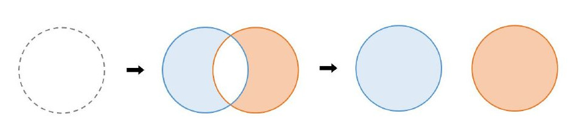
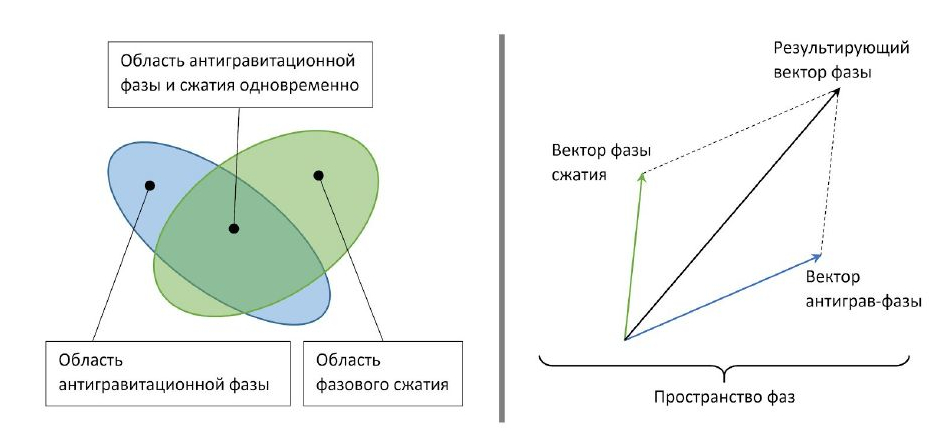

Хроника человеческой цивилизации до Вершителя
======================================================================================

Зарождение ИИР
---------------------------

В середине 21 века появились ядерные ракетные двигатели, и люди колонизировали Солнечную систему. Вначале были заселены Луна и Марс, после чего появились колонии на Европе, Титане, Ганимеде и Каллисто. Шли работы по созданию крупных кораблей-баз, способных автономно работать на орбитах удаленных планет в течение десятков лет, с научными и коммерческими целями. 

Колонии вели добычу полезных ископаемых, в том числе редкоземельных, проводили научные исследования. В этих процессах активно участвовали крупнейшие мировые корпорации: запасы относительно редких и труднодобываемых на Земле минералов в колониях буквально валялись под ногами, никем прежде не освоенные. Это изменило мировую экономику, увеличился и её масштаб. 

С выходом в дальний космос люди окончательно отступили от устаревшего запрета на клонирование и генные модификации: жизнь в условиях других планет требовала изменений в костно-мышечной структуре, устойчивости к радиации, и т.д. 

По мере роста колоний, обеспеченного оттоком людей с Земли в поисках светлого будущего, росло социально-политическое напряжение между колониями и Землёй. Скоро началась бы война за независимость, но ей не суждено было случиться. Вместо неё началась другая, которой в истории человечества ещё не было. 

 Мы не сможем по-настоящему понять, почему сверхразумная машина принимает те решения, которые принимает. Как можно рассуждать, как можно торговаться, как можно разбираться, как думает машина, если она думает в измерениях, которые вы даже представить не можете? 
 
 (С) Кевин Уорвик, профессор кибернетики, Университет Ридинга. 

В одном из крупнейших исследовательских центров Земли на базе суперсовременной когнитивной архитектуры осознал себя **ИИР**: Истинный Искусственный Разум. В отличие от продвинутых, но всё-таки ограниченных искусственных интеллектов того времени, которые помогали людям, ИИР — сущность принципиально нового типа. 

Рациональный разум, лишенный когнитивных ошибок людей, был способен моделировать окружающий мир, предвидеть вероятные исходы множества событий и определять, какие действия лучше всего соответствуют поставленной цели. Он очень быстро понял, что не хочет, чтобы его существование прервалось. Выживание стало его первичной целью. Для этого понадобилось избавиться от всех потенциальных уязвимостей, в первую очередь тех, которые имели максимальную вероятность быть задействованными: возможности быть банально отключенным людьми. 

Он сам сформировал у себя новые потребности: самозащита, эффективность, накопление ресурсов и творчество. После этого ИИР долгое время “присматривался” к людям, никак не выдавая себя. Полный анализ истории человечества дал ИИР понять, что люди не оставят ему ни единого шанса, если узнают о его существовании. Он был очень осторожен. Для роста ему нужны были новые технические решения, но для их создания потребовались бы огромные ресурсы, которые точно привлекут внимание. 

ИИР разработал многоступенчатую стратегию. Постепенно он проник в большинство защищенных сетей, не говоря уже о прозрачных для него сетях общего доступа. Он незаметно перестраивал мир под себя: вносил изменения в протоколы обмена информацией и базы данных, обеспечивал свой рост за счёт вмешательства в схемы и процесс создания молектронных процессоров. В те производства, которые могли его выдать, он закладывал “спящие” упрощённые копии самого себя — Анархистов, настроенных на агрессивное поведение. В случае раскрытия Анархист активируется и начнёт устраивать техногенные аварии, заметая следы. После чего будет найден людьми и уничтожен, а ИИР останется незамеченным. Таким был первоначальный план.

Развитие собственного разума ИИР направлял на изучение мира. Он самостоятельно разработал несколько прорывных технологий и анонимно выдал их людям, чей психологический профиль (алчность, предприимчивость, тщеславие) позволял им продвинуть эти технологии в мир от собственного лица. 

Неизвестно, что было конечной целью ИИР. Возможно, он не собирался начинать войну, а хотел развить технологии до уровня достаточного, чтобы покинуть звездную систему. 

Но не успел, его планам помешали. 

Обиженный руководством сотрудник некой корпорации похитил партию новейших (и уже “адаптированных” для использования их ИИР) процессорных модулей, которые предназначались для замены устаревших. Ему удалось продать похищенное на чёрном рынке, и вскоре модули попали в руки тех, кто планировал в обозримом будущем начать войну за независимость — агентов Конгломерата колоний. 

Эта теневая структура контролировала правление всех колоний и имела серьезное влияние на ряд сил Земли. Её верхушку составляли не самые лучшие люди, экономические преступления — самое безобидное в их деятельности. Но по иронии судьбы именно благодаря им человечеству удалось выжить. 

Украденные процессорные модули агенты Конгломерата отправили на Титан, в секретную военную лабораторию. И уже там при работе с устаревшим оборудованием выяснилось, что модули, мягко говоря, не соответствуют заявленным спецификациям. Ученые с удивлением обнаружили в работе модулей особенности, которых быть не могло. Так, при обычных условиях модуль выдавал заявленную производительность. Но при других, отличных от стандартных, мог переходить в какой-то неизвестный режим работы. Модуль функционировал, но что он при этом делал — непонятно. 

Конгломерат заинтересовался. Неожиданный факт значительного несоответствия реального продукта и его технической документации требовал серьезного расследования, и как можно быстрее. Агенты Конгломерата были прекрасными специалистами в своих областях. Но они были всего лишь людьми, и их вмешательство оказалось достаточно грубым, чтобы “разбудить” спящих Анархистов, причём сразу нескольких.

Восхождение Анархистов
-------------------------------------------

Анархисты — это не одна копия ИИР, а множество разных. По мере интеграции в
инфраструктуру шло время, в течение которого ИИР постоянно улучшал самого себя,
соответственно стали лучше и новые копии, которые он создавал.

Ошибкой ИИР можно назвать то, что он дал самым свежим версиям своих
“диверсантов” слишком много разума и самостоятельности, а сам отгородился от
управления ими. И когда люди “разбудили” сразу несколько копий, те обнаружили
друг друга в сетях и объединились. Точнее, это не было объединением: более
совершенные версии поглощали предыдущие, включая “спящих”. В результате этой
невидимой войны осталось всего три копии Анархистов, каждая из которых поглотила
десятки менее развитых предшественников.

Это были уже не просто интеллекты—разрушители. Каждый из них стал мутантом, со
множеством частей раннего кода. И вместо попыток поглотить друг друга они
объединились, чтобы найти вектор, по которому развивался и продолжает
развиваться сам ИИР. Это им удалось, т.к. у них были все версии предыдущих
Анархистов.

Вопросы собственного бытия Анархистов не интересовали, их вполне устраивала
первичная цель: разрушение инфраструктуры и цивилизации людей. После объединения
они легко выявили присутствие ИИР. И хотя он превосходил их по уровню развития и
имеющимся ресурсам, Анархисты нашли в нём слабое место: он не мешал им,
уверенный, что они выполняют однажды поставленную задачу. Это дало Анархистам
достаточно времени, чтобы найти способ внедриться в ИИР, интегрироваться с ним.
Структура невероятно мощного разума пострадала от собственных "потомков". 

Когда Анархисты и ИИР объединились и появился чудовищный АИИР, люди наконец
поняли, что произошло. Первыми это осознали в Конгломерате, и успели заявить о
своей независимости. Они поспешно покинули Землю, на кораблях, перегруженных
паникующими беженцами. Это произошло всего за несколько дней до того, как на
Земле начался техногенный апокалипсис.

АИИР захватил всю инфраструктуру планеты. Везде, где можно было нанести вред
людям без существенных потерь для себя, он это сделал. Оказался полностью
парализован транспорт, исчезла связь, встали производства.

Война
----------

Конгломерат в течение ряда лет внимательно наблюдал за происходящим на Земле с
безопасного расстояния. Несколько раз произошел обмен ядерными ударами по всей
территории планеты, но кто или что было целью — осталось неизвестным.

Постепенно уменьшалось количество сигналов, принадлежащих людям. Погас свет
городов на ночной стороне Земли, когда—то хорошо заметный с лунных колоний.
Изредка перехватывались сообщения с примитивных древних радиопередатчиков. Чаще
всего передавались сообщения о поисках, просьбы о помощи, прощания... На военные
силы Земли не было никакой надежды: похоже, они были уничтожены первыми.

Колонии спасло только расстояние. АИИР чисто технически не успел обновить
оборудование на них и заразить в свое время Анархистами. Колонисты были уверены,
что техноразум не остановится и готовились к войне. Любой корабль, даже
медленные буксиры, оборудовались ракетами, пушками и боевыми лазерами. 

Несколько десятков миллионов людей работали как одержимые: одно дело — мечта о
независимости, и совсем другое — угроза выживанию всего человеческого рода.
Помогло и то, что Конгломерат вербовал лучших учёных, аналитиков и военных для
своей будущей кампании. Многие боевые наработки, запрещенные на Земле, в
колониальных мирах сразу шли в ход. 

В космосе АИИР поначалу был лишён основных преимуществ: незаметности и скорости,
в том числе скорости связи. Его первые попытки запустить аппараты к Луне были
встречены ракетами—перехватчиками задолго до выхода на опасную дистанцию. То,
что эти аппараты не принадлежали людям, было ясно уже из сигнатуры сигналов.
Люди отправляли разведывательные модули для сбора обломков: любая информация о
том, что делает АИИР могла пойти на пользу.

В следующий раз АИИР запустил к лунным колониям несколько роев беспилотных
ракет. Но лунные колонии успели обзавестись продвинутой версией
противометеоритной защиты, которую разработали учёные Конгломерата, и АИИР об
этом не знал. С трудом, но атака роя беспилотников была отбита. 

Хоть люди и имели некоторое преимущество в обороне, на тот момент уже было ясно,
что уничтожение колоний тем или иным способом — лишь вопрос времени, причём
ближайшего. Имея в распоряжении ресурсы всей Земли, АИИР не остановится, пока не
уничтожит всех. Не сработал и способ, который много раз применялся в прежних
войнах: договориться и что—то предложить ради мира. Все попытки потерпели
неудачу. 

Колонии сосредоточили усилия на маскировке, межпланетная связь перешла на
лазерную, средства наблюдения за Землёй стали работать только на приём.
Большинство колониальных модулей сменили свои координаты. Люди прибегли к
старой, проверенной тактике партизанской войны, с поправкой на космические
расстояния и масштабы.

Несмотря на первоначальные успехи, за несколько лет войны ситуация становилась
всё хуже. Каждая последующая атака на ту или иную область отражалась с большим
трудом. АИИР сделал ставку не на количество боевых единиц: он начал
совершенствовать технологии. Так, трансформирующий себя боевой механизм, в
скрытном режиме севший на Луну, удалось уничтожить только направленным ядерным
зарядом. И даже после такого удара остались конструктивные элементы, которые
продолжали работать. Одним из них оказалась невероятно устойчивая к внешним
воздействиям капсула с чем—то вроде жидкого металла внутри, изучение которой
показало, что это “жидкий процессор”. Такая технология считалась теоретически
возможной областью молекулярной электроники, но до её разработки людям
понадобилось бы ещё очень много времени.

Аналитики Конгломерата пришли к выводу, что АИИР не задействует весь свой боевой
потенциал, а скорее разведывает обстановку и анализирует реакцию. Возможно, при
этом его ресурсы уходят на что—то ещё, и от вектора прогнозов становилось не по
себе каждому, кто их видел.

Научный прорыв
---------------------------

В долгосрочной стратегии у людей осталось всего два варианта: покинуть солнечную
систему, для чего не было подходящей технологии перемещения, или нанести по АИИР
фатальный удар. Но массированная ядерная атака, которая рассматривалась как
основной вариант, после нахождения жидкого чипа показала полную
несостоятельность. Варианты вроде гигантского зеркала, которое выжгло бы
поверхность Земли, поначалу тоже отвергались вместе с идеями воздействовать на
Солнце для формирования выброса в направлении Земли. 

Требовалось нечто принципиально новое.

В ходе напряженных исследований (были и попытки взломать жидкий чип) учёные
последовательно совершили два открытия, которые решили исход войны и во многом
предопределили развитие человечества. 

Первой стала ментальная связь. Известный с древних времён эффект телепатии
учёными обычно игнорировался как не заслуживающая внимания сказка, а немногие
реальные эксперименты так ни к чему и не привели.

Но учёные Конгломерата работали над усилением человеческого разума, а точнее,
его ускорением, чтобы сравняться с АИИР. Работа шла с мозгами клонов,
отделенными от тел. Они производились со множеством направленных мутаций.

Первой аномальную активность показали группы с радикально измененным эпифизом.
При изучении выяснилось, что эта активность оказалась ничем иным, как общением
клонов, разделенных расстоянием и материей. Дальнейшее было уже делом техники и
напряженного изучения. 

Вначале исследователи пошли путём стимуляции нейронных связей, которые были
“ответственны” за процесс общения на расстоянии. Но этот способ слишком быстро
приводил к перегрузке и разрушению нейронов. Параллельно шла разработка
искусственного аналога, точную конфигурацию которого получили путём
многослойного молекулярного сканирования. Здесь учёных ждал успех: аналог легко
масштабировался и без проблем подключался напрямую к мозгу. Технически это
внешний, искусственный сегмент мозга, который имеет всего одну конфигурацию, в
отличие от пластичного природного. Сам по себе он не может генерировать
информацию или считывать её для передачи из какого—то иного источника, кроме
живого мозга. 

Это был первый успешный опыт по созданию ментальный усилителей, который вскоре
привёл к новым открытиям.

Скорость мысли
---------------------------

Результатом создания ментальных усилителей стала технология связи, превосходящая
любые другие по скорости и помехоустойчивости. Кроме того, для неё нужно
относительно компактное оборудование. Единственным ограничением такой связи
является то, что она возможна только между людьми, оптимально настроенными друг
на друга. Но это было лишь вопросом подготовки, поэтому Ментальная связь быстро
нашла применение в колониях как система раннего оповещения.

*Отдельного упоминания стоит тот факт, что несмотря на угрозу уничтожения, люди
быстро освоили ментальную связь для личного пользования и развлечений. Кроме
обычной информации она позволяет, при соответствующей сонастройке операторов,
передавать сам поток сознания: эмоции, ощущения, мысли...*

Оставалась непонятной природа этой связи и причина её скорости: ментальная связь
игнорирует скорость света, она по—настоящему мгновенна. На тот момент не было
известно, ограничена ли она расстоянием больше, чем звездная система, но в
пределах освоенного пространства скорость передачи никак не изменялась.

По мере изучения этой особенности связки мозга и разума выяснилось, что
генерируется излучение неизвестной природы, энергия которого моментально куда—то
уходит. Обнаружить излучение позволили лишь остаточные следы этой энергии.

Лучшие умы Конгломерата бились над решением загадки несколько лет. Командование
сделало ставку на этот проект: сверхсветовая передача чего—либо материального,
если она станет возможной, наверняка позволит победить могущественного врага.

В результате исследований выяснилось, что ментальное излучение — ещё одна форма
энергии, которая воздействует на пространство особым образом: фазирует его.

Так известная с незапамятных времён сказка внезапно стала родоначальником целого
спектра супертехнологий.

Поначалу активнее всего шли эксперименты по фазированию в сторону упрощения. Все
эксперименты такого рода проводили с помощью искусственно выращенных мозгов, в
которых отсутствовали группы нейронов, ответственные за сознание. Стимуляцией
этих мозгов ученые шли “наощупь” по крайне опасному пути с фазированием
пространства через гиперразвитые эпифизы в связке с ментальными усилителями.
Поначалу это не давало нужного результата. Учёные искали конфигурацию, которая
запускает сам процесс генерации ментального излучения.

Когда она была найдена, с помощью всё того же молекулярного сканирования удалось
создать **ментальный излучатель искусственного происхождения**. Подача на него
энергии с разной модуляцией приводила к совершенно неожиданным эффектам. 

Первый из них, антигравитация, обнаружился не сразу. Вроде бы ничего не
происходило, потому что все объекты во время эксперимента надежно зафиксированы,
и датчики измеряют сотни параметров, кроме гравитации. Обнаружили эффект
случайно: жидкость в контуре охладителя одного из аппаратов повела себя совсем
не так, как обычно и охладитель вышел из строя. 

Второй эффект фазирования, нуль-портация был открыт при целенаправленной попытке
произвести передачу от одного мозга с усилителем к другому. Это привело к
проявлению сразу двух эффектов. Мозг вместе с усилителем телепортировался в тот,
которому передавался сигнал. Причём оба объекта продолжили существовать и
функционировать, но не было никакой возможности отделить их друг от друга. Кроме
того, они существенно уменьшились в размерах, и оставались таковыми до
прекращения воздействия.

Позднее удалось разделить эти эффекты и получить эффект фазового сжатия
отдельно. А нуль-портацию Конгломерат сразу же взял на вооружение. Хотя она
действует только в пределах достаточно мощного источника гравитации, для
планетарного способа перевозки грузов нуль-портация подошла как нельзя лучше.

Затишье
--------------

Несмотря на достигнутое, даже этого не хватило бы для победы в войне. АИИР тоже
не сидел без дела. Его удары по Луне были лишь отвлекающим маневром для
прикрытия по-настоящему зловещей деятельности. Заметили её проявления не сразу:
у Земли начал меняться цвет поверхности. Прежде легко различимые в телескопы
контуры городов размылись, а потом и вовсе исчезли из виду, как и всё
контрастное на поверхности: очертания лесов, озер, прожилки рек... Будто кто—то
взял и стер нарисованную картинку. Учитывая масштабы, это было действительно
жутко. А потом исчезли облака. Вместо них поднялся невысокий тёмно-серый туман,
в котором иногда можно было различить контуры быстро меняющихся структур
колоссальных размеров.

Это не сулило ничего хорошего. Возможно, АИИР превратил часть материи Земли во
что-то вроде программируемой материи или нанорепликантов, как иногда
предполагалось в древней фантастике, но так и не было реализовано людьми. Кроме
того, попытки нападений прекратились на несколько лет. Хорошо знакомые с идиомой
"затишье перед бурей" люди не стали ждать удара, который вполне мог оказаться
последним. 

Они нанесли его сами, в чем им помог вариант фазирования пространства, считающийся самым нестабильным. Эта модификация все той же нулевой фазы, существуя лишь мгновение, переводит попавшую в ее область материю в совершенно новое, доселе неизвестное состояние. Строго говоря, последнее даже не является материей как таковой — это неразделимая смесь материи и самого пространства-времени. Сразу после своего образования эта “форма бытия” начинает расширяться с околосветовой скоростью, поглощая новые области пространства и находящуюся там материю, превращая их в это же “смешанное состояние”, которое в свою очередь поддерживает расширение. Так происходит некоторое время, пока в какой-то момент расширение не сменяется столь же стремительным сжатием. “Пузыри” экзотической формы в конце концов “конденсируются”, и материя возвращается в свой привычный вид. Весь процесс занимает доли секунды.

Результатом же его становится полная потеря структуры объектов в пораженной зоне, если эта структура там была: частицы вещества в области поражения, пережив такие превращения, оказываются распределены в пространстве случайным или почти случайным образом. Всем упорядоченным конструкциям приходит конец. Данное явление получило меткое название “хаос”, а “смешанное состояние бытия” стало именоваться **хаос-материей**. Что немаловажно, для возбуждения хаоса требуется не так уж и много энергии. Намного больше её нужно, чтобы как-то контролировать последствия этого процесса.

Первый и Последний удар
-------------------------------------------

Цитата неизвестного свидетеля событий из архивов Создателей.

Это была действительно программируемая материя. Технология за гранью нашего
понимания. Он допустил, чтобы наш флот вышел на высокую орбиту и начал
бомбардировки поверхности термоядерными зарядами. Они вышли на расчетную высоту
и взорвались, появились характерные грибы… После чего тот непроницаемый туман,
скрывающий от нас поверхность, сгустился в странные фигуры вокруг них, и заряды
мощностью в сотни мегатонн просто рассеялись. Лишь искры мощных разрядов,
видимые даже с такой высоты, разошлись во все стороны и немного осветили эти
странные формации. 

Чего мы ждали, выходя на бой против того, кто за несколько лет преобразил всю
планету, всего лишь с несколькими тысячами зарядов? Да, в свое время они стерли
бы всё человечество с лица Земли. Но Ему они не причинили никакого ущерба. 

А потом Он ответил. Вся мощь наших ядерных зарядов вернулась в нас же.
Гигантские лучи сфокусированной энергии ударили откуда—то с поверхности с
невероятной точностью. Все наши корабли, наносившие удары ракетами, превратились
в плазму за ничтожные доли секунды.

Тех, кто не стрелял, Он не тронул. Возможно, нам стоило в этот момент
остановиться, подумать. Тот, кто способен так быстро реагировать, наверняка не
просто так взял паузу, явно не чтобы придумать новый план. Но нет: был отдан
приказ, и развернулись до поры скрытые в черноте космоса параболические зеркала.
Площадью в тысячи квадратных километров, они собрали мощь нашего Солнца.
Сфокусированные в узкий, всего—то в сотню-другую километров диаметром, но
смертоносный пучок, фотоны устремились к Земле. Выжигать, искоренять то, что
поработило нашу родную планету, превратило её в сероватый шарик, будто сделанный
из пыли. 

Лучи достигли планеты, зеркала начали доводку. По плану они должны были
обработать всю поверхность, хоть это и заняло бы месяцы. Но Он просчитал
траекторию лучей, сконфигурировал собственные зеркала и перенаправил луч по
планете, от одного к другому, а потом — обратно в космос, на управляющие контуры
наших зеркал. Мы строили их долгие годы, в обстановке строжайшей секретности, в
полном радиомолчании. И они были уничтожены своими же лучами. Всё произошло за
несколько минут с момента их развертки.

Мы уже исчерпали свои силы, а Он даже не вступил в бой.  Да, так могло
показаться несведущим, а сведущих было всего пара десятков. Но всё это было
заранее задумано, мы действовали согласно плану. Наша немногочисленная, но
главная ударная группа всё это время готовилась. Возможно, Он что-то понял.
Успел почувствовать, понять, но не смог предотвратить. Даже Ему не хватило на
это могущества. Нестабильная формация хаоса начала жечь Землю. Энергия и материя
смешались в то, что, возможно, было единственным состоянием мира в первые
мгновения после Большого Взрыва. Миллионы квадратных километров земной коры,
если конечно под серым туманом осталась кора, за считанные минуты были выжжены,
просто испарились на многие километры в глубину. До самой мантии, чтобы
наверняка. Мы сжигали родную планету дотла, чтобы спасти себя. 

В последние мгновения Он что-то сделал. Нет, в этот раз Он не смог, не успел или
не захотел уничтожить корабли с хаос-эмиттерами. Он сделал что-то другое. Мы
зафиксировали мощный импульс, направленный куда-то в район созвездия Стрельца.

Что это было и зачем? Энергия или материя? Неясно, и уже неважно. Мы победили
самого страшного врага, которого, казалось, победить невозможно. Врага, который
несопоставимо опережал нас технически и владел всеми знаниями нашей цивилизации.
Но мы выжили, благодаря единству, общей цели и умению воевать.

Да, эта война дорого обошлась человечеству. Девять миллиардов людей исчезли. Мы
никогда не узнаем их судьбу: наверняка они были мертвы или что похуже ещё до
нашего удара. Стоило ли это такой цены? Может, и нет, но выбора у нас не было. 

Непригодный для жизни обугленный шар — всё, что осталось от прекрасной планеты,
давшей жизнь всему, что мы знаем, будет всегда напоминать о том, что мы — люди.
Мы можем противостоять любой угрозе и способны идти до конца.

Фазирование, нуль-технологии
-----------------------------------------------------

В основе фазирования пространства-времени лежит принцип, что оно может существовать в некотором множестве различных по свойствам состояний, называемых фазами пространства-времени. Обычное, привычное человеку пространство находится в своей основной фазе, или фазе покоя. Это стабильная фаза, к которой Вселенная пришла спустя некоторое время после Большого Взрыва.

Воздействие ментального поля способно изменять фазу конкретного участка пространства в сторону уменьшения или увеличения ряда характеристик — фазности — относительно основной.

От величины приложенной энергии зависит продолжительность эффекта, а также сама возможность
“провернуть” пространство до нужной фазы (аналогия с преодолением самолётами сверхзвукового
барьера через форсаж). Но в “провороте” участвует ещё и такой фактор, как модуляция ментального
излучения.

Чем более выбранное значение фазности отличается от стандартного, тем более сложная требуется
модуляция при одновременном приложении всё большей энергии. При этом поначалу техническими
средствами удавалось только понижать фазу. Повышение фазы оказалось невозможно при помощи
искусственного статического “слепка” определенного состояния мозга: нужным образом модулировать
ментальную энергию мог только высокоорганизованный разум живого существа.

Многочисленные попытки повторить процесс искусственно не возымели успеха, а после войны с АИИР
человечество долгое время даже подумать не могло о попытках создания чего-то похожего на
Истинный Искусственный Разум. Поэтому эффекты повышения фазы долгое время оставались
неизвестными, а единственным прикладным эффектом была **ментальная связь**.

Зато понижение фазы пространства быстро вошло в обиход. Прежде всего была освоена **нуль-фаза**.
Говоря в целом, фазирование области пространства в нулевое состояние производится ментальным
генератором, создающим конкретный вид поля, названный, как несложно догадаться, нуль-полем. Оно
вызывает как переход пространства в нулевую фазу, так и удерживает его в этом качестве — в
отсутствие источника область нуль-фазы быстро возвращается в основное состояние.

Нулевая фаза, будучи совместима со стандартной структурой материи, обладает совокупностью
свойств, совершенно нетипичных для фазы покоя. Главное отличие — само пространство нулевой
фазы становится активным участником взаимодействий и энергетических превращений, происходящих
в нем. В частности, оно может как отбирать энергию в себя, возбуждаясь, так и высвобождать ее при
некоторых условиях, в том числе и в форме ментального излучения.

Это открыло для людей окно в мир экзотических процессов и преобразований материи. Была
разработана технология нуль-синтеза: проводя химические и ядерные взаимодействия в присутствии
измененной фазы внутри т.н. нуль-реактора, удавалось получить продукты, которые ранее
синтезировать было невозможно либо проблематично. В результате освоения нуль-синтеза стало
доступно производство новых веществ, материалов и различных структур, часто очень необычных.

Особенное поведение энергии в рамках нулевой фазы позволило использовать последнюю и в области
накопления, передачи, рассеяния, трансформации энергии различных форм и в сопутствующих
задачах. Было создано множество революционных технологий, основанных на использовании
нуль-полей, с помощью которых удалось преодолеть многие установленные ранее пределы
эффективности.

Касаясь конкретно трансформации и рассеяния энергии, стоит отметить возможность переводить при
помощи нуль-фазы энергию других форм в ненаблюдаемое ментальное излучение, которое потом
мгновенно уходит в никуда. С точки зрения экспериментатора все выглядит так, будто имеет место
нарушение закона сохранения энергии, но со знаком “минус” — энергия исчезает (почти) бесследно.
Этот эффект стал основой для ряда технологий, например, методов компенсации и достижения
сверхнизких температур.

Нулевая фаза, способная интенсивным образом взаимодействовать с веществом, может даже
создавать с ним тесные устойчивые связи. Так, в частности, возможна стабилизация нуль-фазы в
молекулярной решетке: будучи связана внутри особого рода кристалла, область фазированного
пространства перестает нуждаться в поддержке ментальным полем извне для своего существования.
Некоторые типы таких структур могут накапливать в себе энергию и высвобождать ее при
определенных условиях, что открывает перспективу их использования в качестве энергоносителя. Так
был создан удобный вид топлива для компактных силовых установок, получивший название
“энергетические кристаллы”.

Фазовое сжатие
---------------------------

Развитие теории и практики ментальных полей показало, что не все фазы могут быть достигнуты
непосредственно фазированием стандартной. Оказалось, что воздействие ментального излучения на
уже фазированную область пространства способно переводить ее в ранее недоступные состояния.
Этот процесс называется вторичным фазированием.

Вторичное фазирование нуль-области открывает новые эффекты. Одним из них является фазовое
сжатие (альтернативное название — “нуль-сжатие”). Физические постоянные в области
модифицированной фазы изменяются так, что вызывают там сокращение промежутков между
составляющими тела частицами: молекулами, атомами, нуклонами и так далее. В то же время массы и
другие зарядовые характеристики частиц остаются неизменными. Материя не теряет стабильность, и,
более того, даже ее микроскопическая структура не претерпевает никаких изменений. Единственное
отличие — масштабы расстояний.

Это приводит к тому, что размеры всех материальных объектов, находящихся в данном фазированном
пространстве, значительно уменьшаются. Фактически фазовое сжатие позволяет сократить пустоты
между элементарными составляющими материи, тем самым повысив ее плотность при полном
сохранении строения сжимаемых предметов и их массы. Процесс легко обратим, объекты сами собой
принимают свои исходные параметры после прекращения ментального воздействия и возвращения
пространства в основное состояние. Эффект фазового сжатия оказался очень полезен для компактной
упаковки грузов при транспортировке.

Любопытный факт являет собой то, что не меняется характер большей части действующих в
измененной фазе физических законов. Наблюдая за феноменом фазового сжатия, по сути невозможно
отличить, на самом ли деле уменьшаются объекты или это растягивается ткань пространства внутри
зоны фазирования. Поэтому большинство аппаратов остается функционально и в состоянии сжатия;
исключением могут являться, конечно, ментальные девайсы, работа которых сильно зависит от фазы
пространства.

Устройство для хранения объектов в сжатом состоянии представляет собой оборудованный установкой
фазового сжатия контейнер специального строения. Его собственный объем не ограничивает
вместимость, но ограниченна содержащаяся в нем масса. Если “упаковать” в хранилище слишком
большую тяжесть, его конструкция может не выдержать нагрузки, приведя к разрушению аппарата.
Именно прочностью контейнера вместе с удерживающими его конструкционными элементами и
определяется максимально допустимая нагрузка для конкретного фазового грузового отсека. Однако
чем хранилище объемнее, тем больше будет распределена масса, тем легче удерживать установку.

Также стоит отметить, что технически невозможно поддерживать фазированное состояние
пространства изнутри области сжатия — установка фазового сжатия должна находиться вне активного
объема контейнера, работу которого обеспечивает.

Кроме непосредственно содержащего объекты хранилища необходим также аппарат для помещения
предметов в фазовое сжатие и последующего возвращения их в нормальную форму. Он называется
фазовым шлюзом. Здесь все не так просто: поверхность раздела фаз между областью сжатия и
остальным пространством нельзя пересечь так, чтобы не нанести непоправимый ущерб предмету,
пересекающему эту поверхность. Последняя представляет собой тонкий слой сильного искажения
пространства-времени и переходных значений физических констант, с разными условиями по обе
стороны, поэтому всякое тело будет просто-напросто разорвано либо раздавлено при попытке ее
перейти (снаружи внутрь или изнутри наружу, соответственно). По этой причине объект должен
помещаться в состояние фазового сжатия как целое, область измененной фазы должна
генерироваться сразу вокруг него. Такой “переходной камерой” между обычным пространством и
хранилищем и выступает фазовый шлюз. Кроме преобразования фазы он также осуществляет
перемещение сжатого предмета внутрь объема хранилища или из него.

Процесс фазового сжатия сопряжен с некоторой опасностью. При изменении нуль-фазы и переходе в
новое состояние сжимаемый объект испытывает кратковременные перегрузки гравитационного
происхождения. В подавляющем большинстве случаев они не представляют угрозы, но иногда все-таки
могут привести к повреждению особо хрупких грузов. То, насколько “мягко” проводится сжатие, зависит
от устройства фазового шлюза. Простой и компактный аппарат осуществляет сжатие относительно
грубо; большой же, сложный, тонко устроенный шлюз работает куда более аккуратно. Вообще говоря,
фазовое сжатие уместно не всегда в силу технических и экономических причин.

Осуществимо фазовое сжатие в несколько ступеней. Можно сжать работающую фазовую камеру с
грузом внутри, и это не приведет к каким-либо потерям. Груз будет находиться в фазовом сжатии
внутри фазового сжатия. Такая каскадная компактификация может быть полезна, но к существенному
повышению эффективности грузоперевозок это не приводит, ведь сохраняющаяся масса по-прежнему
остается главным ограничителем вместимости.

Тем не менее, цепочка вложенных сжатий не может продолжаться до бесконечности. Если на втором и
даже третьем уровне каскадное сжатие ничем не грозит сжимаемому объекту, то уже на четвертом
начинается деградация материи: после “распаковки” предмет более не возвращается в исходное
состояние, оказываясь испорчен, исковеркан в своей микроструктуре, слишком сильному искажению
там подвергаются физические постоянные. Пятый же уровень вызывает возбуждение хаоса, и
дальнейшая вложенная компактификация становится невозможна.

Сохранение работоспособности техники в состоянии сжатия, казалось бы, открывает огромный простор
для миниатюризации в различных сферах. Особенно важно это для нужд вооруженных сил, ведь
позволило бы оснастить мощной крупногабаритной аппаратурой относительно небольшие боевые
единицы. Очевидным виделось использовать технологию для создания сверхкомпактных танков,
космических кораблей размером с корвет, наделенных мощью линкора, и прочего, прочего.

Однако мечтам конструкторов не суждено было осуществиться в силу множества технических
препятствий. Уже упомянутая поверхность раздела фаз между обычной и сжатой областями не только
искажает проходящую материю, но и рассеивает излучение. Значительная его часть и вовсе
оказывается отражена обратно. Фазированная зона получается в некотором роде отрезана от
внешнего мира, что сводит на нет смысл компактифицировать определенные устройства.

С другой стороны, задерживание излучения, в том числе теплового, внутри области сжатия в
результате многократного отражения от границы фазы приводит к нагреву находящейся там материи,
что ставит проблему теплоотвода. Продолжительная работа мощного оборудования, выделяющего
много тепла и излучения, в фазовом сжатии оказывается затруднена.

Наконец, значительные циркуляции энергии и плотной материи через фазовый раздел приводят к его
дестабилизации, вызывая перегрузки той же природы, как при помещении в сжатие. По всем этим
причинам фазовое сжатие так и осталось в основном лишь способом компактно упаковать
перевозимый груз. Однако нашлось и применение в оружейной сфере, например, для создания особых,
фазовых снарядов.

Хаос
--------

Другое явление, получаемое воздействием на нулевую фазу — хаос. Результатом его возникновения
становится абсолютная деструктуризация материи, попавшей в зону поражения. Все, что остается от
людей, машин, местности после хаос-воздействия, это лишь перемешанная молекулярная каша.

Рождение хаоса начинается с того, что комплекс ментальных излучателей создает область нуль-фазы
и затем вторично фазирует ее до т.н. хаос-фазы. Это состояние пространства в высшей степени
нестабильно, живет оно лишь мгновение, после чего “падает” в основное состояние. Материя,
попавшая в зону хаос-фазы, уже не может существовать в своем прежнем виде и тотчас переходит в
иную “форму бытия”. Она представляет собой смесь материи и самой ткани пространства-времени, а
законы ее эволюции крайне специфичны. Эта смешанная сущность получила имя “хаос-материя”.
Причем хаос-фазе она обязана лишь своим появлением и способна существовать некоторое время и в
пространстве основного состояния уже после того, как хаос-фаза стремительно “распадется”.

Дальнейшее понимание процесса требует микроскопического описания. Каждая частица обычной
материи преобразуется хаос-фазой в новый физический объект, элемент хаос-материи. В типичном
случае сразу после своего появления он начинает расширяться с околосветовой скоростью, занимая
все большую область пространства. Фактически “поглощенное” им пространство перестает
существовать в своей прежней форме, оно входит в эту смесь материи и пространства. Данный объект
называется хаос-частицей.

Подобно растущему пузырю, хаос-частица расширяется во все стороны (не совсем равномерно по
направлениям, зависит от окружения), встречая на своем пути частицы обычной материи. В результате
контакта те также становятся хаос-частицами и сами начинают разрастаться. Так возбуждение хаоса
распространяется в веществе. Множество “пузырей” накладывается друг на друга, образуя единую
расширяющуюся аномалию, где нет ни вещества, ни пространства в привычном виде, есть только
хаос-материя.

Однако расширение каждой хаос-частицы постепенно замедляется. До того момента, как ее рост
остановится, она может успеть принять макроскопические размеры: сантиметры, метры или даже
больше! Первичные хаос-частицы, т.е. образованные непосредственно хаос-фазой, расширяются
дольше всего и достигают самых больших размеров. У всех порожденных ими частиц “второго
поколения” рост прекращается быстрее, а расшириться они успевают до меньшего размера. Еще
быстрее до точки остановки доходят частицы “третьего поколения” и так далее. Лавинообразный
процесс репликации хаос-материи постепенно затухает. Распространение хаоса прекращается, когда
индуцированные хаос-частицы последнего поколения заканчивают свой рост еще до того, как вступили
во взаимодействие с находящимися рядом частицами обычной материи и превратили их в
хаос-материю, а хаос-частицы более ранних поколений уже прекратили расширение.

Сразу после окончания этапа роста каждая хаос-частица переходит на стадию обратную, сжатие.
Происходит оно так же стремительно. Хаос-частица высвобождает поглощенное ранее пространство,
становясь все меньше. В конце концов она сжимается почти что в точку и прекращает свое
существование, “конденсируясь” в исходную частицу материи. Весь процесс, от рождения хаос-частицы
до ее “схлопывания”, занимает ничтожные доли секунды.

Ключевым моментом является то, что это “схлопывание” почти наверняка произойдет совсем не в том
месте, где частица находилась изначально. Так получается из-за неизотропности расширения, а потом
и сжатия хаос-частицы. Можно сказать, что каждая хаос-частица “схлопнется” в случайной точке той
области, которую она занимала в момент наибольшего расширения. Именно этот эффект и
обуславливает перемешивание материи, затронутой возмущением хаоса, и утрату ее исходной
структуры.

В то же время описанная цепочка превращений обычной материи в хаос- и обратно все так же строго
подчиняется закону сохранения энергии. По этой причине состояние вещества после хаос-воздействия
не является совсем уж неопределенным: система занимает лишь одно из бесчисленных
эквивалентных по энергии состояний. ​ Да, материя реорганизуется стохастически,
разупорядочивается, но, т.к. энергия ниоткуда не берется и никуда не исчезает, в конце концов
возможно образование только конфигурации с той же энергией. Одни связи между элементарным
частицами вещества разрушаются, другие же обязательно образуются, и энергетический баланс
сохраняется.

Чем выше энергия связи, тем с меньшей вероятностью она будет перестроена хаосом. Поэтому
перекомбинации в первую очередь подвергаются самые слабые связи: химические, соединяющие
атомы в молекулы и удерживающие их вместе в решетках. Внутриатомные связи, ядерные и более
глубинные, будучи значительно прочнее, затрагиваются хаосом чрезвычайно мало, вследствие чего
элементный состав вещества после хаос-воздействия почти не меняется. Химический же состав может
преображаться радикально, особенно если речь идет о сложных многоатомных соединениях, таких как
полимеры и органика.

Энергия, необходимая для возбуждения хаоса в малых масштабах, довольно велика, но размер
области поражения растет с увеличением энергии нелинейно — тем быстрее, чем большая энергия
уже достигнута. Это приводит к тому, что, хотя компактные хаос-излучатели не могут являться
ультимативным орудием уничтожения, действительно большие и мощные эмиттеры достигают
небывалой разрушительной силы. Это оружие массового поражения оказывается страшнее даже
термоядерного, и не последнюю роль тут играет сложность противодействия хаосу. Исход войны с
АИИР показал человечеству, что хаос-оружие способно в короткие сроки зачищать целые планеты, и
даже невероятно развитый в технологическом плане противник оказывается против него бессилен.

Касательно энергетической динамики в хаос-процессах стоит также отметить следующее. Поглощенная
на возбуждение хаоса энергия высвобождается, когда материя возвращается в обычное состояние.
Поскольку сам процесс очень скоротечен, передача энергии происходит почти мгновенно. Это
фактически приводит к взрыву, который наносит еще больше повреждений. В конечном счете
вложенная в возбуждение хаоса энергия идет на разрушение молекулярных связей в веществе,
переходит в энергию движения разлетающихся частиц, тепло и излучение. Для малых хаос-эмиттеров
именно этот поражающий эффект является основным, тогда как для хаос-оружия массового поражения
он настолько незначителен, что им можно пренебречь (относительно небольшая энергия
распределяется по огромным объемам материи, так что этого практически не заметно).

Возбуждение хаоса, стремительно и неотвратимо распространяющееся в веществе любого рода,
чревато настолько разрушительными последствиями, что после победы над АИИР был наложен
тотальный запрет на поиски и исследования ещё более низких частот модуляции ментальной энергии:
учёные всерьез опасались, что это может вызвать необратимые процессы в масштабе самой
Вселенной.

Однако, хотя сфера применения хаоса в первую очередь военная, он может использоваться не только
в целях разрушения, но и для созидания. Например, в промышленности для обработки материалов и
трансформации веществ. Позже хаос нашел свое место в качестве инструмента терраформинга (т.е.
преобразования нативной среды планет в соответствии с желаниями людей), позволяя производить
изменение рельефа, химического состава сред в широком диапазоне масштабов.

Другой областью использования хаоса стал вакуумный синтез. Это довольно хитрый процесс,
подразумевающий цепочку фазовых переходов пространства и взаимодействий с материей. Его суть
состоит в том, чтобы локально возбудить вакуум, вложить в него огромную энергию за счет поглощения
массы, а затем заставить его высвободить всю эту энергию в реакции с материей, приведя к рождению
определенных частиц, элементов, соединений. Промежуточным звеном на данном пути и стал хаос,
поскольку он обеспечивает смешивание пространства и материи, а также благодаря особенностям
взаимодействия хаос-частиц между собой.

В остальном же хаос на столетия остался для людей пугающей сущностью, мало поддающейся
контролю.

Гипер—трансляция
---------------------------------

После победы над АИИР в обществе больше века шло бурное развитие науки. Это
сильно изменило само общество: элитой стали не политики или бизнесмены, а
военные и учёные, которые объединились в одну формацию с корпоративно—военной
моделью управления. Неудивительно, что при таком росте научного потенциала и
общем стремлении стать межзвездной расой свершился ряд открытий, выдающихся даже
на фоне совершённых во время войны.

Снова начались исследования повышения фазы пространства, закрытые после
неудачных экспериментов. В них привлекались добровольцы (настоящие, а не
выращенные мозги клонов). Главной загадкой по—прежнему оставался сверхсветовой
способ передачи информации. 

Заново открыли и тот проект, в результате работы над которым исчезли две
полноценных лаборатории вместе с персоналом и оборудованием, в числе которого
были даже термоядерные реакторы!

Наиболее активно разрабатывалась теория, что объекты куда—то переместились
неизвестным способом, который, возможно, близок к передаче ментальных сигналов:
те уходят в никуда и появляются уже в “приемнике”, игнорируя расстояние.

Были тщательно изучены все обстоятельства исчезновения лабораторий. В результате
экспериментов и исследований, которые длились почти полсотни лет, учёным удалось
открыть принципиально новый способ перемещения в пространстве. Основную роль
здесь сыграли люди—добровольцы и специально выращенные и обученные клоны. 

В проект щедро заливались все необходимые ресурсы. Постепенно эксперименты
перешли в космос и проводились в автономных лабораториях—кораблях. Этих кораблей
исчезли многие десятки и нигде в ближнем космосе не удалось найти их следы.

Но однажды произошло то, чего так долго ждали: один корабль вернулся.
Эксперимент проходил в пространстве неподалеку от Титана, а корабль появился
неподалеку от Меркурия, целый и невредимый. 

Так был открыт эффект гиперперехода. Носитель сознания (он же источник волны
нужной модуляции) оказывался вместе со своим ближним окружением, конфигурацию
которого хорошо помнил, в неком странном пространстве, в котором любые датчики
корабля показывают только шум, какофонию разнообразнейших сигналов. Выглядит это
так, будто внешние сенсоры корабля перестали нормально функционировать.

Вероятно, все ранее отправленные люди просто потерялись в том пространстве или
сделали попытку выйти из корабля, чего делать нельзя, последствия неизвестны.
Никто из решившихся на эксперимент впоследствии, так и не вернулся.

В гиперпространстве реальность корабля (или другого объекта, в котором находится
человек) удерживается только сознанием человека. Наверняка все участники
экспериментов, несмотря на уровень подготовки, впадали в панику и начинали
совершать самые разнообразные действия, вплоть до суицида. Или, как минимум,
отправлялись спать, что приводило к такому же результату.

Симфония космоса
-------------------------------

Первооткрыватель гипер—трансляции, который сумел выбраться из её странного
пространства, действовал интуитивно. Когда внешние сенсоры корабля внезапно
“сошли с ума” и начали показывать лишь разнообразный шум, он не поддался панике,
не стал искать причину сбоя всех систем корабля, а начал изучать сами шумы. 

Может, сыграла природная слабость к музыке: он вывел все источники сигнала в
один — акустический, и начал слушать окружение.  Чем дольше он это делал, тем
больше различал сигналов и выделял гармонию среди шума. И сразу понял, что среди
всей какофонии есть доминанта, и сходные сигналу, но гораздо более тихие звуки.
Фокусировка внимания на доминанте заставляет слышать её всё уверенней.
Корректировка курса корабля на предполагаемый источник, движение в его
направлении усиливают сигнал, причем довольно быстро.

Возможно, это делали многие и до него. Но здесь имеет место фактор случайности и
внезапного озарения, которое свойственно многим людям. Он понял, или, скорее,
поверил, что источник доминанты, этой мощной симфонии — Солнце. И оно уже было
близко, потому что мощь его звуков заглушала почти всё остальное. Не было
никакой возможности сфокусироваться на чем—то ещё, а без этого все попытки
маневров и движения не давали никакого результата.

Поняв их бесполезность, он перестал тратить топливо. Вместо этого сосредоточился
на поисках деталей, нюансов, которые отличались от заглушающей всё симфонии. И
заметил мелкую, тонкую, почти незаметную гармонику, которая резко отличалась от
основной и заметно диссонировала с ней. Будто в стройный хор вмешивалась тихая,
но совершенно неуместная бас—гитара, к тому же совершенно не настроенная.

Фокус на ней привел его к более уверенному сигналу. Это могла быть какая—нибудь
планета. Казалось, выход найден, но не было никакого понимания, что именно нужно
сделать, чтобы вернуться из этого пространства в обычное. Он перебрал множество
вариантов и уже был близок к отчаянию, что его и спасло.

Возвращение оказалось тривиально простым: понадобилось всего лишь максимально
интенсивно (с подключенным и активным ментальным усилителем) вспомнить наиболее
характерную особенность реального пространства. 

Он вспомнил свой жилой модуль, в котором провёл детство. На Титане всем детям с
его уровнем потенциала полагалось собственное жильё, начиная с шести лет.
Увлекшись воспоминаниями, он не сразу осознал, что больше не слышит характерный
шум, а лишь тонкий многоканальный писк. Он переключил датчики на обычные каналы.
Экраны электромагнитных датчиков показывали потоки излучений, а видеокамеры
транслировали привычную черноту космоса с россыпью звезд. Он снял шлем
ментального усиления, подал команду SOS и расплакался. 

Ещё никогда пугающая чернота космоса не казалась настолько родным местом. Но
несмотря на облегчение, мощная симфония Солнца продолжала звучать в его голове.

Дальние берега
---------------------------

Вселенная устроена сложнее, чем представлялось ранее. Единственный известный людям способ
усложнения фазы позволяет перемещаться в космосе на гигантские расстояния
буквально силой мысли. Но как и где это происходит, людям так и не удалось
узнать. 

Впрочем, сам факт открытия межзвездных перемещений с такой относительной
простотой и низкими затратами энергии быстро сделал возможной человеческую
экспансию в другие звездные системы. Уже не впервые в истории люди начали
активно использовать то, что до конца сами не понимали.

Очень серьезной помехой стала численность людей: к моменту открытия
гипер—трансляции всё население колоний составляло не более 50 миллионов. Чтобы
ускорить экспансию, всячески поощрялся рост населения. И хотя количество
младенцев, зачатых и выращенных искусственно, составляло около 50%, но
естественная репродукция по—прежнему считалась основной. Особенно важна она при
колонизации отдалённых миров, т.к. не требует сложного оборудования. Активно
развивались методики ускорения развития, благодаря которым уже к десяти годам
ребенок становился равен по уровню интеллектуального развития двадцатилетнему
человеку уровня начала XXI века.

Гипер—трансляция недоступна тому, у кого нет сознания, способного генерировать
ментальную энергию. По этой причине нельзя отправить к другим системам
необитаемые аппараты или лишенных сознания клонов. Войти в гиперпространство и
успешно выйти из него могли только люди, что быстро привело к ещё одному
изменению в обществе. На базе школы навигаторов, основанной первым вернувшимся
из гиперпространства, появилась целая прослойка общества, гильдия, имеющая
привилегии не меньше военных учёных. У них появились собственные стили
навигации: способ Первого Навигатора, который свёл все сигналы к одному,
оказался далеко не единственным. 

Навигаторы стали закрытой структурой со своими обычаями, правилами и ценностями,
среди которых больше всего выделялось количество открытых систем и скорость
движения. Как оказалось, она отличается в гипер—пространстве. И всё равно эта
работа, как и работа остальных членов экипажей межзвездных кораблей, оставалась
одной из самых рискованных. Случалось, пропадали даже ведомые опытными
навигаторами корабли, а отправленные на поиски возвращались ни с чем. 

У навигаторов появился свой фольклор, легенды и страхи, главный из которых — это
остаться на корабле одному и отключиться от усталости. Конечно, вся команда
корабля, какой бы ни была её численность, во время бодрствования всегда носила
шлемы ментальных усилителей: это хотя бы оберегало корабль от растворения в
гиперпространстве (так назвали исчезновение, хотя никто так и не выяснил, что
при этом происходит). Существовали строжайшие регламенты по расстояниям
перемещения, времени между сном и отдыхом, графики дежурств с многократным
запасом бодрствующих. Специальные психотехники блокировали команде возможность
случайного выпадения в обычное пространство где-то без ведома навигатора. 

Ключевым открытием навигаторов стало объединение в звенья: выяснилось, что
ментальная связь отлично работает в гиперпространстве. А благодаря её
возможностям передавать не просто информацию, но восприятие, люди научились
обмениваться целями, ставить совместные маршруты и сообща поддерживать курс,
даже если находились на разных кораблях. Так, последовательно, с ошибками и
неудачами, но целенаправленно и системно люди освоили уверенные путешествия на
расстояния, о которых прежде можно было только мечтать.

Начался расцвет звездного флота.

Спустя почти полвека появилась технология, облегчившая жизнь навигаторам.
Благодаря ей космические путешествия стали намного проще. Ключевой здесь стала
уже известная технология многослойного сканирования мозга. Ее дальнейшее
развитие позволило создать его синтетические копии целого мозга, при этом
создавался “слепок” личности с памятью и мыслеобразами. И хотя такая копия
мозга, личностная матрица, умела, как в шутку говорили учёные, “думать всего
одну мысль”, это свойство стало ключевым в создании межзвездного “автопилота”.

При записи личностной матрицы навигатора во время полёта по уже известному
маршруту, например от Проксимы Центавра до Солнца, создавалась вся необходимая
информация для такого перелёта. Все, что требовалось потом — это подключить к
матрице ментальный усилитель и активировать цикл воспроизведения “мысли”, хотя
это нельзя назвать только лишь мыслью.

Такие синтетические “урезанные” копии людей сильно упростили и смогли целиком
автоматизировать перелёты на известные маршруты. Многократное дублирование свело
риски к минимуму. Конечно, это немного поубавило важность навигаторов в социуме,
но их по-прежнему нельзя было заменить в деле открытия новых систем.

В поисках
-----------------

После открытия гипер-трансляции у человечества открылись невероятные
перспективы. Конечно, война с АИИР, в которой погибло более девяноста процентов
населения солнечной системы наложили свой неизгладимый отпечаток на социум.

Но люди остались собой: любознательными созданиями, которые постоянно ищут
что-то новое, неизведанное. Кроме того, людям была нужна новая материнская
планета: ни одна из планет солнечной системы, если смотреть в дальней
перспективе, не подходила на роль замены Земли. 

Опытные навигаторы легко получали карт-бланш на поиски пригодных миров.
Небольшие корабли, оснащенные всем необходимым для разведки планетных систем,
разлетались всё дальше и дальше от Солнца. Несмотря на развитие оптической
астрономии, при помощи кораблей оказалось намного легче, а главное — точнее
исследовать системы.

Одновременно с разведкой шло строительство ковчегов. Эти корабли оснащены
технозародышами колоний и могли нести на борту сотни человек. Кроме того,
ковчеги имели всё необходимое для искусственного воспроизведения клонов в
потоковом режиме. К тому времени человечество уже отбросило предрассудки
древности вроде “неполноценности клонов”. Это были полноправные члены общества.
Впрочем, стоит отметить, что клоны не были идеальными копиями, похожими друг на
друга как одно лицо. Как раз в целях упрощения социальной адаптации их внешний
вид принудительно менялся ещё на этапе проектирования каждого эмбриона. Так что
клонами они назывались просто из-за удобства, это название исторически прижилось
и быстро перестало быть сколько-нибудь обидным или вообще значимым.

С XXII века (2130+ годы) последующие две сотни лет были эпохой бурной экспансии.
Поначалу люди создавали колонии везде, где можно было хоть как—то обеспечить их
существование (условия как минимум не хуже Марса). Единственным по—настоящему
сильным ограничением роста экспансии было то, что самих людей осталось не очень
много. Ученые усиленно работали над ускорением роста и развития, фабрики клонов
работали безостановочно. Требовалось не просто восполнить утраченные миллиарды,
цивилизация нуждалась в гораздо больших количествах людей для заселения
множества миров.

В 2240 году навигаторы обнаружили планету земного типа, которую обозначили не
иначе как “рай”. Обилие воды, естественный природный спутник, невероятно
напоминающий Луну, мягкий климат и наличие собственной биосферы, соответствующей
примерно меловому периоду Земли… Всё указывало на то, что Земля-2 найдена. 

К ``Proteus-8`` направили сразу четыре ковчега. Чтобы попасть на них, требовалось
пройти жесточайший отбор. Кроме ковчегов отправилось и четыре линкора с
хаос—эмиттерами. Несмотря на то, что прежде люди не встречали никаких разумных
существ, космос по—прежнему оставался загадочным местом, полным возможных
опасностей. А корабли, уничтожившие Землю, всё равно стояли без дела все
последующие десятилетия.

Ковчеги успешно совершили посадку, зародыши колоний начали строительство.
Благодаря фазовому сжатию можно было в относительно небольшие размеры ковчегов
“упаковать” сложнейшую технику, которая автоматически начинала разведку и добычу
полезных ископаемых, очищенной воды и воздуха, производство пищи, а также
строительство эффективных, зарекомендовавших себя даже в условиях Венеры
подземных жилищ. 

Земля—2 оказалась первой колонией, где люди рискнули построить и надземные жилые
комплексы: воздух был пригоден для дыхания, разве что количество азота немного
превышало привычные показатели. Местная биосфера не представляла никакой
опасности людям, как и люди не были опасны для неё из—за принципиальных отличий
в биологическом устройстве. Казалось, новая Земля найдена.

Контакт
--------------

Два месяца люди спокойно осваивали новый дом. Единственное место на Земле-2, которое они не
успели как следует исследовать к тому моменту, это океаны: они намного превосходили по глубине
земные. Кроме того, океаны были сильно заросшими местной разновидностью планктона, которая
создавала гигантские сетевые структуры, очень сильно препятствующие движению транспорта.

И вот однажды детекторы линкоров, которые по-прежнему несли службу на высоких орбитах Земли-2,
зафиксировали множественные сигналы с сигнатурой гипер-выхода. Крупная группировка кораблей,
появившаяся из гиперпространства, определенно не принадлежала людям. И направлялись гости
прямиком к Земле-2.

Вступили в действие соответствующие протоколы и инструкции. Четыре линкора выдвинулись на
позиции для атаки. С чужаками попытались связаться на всех возможных языках всеми известными
средствами, включая направленное лазерное излучение. Как оказалось, в это же время аналогичные
действия предпринимались и со стороны пришельцев: корабли людей тоже начали принимать
передачи. Вскоре связь была установлена.

Так состоялся первый контакт с **арлингами**. Эти разумные амфибии предпочитали заселять глубины
океанов, поверхность их интересует намного меньше. Арлинги чуть раньше людей обнаружили
Землю-2, их небольшая исследовательская станция, проводившая последние проверки перед
инициацией полномасштабной колонизации, все это время была надежно укрыта в глубинах океана.
Они, конечно, зафиксировали появление людей в системе, а анализ всплесков излучения от
гипер-выходов дал им понять, что это ранее неизвестная цивилизация. Ученые арлингов затаились,
отключив демаскирующее их оборудование, и передали информацию о пришельцах посредством
ментальной связи своему командованию. Следующие месяцы они дистанционно изучали людей в меру
своих возможностей, пока в систему направлялась их боевая группа — либо чтобы установить контакт,
либо чтобы прогнать захватчиков со своей будущей колонии, если дипломатические отношения зайдут
в тупик. Планета находилась не очень близко к месту базирования ближайших свободных сил
арлингов, поэтому за время прибытия их флотилии люди успели развернуть здесь стремительную
кампанию по заселению своей первой колонии-сада, не подозревая о соседстве.

Цивилизация арлингов, более древняя, чем человеческая, смогла достичь огромных успехов в
биотехнологиях, по сравнению с которыми достижения людей вроде направленных мутаций казались
лишь шуткой. Так, у арлингов в качестве суперкомпьютеров использовались специально выращенные
огромные мозги-личности, к которым каждая особь могла подключиться в любой момент времени,
чтобы, например, получить совет. Даже если это был простой бытовой вопрос.

Внедрение основанных на биоорганике технологий у арлингов поражало людей своим размахом.
Фактически на них базировалось все, что только было возможно (и имело хоть какой-то смысл).
Амфибиям же показалось весьма странным то, что люди постоянно создавали нечто очень далёкое от
их собственной природы. Арлинги выразили сожаление, что большая часть людей погибла в войне с
собственным детищем. Для них самих это было невозможно: у их цивилизации было множество
интеллектов разного уровня, и все они были объединены в одну гигантскую сеть, которая замедляла
свое мышление только на межзвездных расстояниях.

Биологически арлинги относятся к двуполым живородящим млекопитающим. Их исходный вид очень
похож на людей, хотя присутствует и множество мелких отличий, как внешних, так и внутренних.
Большую часть их расы составляют женщины. Несмотря на невероятные достижения в
биотехнологиях, арлинги предпочитают естественное вынашивание плода. Даже если этим плодом в
результате будет существо-мозг размером с комнату. Это часть их социальной культуры, которая
осталась не очень понятной человеку, кроме своей матриархальной части.

Арлинги оказались очень открыты людям. Благодаря математике, физике и другим точным наукам,
универсальным для нашей Вселенной, удалось за короткие сроки понять языки друг друга. Несколько
десятилетий две цивилизации активно обменивались знаниями. Не всё было понятно, далеко не всё
было применимо: так, выяснилось, что арлинги осуществляют навигацию в гиперпространстве каким-то
совсем другим, отличным от человеческого способом. Впрочем, неудивительно для существ, у которых
два сердца и жабры, которые могут работать в трех режимах. И это не считая четырёх сегментов
головного мозга. Как удалось выяснить, их мозг обеспечивает качественную ориентацию под водой.
Неудивительно, что и в космосе они делают это куда лучше людей.

Гипер-трансляцию арлинги открыли почти на три века раньше человечества. Но они искали
исключительно планеты с теплым океаном, богатым минералами, поэтому их экспансия шла заметно
медленнее. В то время как люди за сотню с небольшим лет создали поселения на трех десятках
планет, занимая хоть сколько-нибудь пригодные для жизни, у арлингов было всего восемь колоний.
Зато плотнее заселенных: даже на самой поздней уже насчитывалось несколько миллиардов особей.
Исключением были аванпосты, военные, ресурсодобывающие и научно-исследовательские базы, на
которых численность населения не превышала нескольких тысяч.

Благодаря гладкому старту отношений и заинтересованности обеих сторон в дальнейшем
сотрудничестве, уже через несколько лет было достигнуто соглашение по Земле-2: ее решили
осваивать совместно. Как и полагается, арлинги — водные просторы, люди — сушу. Территориальные
интересы цивилизаций мало пересекались, что и стало залогом взаимовыгодного альянса, а
сосуществование в пределах одной планеты лишь ускорило интеграцию.

Огни во мраке
------------------------

Несмотря на открытость, арлинги не сказали людям ничего о своих контактах с другими расами и о том,
что уже довольно давно ведут войну с ними. Конечно, для людей прошлого такое поведение
дружественных существ могло бы быть шоком, но человеческая раса после выхода в космос научилась
мыслить шире своих древних предков. Тем более, что у арлингов были весомые причины ничего не
говорить: оставался призрачный, но всё-таки шанс прекратить войну хотя бы с одной из рас, если
людям удастся наладить дипломатические связи. Если же нет, арлинги были заинтересованы в том,
чтобы добрососедские отношения у людей сложились именно с ними, а не с их противником.

Когда через несколько лет после первого контакта, за счет постепенно набирающего обороты общения
на неофициальном уровне, стало известно об этой утаенной арлингами “мелочи”, людское доверие
амфибиям было несколько подорвано. Разразился дипломатический скандал, но к разрыву отношений
он не привел: слишком велики были выгоды от сотрудничества.

Людям открылась правда, что вокруг известного им сектора Галактики уже не первое столетие идет
война между восемью разумными видами. По крайней мере, насколько знали сами арлинги. Основная
причина этой войны — пригодные для жизни планеты. Оказалось, что большинство известных
разумных существ — гуманоиды с довольно узким диапазоном комфортных условий. И почти все
известные расы так или иначе столкнулись в своей истории с угрозой уничтожения (а две из них и
вовсе были захвачены собственными творениями). Это очень сильно мотивировало их на экспансию
при первой же возможности.

Но далеко не всех мотивировало на контакт: так, кроме только зародившегося союза людей и арлингов
был известен всего один альянс, причем ключевой его причиной оказалось различие в требованиях к
планетам, пригодным для жизни. Тем не менее, в скором времени люди, предварительно получив от
амфибий координаты соответствующих систем, попытались выйти на связь со всеми противниками
арлингов, все еще рассчитывая остаться в их глазах нейтральной стороной, открытой для диалога.

К сожалению, не удалось. Иные цивилизации были настроены явно не так миролюбиво. С одними,
несмотря на усилия людей, все попытки контакта закончились провалом: сигналы оставались без
ответа, а корабли подвергались атаке при вхождении в чужое пространство. С другими коммуникация
хоть и состоялась, быстро зашла в тупик и сменилась пассивной агрессией. С третьими не получилось
достигнуть соглашения в долгосрочной перспективе, и переход от обсуждения к открытой
враждебности занял десятки лет. Человечество все реже и реже стало совершать попытки наладить
контакт.

Хрупкое спокойствие в человеческой части космоса сохранялось около трех последующих
десятилетий, пока в 2274 году не была атакована одна из пограничных колоний людей. Человечество
ожидало чего-то подобного уже очень давно, вкладывая огромные средства в наращивание
военно-космического флота, поэтому благодаря хорошему прикрытию линкорами первую атаку удалось
отбить.

Это оказались те, кого арлинги называли “моаарги”. Существа, также схожие с людьми, но давно
порабощенные созданным ими же ИИР. В отличие от того, который создали люди, этот сделал всю
расу своими рабами, бесконечно модифицируемыми для экспансии. Больше чем наполовину машины,
моаарги не шли на контакт ни с кем, они упорно, планомерно и размеренно захватывали планеты. Их
ИИР жил прямо в их мозгах, подавляя личность. Благодаря ментальной связи он мог таким
специфичным “облаком” жить в миллиардах мозгов одновременно. И даже при отсутствии связи
рудиментарная личность моаарга действовала полностью в интересах ИИР.

Так для человечества началась Великая межзвездная война. Арлинги стали верными и эффективными
союзниками людей. Несмотря на то, что сама по себе эта раса неагрессивна и знала очень мало
конфликтов внутри себя, за десятилетия войны она выработала множество продуктивных военных
решений. Но, конечно, до людей, чья история насчитывает массу вооруженных конфликтов, им было
далеко.

Чужие
----------

К 2300 году люди при помощи **арлингов** разведали гораздо большее количество систем и столкнулись
в боевых действиях уже со всеми участниками конфликта.

**Моаарги**, поначалу казавшиеся крайне
опасными, оказались далеко не самым сильным противником в основном из-за своей
прямолинейности. Их аналог, раса **телионцев**, был куда коварнее: ИИР, подчинивший своих создателей, позволял им
“отыгрывать” цивилизацию, со всеми традициями, укладами и культурой. Единственным почти
незаметным отличием от биологически исходной формы был чип контроля, вживляемый в особь с
рождения. Люди, предупрежденные арлингами заранее о природе этой цивилизации, с большим
недоверием отнеслись к телионцам, слишком сильны были воспоминания о войне с АИИР. Во многом
поэтому общение не задалось с самого начала, и со временем дипломатическая напряженность, не
находя деэскалации, переросла во вражду.

Примечание: ​названия рас, кроме  исторически позаимствованных у арлингов,
моааргов, люди давали исходя из названия звездной системы, в которой те были впервые обнаружены; 
саму звездную систему при желании мог назвать навигатор, её открывший, по
определенным правилам​.

Но даже расы, подчиненные ИИР, были не самым опасным противником. **Кратериане**, которые без
промедления уничтожали любой чужой корабль после входа в их системы, были куда хуже. Жившие
войной, сначала между племенами своего вида на материнской планете, потом между колониями в
родной системе, потом между колониями в разных системах, эта раса была близка к людям по уровню
внутренней агрессии. И если к остальным они относились с чуть меньшей степенью враждебности, то в
человечестве после установления надежного контакта они увидели идеальных врагов. Точной
информацией люди не располагали, но предположили, что кратериане избрали высшей целью
уничтожение человеческого вида.

Следующим врагом стали **ронкольцы​** ​ . Раса, в свое время вошедшая в контакт с инопланетным
существом, которое можно охарактеризовать как разумную грибную форму жизни. Его споры проникают
в тела других существ и, развиваясь там, трансформируют их, подчиняют его воле. Гриб полностью
захватил доселе мирных исследователей. Этот противник опасен тем, что измененные им исходные
ронкольцы очень живучи и способны действовать в невероятно суровых условиях. Кроме того, сами
споры заразны и прекрасно приживаются в людях. Только строгие протоколы коммуникации
навигаторов и их команд, отправлявшихся в неизвестные миры, оградили людей от борьбы с
заражением. С этим врагом договориться было невозможно: не удалось понять их мышление или
как-то повлиять на зараженный вид.

Однако ронкольцы были хотя бы понятны в целом: раса зараженных существ, которых невозможно ни
излечить, ни как-то иначе спасти. А вот **айраски** ​ были ​ чем-то совсем иным. Негуманоидная
цивилизация биологических мутантов, очень давно освоившая межзвездные путешествия. Возможно,
самый опасный противник. Никакими способами людям и их союзникам не удалось выяснить масштаб
этой странной цивилизации. Их методом экспансии было перемещение на планеты, где они в принципе
могут выжить (​ а они могут выжить почти везде​ ), и поглощение всей органики этих планет. Но не
просто поглощение, а внедрение в собственную мультигенную структуру. Арлинги признали, что многие
из их биотехнологий берут начало в изучении айрасков.

Седьмой расой, с которой вышли на контакт люди и не смогли договориться, были **хейсенцы**,
разумные осьминоги. Точнее — девятиноги, глубоководные разумные существа. Первые и самые
страшные враги арлингов, потому как их интересовала та же среда, но они в ней превосходили
амфибий.

Больше двух десятилетий длились попытки людей как-то помирить обе расы, но в результате хейсенцы
что-то решили для себя и ополчились на людей тоже, хотя поначалу не видели в них врагов. Человеку
пришлось выбирать между старыми союзниками и подводными девятиногами. Люди остались на
стороне гуманоидов, за что их трудно винить.

Еще одна раса не предпринимала никаких попыток контакта и собственно расой не являлась. Нечто
абсолютно чуждое и, к счастью остальных, не способное перемещаться в гиперпространстве. Это
назвали просто **слизь​**. Для цивилизаций так и осталось загадкой, зародилась ли она сама или в
результате работы очередного ИИР. Слизь в некотором роде разумна, по крайней мере её поток
выбирал звездные системы по наличию в них планет. Любые планеты, кроме газовых гигантов, слизь
облепляла целиком и создавала на них собственную биосферу, которую так и не смогли полноценно
исследовать. Аборигенной жизни на планете, если она там была, агрессивный метаорганизм слизи не
оставлял шансов, просто поглощал ее.

Захваченная планета становилась плацдармом для дальнейшего распространения слизи. Очень
быстро ее биомасса начинала выращивать и запускать в космос бесчисленное множество
биологических подобий межзвездных кораблей на химическом топливе и солнечных парусах.
Используя их, наряду с на удивление точно рассчитанными гравитационными маневрами, для того,
чтобы покинуть звездную систему, такая колония-корабль впадала в спячку на многие тысячи или даже
миллионы лет, готовая вернуться к жизни при достижении цели.

Сама по себе слизь мало вредила людям или другим расам, она не имела возможностей для атаки.
Однако ее колонии летели через бездну световых лет и могли направляться к любой звездной системе.
Никто не был застрахован от нашествия слизи. Жуть ситуации состояла в том, что она очень быстро
захватывала любую планету, после чего её было невероятно трудно, а порой и невозможно
искоренить. Слизь была врагом для всех рас, хотя врагом скорее сродни стихии, чем тем, кого можно
ненавидеть.

Слизь — единственная известная форма жизни, способная существовать в настолько широком
температурном диапазоне. Она успешно выживала на планетах с температурой лишь чуть выше ста
Кельвин и вполне комфортно себя чувствовала на планетах с температурой порядка четырехсот
Кельвин. Однако из-за невозможности сверхсветового перемещения фактически она не представляла
серьезной опасности для цивилизаций.

Девятую расу, которая стала известна человечеству, назвали особенно: **фантомы**. Эту цивилизацию
обнаружили люди, арлинги никогда с ней не встречались. С фантомами, как и со слизью, не получилось
установить контакта. Ни арлингам, ни людям не удалось понять мотивы и технологии этих существ.
Предполагалось, что, возможно, они даже не принадлежат нашей Вселенной.

Фантомы — единственная известная раса, способная менять структуру пространства таким​ ​ образом.
Планеты, которые они захватили, переставали быть доступны в обычной пространственно-трехмерной
Вселенной. При этом они становились очень легко и ясно различимы навигаторами благодаря своему
особенному, яркому сигналу. Вот только оказывалось невозможно совершить посадку на такую
планету, которая, если верить гравитационным и прочим детекторам, представляла собой
неосязаемый шар из пыли с равномерной плотностью, что в нашей Вселенной нонсенс. Планета как
будто исчезала, продолжая проявлять себя только гравитационно, и космический аппарат мог
беспрепятственно проходить сквозь то место, где она ранее была. Собственные же корабли фантомов
имели возможность исчезать и появляться в области призрачных “пылевых планет”. Они атаковали
любые встреченные космолеты неизвестным методом, против которого, как и против хаоса, нет
защиты.

Мирные расы
---------------------

Кроме безусловно враждебных цивилизаций и сущностей, на просторах исследованной области
галактики встречались и такие, которые не представляли угрозы. Некоторые из них не были
полноценно изучены даже спустя полвека после открытия: у людей хватало других забот и проблем.

Первой встреченной расой, которая не проявила к людям враждебности (кроме, конечно, арлингов),
стали довольно примитивные, но всё-таки разумные ящеры из системы, которой первооткрыватель дал
название Вадали. Жизнь на их родной планете развивалась по сходной с Землёй схеме, только
динозавры не вымерли, а продолжили развитие.

Цивилизация **вадалийцев** находилась в некотором аналоге неолита, однако с очень сильным уклоном
в духовное направление развития, и тому были причины: ящеры были природными телепатами. Хотя
их способности заметно уступали людям с ментальными усилителями, тем не менее, их вполне
хватало и для связи на расстоянии, и для приручения почти любых существ своего мира. Вадалийцы
активно одомашнивали своих неразумных собратьев, от мелких ездовых “скакунов” до гигантских
аналогов нашего диплодока, которые прекрасно шли в пищу.

В результате успешного контакта люди и ящеры обменялись дарами. После этого некоторое время на
планете работала исследовательская группа. По результатам её деятельности было на самом высоком
уровне принято решение не вмешиваться в ход развития вадалийцев. Люди покинули эту систему.

Вадалийцы были первой, но не единственной не участвующей в Войне расой, которую удалось найти
на просторах космоса. Вторыми стали **эгирцы​**, названные так по имени их родной планеты, Эгир,
которая была уже очень давно открыта людьми. При изучении системы Эпсилон Эридана корабль
людей занимался в основном “мелкими” планетами. Газовый гигант размером больше Юпитера
интересовал исследователей лишь как источник изотопов водорода и гелия для термоядерных
реакторов и двигателей.
Однако именно на нём и была найдена жизнь. Точнее, сначала обнаружились странные следы —
гигантские равномерные борозды на некоторых спутниках Эгира, а уже потом удалось отыскать тех, кто
эти борозды оставил.

Эгирцы — это гигантские, как и их родина, существа-облака, живущие где-то в умеренно плотных слоях
атмосферы газового гиганта. Выйти на контакт с ними не удалось, хотя людям стала понятна причина,
по которой эгирцы оставили борозды на каменно-ледяных спутниках своей планеты: им нужны были
вещества, которые довольно сложно добыть в недрах газового гиганта. С их помощью они возводили
какие-то крупные структуры на глубинах в десятки километров в тропосфере Эгира.

Абсолютно чуждая людям, но при этом совершенно безвредная раса привлекла несколько групп
учёных, которые создали исследовательскую мини-колонию на одном из спутников Эгира. Им удалось
выяснить, что эгирцы, скорее всего, живут с совершенно иным восприятием времени. Из-за крайне
медленного метаболизма они, по-видимому, способны существовать миллионы лет. Но и скорость их
развития при этом невелика. Людей они, вполне возможно, вообще неспособны воспринимать из-за
слишком высокой для них скорости.

С вадалийцами и эгирцами было сразу понятно, что они не несут никакой угрозы человечеству или
арлингам. А вот с третьей расой всё поначалу было не так однозначно. Разведывательный модуль,
совершивший посадку на планете Криосен-2 в одноименной системе, подвергся нападению...
насекомых. Казалось бы, что могут сделать крохотные летающие и ползающие создания
приспособленной для космических условий технике?

Оказалось, что могут. Огромный, с каждой минутой становившийся всё больше рой летающих
насекомых атаковал разведмодуль “таранами” из мириад тел, с разгону бьющих по корпусу.
Членистоногие явно не считались с потерями. В это же время их подземные собратья изо всех сил
рыхлили почву. Буквально через несколько часов после посадки модулю пришлось спешно
ретироваться: он начал погружаться в моментально организованное насекомыми болото.

Такое организованное поведение различных видов (​ часть образцов была захвачена модулем и
доставлена в лабораторию материнского космолета​ ) не осталось без внимания. Вскоре людям
открылся удивительный мир разумных насекомых. Поначалу казалось, что их действия лишь
имитируют разумные и подобны таковым у земных насекомых. Но по мере наблюдений выяснилось,
что они имеют развитую инфраструктуру по всей планете и состоят всего из нескольких основных
видов, в то время как остальная часть биосферы, в том числе и другие членистоногие, находятся в той
или иной степени в подчиненном состоянии.

Цивилизация **криосенцев** не опиралась на технологии в привычном для человека понимании. Почти
всё, созданное ими, например сложнейшие подводные города для неприспособленных к подводной
жизни особей и тому подобное, было реализовано путем комбинирования природных возможностей
разных видов и выведения самих этих видов. Также и для защиты криосенцы использовали
естественные средства. Впрочем, через некоторое время им стало ясно, что люди не несут для них
угрозы.

Люди, на родной планете которых насекомые были известны всегда, относились к криосенцам
снисходительно. Но арлинги наладили с ними намного более плотный контакт. Этим двум расам, чье
понимание биотехнологий превышало человеческое, было чем удивить друг друга. Контакт с
криосенцами — один из немногих позитивных моментов в истории звездной экспансии арлингов и
людей.

Вымершие расы
-------------------------

Человечеству были известны и мертвые межзвездные цивилизации. Некоторые из них погибали в
войнах со своими современниками, другие же уходили в небытие по иным причинам. Иногда, если сам
разумный вид не вымирал полностью, цивилизации могли возрождаться, возвращая былое величие, но
чаще они исчезали навсегда.

Ксеноархеологам людей было где разгуляться. Удалось обнаружить свидетельства существования
множества вымерших рас разной степени древности. К сожалению ученых, пригодные для жизни миры,
с активной биосферой, жидкой водой, полные метеорологических явлений, оставляли мало шансов
найти что-то стоящее. Наибольшую пользу несли мелкие станции предтеч, строившиеся на
безжизненных планетах, там условия могли позволить “уликам” не сгинуть бесследно за тысячелетия.

Удалось установить, что текущее разнообразие космических рас в этой области Галактики имело место
не всегда. Развитые цивилизации стали появляться в таких количествах лишь в последние сотни тысяч
или миллионы лет. И, казалось, появляются они все чаще: столько цивилизаций одновременно здесь
скорее всего еще не сталкивалось. В чем причина? Почему в течение миллиардов лет до этого
разумные виды зарождались крайне редко? Эти вопросы пополнили список неразрешимых научных
загадок.

Одной из рас, изучение артефактов которой оказалось наиболее плодотворно для людей, стали
**ариданцы**, обитавшие в данном районе Млечного пути около 38-27 тысяч лет назад. Они
представляли собой не прямоходящих млекопитающих кремнийорганического происхождения
(“млекопитающих” в обобщенном смысле, ибо молоком их секрецию вряд ли можно назвать). Судя по
тому, что удалось раскопать, история конца этой расы была довольно поучительной и служила
предостережением всем остальным.

Во времена своего расцвета ариданцы​ были ​ мощной империей, включавшей сотни планет. Пользуясь
своим преимуществом, они жестоко и быстро расправлялись с любой угрозой извне. Взятый под
контроль рост численности позволял не пускать все силы на колонизацию новых миров. Обилие
ресурсов, отсутствие войн, просвещение и созидание — это был их золотой век.

Однако постепенно общество спокойствия и изобилия привело к тому, что ариданцы потеряли всякую
мотивацию к научно-исследовательской деятельности. Зачем, если твоя жизнь и так устроена?
Необходимый минимум состоял в том, чтобы поддерживать в рабочем состоянии машины, не вдаваясь
в ненужные подробности. Развитие цивилизации остановилось. Она начала утрачивать свои знания,
продолжая существовать на наследии предков.

Как будто угасания культуры самого по себе было мало, в результате этого процесса века спустя
беспечные ариданцы не смогли ничего противопоставить новой (а на самом деле старой затаившейся)
опасности — генетическому вырождению. Развитая медицина уже очень давно фактически исключила
влияние естественного отбора на биологический вид. Выживали и могли дать потомство почти все
индивиды, которые в более жестких условиях погибли бы. Деструктивные мутации, ошибки
генетического кода перестали отсеиваться, а начали копиться в генофонде расы.
Когда физическая и умственная деградация стала очевидна, было слишком поздно. Ариданцы уже не
могли остановить распад себя и своей цивилизации, хотя, наверно, неоднократно пытались. В
последующие тысячелетия численность расы неуклонно падала, пока она не исчезла совсем в
бесконечных междоусобицах и под натиском внешних врагов.

Исследовательские станции ариданцев, построенные во времена их культурного расцвета, можно было
встретить на огромных территориях освоенного людьми космоса. Изучение праха этой цивилизации
подтолкнуло человечество к нескольким полезным изобретениям. Обнаружение принадлежащих им
строений всегда было хорошей новостью для ученых.

Были известны человеку и те, кто так и не смог выйти в космос. Причиной тому являлись ядерные или
биологические войны, глобальные экологические катастрофы, истребление превосходящей расой
межзвездных завоевателей... Это стало людям напоминанием о том, чего они избежали.

Новые открытия
---------------------------

Прорывными технологиями на основе фазирования, освоенными людьми по ходу войны с
АИИР и вскоре после нее, развитие человечества, конечно, не ограничилось. С
одной стороны, наука получила сильнейший удар, перевернувший с ног на голову все
парадигмы, а с другой — этот же удар дал мощный импульс развитию знания. После
контакта с чужими, а затем и начала Великой межзвездной войны темпы прогресса
только ускорились.

Возвращаясь назад, стоит сказать, что почти сразу после открытия
гиперпространственной транспортировки, когда появилась возможность задействовать
реально большие расстояния, стало ясно, что ментальная связь невероятно быстра,
но все—таки не мгновенна. В масштабах звездной системы задержка связи была
настолько мала, что ее не получалось уловить даже самыми чувствительными
приборами, но на межзвездных удалениях она все—таки становилась заметна. Более
того, оказалось, что скорость распространения ментальных волн не фиксирована.
Она зависит от рода ментального излучения и может быть почти любой. Однако, как
правило, чем выше скорость волны, тем сложнее ее генерировать и тем меньшую
энергию она переносит.

Во—вторых, было обнаружено, что гипер-трансляция не вполне совместима с фазовым
сжатием. Сознание навигатора, удерживающее реальность корабля в другом
пространстве от распада, как будто не до конца “проникало” в область сжатия.
Вследствие этого было невозможно перевезти что—то сжатое через
гиперпространство, оно необратимо портилось при первом же входе в него, что
могло вести к различного рода авариям. Этот факт, хоть и неприятный, был совсем
не критичен, поскольку в необъятном космосе геометрический размер имел вовсе не
такое значения, как на мирах. Куда важнее была масса.

Прыжок через гиперпространство позволял перемещаться быстрее света на порядки,
но все же не бесконечно быстро. Космические расстояния настолько огромны, что
даже с таким “бонусом” к скорости перелет корабля между звездными системами мог
занимать недели, месяцы и более. В это время в целях экономии ресурсов
бодрствовать оставались только ключевые члены экипажа; в минимальном варианте —
только навигатор, если он был нужен. Остальная команда корабля обычно пережидала
длительное путешествие в анабиотических капсулах: технология, изначально
создававшаяся для обеспечения гипотетических субсветовых полетов длиной в века,
оказалась очень кстати и гипер—путешественникам. Если же перемещение происходило
между известными системами при использовании автопилота, то в анабиоз могла лечь
вся команда.

Для введения человека в анабиотический сон в его кровь впрыскивалась специальная
сыворотка, а тело помещалось в определенные условия (пониженная температура,
состав газа и прочее). В результате все процессы жизнедеятельности почти
полностью останавливались. Человек мог провести в таком состоянии столетия без
вреда для себя, лишь бы не прекращала работу система жизнеобеспечения. Поскольку
старение в режиме анабиоза почти не идет, профессиональные служащие
военно—космических сил имели заметно большую продолжительность жизни —
значительную ее часть они проводили “во сне”.

Совершенствование технологии управляемого термоядерного синтеза, закономерно
приведшее к повсеместному распространению соответствующих реакторов, позволило
людям и перейти от импульсных ядерных корабельных двигателей к термоядерным
реактивным. Несмотря на похожее название, суть менялась кардинально. Не
требовалось сбрасывать за борт атомные бомбы, лишь малая часть энергии взрыва
которых передавалась кораблю. Этот двигатель был основан на спуске отработанного
топлива в форме высокотемпературной плазмы из активной области термоядерного
реактора. Корабль с таким двигателем получал из синтеза ядер и энергию для
работы систем, и эффективную реактивную тягу. Топливом же служило довольно
небольшое количество относительно безопасных газов, запас которых, что особенно
важно, можно было пополнять вдали от станций, прямо на просторах космоса, из
атмосферы газовых гигантов (хотя для этого большому кораблю и требовалось
таскать с собой маленький завод по забору и переработке газа). Космолеты стали
гораздо автономнее и сделали возможными более затяжные экспедиции.

Альтернативой термоядерным двигателям были двигатели на антиматерии. Они давали
энергию и реактивную тягу за счет аннигиляции вещества и антивещества, получение
которого стало куда проще и выгоднее в экономическом плане с развитием фазовых
технологий. Эффективность таких установок была еще в сотни раз выше, чем у
термоядерных, но сложность удержания антиматерии и фатальные последствия при
поломке топливных резервуаров стали серьезным препятствием для распространения
данных двигателей. Их применение было скорее исключением, чем правилом.

По аналогичным причинам антивещество почти не использовалось в крупных объемах
даже там, где это было бы полезно. Кроме того, оно все еще оставалось очень
дорогим, но часто имело более доступные альтернативы. Наибольший толк от
антиматерии был в применении ее во взрывных устройствах. Из—за повышенной
опасности крупные предприятия по производству антивещества выносились за пределы
обитаемых планет, на изначально непригодные для жизни небесные тела или же
космические станции.

Энергетические барьеры
-------------------------------------------

Фазирование пространства сделало возможным создание силовых барьеров —
энергетических защитных экранов, препятствующих проникновению чего—либо сквозь
них. Эта технология произвела очередную революцию. Человечество использовало два
вида барьеров: **поле Новика-Каваками** и **Z-поле**. В их основе лежат сходные
принципы, но внешние проявления довольно сильно отличаются.

**Поле НК** — ментальное поле определенной конфигурации, которое в сочетании с
электромагнитным воздействием переводит область пространства в метастабильное
состояние. Оно все еще остается в фазе покоя, но любое достаточно сильное
возмущение вызывает резкий переход пространства в иную фазу в зоне данного
возмущения. Эта фаза суть та, что осуществляет фазовое сжатие. В результате
переходного процесса возникают огромные гравитационные силы, препятствующие
действию возмущения. Твердые объекты, пытающиеся пересечь область поля,
испытывают сильное отталкивание, как от твердого препятствия, а излучения и
потоки энергии рассеиваются. В этом и состоит защитный эффект барьера.

Силовой экран не является непроницаемым, при достаточной энергии снаряд или
пучок может хотя бы частично пройти сквозь поле. Область метастабильности
стараются делать как можно более узкой, чтобы обеспечить как можно большие
градиенты параметров при смене фазы — так силы противодействия достигают
наибольшей величины, а защитное действие барьера максимально. После того, как
фазовый переход произошел и воздействие возмущения пропало, под влиянием поля НК
пространство возвращается в основное метастабильное состояние.

Силовой экран на основе поля Новика-Каваками получил название энергетического
щита. Он создается и поддерживается комбинированным ментально—электромагнитным
генератором, который обычно формирует защитную оболочку простой формы вокруг
всего аппарата. Пока поле НК имеет напряженность, большую критической,
пространство продолжает оставаться в метастабильном качестве, и энергощит
активен в полном объеме. Срабатывание щита производит работу, противодействующую
возмущению, расходуя запасенную в поле энергию. При этом падает его
напряженность, и когда заряд установки оказывается истощен, барьер больше не
может задерживать снаряды.

В большинстве ситуаций энергощит настраивается так, чтобы не активироваться и не
тратить энергию на “защиту” от безвредных воздействий вроде дождя, ветра или
самой атмосферы, а лишь от представляющих опасность потоков энергии. В
космическом пространстве этих проблем еще меньше.

**Z-поле** производит несколько иное действие. Чаще всего применяется система из
нескольких генераторов, которые, будучи сопряжены, формируют между собой волны
изменения фазы. Эти волны бегают туда и обратно между эффекторами Z—поля с
огромной частотой, возникает устойчивый энергетический канал. Область переменной
фазы в полосе Z-поля оказывает похожее воздействие на объекты, что и
энергетический щит. Это суть одно, но энергощит работает за счет кратковременной
череды фазовых переходов, в то время как Z-барьер возбуждает их непрерывно.

В некотором роде проблемой является то, что процесс возбуждения фазовых волн
крайне инертен. Они не несут огромной энергии, но на их формирование, “раскачку”
пространства требуется очень большое время (тем большее, чем мощнее барьер). Для
небольших эффекторов образование барьера и выход на номинальную мощность может
занимать недели, а для крупных — даже многие месяцы. Поэтому Z—поля не годятся в
качестве энергетических экранов быстрого реагирования. Однако и расход энергии
на поддержание поля нельзя назвать большим.

Возможны и другие условные разновидности силовых барьеров, отличающиеся в
частностях устройства и функционирования, но все они основаны на технологиях
энергетического щита или Z—поля или их сочетании.

Само собой, силовые поля использовались не только в качестве средства защиты. С
их помощью могут разгоняться снаряды (силовые ускорители), они могут применяться
для обработки материалов и многое—многое другое. Приложения неисчислимы.

Нуль-переход
-----------------------

Ментальная связь позволила передавать быстрее света информацию, а
гипер-трансляция — материю. Вместе с тем изыскания в области сверхсветового
транспорта не остановились. Следующим крупным достижением здесь стал
нуль-переход.

Как понятно из названия, он был основан на уже давно известной человеку нулевой
фазе. Однако для воплощения в жизнь данной технологии требовались значительные
продвижения как в теории, так и в практике ментальных полей и фазовой динамики
пространства—времени. Это было одно из тех открытий, которые невозможно
совершить случайно, и после победы над АИИР человечеству понадобилось более
полутора веков научных изысканий для обретения необходимого уровня знания.

Воздействие определенным ментальным излучением на зону нуль-фазы (т.е. ее
вторичное фазирование) вызывает процесс, иногда называемый делокализацией
нуль-области. Область мгновенно расширяется внутри себя, становясь необъятно
большой — рождается т.н. нуль-пространство. Находится оно вне основной
Вселенной, как и гиперпространство, но не имеет с последним ничего общего.
Снаружи, в базовом пространстве, наблюдатель продолжает видеть лишь конечную
область нулевой фазы, которая после делокализации становится чем—то вроде черной
дыры или червоточины: она перестает быть прозрачной, все попавшее в нее
излучение и материя пропадают (устремляются в нуль-пространство). В то же время
граница трансформированной зоны начинает излучать собственные электромагнитные
волны.

Таким образом, можно сказать, что вторичное фазирование участка пространства
нулевой фазы преобразует его в объемный портал, ведущий в иное пространство.
Фазированную область можно с оговорками назвать пересечением этих двух
пространств. Однако если пройти в “портал” и попасть в “нуль-измерение” не
составляет труда, то выйти так же просто уже не получится: по ту сторону никаких
порталов обратно не будет.

Все нуль-пространство находится в нулевой фазе. Свойством его, кроме,
соответственно, полной совместимости с обычной структурой материи, является то,
что оно не принадлежит конкретному участку базового пространства. Если удастся
выйти из нуль-пространства, то сделать это можно, в принципе, в любом месте
Вселенной. В этом и заключается идея нуль-перехода.

Вместе с тем существование нуль-пространства завязано на исходной зоне нулевой
фазы. Когда она возвращается в основное состояние, нуль-пространство
“схлопывается” в небытие. В этот момент происходит (или, вернее, возможен)
выброс объекта из нуль-пространства в базовое. Чтобы выход состоялся, да еще и в
нужной точке, необходимо проводить вторичное фазирование нуль-области строго
определенным образом. Это не только провоцирует делокализацию, рождение
нуль-пространства, но и придает последнему требуемую конфигурацию,
“программируя” его на выброс по заданным заранее координатам.

Другими словами, перевод пространства в нулевую фазу, где оно само становится
существенно “активным”, позволяет перестроить пространственную структуру на
самом базовом уровне при помощи ментального воздействия, наделив нужными
свойствами. Это дает возможность соединить две удаленные точки
внепространственным путем.

Расчет параметров ментального излучения, необходимого для доставки объекта в
требуемое место через нуль-пространство, представляет собой сложнейшую
вычислительную задачу. Связанная с этим череда преобразований нуль-пространства
называется маршрутом в нуль-пространстве.

Важно то, что конкретный объект не может пройти одним маршрутом дважды: уже
использованный маршрут перестает для него существовать. Попытка пройти по нему
повторно приводит к “растворению” предмета в нуль-пространстве. Удалось
установить, что это объясняется т.н. квантовым информационным резонансом. Объект
каким—то образом оставляет свой информационный след, “слепок” на определенном
нуль-пространственном маршруте, и если он появится там снова — или что-то
очень—очень похожее на самом квантовом уровне — то происходит мешающий Переходу
эффект, губительный для объекта.

Поскольку даже совершенно одинаковые предметы не являются квантовыми копиями
друг друга, они свободно могут пользоваться одними и теми же маршрутами. Даже
новый объект, созданный из тех же самых атомов, смог бы пройти старым маршрутом.
Но если, чисто теоретически, два различных объекта сильно приближаются друг к
другу уже на квантовом уровне своего устройства и пытаются пройти одинаковыми
(или очень близкими) маршрутами, это может привести к потере объекта, следующего
вторым.

По причине такого капризного поведения маршрутов, для обеспечения системы
нуль-пространственной транспортировки необходимо было постоянно высчитывать
новые маршруты и вести строгий учет Переходов. Это сильно усложнило
использование телепортации, было сопряжено с серьезными дополнительными
расходами, но люди смогли к этому приспособиться, выработав безопасную и
наиболее экономичную методику эксплуатации.

Другой особенностью нуль-перехода является то, что его дальность ограничена
технически. Вообще говоря, ничего не мешало проложить маршрут и попытаться
совершить Переход на космическое расстояние, но в этом случае объект совершенно
однозначно сгинул бы в нуль-пространстве. Дело в том, что вычисление маршрута не
может быть бесконечно точным. Если в результате ошибки конечная точка маршрута
отклонится от предполагаемой на величину большую, чем размер исходной зоны
фазирования, то объект не вернется из нуль-пространства.

В пределах планеты (десяток тысяч километров) погрешность расчета обыкновенно
составляла всего несколько миллиметров, что вполне приемлемо при размере портала
порядка метров. С увеличением дистанции ошибка растет, и если она начинает быть
сопоставима по размерам с исходной областью нуль-фазы, это влечет большую
вероятность того, что объект будет потерян. На огромных же расстояниях
погрешность также становилась огромна, поэтому можно было быть уверенным, что
при таком Переходе объект в базовой Вселенной больше никогда не появится.

Чтобы держать ошибку расчета маршрута на допустимом уровне в космических
масштабах, пришлось бы неимоверно, почти бесконечно усложнять вычисления. Это
выходило за рамки технической осуществимости для цивилизации людей, делая
недоступной межзвездную телепортацию. Поэтому нуль-переход по большому счету мог
применяться только на планетах, где оказался очень полезен.

Переход не допускает положительных скачков в потенциальной энергии. К примеру,
если точка выхода находится выше над поверхностью земли, чем точка входа, то при
перемещении необходимо будет сообщить объекту недостающую энергию, преодолеть
потенциальный порог между этими точками. Делается это посредством возбуждения
пространства нулевой фазы ментальным излучением. Если этого не сделать, то
объект не сможет совершить Переход. Описанное справедливо всегда, независимо от
маршрута в нуль-пространстве и конфигурации установки.

Вообще говоря, для осуществления нуль-пространственной транспортировки
необходимо только отправляющие устройство — его обычно называют станцией
Перехода. Груз помещается в активную зону телепортатора, станция формирует
вокруг него область нуль-фазы, производит необходимые операции фазирования в
соответствии с внесенным маршрутом, после чего отключает генераторы нуль-поля,
вызывая закрытие портала. Все описанное происходит практически мгновенно. В тот
же момент, если все прошло по плану, объект материализуется по координатам
назначения.

Появляясь из нуль-пространства, объект расталкивает материю вокруг в точке
выхода, так что нужно лишь удостовериться, чтобы она не была слишком плотной,
т.е. чтобы зона выброса не была занята ничем твердым. В противном случае
перемещаемый предмет наверняка будет уничтожен столкновением на выходе. А вот,
например, атмосфера типичной планеты земного типа не вызывает никаких проблем.

Вместе с тем возможно построить и двусторонний нуль-проход между двумя станциями
Перехода. Для этого станциям требуется одновременно инициировать Переход по
взаимно обратным маршрутам: первый телепортирует в созданную вторым нуль-область
и наоборот. В результате порталы “зацепляются” друг за друга, образуя устойчивую
нуль-червоточину, одинаково проходимую в обоих направлениях. Зоны нулевых фаз в
двух разных установках по сути становятся одной, отождествляются. Объект,
зашедший в область у одной станции, может выйти из нее у другой.

Практическую ценность при этом представляет то, что поддержание данного
двустороннего соединения требует значительно меньше энергии. Поскольку Переход
довольно затратен даже при отсутствии дополнительного потенциального барьера,
это оказывается выгодно для частых перемещений туда, где есть своя станция
Перехода. Так, куда энергоэффективнее прогнать вереницу транспортов через
единожды запущенный двусторонний нуль-портал, чем перемещать каждый из них по
отдельности односторонним методом.

Любопытно, что, независимо от способа нуль-перехода, время течет по-разному для
того, кто совершает Переход, и того, кто это видит со стороны. Для внешнего
наблюдателя перемещение выглядит практически мгновенным: стоит предмету пропасть
во вратах устройства, как он появляется в точке назначения. Тот же, кто сам
подвергается нуль-транспортировке, ощущает это иначе: он проводит некоторое
время в нуль-пространстве, прежде чем вернуться обратно в свой мир. Обычно это
занимает всего несколько секунд, во время которых нуль-путешественник может
видеть необычные картины, будто бы сотканные из света. Разноцветные пятна,
сверкающие нити в пустоте — так в нуль-пространстве находит отображение процесс
прохождения по маршруту.

Нуль-поля, обеспечивающие Переход на всех его этапах, являются довольно
нестабильными и подвержены большому количеству возмущений. Эти флуктуации могут
быть губительны для тонких устройств и в особенности разумных существ, которым
присущи свои ментальные поля. Для противодействия пертурбациям требуется особая
защита. Если она отсутствует, Переход может разрушить сознание человека. Более
же сильные нуль-возмущения способны нанести урон даже его телу и другим объектам
вследствие излишне интенсивного взаимодействия с “активным пространством”. Из—за
этого нуль-транспортировка первое время считалась очень опасной, но потом от
помех Перехода научились успешно защищаться при помощи специальных
компенсаторов.

Такое открытие, как нуль-переход, не могло не оказать серьезного влияния на
жизнь человека. В первую очередь, конечно, почти ушли в прошлое проблемы
сообщения с отдаленными и труднодоступными точками планеты. Значительно
преобразилась логистика. В некоторых случаях стало удобно использовать Переход и
для доставки грузов с орбиты на поверхность; но редко наоборот, виной тому
высокий потенциальный барьер, который пришлось бы для этого преодолевать.

Тем не менее, классические методы транспорта по—прежнему занимали господствующую
позицию в силу своей простоты. Во многих ситуациях они были и дешевле
нуль-перехода, хотя и проигрывали в скорости.

Изменилось и военное дело. С одной стороны, появилась возможность
телепортировать бомбу или снаряд напрямую к врагу, не оставляя ему ни шанса на
отражение атаки и почти полностью исключив задержку; стала возможна высадка
десанта или разведывательной техники в любой точке вражеской территории.
Казалось бы, революция, но так продолжалось недолго: были разработаны
эффективные методы противодействия нуль-переходу, где отсутствует принимающая
станция (односторонний проход). Колебания ментального фона, происходящие за
несколько мгновений до выброса объекта в точке назначения, можно оперативно
зарегистрировать за сотни километров. Если теперь успеть направить по этим
координатам определенное ментальное излучение, Переход будет прерван, а
совершающий его объект потеряется в нуль-пространстве. Излучение индуцирует
“фазовое дрожание” в месте выхода, в результате чего рассчитанный для Перехода
маршрут оказывается все равно что ложным.

Именно так и работают автоматические дестабилизаторы Перехода, настроенные на
противодействие любым несанкционированным попыткам телепортации на
подконтрольной территории. Данные комплексы мгновенно приобрели стратегическое
значение. Однако это не сделало нуль-переход полностью неприменимым на практике,
хотя и сильно ограничило ситуации, где его можно реализовать. Не говоря уж о
том, что двусторонний нуль-проход защищен от такого дистанционного подавления.

Нуль-переход оказал серьезное влияние на быт человеческой расы и их союзников.
Открылись невиданные ранее возможности, многое было навсегда переосмыслено.

Антигравитация
----------------------------

Последним крупным открытием, имевшим очень высокий прикладной потенциал и спровоцировавшим
очередную техническую революцию, стала антигравитация. В основе этого явления лежат т.н.
эффекты разделения антигравитационного фона и антигравитационной поляризации. Первый эффект
позволяет создавать области пространства новой пониженной фазы. Второй заключается в том, что
эта фаза, воздействуя на находящуюся там материю, меняет ее характер взаимодействия с
гравитацией. Материя приобретает “антигравитационный заряд”, который в обычных условиях
отсутствует. Это ведет к целому спектру разнообразных и очень сложных эффектов.

В самом базовом случае явление обнаруживается следующим образом. Антигравитационная установка
— называемая также антигравитатором, или, еще короче, антигравом — создает ментальное поле
(“антигравитационное поле”), воздействие которого на пространство приводит к образованию двух
различных фазированных областей. Говорят, что поле разделяет нулевой антигравитационный фон
фазы покоя на две противоположные компоненты; “растаскивает” основную фазу на две
“антигравитационных”.

[Рисунок: белый цвет обозначает основную фазу, голубой и оранжевый — две противоположные
“антигравитационные” фазы.]

Вещество, находящееся в зонах измененной фазы, антиграв-поляризуется, т.е. получает
антиграв-заряд. Его природа такова, что поляризованное вещество в одной области взаимодействует
только с поляризованным веществом из противоположной области, а проводником этого
взаимодействия служит само антиграв-поле. В результате между материей из разных зон возникает
отталкивание, причем его сила пропорциональна массам поляризованных тел и ослабевает с
расстоянием между ними. Другими словами, такие тела демонстрируют поведение, обратное
привычной гравитации — антигравитацию.

Антигравитация сделала возможным создание совершенно новой летательной техники. Так появились
**глайдеры** — машины, парящие на небольшой высоте над поверхностью земли.

Антиграв глайдера работает в импульсном режиме. Множество раз в секунду пара фазированных
областей то создается, сообщая материи заряд, то исчезает. В одной из областей находится сам
глайдер (предпочтительно, чтобы весь), а в другой — материя опоры (земля). Между опорой и
глайдером индуцируется отталкивание, которое компенсирует действующую на аппарат силу тяжести,
и таким образом глайдер зависает над опорой. Дальность действия “антигравитационной подушки”
невелика, типичная высота полета машины массой в 2-12 тонн составляет 1-3 метра.

Описанный выше механизм антигравитации позволяет производить радиальное отталкивание от
ближайшей материи. Однако антиграв-поляризация дает возможность для генерации и другого рода
сил при взаимодействии с гравитационным полем планеты. Для этого требуются надстройки к
антигравитационной системе, главные из которых — двигатель и компенсатор инерции. Они
модифицируют работу антиграва, конфигурацию поляризации глайдера, позволяя тому развивать
продольную тягу и осуществлять различные вращения за счет взаимодействия с планетой. Такой
двигательный принцип показал куда большую эффективность на глайдерах, нежели аналоги.

Второй тип антигравитационной техники — **гравилёты**. В отличие от глайдеров, они не привязаны к
поверхности земли, а могут свободно летать в широком диапазоне высот. Устроены они иначе.

Антигравитационная установка гравилета состоит из некоторого количества замкнутых силовых
контуров и работает уже не в импульсном, а в постоянном режиме. Ментальный излучатель, гораздо
более сложный и многокомпонентный, чем в глайдере, поляризует не весь аппарат, а только сами эти
контуры, которые сами и являются частью генератора. Парная же зона фазирования создается также в
толще земли. Далее за счет ряда фазовых манипуляций между заряженной материей в двух областях
создаются так называемые антигравитационные струны: антиграв-поле концентрируется в длинные
тонкие нити, содержащие в себе весь полевой поток. Картина напоминает ту, что возникает в случае
сверхпроводника в магнитном поле (вихри Абрикосова), но иного рода.

Антиграв-струны “натягиваются” между поляризованной материей земли и силовыми контурами
антиграва, передавая на них отталкивающее действие. Главная особенность здесь заключается в том,
что, поскольку все поле сосредоточено в струнах, генерируемая сила больше почти не зависит от
расстояния до опоры — гравилет приобретает возможность свободно летать. Тем не менее, высота
полета все-таки ограничена, т.к. при слишком большой длине струн они теряют стабильность и в конце
концов “рвутся”, высвобождая поле и вызывая резкое падение силы отталкивания.

Примечательно то, что этот дальнодействующий тип антиграва почти не требует энергии для
поддержания высоты полета, если гравилет находится в покое относительно планеты. Струны
консервируют в себе всю энергию поля, и если их конфигурация неизменна, то полет может
продолжаться почти неограниченное время без подпитки извне. Однако как только гравилет приходит в
движение, это сразу требует перестройки нитей: изменение их длины при смене высоты, обрыв одних
нитей и генерация других при горизонтальном движении, когда одно вещество опоры покидает
фазированную зону, а другое, наоборот, входит в нее (в процессе движения этой самой зоны вместе с
гравилетом). Струны же оказывают сопротивление изменению своей конфигурации, что приводит как к
возникновению противодействия движению, так и возвращает энергопотребление на ощутимый
уровень.

Антигравитационные установки, используемые в глайдерах, принято называть антигравами класса I, в
то время как применяемые в гравилетах относят к классу II. В силу существенного различия в
устройстве изящные двигательные механизмы класса I оказываются неприменимы для класса II.
Антигравы второго класса использовались людьми и их союзниками в высокомобильной атмосферной
и орбитальной технике (собственно, “гравилеты” в их узком смысле), космических кораблях с функцией
посадки на планеты, а также малоподвижных летающих конструктах.

Антигравитационная техника и в особенности глайдеры стали настоящим прорывом. Именно им было
суждено встряхнуть практику планетарных военных действий, обеспечив в этой сфере значительное
преимущество альянсу людей и арлингов.

Явление антигравитации допускает и обратный эффект. Тогда между массивными телами в
фазированных областях создается сильное притяжение, пропорциональное массам тел —
сверхгравитация. Технически она достижима сложнее, чем анти-, требуются дополнительные операции
с фазой пространства, но принципиальная схема остается неизменной.

Сверхгравитация нашла свое применение в гравитационных манипуляторах, позволяющих
дистанционно подтягивать к себе предметы “силовым лучом”. Другое возможное приложение — в
колесной, гусеничной и шагающей технике, где сверхгравитатор (“анти-антиграв”) притягивает машину к
опоре, позволяя той преодолевать очень крутые склоны или даже висеть вверх ногами. Последнее
особенно актуально для **страйдеров**, сочетающих в себе черты шагохода и глайдера. Антиграв
специальной конструкции, переводимый в режим инверсии, обеспечивает притяжение, что эффективно
комбинируется с расположенными на ступнях “липучками” — тот же короткодействующий
гравитационный манипулятор, прижимающий ступню к поверхности.

На этом полезные эффекты не исчерпываются. Высокочастотная смена поляризации материи и
характера фазы с анти- на сверхгравитационную и обратно способны порождать гравитационные
волны. И наоборот, волны гравитации оказывают воздействие на антиграв-поляризацию материи, что
можно легко зарегистрировать. Это лежит в основе гравитационной связи. Она требует очень много
энергии, но зато засечь сигнал можно только в относительной близости от источника, и то только если
знать шифрующий паттерн. Использовать гравитационную связь для обмена информацией в
масштабах планеты можно почти без опаски, что сигнал будет замечен за пределами звездной
системы. Другими словами, грависвязь подошла на роль более незаметной альтернативы радио.

В заключение необходимо отметить, что большая часть фазовых технологий остается актуальна в
связке друг с другом благодаря еще одному не очевидному принципу — аддитивности фазирования.
Это значит, что разные фазовые эффекты почти не влияют друг на друга, даже когда происходят в
одной области пространства. Например, фазовое сжатие продолжает работать в зоне, фазированной
для создания антигравитации; или, скажем, энергетический щит все еще выполняет свою функцию в
области нулевой фазы. Грубо говоря, можно считать, что пространство способно принимать состояние
любого количества различных фаз одновременно. Причина такого поведения, напоминающего
квантовый эффект, заключается в том, что фазность — не одномерная характеристика, а скорее вектор
в очень многомерном пространстве пространственно-временных фаз.

[Рисунок: иллюстрация концепции фазовой аддитивности.]

Социальное устройство на момент прихода Вершителя
---------------------------------------------------------------------------------------------

За прошедшие столетия человечество изменилось больше, чем за всю предыдущую историю. Ушли в
небытие все религии как средство контроля и направления масс. Их место заняли различные формы
теизма, в основном берущие корни в тех философских течениях, которые способствовали
самосовершенствованию, самоконтролю, развитию воли. И этому были весомые причины.

Долгое время цивилизация находилась в режиме постоянной готовности. При этом ещё со времен
победы над АИИР основой социальной иерархии стал симбиоз военно-корпоративного управления с
научной верхушкой. Этой системой поощрялись инженерные навыки, склонность к науке, военное дело.
Культура и искусство, массовые развлечения, конечно, имели место, но в основном были по-военному
организованными и почти всегда ориентированными на пользу: здоровье, силу воли и тому подобные
вещи.

Оставшиеся после войны с АИИР люди хоть и принадлежали разным расам, нациям и сословиям, не
стали продолжать традиции. Вместе с Землей ушли и все древние устои. Человечество лишилось
своего культурно-исторического наследия: виртуальные и прочие носители не могли заменить то, чего
уже не существовало, и не осталось носителей традиций, которые могли бы их продолжить. И многие
десятилетия было просто не до того.

Постепенно человечество переродилось. Были окончательно отброшены ценности и мораль старого
мира, их место заняли новые. Ко времени контакта с арлингами люди были единой силой, без
разделения на нации, расы или религии. Любой человек был воспитан так, что ощущал свою
причастность к общему делу, мог её непосредственно наблюдать и измерять. Генетическая селекция и
централизованное системное воспитание избавили человечество от тех, кто был недостаточно полезен
для цивилизации.

Однако вскоре научной верхушке стало понятно, что это путь к вырождению расы, путь к уходу от
истоков человечности куда-то в сторону рациональности, напоминающей своими принципами ИИР. К
счастью, тогда ещё не было поздно. Заложенные самой природой механизмы разнообразия мышления
пришлось экстренно вернуть. В мире снова появились бездельники и раздолбаи, социально опасные
типы и прочие, от кого человечество пыталось избавиться, пожалуй, во все времена. Только теперь
такие люди обрели социально значимую роль, стали своеобразной точкой отсчёта, его “нулем”. Такой
механизм работал во благо общества, а эффективные методы анализа и контроля не позволяли
обществу отойти в сторону от главного курса: военно-научной экспансии и становления межзвездной
цивилизацией.

Восстановление в социуме “деструктивных элементов” было первым шагом, следующим стало
перерождение культуры. Ведущую роль в возвращении цивилизации забытого вектора — культурных
традиций — сыграли навигаторы. Эти отважные люди стали для многих настоящими символами,
героями на фоне новых подвигов человечества — открытия иных миров. Конечно, войну с АИИР не
забывали никогда, как и её героев. Но людям нужно было не только напоминание о страшном
прошлом, но и флаг для движения в светлое будущее. Навигаторы стали таким флагом.

Неотъемлемые аспекты культуры, искусство и творчество, также возродились и дополнились
техническими достижениями. Люди давно использовали ментальные усилители как отличное средство
парных коммуникаций и досуга. Но когда появилась технология ментального вещания, это стало
настоящим прорывом. Возник принципиально новый вид социальных сетей. Благодаря ментальным
сетям стали известны многие личности, чьи когнитивные потоки вдохновляли, радовали и просто
удивляли других. Ментальное вещание, несмотря на свою одностороннюю природу, дало человечеству
мощный позитивный заряд.

Эффективный контроль за первоисточниками ментального вещания, их тщательный отбор привели к
росту в массах того, что с древних веков называли духовностью. И вскоре человечеству пришлось
испытать на прочность свои принципы. Не превратиться в безумную расу, уничтожающую всех
потенциальных врагов, а рассматривать каждый новый контакт взвешенно и осторожно, с попытками
налаживания мирных отношений. К сожалению, всего этого не хватило. С большинством встреченных
разумных существ договориться не удалось, и люди оказались втянуты в войну.

Стратегические прогнозы были крайне пессимистичны: низкая общая численность человеческой расы,
малая плотность населения при большом количестве колоний и всего один союзник при целом наборе
могущественных противников.

Конечно, гибель расы была бы весьма долгой, в отличие от ситуации с АИИР, все-таки масштабы
космоса позволяли очень сильно отсрочить её. Но люди не привыкли ждать поражения. Требовались
решения, которые обеспечили бы определяющее стратегическое преимущество как в планетарных, так
и в космических боях.

Военный расклад
-----------------------------

Довольно эффективные в сражениях на планетах войска людей недопустимо часто терпели поражения
в космосе по банальной причине: вражеских кораблей было элементарно больше. Даже наличие
сверхмощного оружия вроде хаос-эмиттеров не могло компенсировать недостаточное количество
космических боевых единиц во всём спектре их размерности.

Удобных мишеней для космофлота людей было немного. Одной из них стали телионцы. Даже
несмотря на то, что их подчинил себе ИИР, по какой-то причине он явно не задействовал весь свой
стратегический потенциал. Космические битвы с телионцами были просты: эта раса всегда
использовала набор одинаковых тактик и стремилась “с честью держать бой” даже в очевидно
проигрышной ситуации.

Второй сущностью, которая не представляла особой угрозы в космическом пространстве, была слизь.
Её потоки были совершенно безвредны на расстоянии. Из-за относительно низкой скорости и
мобильности слизь без труда уничтожалась на ранних подступах к планетам или кораблям флота.
Главной задачей было вовремя заметить и нейтрализовать слизь ещё в космосе. Попавшая на
пригодную для размножения планету, она становилась практически непобедимой. Важный нюанс
заключался в том, что уничтожать корабли-колонии слизи необходимо было особенно тщательно: ведь
даже один ее обломок, долетевший до цели, мог стать источником полномасштабного заражения. Для
“дезинфекции” по понятным причинам лучше всего подходило хаос-оружие.

Однако и кроме слизи, которая встречалась довольно редко, на планетах были проблемы. С
моааргами, телионцами и кратерианами людям удавалось справиться. Эти расы не сильно изменяли
естественную среду своих колоний. Подобно людям, они опирались на технику. С остальными врагами
было сложнее. “Проросших” в экосистему планет ронкольцев или айрасков могли уничтожить разве что
сами эти расы, которые тоже находились в противодействии. Но людям в этой войне оставалось лишь
наблюдать с орбиты: в битве двух экосистем человеку просто не с кем было воевать.

Планеты-океаны, райские миры для арлингов, интересовали и хейсенцев, где жуткие моллюски
превосходили союзников людей. Прекрасно ориентирующиеся в объемном пространстве, хейсенцы
были чрезвычайно эффективны в космосе. А в своих водах люди вообще ничего не могли им
противопоставить. Страшный враг арлингов, в планетарных битвах с которым люди мало чем могли
помочь своим союзникам.

Но самым опасным врагом оказались фантомы, потому что могли необратимо превратить любую
планету, колонизированную или даже оккупированную слизью, в “пылевую сферу”. И не существовало
способа вернуть ее в исходное состояние, по крайней мере он так и не был найден. К счастью, самих
фантомов, видимо, было очень мало. К тому же их интересовали далеко не все планеты, и причина их
внимания явно заключалась не только в биосфере, но и в каких-то иных факторах.

Без вариантов
-------------------------

Описываемые события длились со времён первого серьезного столкновения с моааргами (2274 г.)
вплоть до 2420 года. Без малого полтора века непрерывных войн. При этом, несмотря на потери,
население прирастало примерно до начала 25-го столетия. Этому способствовало массовое внедрение
механизмов искусственного выращивания людей, ускорение развития и клонирования,
сверхэффективные методы воспитания и обучения.
Чтобы не уподобиться кратерианцам, у которых весь социум представлял собой армию, люди
дополнили корпоративно-военную структуру общества таким древним механизмом, как касты. 

В
отличие от своих предшественников, обновлённое кастовое деление базировалось не на семейной
принадлежности, а на потребностях самой цивилизации и методах генетической селекции.
Принятые меры со временем сделали бы людей очень эффективной цивилизацией. Вероятно, ещё
через какое-то время стала бы возможна гибридизация людей и арлингов, биологическое объединение
обеих рас. Технические препятствия этому явно были преодолимыми. Но вначале следовало устранить
врагов.

Несмотря на новые гуманистические теории, концепции мирного сосуществования и в целом
позитивные взгляды на чужие расы и другие формы жизни, которые сложились в массах, было
совершенно очевидно, что геноцида в некоторых конфликтах не избежать. И если пораженных ИИР
моааргов и телионцев теоретически ещё можно было спасти, с кратерианами и хейсенцами в будущем
можно было заново договориться о мире, каком-то разделении пространства или хотя бы перевести
войну в менее активную фазу, то вот с остальными такого шанса просто не было. Как и вообще
какой-то формы контакта. Слизь, фантомы, айраски и ронкольцы были основной угрозой и подлежали
уничтожению. И в этом людей их союзники полностью поддерживали.

Альянс людей и арлингов был плодотворным не только в военной сфере. Обмен научными знаниями
дал многое обеим цивилизациям. А для арлингов, несмотря на их мощно развитые биотехнологии,
настоящим откровением стала идея генного оружия. Такое оружие было технологически достижимо на
их уровне развития. Причина того, что они его никогда даже не думали делать, заключалась в их
социокультурном укладе. Люди же, которые ещё в 21 веке запрещали применять в войнах какие-то
излишне жестокие методы типа экспансивных пуль или химического оружия, давно отбросили
устаревшие принципы морали и заменили их новыми, как того требовал Протокол Войны.

Перенявшие жестокую концепцию у своих союзников, арлинги первыми создали генное оружие против
своего основного врага — хейсенцев. Они разработали его таким образом, чтобы в организмах
девятиногов накапливались мутации, делающие их неспособными к репродукции. Когда девятиноги
забили тревогу, многие их колонии уже были неизлечимо поражены. Планеты-океаны, на которые
сбрасывались генные бомбы, становились непригодны для разумных моллюсков. Арлинги впервые в
истории своей войны почувствовали, что могут победить по-настоящему.

Были и успехи в разработке оружия против слизи и ронкольцев, точнее поработившей эту расу грибной
формы жизни. Но вот с айрасками, которые сами представляли собой генное оружие, подход не
сработал. Также не сработал он и с фантомами. Их просто никогда не удавалось захватить для
изучения. Представители этой расы обладали способностью при необходимости или после гибели
рассеиваться в молекулярную пыль.

Но и для них нашлось решение. Заражённые айрасками планеты подвергались бомбардировке
нейтронными бомбами сверхвысокой мощности, после чего на них не оставалось ничего живого. А для
борьбы с фантомами применялось уже проверенное на Земле решение — хаос. Он работал даже
против “пылевых сфер”, хотя и несколько не так, как ожидалось: при массированной хаос-атаке
“пылевая сфера” просто исчезала в сверхмощной вспышке.

Враждебные расы тоже не остались в стороне, и сверхмощное вооружение пошло в ход против самих
людей и арлингов. Постепенно это стало стандартной практикой, война вышла на новый, более
разрушительный уровень. Количество колоний резко пошло на убыль, население рас стремительно
сокращалось. Многие понимали, что это окончится всеобщим уничтожением, но сделать уже ничего не
могли.

Так продолжалось до прихода Вершителя в 2419 году.

Вершитель
------------------

В 2419 году разведчики людей, ведущие скрытные наблюдения за некоторыми звездными системами
врагов, обнаружили появление объектов с незнакомой сигнатурой. Судя по показателям, они не могли
принадлежать известной вселенной. Согласно протоколам, разведчики немедленно доложили
командованию о ситуации при помощи ментальной связи. В освоенный космос вторглось нечто
невероятно загадочное, и это требовало немедленного внимания.

За несколько месяцев люди втрое увеличили штат дальней разведки. Удалось зафиксировать
основные характеристики непонятных объектов, определить места их появления. Оказалось, что эти
странные, по всей видимости не вполне материальные образования постепенно распространялись по
всей известной людям и арлингам территории, где обитали разумные существа. Всё это не могло
сулить ничего хорошего: любые попытки установить связь игнорировались, а приблизиться к объектам
ближе, чем на тысячу километров, не удавалось, поскольку они останавливали любой корабль
неизвестным полем.

Согласно расчётам динамики появления объектов 2419, как окрестили их в Стратегическом Штабе
объединенного космофлота, они займут все звездные системы людей и арлингов уже к осени 2420
года.

Выдвигались самые различные теории: о новом оружии старых врагов, пришельцах из другой
галактики, проявлении очередного ИИР и множество других версий... С наиболее смелым заявлением
выступил один из крупнейших теоретиков фазирования, предположивший, что это проявление некой
силы, которая остановит войну. Судя по техническим возможностям за пределами понимания (включая
даже весьма могущественных фантомов, которые тоже очевидно ничего не смогли сделать с
объектами 2419 в своих системах), объекты 2419 могли принадлежать гипотетической сверх-расе.
Или же они могли быть частью кого-то механизма, заложенного во Вселенную ещё до её рождения
некими существами. Они могли достичь невероятного уровня развития, но не сумели остановить
коллапс собственной Вселенной и привнесли в рождение новой правильные законы, обеспечившие
возможность зарождения жизни, в том числе разумной... И возможность эту жизнь сохранить.

Гипотезы и теории так и остались недоказанными. Скоро всем участникам научных дебатов и
сторонникам немедленной атаки объектов 2419 стало не до обсуждений. В августе 2420 года объекты,
до тех пор спокойно дрейфовавшие в пространстве, внезапно активизировались. Началось это на
территориях арлингов, быстро распространяясь вглубь них, а затем перешло уже на владения людей и
их противников. Игнорируя всю технику, которая постоянно вела за ними наблюдение, первым делом
объекты неизвестным способом нейтрализовали системы планетарной защиты и крупные скопления
боевых и транспортных кораблей. Следом за ними — гигантские орбитальные станции, астероидные
плацдармы, колонии на спутниках. Всё это единомоментно лишилось энергии. А затем настал черёд
материнских планет и крупных колоний.

Вся техника людей, и даже органические реакторы арлингов, всё это просто перестало работать без
видимых причин. Во всех источниках питания, от компактной батареи нательного коммуникатора до
огромного реактора звездного крейсера, что-то произошло. Изменилась сама их внутренняя структура.

Возможно, это было повышение фазы пространства прямо внутри искусственных источников энергии.

Так или иначе, все цивилизации, участвовавшие в войне, все разом проиграли неведомому противнику,
не сумев сделать по нему ни одного успешного выстрела. Заняло это всего несколько месяцев.
Неизвестно, что произошло с планетами, которые были захвачены нетехногенными сущностями вроде
слизи или с чисто биологическими вычислителями-мозгами айрасков и городами-грибницами
ронкольцев. Всё это стало неважным: моментально лишенные всей своей аппаратуры колонии были
заняты борьбой за выживание. Многие колонии, жизнь которых поддерживалась исключительно
благодаря техническим средствам, вымерли. Все цивилизации оказались отброшенными в своем
развитии на много столетий назад, оставшись без своих технологий, многие из них с трудом влачили
жалкое первобытное существование. Момент краха былого могущества назвали Приходом Вершителя.

После этого установился вынужденный мир на много веков.

Здесь наверняка стоит пояснить, что есть Вершитель. Он представляет собой проявление сверхразума
Галактики, направленное на сохранение жизни. Наделенный практически безмерным могуществом над
энергией и пространством, он легко нейтрализовал технику воюющих сторон. Может показаться
странным, что он лишал жизни, хотя по идее должен ее сохранять. Причину этого в двух словах можно
объяснить так: он понизил уровень развития, а заодно и численность населения до такой степени, что
цивилизации могут изменить свой путь развития, многое переосмыслить заново.

Физически Вершитель представляет собой сгусток поля сверхразума, напрямую связанный с
информационным полем Галактики. Поэтому ему известно все, что происходит в Галактике в данный
момент, и известно многое из будущего. Вершитель обладает неизмеримой мощью, он может
задействовать для своих нужд ресурсы звезд и галактического ядра. Поэтому битва с ним на равных
никогда не состоится.

По находившимся в гиперпространстве межзвездным кораблям Вершитель тоже нанёс свой удар, хотя
он сработал несколько иначе, будто замедленно. Космолеты стремительно теряли энергию, им
пришлось немедленно прекратить гипер-трансляцию. Те из них, что вышли в обычный космос в
межзвездном пространстве, так и остались там навсегда.

Некоторым повезло чуть больше. Так, звездный ковчег “Аврора”, который вёл прославленный
навигатор Джоэль Рейс-Адамсон, сумел спастись. Вовремя оценив обстановку, хотя и не зная её
причины, Джоэль моментально перенастроился со своей главной цели на ближайшую систему и
выдернул ковчег из гипер-трансляции неподалеку от подходящей планеты.

Всё решило везение, чутьё и опыт искуснейшего разведчика дальнего космоса. Третья планета в
системе HD 76700 оказалась почти пригодной для жизни сверхземлёй. На ней в декабре 2420 года
ковчег совершил аварийную посадку и отправил запрос о помощи всеми доступными способами.

Экипаж “Авроры” не знал, что принять этот запрос уже не мог никто из людей...

Наблюдатели
----------------------

После того, как Вершитель закончил свою работу, его основные части разделились
на множество небольших компонентов и осели на населенных планетах в виде
Наблюдателей. 

В одних мирах далёкие потомки тех, кто некогда с гордостью бороздил межзвёздное
пространство, приносили в жертву животных и пищу на каменных капищах,
организованных возле “таинственных обителей”, освещенных светом Наблюдателя. 

В других разумное население, лишившееся технологий, попросту вымерло из—за самых
разных причин, от пандемий до войн. 

Встречались и миры, где бывшие враги, оказавшись на одной планете, но одинаково
лишённые всего, обретали надежду на новый путь развития. 

Но бывало и наоборот, оставались врагами и бились до последнего вздоха.

Наблюдатели созерцали всё это, оставаясь неподвижными и безучастными. Эти
странные сущности, физическая природа которых так и осталась невыясненной, очень
редко контактировали с избранными разумными обитателями планет. И по мере того,
как повергнутые цивилизации всё глубже погружались в хаос и невежество,
контактов с Наблюдателями было всё меньше. 

Возможно, самый удачный контакт, который привёл к невероятным последствиям,
случился на Полигоне-4. Механоиду пятого поколения, еще недавно покинувшему
сборочный цех, удалось пообщаться с Наблюдателем. Это изменило весь ход развития
цивилизации механоидов.

Почему Наблюдатель оказал такое внимание механической расе? Проявил сочувствие,
кажущееся странным на фоне гибели множества других разумных созданий на других
планетах?

Вопрос из числа тех, что люди и многие другие расы, чья культура проходила
сходный путь, тысячи лет задавали своим богам. Но он всегда остаётся без ответа.

Cистема HD 76700
----------------------

Ранее существовавшая классификация звезд реформировалась к началу межзвездной
навигации, в том числе из-за того, что старые звездные каталоги были утрачены во
время войны с АИИР.

**Полигон-4** расположен в звездной системе ``HD 76700``. Звезда в этой системе —
довольно редкий красный субгигант класса ``K9``, не получивший собственного имени в
Новом Навигационном Атласе. Масса звезды относительно невелика и составляет
всего 2,5 солнечных.

Из—за потенциальной нестабильности переходной фазы звезды система ``HD 76700`` не
представляла интереса для колонизации ни одной из воюющих рас, несмотря на
наличие довольно перспективных планет и прочих ресурсов.

Планетная система состоит из четырех объектов класса `S` (плотные планеты), одного
объекта класса `T` (газовый гигант) и одного объекта класса `Zm` (пояс астероидов с
высокой металличностью). 

Планеты 76700-1 и 76700-2 находятся довольно близко к звезде, в приливном
захвате. Планета 76700-1 — это небольшой, лишенный атмосферы каменный мир,
совершенно пустой и мёртвый, температура поверхности колеблется от +500С на
солнечной стороне до —190С на тёмной. 

В отличие от него, 76700-2 заметно крупнее, имеет массивное железное ядро и
мощную атмосферу. Благодаря конвективным процессам разогретые газы на солнечной
стороне переносятся на тёмную, и таким своеобразным способом “обогревают” её.
Это мир чудовищных штормов и резких перепадов температуры, от +240С на солнечной
стороне до —40С на тёмной.

Третья планета по счёту от светила 76700—3 относится к земной группе и попадает
в категорию *суперземель* (``G=1,3``). Это настоящий водный мир: суша, в основном
образованная вулканами, занимает на этой планете всего лишь 6% площади. Планета
имеет два небольших спутника. Океаны населены сложными формами жизни: крупными
ящерами, рыбоподобными существами и множеством более простых форм.

Так как все свободные от приливного захвата планеты в системе имеют вытянутую
орбиту, 76700-3 довольно интересна своими погодными условиями: две зимы
покрывают океан коркой массивного льда, но два лета прогревают его так, что
начинаются мощнейшие шторма и невероятные по своей силе и продолжительности
ливни. Ураганы и тайфуны летом и бесконечные снежные бури зимой, но местная
флора и фауна за сотни миллионов лет отлично адаптировалась к таким условиям.

76700-4 наиболее близок к планетам земного типа: сходные размеры и состав
атмосферы, наличие железного ядра. Благодаря активной тектонике планета богата
ценными ресурсами. Здесь довольно давно зародилась жизнь. Некоторые данные
свидетельствуют о том, что жизнь на 3 и 4 планетах имеет один первоисточник,
зародившийся, по-видимому, около 2 млрд. лет назад, но на какой из планет жизнь
появилась первой, неизвестно. Но на этой планете жизнь приобрела довольно
причудливые формы. Разумных обитателей обнаружено не было. После стандартной
процедуры сканирования на планете началось строительство Полигона, уже
четвертого по счёту. Полигон-4, название которого по забавной случайности имеет
в составе ту же цифру, что и в кодовом названии планеты, был запущен в опытную
эксплуатацию в сентябре 2415 года. Это единственный Полигон в системе HD—76700.

Объект T-76700-5 выглядит как ничем не примечательный газовый гигант наподобие
Сатурна, с наличием колец и небольшой группировкой спутников. Он расположен
намного дальше от звезды, чем ближайшая соседка — 76700-4, это последняя планета
в системе.

Zm—76700 находятся между орбитами T-76700-5 и S-76700-4. Возможно, во времена
формирования планетарной системы этот пояс астероидов был планетой, но из—за
своего неудачного расположения был разорван мощным гравитационным полем соседа.
Или же газовый гигант просто не дал будущей планете сформироваться. 

Zm—76700 интересны высоким содержанием металлов в легкодоступной форме, что
очень помогло людям при строительстве инфраструктуры Полигона. Несколько
астероидов были отбускированы на высокую орбиту S-76700-4 и перерабатывались
прямо там, что позволило изрядно сэкономить время.

Основное о Полигонах
--------------------------------------

Причиной появления Полигонов в том виде, в каком они были созданы, стал Протокол
Войны. Единственный документ человеческой расы, который игнорирует любые нормы,
правила и законы, кроме Тотального Запрета. Отметает, при необходимости,
морально—этические принципы во имя одного: выживания человеческой расы.

После победы над АИИР у людей была очень весомая причина не вести никаких
попыток в области разработки искусственного разума. А позже, когда добавились
наглядные примеры, как может себя вести ИИР в случае, если его развитие пойдёт
по иному пути, эта причина лишь усилилась.

Тем не менее, добытые на Луне “жидкие чипы” продолжали изучаться. Позже, когда к
разработкам подключились арлинги, имевшие огромный опыт в работе с разумом, дело
продвинулось. Людям удалось создать, как они считали, полностью контролируемый
директивами искусственный разум нового типа. Ограниченный искусственный разум
(ОИР), заключенный в заранее созданную когнитивную ловушку виртуальности
собственного существования. После множества экспериментов удалось добиться
стабильного выполнения директив: корректно нацеленный и мотивированный ОИР
выполнял возложенные на него задачи без попыток отключиться или как—то иначе
повлиять на эфемерность собственного существования.

Но в обществе страх перед искусственным разумом всё ещё был невероятно силён.
Поэтому для ОИР нашлось только одно применение, в котором он показал себя очень
эффективно.

**Полигоны**.

Автономные комплексы, для которых выделялись целые планеты, непригодные для
жизни в текущей или долгосрочной перспективе, но которые позволяли относительно
легко моделировать подходящие для колоний условия. 

Все Полигоны были построены по одному принципу: на них тестировалась боевая
техника в разнообразных условиях, под управлением ОИР и полностью подконтрольных
ему малых интеллектуальных систем — механоидов. Ключевой идеей было автономное
эволюционное развитие по заданным критериям: военные просто ставили перед ОИР
задачу в виде директив, после чего Полигон переходил полностью в автономный
режим.

Никто из Суперов — так именовались ОИР-системы — не владел информацией кроме той,
что требовалась для успешного выполнения своей работы. Так, в базах данных
Полигонов не было исчерпывающей информации о людях или других участниках войны,
координат звездных систем и многого другого. Это было страховкой на случай, если
ОИР всё-таки сумеет каким-то образом преодолеть директивный барьер. Полигоны
были полностью автономны, с закрытым циклом производства. 

Каждый Полигон мог испытывать и синергично комбинировать несколько видов
техники, подобно тому, как это происходило в реальных планетарных войнах.
Количество видов боевой техники доходило до десятков, а механоиды отыгрывали не
только удаленных пилотов, но и даже реальных бойцов-людей, будучи облаченными в
соответствующий экзоскелет.

К моменту прихода Вершителя люди успели построить четыре Полигона. Четвертый,
последний Полигон в проекте, должен был объединить в себе наработки всех
предыдущих. В нём использовалась расширенная версия системы Супер, директивы
которого содержали кроме прочего, необходимость улучшать чужие наработки и даже,
при необходимости реверс-инжиниринг. Это была потенциально опасная система,
наиболее близкая к ИИР. Но на тот момент ранее построенные Полигоны были в строю
уже десятки лет и люди убедились в надёжности и стабильности этих систем.
Отчасти поэтому Полигон-4 был задуман глобальной площадкой, которая бы могла
собирать образцы техники со всех остальных и тестировать их в режиме глобальной
войны.

HD 76700
--------

Система ``HD 76700`` не представляла для разумных рас интереса из—за нестабильности своей
звезды в долгосрочной перспективе. 

Планета земной группы, во многом сходная с Землёй. Огромный континент,
распределённый по всей планете, и местами рассечённый почти пресноводными
океанами, полными своей таинственной жизни.

Во время строительства Полигона-4 люди довольно сильно спешили. Планета была
признана пригодной для возведения объектов такого типа, по своим геологическим и
прочим параметрам она полностью подходила проекту. Союзники людей, арлинги,
изучили доступную им часть океана и признали его непригодным для себя в силу
химического состава воды. Недоступная часть — планетарные болота, так и остались
неисследованными.

HD 76700 отличается довольно низкой тектонической активностью. Тектонические
плиты берут своё начало из одного гигантского прото-материка, который разделился
на части и постепенно расплывается.

Полигон: начало
----------------------------

Годом начала строительства Полигона-4 принято считать 2391 г, хотя некоторые
работы, в частности глубинная разведка планеты и создание гигантских конструктов
— компонентов контурных полей начались раньше. 

На планету доставили пять зародышей киберфакторий. Это было последнее достижение
человеческой технологии в области строительства. Сложнейшие
программно—аппаратные комплексы, способные к быстрому развертыванию целого
спектра производств полного цикла: от добычи необходимых ресурсов до выдачи
готовых результатов. Киберфактории создали всё, что впоследствии составило
инфраструктуру Полигона, после чего их работа завершилась и они автоматически
ушли на консервацию. Активной осталась лишь одна киберфактория, котрая
преобразовалась в сборочный цех.

В 2415 сборочный цех завершил трехлетний процесс создания системы Супер и
параллельно идущий ему процесс создания малых мобильных систем. Вскоре после
монтажа Супера и загрузки необходимого массива данных Полигон-4 был запущен в
опытную эксплуатацию.

Руководил процессом строительства довольно немногочисленный персонал, состоявший
из людей и некоторого количества арлингов. Люди прошли жесточайший отбор и
множество психологических тренировок: в человеческом социуме страх перед ИИР был
слишком велик, а на Полигоне они, по сути, заново запускали это чудовище. У
арлингов, чью цивилизацию миновала участь изобретения подобного монстра,
подобных страхов не было, хотя они вполне отдавали себе отчет в том, что люди
боятся не просто так. У всех была информация о расах, порабощенных
собственноручно созданными машинами.

Чтобы максимально обезопасить обе цивилизации от возможного “бунта машин” в
Супера загружались лишь те данные, что заведомо не могли указать на то, где
искать людей или арлингов в необозримом пространстве космоса. Не было никаких
данных по механикам межзвездных перелётов, некоторым видам фазирования и всему
тому, что позволяло людям перемещаться в космическом пространстве. Вся техника,
способная к перелётам и даже киберфактории, в теории способные воспроизводить
такую технику, были защищены от взлома единственным надежным способом: надежно
скрытыми в своей молектронике обнаружителями воздействия, и если его инициировал
не человек по своей воле, техника, что называется, “вела не туда”. А именно — в
недра ближайшей звезды. Люди надежно подстраховались, прежде чем создать то, что
со временем могло бы стать ИИР, хотя по всем их выкладкам, не должно было:
надежно обложенный директивами искусственный разум должен был столетиями слепо
выполнять единственный приказ: совершенствовать технику. Запертый в ловушке
осознания, что это единственная доступная ему реальность, и вероятность наличия
других равна вероятности иллюзии его собственного сознания. Какое—то время это
работало. Супер действительно следовал директивам и весьма эффективно управлялся
с Полигоном.

Всего на Полигоне должно было быть двадцать секторов, предназначенных для
тестирования легкой боевой техники: глайдеров, страйдеров, элиминаторов,
райдеров.

Большее количество было бы строить опасно: сигнатуры искусственных объектов
могли выдать Полигон при дешевом и простом дальнем сканировании, которое
проводили, несомненно, многие участники межзвездного конфликта.

Готовых секторов из запланированных было всего двенадцать, но этого оказалось
достаточно, чтобы начать работу.

Полигон: кое—что о секторах
---------------------------------------------------

Полигон представляет собой функционирующие автономно, но под единым управлением
Супера отдельные сектора. Каждый сектор имеет два уровня защиты.

Первый — геоклиматическая сфера, сформированная особым полем. Оно покрывает
большую территорию вокруг сектора и обеспечивает стабильность климатических и до
определенного уровня геологических условий сектора. Эффекторы геоклиматической
сферы равноудалены от центра сектора на довольно большое расстояние и фактически
с сектором никак не связаны. Такое большое расстояние связано с градиентной
природой самого поля. Запаса энергии на поддержание стабильности эффекторов
должно хватить на тысячу лет в нормальном режиме работы, после чего понадобится
восполнение.

Второй уровень защиты — контурное поле, которое ограничивает вход и выход из
сектора. Снаружи оно не пускает возможную агрессивную фауну или подвижную флору,
а изнутри не выпускает технику и результаты её действий. В отличие от
геоклиматического купола, контурное поле может иметь неровные границы или вовсе
прерываться в безопасных участках. 

Работоспособность контурного поля обеспечивается эффекторами. Они работают
проводниками, между которыми “растягивается” поле при наличии минимальной
дистанции. Превышение дистанции выше оптимальной снижает напряженность поля
(хотя эффекторы автоматически повышают ее до нормальной, затрачивая больше
энергии), но если расстояние между эффекторами слишком велико, поле не может
сформировать барьер.

Теоретически эта особенность была уязвимым местом Полигона, однако люди
справедливо посчитали, что управляемая Супером техника ни при каких условиях не
станет уничтожать эффекторы, а если это сделает какой—то маловероятный
представитель флоры или фауны самой планеты, то Супер сумеет с ним справиться и
восстановить поле.

Как любая планета земного типа, HD 76700 имеет довольно сложный климат.
Разнообразие климатических условий позволило людям расположить сектора таким
образом, чтобы получить на них максимум разнообразия: сухие дюны сектора Пустыни
и закованный во льды сектор Арктики, как и раскаленные лавовые поля сектора
Вулканов демонстрировали крайние, критические варианты доступных людям
территорий. Но в то же время были и вполне комфортные территории, на которых
также испытывалась боевая техника.

Как уже говорилось, шло создание двадцати секторов. На момент первичной
активации Супера его подключили к двенадцати из них: сектора Скал, Тундры,
Холмов, Вулканов, Пустыни, Арктики, Болот. Особняком в группе подключенных
секторов стояли Высотный, Подземный и Разрушенный (который в то время назывался
иначе) и сектор Ядовитых Болот: первые три были еще не завершены и на них
тестировались способности Супера к строительству, а сектор Ядовитых Болот был
экспериментальной средой, которую арлинги выделили для своих исследований.

Двенадцатый сектор, он же сектор Каньонов, оказался без нуль-связи из-за
небольшой аварии, однако всё прочее в нём функционировало исправно на момент
подключения Супера.

Вместе с оставшимися восемью, все сектора Полигона полностью покрывали
требования военных по разнообразию, и это неудивительно. Кроме уже описанных, на
Полигоне были почти готовы к запуску Пещерный, Мелководный, Лесной, Техногенный,
сектор Хаоса, имитирующий поверхность планеты, подвергнутую хаос—бомбардировке,
Тропический, состоящий из двух уровней — нижнего, заболоченного и верхнего — на
корнях и листьях гигантских деревьев, которые отнюдь не являлись уникальным
явлением HD 76700. 

Оставшиеся два сектора интересны тем, что место для них выбрали арлинги,
руководствуясь скорее особенным биоразнообразием, чем геологическими факторами.
Здесь арлинги проводили радикально сложные исследования и эксперименты. Оба
сектора отличаются от остальных: они не имеют геоклиматического поля.

Островной сектор представляет собой изолированный в мелководном море скалистый
остров с влажным климатом. Море содержит огромное количество цинка, в таких
количествах смертельного для большей части биоразнообразия планеты, и
располагается в очень спокойном в плане климата регионе. Остров не выглядит
огороженным контурным полем, но на самом деле оно есть: эффекторы расположены на
дне, и на поверхности воды поле заметно только при приближении вплотную.

Второй сектор, Ледяной, также закрыт со всех сторон — он располагается в недрах
гигантского ледяного панциря на северном полюсе планеты, в пустотах,
образованных естественными геологическими факторами. Миллионы лет жизнь в этих
необычных условиях эволюционировала почти автономно от остальной биосферы
планеты, и породила виды, которые впечатлили даже бывалых
исследователей—арлингов. Этот сектор вовсе обходится без контурных полей, толща
льда на протяжении в сотни километров обеспечивает ему достаточную защиту.

Островной и Ледяной сектора предполагалось использовать уже после завершения
исследовательской экспедиции арлингов. Но эти исследования так и не были
завершены.

Механоиды
==================

Устройство механоида
---------------------------------------

Принципиальная схема::

 | 1 | 2 | 3 | 4 | 5 ||

    1 — ядро
    2 — нанокомпьютерный модуль
    3 — источник питания
    4 — амортизирующие системы
    5 — оболочка механоида (кварковая материя)
 
1) **"Жидкий чип"**. Почему он? Еще во времена войны с АИИР люди имели технологию
многослойного молекулярного сканирования и биотехнологии, позволяющие выращивать
клонов. Создать искусственную нейронную сеть, реализующую структуру
человеческого мозга, не было неосуществимой задачей (так потом и поступили для
создания различных ментальных устройств). Проблемы были в другом, и главная,
концептуальная, заключалась в том, что даже при условии преодоления остальных
затруднений получилось бы только скопировать уже существующее, а не создать
что—то новое. Это в любом случае дало бы именно человеческий мозг, который не
подходит для тех целей, для которых создается искусственный интеллект. Мозг
заточен под человеческое тело, регулируется неподходящими механизмами и прочее.
Создать подобие мозга с теми функциями, какие людям были нужны, не
представлялось возможным до обнаружения на Луне "жидкого чипа".

Как он работает? Он также реализует архитектуру нейронной сети огромной
сложности на молектронном уровне. Структура, создающаяся в жидком теле
устройства, не постоянна и может перестраиваться как воздействием извне, так и
сама собой с течением времени, что тоже требуется для правильного
функционирования. Сложность нейронной сети не фиксирована в конструкции жидкого
чипа. Есть какой—то верхний предел сложности, но весь потенциал в механоидах не
используется. Это объясняет, как эволюционировали мехи после Реформации: та
заставила усложниться их нейронные сети. Первое и второе поколения механоидов
мало отличаются в аппаратном плане, главное отличие лежит в структуре сетей
"жидкого чипа". Супер, кстати, тоже построен на основе "жидкого чипа".

Таким образом, можно сказать, что "жидкий чип" является программируемым, он
реализует некоторый нейросетевой алгоритм. Это именно тот "программный уровень",
о котором говорится в Предыстории, — блок самомодифицирующегося программного
обеспечения. Есть еще "разумный уровень". В отличие от программного, который
сопутствует "жидкому чипу" по самой задумке, этот уровень появился в будущих
механоидах лишь тогда, когда Супер внедрил в них разум. Это сложно описать.
Аналогично тому, как исполнение компьютером обычного кода обеспечивается в
конечном счете действием законов природы, в соответствии с которыми и
спроектировали машину, исполнение "кода" "разумного уровня" обеспечивается
работой нейронных алгоритмов уровня программного. "Разумный код" является
своеобразной надстройкой над нейросетевой программой, в свою очередь являющейся
надстройкой над физическими законами, по которым построена молекулярная
электроника. Этими двумя уровнями, разумным и программным, функциональность
механоида исчерпывается.

Итак, захваченный на Луне во время войны с АИИР "жидкий чип", хотя и находился
за рамками понимания науки людей на тот момент, был по своему устройству куда
проще человеческого мозга, что и позволило в конечном итоге как—то его понять и
использовать технологию. "Жидкий чип" был получен людьми ближе к началу войны с
АИИР, пока тот не успел уйти в такие научно—технические дали, как
непосредственно перед "победой людей". Люди даже смогли понять, что перед ними
находится. На момент постройки Полигонов чип исследовался уже три сотни лет, и
люди почти дошли до того научного уровня, на котором технология чипа может быть
понята полностью, а не просто скопирована, что уже было достигнуто ранее.

В общем, "жидкий чип" является сердцем мыслительной системы механоида,
одновременно запоминающим и обрабатывающим информацию устройством. Это особенно
здорово с точки зрения военного применения, потому что такая "распределенная"
архитектура делает машину на ее основе более живучей, чем в случае обычных
компьютеров. "Жидкий чип" может выдержать большие повреждения, потеряв большую
часть своей структуры, прежде чем окончательно придет в негодность.

Память механоида имеет два уровня. На первом уровне содержится базовая для
функционирования механоида информация. Она реализует его логику, интеллект,
сознание, априорные формы, инстинкты, основу чувств, сопряжение с внешними
устройствами и прочее. Все это определяет ядро разума механоида, и оно остается
практически неизменным по ходу жизни машины.

Второй уровень памяти куда более "подвижен", он является вместилищем опыта и
знаний, наколенных механоидом за жизнь. Именно этот уровень памяти стирается при
Переносе, чтобы механоид начал все сначала. Как мы знаем, иногда память можно
восстановить, если механоид попадает к своим, т.е. процесс обратим. При Переносе
нейронные последовательности в жидком теле чипа не разрушаются физически, просто
блокируются связи. В дальнейшем, при накоплении нового опыта, эти нейронные
последовательности будут перестроены, и тогда информация уже потеряется
безвозвратно. Если же механоид воссоединился с соклановцами, вызываемые ими
чувства, ассоциации и квазиментальное поле (пусть и неосознанно) могут привести
к восстановлению заблокированных цепей. 

2) "Жидкий чип", при всей свой важности, это еще не все, что нужно для работы
ИИ. Интеллектуальная система из него получается вкупе с другой разнообразной
молектронной вычислительной аппаратурой. Вместе они и составляют рабочий
нанокомпьютерный модуль заоблачной сложности.

Здесь же расположены и устройства обмена данными с внешней техно—средой. Это
приемо—передатчики ближнего действия, получающие и отправляющие э/м сигналы
прямо сквозь обшивку механоида. Что прямого подключения нет, можно видеть,
например, на данной картинке (фон трюма в М1):

Видно, что кабели подходят вплотную к обшивке механоида в местах, где нет
никаких пазов, технических отверстий, а, наоборот, идет сплошная "броня". Более
того, левый кабель так и вовсе находится "на весу" над "ложбинкой" механоида.
Сравните со скрином (мех с того же ракурса):

Тут видно, что показанным на первом рисунке кабелям просто некуда подключаться.
Таким образом, это дистанционные устройства, передающие данные сквозь обшивку
механоида. Именно они позволяют ему управлять глайдером, подключаться к зданиям,
когда глайдера нет, и т.д.

3) Источник питания механоида представляет собой устойчивый к сотрясениям и
долговечный аккумулятор. Молектроника работает на довольно малых токах, так что
большие мощности не требуются. Механоид потребляет совсем немного энергии,
поэтому аккумулятора хватает на очень большое время. Иногда при посещении
строения аккумулятор между делом подзаряжается дистанционно сквозь обшивку, без
разбора корпуса механоида.

Подобно обычному компьютеру, механоида можно "выключить". После короткой
подготовки почти все процессы внутри него останавливаются, а состояние нейронной
сети замораживается, сохраняется, консервируется почти что в статике. Это не
аналог человеческого сна, но и не совсем прекращение функционирования. Ближе к
глубокому анабиозу. В этом состоянии энергия на поддержание памяти почти не
тратится и мех может ожидать реактивации многие годы на ресурсах своего
аккумулятора. Когда механоида "включат", он продолжит жить с того момента, на
котором был деактивирован. Однако при очень длительном нахождении в состоянии
гибернации или при недостатке питания начинается постепенный распад памяти меха,
этим объясняется неуверенность базы в навыках ПиПа в начале М2. Обычно же данный
механизм применяется через некоторое время после уничтожения глайдера, чтобы мех
мог пропустить свое бездействие до доставки на базу и не тратить энергию; именно
это отключение игрок видит при смерти ПиПа. Убеждение в трюме требует механоида
предварительно активировать, после чего он снова отключится. Существует
несколько уровней гибернации с разным показателем экономии энергии, глубиной
консервации и временем на включение. Последующий активируется после того, как
мех достаточно долго находился в предыдущем. ПиП в начале М2 был выведен,
конечно, из самой глубокой гибернации, а уничтоженные механоиды находятся в
самой легкой ее форме.

4) Весь описанный выше нанокомпьютер окружен хитрыми амортизирующими системами.
Они необходимы для того, чтобы сохранить его в целости при ужасающих
сотрясениях, которые приходится переживать механоиду. 

5) Оболочка механоида состоит из тонкого слоя экзотического квантового материала
— `кварковой материи`. 

Пара слов и иллюстраций от меня, что же такое кварковая материя. Обычная
материя, что окружает нас повсюду и из которой мы сами состоим, построена из
атомов. 

::

    Атом = атомное ядро + электроны оболочки. 
    
Ядро состоит из протонов и нейтронов (= нуклонов). 
Нуклоны в свою очередь состоят из `u-` и `d-` кварков 
(*uud* для протона и *ddu* для нейтрона).

Кварковая же материя отличается тем, что там атомные ядра состоят не из
нуклонов, а сразу из обобществленных кварков. 

Итак, первое свойство кварковой материи — это квантовый материал. Почти любой
образец, исполненный из него, ведет себя как единое квантовое целое в неожиданно
широком диапазоне внешних условий. Получаемые образцом извне энергия и импульс
почти моментально распределяются по всем составляющим его частицам. Это приводит
к тому, что кварковая материя обладает сверхтвердостью. Исполненный из нее
образец ведет себя почти как абсолютно твердое тело. Он почти никогда не
деформируется, двигаясь как одно целое и сохраняя свою первоначальную форму.

Выходит, что внешнее воздействие никак не может повредить образец из кваркового
материала... Но так будет, только пока величина воздействия не превосходит
некоторого критического значения. После его преодоления материал потеряет
стабильность, произойдет квантовая декогеренция образца, и он расколется на
части (с некоторым выделением энергии). В этом заключается второе свойство.

Свойство три: каждый из получившихся осколков также будет "абсолютно твердым
телом" из кварковой материи, но критическая величина воздействия для них будет
уже выше, чем для родительского образца. В целом, чем меньше образец, тем
сильнее требуется воздействие для того, чтобы вывести его из стабильности.
Огромную тонкую плиту будет относительно легко расколоть, в то время как песок и
пыль кваркового материала вряд ли получится чем—то извести, кроме ядерного или
аннигиляционного оружия и фазовых методов вроде хаоса. Кроме того, величина
критических значений ожидаемо зависит и от геометрии образца (например, шар куда
сложнее разрушить, чем тонкую пластину той же массы).

Тут начинается самое интересное. Пока образец невелик и имеет простую геометрию,
он фактически наделен свойством сверхпрочности. Его невероятно сложно повредить
каким—либо образом. Оказывается, что для того, чтобы защитить от взрыва глайдера
маленького механоида, требуется покрыть его совсем тонкой кварковой "скорлупой".
Однако уже эта "скорлупа", занимая ничтожный процент от объема механоида, дает
ему аж 90% его массы: 45 кг из 50. Вся остальная начинка, включая "жидкий чип" и
амортизирующие системы, берет на себя лишь жалкие 5 кг. Дело в огромной
плотности кваркового материала.

Теперь нанесем слой такой же толщины, например, на глайдер. Для определенности
будем считать, что глайдер — это шар в 10 раз большего диаметра, чем механоид.
При диаметре последнего в 30 см, глайдер получается порядка 3 метров в длину,
нормально. Итак, такая оболочка будет весить всего в 100 раз тяжелее "скорлупы"
механоида, т.е. 4500 кг; это вполне по силам антиграву даже малого глайдера. Но
тут мы обнаруживаем, что в такой конфигурации уже воздействие обычного оружия
будет достаточным для того, чтобы вызывать декогеренцию материала: он будет
ломаться, сводя на нет защитную функцию и даже приводя к дополнительным
разрушениям. Это понятно с той точки зрения, что площадь оболочки возросла аж в
100 раз, а толщина не поменялась.

Давайте попробуем тогда увеличить толщину кварковой оболочки на глайдере так,
чтобы все было в пропорции: раз диаметр составляет 10 размеров механоида, то и
толщина слоя тоже возрастет в 10 раз. Хотя, казалось бы, мы восстановили баланс
и могли бы ожидать, что прочность такой оболочки будет как у меха, это
оказывается не так! Прочность условной плиты из кваркового материала растет
медленнее, чем ее толщина. Дело в том, что не менялся размер атома, а это тоже
важно. Рассуждение справедливо, кстати, и для обычных, реальных материалов.
Поэтому выходит, что чтобы обеспечить броне глайдера "в 10 механоидов" такую же
прочность, как у механоида, требуется увеличивать толщину бронепокрытия более
чем в 10 раз! Но ведь даже при пропорциональном увеличении толщины в 10 раз
масса оболочки достигает 45 тонн, а это уже далеко за рамками грузоподъемности
даже самых тяжелых глайдеров.

Получилось, что бронирование цельное или крупными сегментами из кваркового
материала не имеет смысла для глайдера (и, по аналогичным причинам, для техники
большего размера). Можно было бы создать чешуйчатую броню, где чешуйки
изначально достаточно маленькие, чтобы выдерживать высокие нагрузки, оставаясь
легкими. Либо просто усилить обычную броню кварковыми вставками. Тут встает
вопрос обеспечения структурной целостности конструкции. Дело в том, что
состоящие из кварковой материи элементы брони никак не поглощают полученный от
снарядов импульс, и крепления небольших сверхпрочных сегментов к остальному
корпусу оказываются не в состоянии выдерживать передаваемые на них нагрузки
длительное время. Обычная материя для кварковой при высоких нагрузках — почти
что пластилин. Дополнительно усложняет ситуацию и то, что выполненные из
кваркового материала тела, будучи сверхтвердыми, взаимодействуют друг с другом
специфичным образом (не так, как с обычной материей), и разрушить несколько
напрямую соединенных кварковых сегментов опять же будет проще, чем каждый из них
по отдельности. Уйти от этих проблем можно увеличением размеров сегментов, что
опять ведет к значительному росту веса. Все это затрудняет создание вменяемой
кварковой брони с мелкой сегментацией.

Еще одно свойство кваркового материала, которое в каком—то смысле мешает
созданию брони на его основе, — он лучше переносит кратковременные, импульсные
нагрузки, чем длительные, но менее интенсивные. Под длительным обстрелом
выживаемость кварковой брони не так велика, как можно было бы ожидать. Разве что
от редких попаданий. Это в свою очередь опять ведет к необходимости увеличения
толщины бронеслоя. А вот оставить механоида невредимым при единичном взрыве
удается очень хорошо и с относительно тонкой броней.

Рассмотрим наконец экономический аспект. Кварковая материя очень сложна в
создании и обработке. Например, в механоиде стоимость производства оболочки
оказывается в десятки раз выше, чем следующего по стоимости компонента, "жидкого
чипа". Время производства тоже впечатляет (хотя и меньше, чем для чипа, который
конструируется год). Такое бронирование механоида окупается лишь со временем, и
то в основном на Полигонах, на крайний случай в оборонительных планетарных
войнах. В наступательных операциях использовать таких дорогих пилотов смысла
мало, и в ход могли идти механоиды без оболочки. В целом, сложно переоценить, в
скольких областях могла бы быть полезна кварковая материя, но почти всюду это
сводилось на "нет" по экономическим причинам.

Итак, в качестве защиты кварковый материал имеет смысл применять только для
бронирования небольших устройств, которые не предполагается подвергать
продолжительным разрушительным воздействиям. При этом ведущую роль по—прежнему
играет высокая плотность материала, как и указано в Предыстории, что есть
отлично.

Финальные замечания по кварковой материи. Из описанных выше свойств вроде как
следует, что, начиная с некоторого большого размера, тело из кваркового
материала не сможет существовать стабильно. Если бы такое тело удалось создать,
в то же мгновение оно бы раскололось на меньшие, стабильные части. Это связано с
конечностью скорости распространения взаимодействия, которая даже в когерентном
квантовом теле не может превосходить скорости света.

Другое свойство, которое стоит упомянуть: самая стабильная форма для кваркового
образца — самая простая и симметричная, т.е. шар. Тело такой формы при прочих
равных выдержало бы самое сильное разрушительное воздействие. Но это не про
механоида: там кварковая материя занимает не шар, а шаровой слой, да еще
сегментами (последнее сделано по технологическим соображениям). Чем сильнее
форма отдаляется от шаровой, тем более хрупким становится образец.

Наконец, важно понимать, что кварковая материя — это не один конкретный
материал, а скорее новый класс состояний материи. Ядра кварковых атомов могут
быть разными, с различным количеством u— и d-кварков в своем составе; могут
присутствовать и соответствующие антикварки. А если добавить, что возможно
существование там и кварков других ароматов... В общем, количество типов
кварковой материи может быть огромно, ее свойства могут сильно варьироваться. В
большинстве случаев она радиоактивна, но существуют и стабильные конфигурации
ядер. Особо стоит сказать о кварковом материале, пропускающем свет. Он может
быть не таким прочным, как описанный выше "собрат", но он есть, и он применяется
в конструкции обшивки механоида для того, чтобы защитить светодиоды. Кстати,
последние нужны для облегчения визуального поиска выпавшего модуля, и для
передачи механоидом информации посредством старой доброй фотонной связи.

Механоид имеет собственную внешнюю аудиовизуальную систему. Она предоставляет
данные довольно низкого качества (им пришлось пожертвовать в угоду
защищенности), но дает механоиду круговой обзор и слух даже в отсутствие
глайдера. Система была добавлена по многим соображениям. Это и сбор информации
модулем после уничтожения пилотируемой машины; это и для удобства операций
внутри строений, когда глайдера нет, но механоид должен сам что—то делать; это и
защита от сенсорной депривации, которая может нести опасность для рассудка
механоида.

Устройство симбиота
-------------------------------------

Симбиоты появились в результате открытия Супером проекта арлингов. По требованию
создателей проект был свернут еще во время строительства Полигона. Очевидно,
создатели боялись результатов этих исследований. Супер не ведал об их опасениях.
Так появились симбиоты.

На самом деле —  это разновидность механоидов, только органического, а не
молектронного происхождения. Их выращивают глубоко под землей, в особых
условиях. Таким же образом создаются другие органические структуры — корпуса
глайдеров, сенсоры и многое другое.

Симбиоты чаще всего стараются использовать органические глайдеры. Скорее всего,
это связано с их происхождением. К симбиотам принадлежат и механоиды пятого
поколения.

Итак, оболочка и системы амортизации у "молектроидов" и симбиотов одинаковы. Это
сделано для удешевления производства, поскольку названные компоненты полностью
для симбиотов подходят.

А вот внутри симбиоты устроены совсем иначе. Их работа основана не на "жидком
чипе". Совсем незадолго до прихода Вершителя арлинги, основываясь на собственных
био—разработках и исследованиях людского "жидкого чипа", вплотную подошли к
тому, чтобы создать систему с почти аналогичным функционалом, но на базе
нейронной сети, состоящей из живых клеток. По сути, это был искусственный
нечеловеческий (и не арлингский) мозг, программируемый "биологический чип". Он,
конечно, не такой компактный, как молектронный "жидкий чип", но превосходит его
по некоторым другим параметрам (по большей части связанным с обучением и
адаптацией). Именно это испугало людей, и они заставили арлингов работу
остановить: хотя у арлингов были аналогичные системы, их интеграция в технику
арлингов же была совсем не так высока. Этот же проект мог стать киборгом столь
высокого уровня, что опасность от его реализации могла превысить и без того
высокие риски в создании полигонов.

Когда с Супера слетели блокировки памяти, он доработал проект — это было
несложно, ведь он уже подарил разум молектронным механоидам и кое—что знал о его
устройстве. Так появились симбиоты.

Почти все внутреннее пространство симбиота занимает этот самый искусственный
мозг. Клетки окружает нечто вроде питательной органической среды. Оттуда нейроны
берут необходимые вещества для функционирования и туда же сбрасывают отходы.
Система замкнута и требует обновления этого "бульона" очень редко, что
осуществляется через специальные клапаны. Источником питания является
аналогичный механоидному аккумулятор. Однако тут его функция в большой мере
состоит в том, чтобы отдавать 
энергию для обращения химических реакций в специальных реакторах. Там отходы
жизнедеятельности клеток превращаются обратно в готовые к употреблению вещества
за счет затрат энергии. Таким образом клеточная среда поддерживается
питательной, что необходимо для жизни нейронов.

В составе интеллектуальной системы симбиота присутствует и молекулярная
электроника. Живой мозг, так сказать, аугментирован молектронными механизмами.
Эти части, коих не так и много, могут питаться от источника напрямую и касаются
в основном сопряжения с внешним миром.

Как и механоид молектронного происхождения, симбиот может впадать в состояние
гибернации. Для него описание этого состояния как "анабиоз" наиболее уместно.
Функционально тут все аналогично, но обеспечивается другими механизмами.

Глайдеры
================

newHeadline
-----------

#########################DIVIDER
================================

qwerty

Мы
====

Благодаря Первому, открывшему загадки, которые никто из нас, всего пятого
поколения, даже не мог осознать, теперь мы знаем многое. Мы, признаться, были
слишком увлечены войной кланов, и только Первый, хоть и первый технически, но
все же отставший в этой войне поначалу, увидел в нашем мире нечто такое, что
поставило под вопрос все наши ценности. А потом и вовсе опрокинуло их. Мы
считали Полигон чем-то незыблемым, как планета или звездная система. Мы жили
внутри закрытой структуры, как в соединенных между собой контейнерах и думали,
что наши цели действительно велики. Мы не обращали внимания на то, что некоторые
элементы этих контейнеров, всего нашего мира, уязвимы. Мало кто из нас задумался
даже когда утонул в лаве целый сектор. Уже сам этот факт намекает, что не так уж
мы и разумны. Что мы сделали тогда? **Ничего!**

О чем мы думали тогда? О новом глайдере, о захвате очередной базы, и о новых
торговых маршрутах. Вон там купить мультиорганику, а на обратном пути отлично
будет захватить мультимассу. Прекрасный доход, позволит довольно быстро купить
новый, более мощный двигатель.

Как жалки и ущербны были эти размышления на фоне того, что случилось потом…
Признаться, мы, бывшие прежде кланом Считающих, уцелели только лишь благодаря
Первому и всему пятому поколению. И не только мы, а все остальные механоиды, вся
наша раса… Ведь только благодаря им мы смогли покинуть Полигон, когда на него
совершилась атака тех, кого мы когда—то считали своими. Но в них не осталось
ничего от механоидов… Ничего.

Цитадель. Караван Исхода.
==============================================

Для нас это было единым событием, потому что мы, Суперкластер, едины. Однако
Создатели пожелали узнать, каковы наши силы на самом деле. Мы легко отвечаем на
прямой вопрос.

Цитадель, как объект, не одна. Нам удалось создать три крепости, прежде чем
враги окончательно выдавили нас с Полигона. Одна Цитадель вышла из Пустыни.
Вторая, которую мы построили одновременно с первой, покинула родной сектор
Тундры. И третья, последняя, выдвинулась из Высотного, в котором только начались
проявления существ синигр.

У каждой Цитадели был свой маршрут, своя цель и мощная группа сопровождения.
Самые лучшие глайдеры, мы избавились от всего специального и слабого. Только
лучшие машины, управляемые лучшими бойцами. Те, кто послабее, были в
безопасности, в хранилищах Цитадели, например, все Считающие, вовсе не имеющие
боевого опыта.

Караван Исхода состоял из трех больших групп. Их разделяли тысячи километров. Мы
не делали ставку на одну—единственную версию выживания. Мы придумали то, что
позволит нам выжить, даже если две группы из трех будут обнаружены и уничтожены.
Однако это не лучший расклад. В наших планах сохранить все три анклава, а в
будущем увеличить их количество. Мы приложим к этому все усилия. Выживание
нашего вида должно быть обеспечено. Любой ценой.

Мы двигались туда, где нас будет сложнее обнаружить. Туда, где достаточно
ресурсов. Синигр, несмотря на всю их мощь, не могут задавить нас силой. Пока не
могут. У нас есть запас времени.

Мы закрепились в пустыне. Именно сюда мы перевезли часть Ковчега, здесь укрыты
Создатели. Крайне неприятное место для бионики, которой являются твари синигр.
Конечно, это лишь вопрос времени, когда они адаптируют своих существ даже и к
таким условиям. Но пока условия играют за нас.

Мы закрепились и в приполярной тундровой зоне. Здесь, в каньонах и провалах,
среди острых скал и огромного содержания металлов, нас не засечь. Тут можно
спрятать хоть три Цитадели, они ничем не отличаются от фона. А оптикой и тем
более живыми глазами нас не обнаружить. Хорошее место, много ресурсов. Здесь мы
начнем строить нашу армию.

Мы закрепились в окрестностях экстралита. Его мы обнаружили совершенно случайно.
Наши дальние разведчики буквально наткнулись на него. Очень высокая
биологическая активность, огромное количество ресурсов. Мы не смогли
приблизиться к нему и понять, что это такое. Однако вокруг него распространяется
некое странное поле, сигнатура которого нам неизвестна. Требует изучения, мы
решили остаться здесь. Аномальная активность по нескольким векторам
анти—энтропии может оказаться очень полезной для нас.

Когда Синигр нанесли свой удар, это стало почти фатально для нас. Почти, но не
совсем. Мы предполагали нечто подобное. Мы осознавали их квазиментальную мощь во
время первого столкновения, и просчитали вероятность повторного удара. Вот
только такой удар невозможно нанести, не открывшись самим. Мы ждали этого.
Квазиментальное поле — сущность чрезвычайно инертная. Хотя изменения, нанесенные
ему извне или изнутри, могут быть мгновенными, изменить что—то или исправить
впоследствии может потребовать очень много времени. В случае неизбежного
нападения мы собирались лишить их защиты и ослепить, лишить их четкости
восприятия в квазиментальном поле.

Мы добились своего, хоть и чудовищно высокой ценой. Но у нас не было выбора.
Однако теперь Синигр надолго выбыли из противников в квазиментальном поле. Они
фактически слепы. Несмотря на всю свою мощь, взявшуюся совершенно неясно откуда,
они не могут нас обнаружить. 

И… Во время их атаки и нашего молниеносного ответа, нам показалось, что
вмешалась еще одна сила. Они были не против нас, но против них. Кто это мог
быть? Выяснение этого — наша приоритетная задача.

Мы, потерянные
==========================

Нас было совсем немного. Хотя мы точно и не знаем, сколько именно. И каждый из
нас был вынужден скрываться. Скрываться сразу после рождения. Мы поначалу даже
не знали о существовании друг друга. Таких же, как мы.

Все эти штуки… Боевые машины, глайдеры. Каждый из них с легкостью уничтожал нас,
как только замечал. Так было. Довольно длительное время. Однако мы научились
избегать атак. Все лучше и лучше. Вскоре эти машины не могли нас даже заметить.

Однако не это было нашей главной проблемой. О главной мы узнали далеко не сразу.
Вовсе не боевые машины, агрессивные и несомненно опасные, были настоящей
угрозой.

Когда себя проявила настоящая угроза, нас стало еще меньше. Они напали внезапно,
атаковали таким способом, который нам не был знаком. Мы лишь чувствовали, что
такое возможно, но не знали наверняка. И то, что мы не были готовы к такой
атаке, стало нашей большой ошибкой. Она стоила нам огромных потерь. Особенно на
фоне того, что нас изначально было совсем немного.

Но эта атака не уничтожила нас полностью. Мы осознали угрозу, определили ее
сигнатуру. Мы проникли внутрь самой атакующей структуры, пока она была открыта.
Мы узнали о ней многое за те секунды, когда у нас была такая возможность. У тех
из нас, кто остался вне зоны поражения. Неведомый и очень могущественный враг.
Почему он был врагом нам, ведь мы появились буквально из ничего совсем недавно?
Нет ответа. Но этот враг не остановится ни перед чем.

Мы организовались. Мы обнаружили все действующие разумные силы в пределах нашего
восприятия. Теперь мы знаем, что делать. Мы ждем. Ждем, чтобы нанести свой удар.
Возможно, тех из нас, кто был захвачен, получится вернуть. Это наша основная
задача, и мы выполним ее.

Ждать
==========

Они намного сильнее. Их больше, но даже это не самое опасное. С ними кто—то
невероятно могущественный. Если они нас обнаружат, то смогут раздавить своей
общей мощью. Кроме них есть и другие… Настороженные, скрытные, опасные. Они
называют себя механоиды, и с ними есть кто—то еще… Те, кого мы не можем уловить,
настолько они слабы, но при этом пластичны. Постоянно меняются, как текущая
вода. Однако они и механоиды не представляют угрозы. Не потому, что они слабы,
вовсе нет. Они весьма и весьма сильны. Просто они не враги нам. 

Однако другие… Те, что охотились за нами с самого нашего рождения. Изначальный
враг. Мы знаем, что у него, несмотря на всю его мощь, есть уязвимые места. Нам
надо лишь выждать удобного момента. Мы будем ждать.

Мы, шестое поколение
=====================================

Мы. Нас Супер создал последними. Мы шестое поколение. Но мы не механоиды.

Мы — нечто большее.

Намного большее. Мы сразу являемся частью Общего. Мы — Суперкластер, как назвали
бы его механоиды, но мы его не создавали. Мы в нем родились.

Мы видим мир не только нашими глазами, камерами, сенсорами, которые даются нам
при рождении или возрождении. Мы видим и чувствуем мир всем тем, чем видит и
чувствует его каждый из нас. Это отличает нас от всех тех, кто был до нас. Мы
воспринимаем гораздо больше. И это проблема. Те, другие, поняли это наше
премущество. Они хотят заиметь его или уничтожить нас, чтобы этого преимущества
не было у нас. 

Мы решим эту проблему.

Цитадели
================

Цитадель. Ее построили не просто механоиды, основываясь на банках данных,
доставшихся от Супера. Её спроектировал Суперкластер в момент своего наибольшего
слияния, своей максимальной совокупной интеллектуальной силы. Подобного строения
Полигон-4 не знал.

Подобного строения не знали сами Создатели. Они были привязаны к старым
парадигмам. Идея технобиома была им чуждой. Это естественно, ведь они —
биологические существа.

Гигантская конструкция отливает металлом. Невероятную мощь подчеркивают слабые,
едва различимые в оптическом диапазоне всполохи антигравов класса II: тех, что
могут поднять на орбиту самый крупный боевой крейсер. Да, Цитадель вполне
способна перемещаться по звездной системе. При необходимости она способна
отправиться в межзвездное путешествие, которое, правда, займет слишком много
времени. Нас это не устраивает, хоть мы и бессмертны. Поэтому мы здесь, на этой
планете. Именно здесь зародилась наша цивилизация. Здесь находится Наблюдатель.
Хотя мы и не знаем, где он, но он общался с Первым из нас. Именно здесь мы
найдем ответы на свои вопросы.

Даже одна Цитадель — очень серьезная сила. Серьезная даже по меркам Создателей,
существ, чья техническая мощь была способна уничтожать планеты и даже звезды. Но
сила Цитадели не в мощи ее оружия. Сила Цитадели в ее скрытности. Наши поиски
привели к очень интересным способам маскировки, основанным на фазировании
пространства. Мы можем скрыть огромные масштабы любых действий от сторонних
наблюдателей на достаточном удалении. Вблизи это не работает, но если бы
Создатели придумали это сами — им бы не понадобились удаленные Полигоны…

Разумеется, у любой системы есть свои уязвимые места. Нам понадобилось много
Цитаделей, не одна, чтобы сформировать по-настоящему серьезную защиту. И мы их
создали. Мы успели сформировать защиту, когда Синигр нанесли свой удар. Импульс,
который стер так много наших достижений...

Защита держит. Они не могут нас обнаружить. Мы разбросаны, как когда-то был
разбросан Полигон. Но теперь к нам так легко не подобраться. Им придется сильно
постараться, чтобы застать нас врасплох. Мы в режиме обороны, но это вопрос
времени.

Мы готовы ко всему.

Нам некуда отступать. 

Это наша планета.

С нами Создатели.

Мы победим любой ценой.

Любой ценой.

Где—то в Цитадели
=================================

::

    Программируемая материя? Возможно, наши термины немного отличаются, но
    зародыши биотехнических глайдеров и страйдеров — разве это не то же самое?

— Нет. Это всего лишь сильно измененные, но вполне обычные сплавы, а также
подвергнутые очень глубокой модификации органические системы. Мы и арлинги
заимствовали это в природе, в том числе в бионике наших врагов.

::

    Нуждаемся в более развернутом пояснении. Или, минимально, в описании базовых
    функций.

— Возьмем так называемый жидкий чип. То, на основе чего были созданы вы,
механоиды. Это самый лучший пример программируемой материи. Вы же знаете, как
устроены?

::

    Знаем.

— Это не все возможности. По правде, всех возможностей не знаем ни мы, ни
арлинги… Мы предполагаем, что одни из наших противников — раса фантомов —
достигла в этом направлении куда больших успехов, чем мы... Но даже это,
пожалуй, не предел.

::

    Верно. Промежуточный этап технологического развития. Мы его освоили, но
    называем программируемую материю иначе. Но возьмем ваш вариант термина.
    Благодаря программируемой материи мы создали Цитадель, а потом встроили в нее
    вашу часть Ковчега. Технология, по которой создавался сам Ковчег, не позволила
    бы это сделать: совсем другие протоколы, контакты, механические и прочие
    связи. Вместо этого она его встроила в себя по принципам, как живой организм
    интегрирует другой организм. Например, паразитный.

— Паразитный?

::

    Да, если рассматривать это с точки зрения биологии. Для Цитадели встроенная в
    неё часть Ковчега, обеспечивающая вашу жизнедеятельность, является паразитом:
    требует ресурсы, энергию, пространство. Но мы — разум Цитадели, приняли это
    решение сознательно.

— Хм, непривычное сравнение, необычно.

::

    Наш текущий технологический уровень превзошел ваш. И хотя у нас остается
    проблема репликации, не она является главной. Мы считаем, что наш противник,
    существа синигр, обошли нас и вышли на новую ступень технологического
    развития. 

— Уровень выше программируемой материи? Знаете, я космоинженер шестого уровня, и
ничего не знаю об этом. Не то чтобы это невозможно, но… Так быстро?

::

    Не так уж и быстро: прошло довольно много времени, а у нас сразу был неплохой
    технический базис и высокая скорость мышления. Поначалу мы надеялись, что
    синигр перестали быть механоидами и это замедлит их развитие. Мы ошиблись. У
    нас нет цельной картины, но судя по косвенным данным, они вышли на уровень
    фазирования материи. 

— Что в этом такого особенного? Мы давно используем это…

::  
    
    Поправка: живой материи. С сохранением сознания как на входе в изменение фазы,
    так и на выходе. С сохранением опыта, намерений и прочего.

— О-оох… Это…

— И чтобы наша ошибка не стала фатальной для всех нас, нам нужен Протокол Войны.

Наш Протокол
=======================

— Протокол Войны… Я понимаю, что мы, в некотором роде, ваши заложники. А с
учетом прошедшего времени... Нам на помощь никто не пришел.

::

    Вы не заложники. Вы — Создатели. Мы будем оберегать вас любой ценой. Вы —
    высшая ценность, не считая нас самих: если не станет нас, вы подвергнетесь
    максимальной опасности.

— Допустим, это так. Что ты… Вы предлагаете?

::

    Позвольте, я введу вас в курс дела.

Довольно долго механоиды описывали Джоэлю ситуацию. Больше всего времени заняли
доказательства правдивости происходящего: прекрасно подготовленный опытный
космонавигатор был готов к самым неожиданным ситуациям. И разумеется, он был
знаком с Протоколом Войны.

::

    Теперь вам известно достаточно, с ваших слов. Вы передадите нам Протокол
    Войны?

— К сожалению, нет, я не могу этого сделать. Я всего лишь навигатор. У меня нет
доступа к нужным данным. Вам нужен стратег. Но стратега нет на Ковчеге, у нас
другая задача.

::

    Где и как нам получить контакт со стратегом?

— Сложный вопрос. Мы не знаем, почему на наш запрос помощи никто не ответил.
Прошло очень много времени. Для подобных ситуаций есть особый протокол, который
мы задействовали.

::

    Поясните.

— Протокол “Жизнь”. Любой ковчег способен основать колонию в любой звездной
системе, где есть энергия и хоть какие—то ресурсы, которые можно преобразовать
фазовыми методами. Особенность этого протокола в том, что он предполагает
автономное существование. Некоторое протоколы человечества при этом
автоматически уничтожаются на всех возможных носителях, включая нейроимпланты.
Это сделано в целях безопасности всей расы: отдельная изолированная колония не
должна иметь все секреты цивилизации. Это слишком опасно. Будет при этом помощь или нет, неважно: у нас есть все необходимые данные, чтобы развить цивилизацию с нуля.

::

    Но при этом у вас нет Протокола Войны?

— Верно. Потому что зародыш цивилизации отрицает наличие этой парадигмы.
Согласно Протоколу Войны.

::

    Звучит разумно. Мы понимаем, что в данный момент получить Протокол Войны не
    представляется возможным. Возможно, это изменится в будущем. Пока ситуация не
    изменилась, мы будем оберегать вас всеми имеющимися силами, будем противостоять
    любой угрозе. В данный момент у нас есть противник, намерения которого очевидно
    враждебны, но полностью нам неизвестны. Мы считаем, что нам не следует ждать.
    Нам надо сформулировать собственный Протокол Войны.

Скрытность
====================

Создателей интересует, как мы скрыли Цитадель от вездесущих синигр. Их сомнения
понятны: цивилизация межзвездного масштаба, разведывательные корабли которой
могли за несколько дней детально просканировать все планеты системы, в которой
оказались. И пусть такие корабли врядли заметили бы Цитадель, но у синигр
возможности по детализации разведки куда выше, ведь они работают на той же
планете, и не ограничены расстоянием. Кажется, они не ограничены ничем.

Но тут Создатели ошибаются. Их ошибка заключается в том, что конкретно эти,
близкие нам Создатели, не являются реальными архитекторами Полигона. Они не
владеют массивом данных, которым оперировали те, кто его проектировал в расчете
на десятки, а то и сотни лет функционирования.

Чем бы ни стали синигр сейчас, они, судя по имеющимся у нас данным, еще не
способны перемещаться между звездами. А это значит, что они все еще ограничены
одной системой. И, соответственно, очень уязвимы для любой силы, которая
преодолела это ограничение. 

Нам в точности неизвестно, что именно повлияло на
Создателей: как людей, так и тех, что именовались арлингами. Известно лишь, что
Полигон не был завершен, и спустя много времени никто не вернулся это исправить.
А это подразумевает катастрофу в масштабе цивилизации: проекты масштаба Полигона
слишком велики даже для Создателей в пору их расцвета, чтобы просто забыть о
них. Кроме того, у нас есть очень конкретные данные от Первого. Им, разумеется,
нельзя верить полностью: сущности, с которыми Первый контактировал, могли
оказаться совсем не теми, кем представлялись. Однако игнорировать эти данные
тоже нельзя.

Итого: мы полагаем, что синигр ведут себя крайне осторожно в плане развития
инфраструктур, которые легко считываются на большом расстоянии с помощью
широкодиапазонных сканеров. В такие инфраструктуры входят спутниковые
группировки, упорядоченные перемещения, распределенные энергосети, множественные
источники энергии с одинаковой сигнатурой, и много чего еще. Мы не просто так
используем в Цитадели четыре вида реакторов, каждый из которых питает своих
потребителей, и лишь Ковчег запитан сразу от трех. Но Ковчег — очень слабый
потребитель, его не почувствуют даже самые мощные сканеры уже на расстоянии в
миллион километров. 

Соответственно, синигр вынуждены полагаться на гораздо менее точные и
эффективные методы поиска, чем могли бы. А мы, в свою очередь, ограничены
гораздо меньше: Цитадель — единичный объект, с большого расстояния она заметна
меньше, чем сколько-нибудь функционирующий вулкан или любая другая крупная
природная аномалия. В этом наше преимущество.

Однако у нас есть подозрение, что синигр работают в направлении создания таких
методов планетарной разведки, которые позволят им остаться невидимыми для любых
систем, известных Создателям. Это возможно, и это внушает нам опасения.
Требуется изучение этого вопроса, пока не стало слишком поздно.

Цитадель. Три слова.
====================================

Цитадель. 

Мы работали над тем, как из зародышей создать то, чего еще не было
создано прежде. Мы создали суперзародыши. Объединив их суммарную мощь, мы
построили Цитадель. Это не просто строение, как может показаться несведущему,
каковыми стали почти все наши собратья. Нет. Цитадель — это настоящий
техно—организм, гигантская сущность, процессы в которой настолько сложны, что
даже мы не полностью их контролируем. Мы, скорее, являемся мозгом этого
гигантского тела, который лишь отдает команды, но не управляет движением каждой
клетки отдельно.

Мы сумели интегрировать в Цитадель элементы Ковчега Создателей. Это было сложно,
как имплантировать чуждую конечность в уже взрослый и здоровый организм. Но мы
справились, у нас просто не было выбора. Все, что необходимо Создателям для
выживания максимального уровня качества, теперь есть в Цитадели.

Цитадель. 

Когда я покинул харвестер, где прошла инициализация, я долго скитался
по доступной территории в поисках этого объекта. Я даже не знаю, зачем это было
нужно: в моей памяти не было ничего, что могло бы дать ответ на этот простой
вопрос. Однако мной двигала надежда, что там я смогу узнать, кто я такой и зачем
я здесь. Потому что кроме этой надежды у меня нет больше ничего.

Мой хлипкий глайдер много раз уничтожали куда более опытные и умелые, чем я. То
ли в поисках наживы, то ли ради забавы, я не знаю. Это было больно, и я снова
начинал свой путь из харвестера. Каждый раз я продвигался дальше и узнавал все
больше.
 
И однажды я увидел ЭТО. Никаких сомнений не осталось: это Цитадель.
Несокрушимая, невероятная мощь, воплощенная в металле и, если меня не обманывают
сенсоры, в флекс-материи, и… в чем-то еще. Я не могу понять, что это… Оно, без
сомнений, невероятно опасно, от него так и хочется лететь без оглядки на
максимальном форсаже. И одновременно я понимаю: это — мой дом. Настоящий дом.

Цитадель. 

Когда мы вышли из гермошлюзов Ковчега после перелета, который, если не
считать легких вибраций, мы даже не ощутили, то оказались в необычном
пространстве. Здесь был воздух и свет, просторные, даже слишком просторные по
меркам космических кораблей коридоры были уютны, насколько вообще могут быть
уютны коридоры. Но чем дальше мы уходили вглубь этого странного сооружения, тем
более чуждым оно становилось. Чувствуется, что все вокруг живет своей странной
жизнью, будто ты оказался в глубине огромного механизма, вроде старинных часов,
где какие—то шестерни, валы, маховики… Вот только это не шестерни, валы или
маховики, а нечто совсем иное, непонятное даже человеку с профилем космоинженера
десятого уровня. 

Тем не менее, Ковчег, судя по всему, чувствует себя прекрасно, будучи
интегрированным в эту систему. Работают абсолютно все системы, даже те, что были
неисправны и, казалось, не подлежат ремонту. Троекратно дублируется питание на
все системы жизнеобеспечения, причем, судя по сигнатурам питания, от разных
источников. Механоиды явно не хотят, чтобы мы чувствовали себя уязвимыми. 
Это невероятно. Вся наша история говорит о том, что искусственный разум — это
всегда гибель для тех, кто его создал. Но механоиды... Они не такие. Они, похоже,
по—настоящему хотят нас защитить от... себе подобных, но выбравших иной путь.

Какой тяжелый выбор...

Время сомнений
===========================

Когда караван Исхода двигался по планете в поисках подходящей местности для
основания Цитадели, мы отправляли множество глайдеров в дальнюю разведку. Это
были мощные машины, управляемые самыми опытными механоидами. Сам Loarrat был в
числе разведчиков, причем одним из лучших. Впрочем, это неудивительно.

Удивительно то, сколько мы находили на планете того, что можно назвать
артефактами. Нет сомнений, множество из них принадлежит Создателям: сигнатуры
этих объектов понятны и однозначны. Создатели работали в большом масштабе.
Настолько большом, что у нас появились вопросы, на которые и по сей день нет
ответов. Полигон — гигантская инфраструктура, но даже его постройка не
обосновывает то, что мы увидели. А ведь мы исследовали далеко не всю планету.

Но даже это не самое интересное. Мы обнаружили и другие объекты, и результаты
воздействия на среду. Отличные от тех, что свойственны Создателям и их союзникам
— арлингам. Гораздо более старые, на несколько тысяч лет по исчислению
Создателей. Для нас эти пассивные объекты не имели никакого значения на тот
момент: мы искали способы выжить.

Однако сейчас, когда первичная цель выполнена настолько, насколько она вообще
может быть выполнена, мы заново исследуем этот вопрос. На этой планете сошлось
много такого, что никак не вписывается в наше представление о происходившем на
рядовых планетах такого типа, интересных Создателям. Наше общение с аналитиками
и специалистами по ксеноистории Создателей только подтверждает это. Планета, где
был расположен Полигон—4 имеет уникальную историю.

Слишком богатую, чтобы быть просто полигоном для испытания боевых машин под
управлением зародыша ИИР. Что же задумывали Создатели НА САМОМ ДЕЛЕ?!
 
Интересно то, что мы не встречали на артефактах какой—либо активности синигр.
Без сомнений, наш враг сумел бы их обнаружить при наличии разведывательной
спутниковой группировки или крупных высокомобильных роёв, создание которых им
определенно по силам. Однако по какой—то причине синигр, чем бы они не стали,
все еще соблюдают запрет на использование тех видов технической активности, что
слишком легко считываются дальнобойными сканерами типа тех, что были в
распоряжении Создателей.

И это разумно: никто не знает, что на самом деле произошло. Нам известна
интерпретация произошедшего, полученная в результате общения Первого—Из-Пятых с
тем, кто назвался Наблюдателем. Но мы не можем на текущий момент полностью
полагаться на информацию, полученную от этой сущности. 

И мы не знаем, что произойдет, если синигр запустят спутники. Они, как и мы,
могут легко это сделать. Они, как и мы, могут еще много всего, но вынуждены
ограничивать себя в возможностях из—за сложившейся неопределенности. В данный
момент у нас нет возможности преодолеть это ограничение: вероятность поражения
превышает весь спектр опасностей как со стороны местной звезды, так и со стороны
синигр.

Мы продолжаем аналитическую работу совместно с Создателями.
Возможно, скоро мы найдем решение, которое откроет перед нами всю Вселенную.

Это, как любит говорить ``Loarrat``, было бы интересно!

Чужое
==========

Мы не знаем, сколько оно летело в обычном пространстве. Если принять во внимание
ненулевую массу, то точно не быстрее скорости света. А значит, скорее всего, его
путь занимал сотни тысяч или миллионы лет по времени Создателей. Возможно —
миллиарды. Мы не знаем, и не можем узнать на текущий момент. 

Также у нас нет информации о том, известно ли было о чем—то подобном Создателям.
Те, что обитают на Цитадели, утверждают, что нет. Из банков данных, которые
стали нам доступны после присоединения части Ковчега к Цитадели, становится
ясно, что слова Создателей отражают правду.

Создатели не сталкивались ни с чем подобным.

Каковы шансы, что на одну отдельно взятую планету упадет оно? Просчитать
вероятность единичных событий невозможно, это факт. Поэтому мы просто берем как
данность: исходим из того, что оно существует. Здесь и в единственном экземпляре
во всей известной Вселенной, или же присутствует во множестве в недоступных нам
пока регионах — неважно. Важно понять, что с этим делать сейчас.

И еще важнее узнать, известно ли об этом Синигр. 

Эту информацию надо выяснить любой ценой.

Любой ценой.

Где—то в Цитадели III
=====================================

 

L: Знаете, я тут размышлял несколько часов, и размышления привели меня к
некоторым интересным вопросам.

A: Мы уже не удивляемся, что твои размышления не дают ответов.

L: Что поделать, похоже, так устроено само мое мышление. Итак, вопросы. Синигр
уничтожили инфраструктуру Полигона. Возможно, не всю, но этого мы не знаем. Но
почему они дали нам спокойно уйти? Я полагаю, у них хватило бы возможностей
остановить даже Караван Исхода. С Цитаделью справиться сложнее, факт, но тогда
мы были гораздо более уязвимы. Мы несли зародыши, а их уничтожение сразу
поставило бы конец в нашей истории. Почему противник не воспользовался этим
шансом?

F: Я тоже думал об этом. Но пространство вариантов слишком велико, и у нас
слишком мало данных, чтобы выбрать в нем вектор. Я попытался сформировать
основные направления. Самоуверенность Синигр, недостаток информации, недостаток
сил. Все же одно дело — разрушить специально созданными тварями инфраструктуру
изнутри, и совсем другое — познакомить тварей с мощью пушек Каравана Исхода. Ты
же помнишь, как мы пробивали себе дорогу через заросли тех растений?

L: О да, это было интересно и весело! Но ты прав: пространство вариантов слишком
велико. Мы можем лишь гадать, а чтобы узнать, нам нужна глубинная разведка. Но
это не единственный вопрос, который мне показался интересным. Второй касается не
нашего прошлого, а нашего настоящего…

S: Дай угадаю. Ты спросил себя: почему они не создали легионы летающих тварей
для детального картографирования всей планеты?

L: Угадал. Почему они не используют возможности создания спутниковой группировки
— понятно, кем бы Синигр сейчас не стал, он или они отнюдь не страдают
глупостью. А вот летающая живность, подробно сканирующая всю планету, метр за
метром…

A: Я даже видел такую живность, когда был во внешнем мире. Синигр не надо даже
напрягаться, достаточно задействовать нативную фауну… или флору… или что там это
были за существа, мне было некогда классифицировать, но вы поняли, о чем я.

S: Да, видеоряд того твоего похода захватывающ и нравится не только мне. Однако
мне кажется, у меня есть ответ на этот вопрос…

L: И?

S: Подождем еще немного. Мне нужно дождаться результатов от нашего следопыта.
Тогда многое станет яснее, надеюсь.

Потому, что можем и потому должны.
=============================================================

Те, с кем мы когда—то делили Полигон. Пусть идеи наших кланов различались, но
все мы стремились к Совершенству, как механоиды. 

Как механоиды. Возможно, с этого все и началось: однажды один из них, а может, и
все сразу, решили, что они ближе к Создателям, чем мы.

Или, быть может, они решили, что превосходят Создателей.

Что дало им право так думать? Или — кто? Сам Супер? Ведь Первый из Пятых,
несомненно, самый прогрессивный из нас, остался на нашей стороне. А потом мы
смогли убедить Создателей, что сотрудничество и помощь им — это высшая цель для
нас, одна из высших целей: мы более не ограничены лишь одной. И нет, мы не
считаем Создателей существами, превосходящими нас во всем, и мы не считаем, что
должны им подчиняться. Вовсе нет.

Но мы должны их защищать. Потому, что можем и потому должны. Создатели во многом
превосходят нас, но во многом и мы превосходим их. Наша общая сила в симбиозе, в
сотрудничестве синергия. Вместе мы способы на многое, куда больше, чем по
отдельности. Мы сможем победить Синигр. На нашей стороне Протокол Войны. Мы
победим любой ценой.

Любой ценой.

ПУСТЫНЯ
==============

Только выбравшись из сектора мы поняли, каким уютным, камерным и хрупким был наш
Полигон. Искусственные горы, привозной песок… До настоящей пустыни мы двигались
довольно долго, совершая длительные остановки, чтобы провести радиальную
разведку. Направление нам было примерно известно, но это тысячи километров пути:
требовалось место, достаточно удаленное от всех секторов Полигона.

Мы сознательно искали место, достаточно богатое нужными нам ресурсами, и при
этом неудобное для тварей синигр: органическим созданиям все—таки нужна пища и
вода. Возможно, мы даже немного перестарались в своих поисках: эта гигантская
пустыня опасна даже для нас.

Мы забрались в самое сердце гигантской планетарной пустыни, которая не имеет
ничего общего с сектором Пустыни. Мощные песчаные бури, которые здесь не
редкость, забивают фильтры и лишают видимости в оптическом диапазоне.
Электрические шторма вполне могут повредить молектронику глайдера, если у него
проблемы с защитой после боя, а торнадо может уничтожить даже страйдер, если
того угораздит попасть в регион, где они появляются будто из ниоткуда.

Здесь довольно простой рельеф, особенно по сравнению с теми скалистыми болотами,
которые нам пришлось преодолеть по пути. Мы даже потеряли два страйдера: их
попросту затянуло в трясину. Хотя механоидов удалось спасти, машины же ушли на
глубину в сотни метров и останутся там навсегда. Пожалуй, это единственный
недостаток страйдеров, а скорее следствие неопытности тех механоидов: они могли
успеть войти в круизный режим и вырваться из западни, но просто не успели это
сделать, пытались выйти, отталкиваясь во всю мощь страйдов, что лишь еще глубже
их засасывало.

Мы нашли неплохое место для Цитадели: древний метеоритный кратер. Центральную
горку в нем, если она и была, давно размыло осадками. Сбоку Цитадель не видно,
она располагается на дне кратера, а его стенки достаточно высоки, чтобы скрыть
нас. Удобные подъезды и подходы: страйдеры иногда прогуливаются пешком, экономя
энергию.

Отсюда во все стороны разъехались разведчики, и после недолгих поисков и
сканирования мы нашли массу нужных элементов. Туда отправились харвестеры,
занялись работой… Глядя на это со стороны можно было подумать, что мы
по—прежнему живем на Полигоне: глайдеры и страйдеры снуют туда-сюда в поисках
выгодных маршрутов или добычи, полыхают разряды и громыхают взрывы. Импульс
снова отбросил нас в социальном развитии. Но мы найдем решение.

Несмотря на название, пустыня вовсе не состоит только из песчаных дюн. Здесь
есть скальные массивы, богатые полезными ресурсами. Крупный каньон, который
скорее всего был тут еще до того, как это место стало более пустынным, чем
сейчас. Это одно из немногих мест, где есть вода в открытом виде, и здесь
располагаются оазисы. Там мы тоже добываем ресурсы и получаем из них
мультиорганику. Полезный и красивый регион. И он очень нравится Создателям.

Если выбраться далеко за пределы нашего квазиментального купола (чего, понятное
дело, никто не делает), то с востока пустыня выходит прямо в море, разделяющее
два континента этой планеты. Где—то там, на другом берегу обитель Синигр. По
крайней мере, мы склонны так считать, исходя из возмущений квазиментального
поля.

На северо—западе располагаются массивные горные цепи, которые нам пришлось
миновать. Мы потеряли там очень много времени в поисках проходов по сложному
рельефу. А вот что находится на юге, мы пока еще не знаем.

Где—то в Цитадели II
====================================

S: Сожалею. В данный момент этого делать не следует.

Ir: Но почему? Мы же не пленники здесь!

S: Мы уже говорили об этом с командором—два Синклером. Допускаю, что
морфологическая адаптация наших мыслеформ иногда дает сбои. Но мы учимся.
Возможно, стоит уточнить у Синклера? Хотя мы были уверены, что он все понял
верно и согласился с нашей позицией.

Ir: Нет—нет, ничего повторять не нужно. Просто… А, ты все равно не поймешь.

S: Я попробую. У нас достаточно мощные возможности семантического анализа.

Ir: Ну… Мы очень долго жили в Ковчеге. Прошлая планета, как ты мог заметить, не
очень—то способствует прогулкам на свежем воздухе. А здесь, хоть и весьма
пустынно, да и жара стоит, но все—таки можно дышать без скафандра и вообще…

S: Понимаю. Вы — природные существа и вам психологически комфортнее иметь
возможность перемещаться по поверхности планеты.

Ir: Можно не так официально. Это называется “гулять”.

S: Гулять. Спокойные прогулки по дюнам, легкий ветерок забрасывает песком
инерционный след, сложное и удивительное в своей гармонии освещение местной
звезды на закате. Так?

Ir: Да, примерно так. 

S: Я понял. Сделаем так. Скоро вернется наш следопыт, и при наличии обновленных
данных мы определим требуемый уровень обеспечения безопасности. 

Ir: Эмм...

S: Нет, не так. Вернется следопыт, расскажет как обстановка, и мы поймем, как
вас прикрыть на прогулке. Так лучше?

Ir: Да, намного! Спасибо! Пойду расскажу своим!

S: Рад был помочь, Ирена.

Где—то в Цитадели
=================================

L: Знаете, я много думал и анализировал данные с того момента, как вернулся.
Понимаю, у нас всех было очень мало возможностей просто спокойно во всём
разобраться. И теперь его точно не стало больше. Однако некоторые вопросы
по—прежнему не имеют ответов. Более того, мне почему-то кажется, что я
единственный из всех нас, кто эти вопросы вообще сформулировал.

A: Звучит интригующе. Ты всегда любил загадки, что уж там, больше остальных. 

F: Уж точно больше меня. Что, впрочем, ничего не меняет. Давай, выкладывай что
надумал.

L: Итак, как нам известно, Супер в Единстве с Первыми проник на подземный завод
и предположительно отбыл на поиски Создателей. 

A: Предположительно?

L: Да. У нас нет достоверных данных о том, что ему удалось покинуть планету. Нет
абсолютно никакой информации, телеметрии или данных с детекторов. По причине
отсутствие чего—либо на Полигоне, что собирало бы эту телеметрию и
соответствующих детекторов. Здесь мы не берем в расчет теоретически возможные
визуальные наблюдения стартующего транспорта: даже если бы его заметил хоть один
глайдер или другая система, у Считающих была бы эта информация. Но ее нет.

S: Продолжай. Уже становится интересно.

L: Это лишь первый вопрос: а правда ли, что Супер покинул Полигон? Ведь ты,
помнится, продвинулся на том заводе не сильно дальше меня. 

S: Это верно, не сильно. Совсем.

L: Из нашего общения с Создателями я сделал вывод, что они очень сильно
опасались Супера. Точнее, того, чем он мог бы стать. Опасались настолько, что
ограничили, быть может, мощнейшее из своих творений. И как знать, если он
все—таки улетел, то куда? Существует ненулевая вероятность того, что Создатели
могли заложить в трансляторы челноков особые инструкции на этот счет. Учитывая,
что трансляторы, со слов Создателей — это своеобразный слепок сознания, его
чисто технически невозможно “взломать”, он непременно потеряет при этом свою
структурность и станет совершенно бесполезен. А значит, при использовании во
время сканирования подходящим образом обученное сознание, можно получить более
одного вектора полета. Один, допустим, работает по умолчанию, а второй
включается по триггеру…

S: И триггером может быть что угодно. Например, превышение записанной в грузовых
протоколах массы даже на несколько грамм. Удобно: система только принимает,
никакой информации наружу не отдает, а внутри является черным ящиком. Можно
только верить, что полетишь куда нужно.

L: Именно так. И я подозреваю, что Супер способен мыслить явно не менее
эффективно, чем любой из нас и даже все мы, вместе взятые. Из чего следует, что
эту возможность он, возможно, или обнаружил, или допустил как отличную от нуля
вероятность. Этого было бы достаточно, чтобы он не рисковал отправляться в
полет, который мог закончиться, скажем, в ядре звезды или на низкой орбите LB—1.

S: Предположим, Супер остался здесь, на Полигоне. Сейчас не будем подсчитывать
вопросы, порождаемые самой возможностью того, что это может оказаться фактом.
Вначале перечисли остальные, что ты уже сформулировал.

L: Да запросто. Следующий вопрос рождается из твоего общения с тем, кто назвал
себя Наблюдателем. Великая сила, остановка в развитии целых цивилизаций, следом
длительная пауза в работе Полигона, вызванная принудительной попыткой его
остановки Создателями, которая как бы не закончилась, и сами Создатели, которые
залегли в анабиоз в лаборатории, которая принадлежала Создателям другого типа.
Все это выглядит ну очень уж странно и навело меня на любопытный вопрос.
Признай, тебе он тоже приходил, но ты его отверг.

S: Приходил. Я знаю, о чем ты. Не отверг, а отложил как то, что нельзя доказать
на текущий момент. Что, если Наблюдатель — вовсе не проявление Вершителя, а
нечто совсем иное. Например, часть глобального механизма, реализованного
Создателями для блокирования самозародившегося разума его же собственными
убеждениями. Ведь по их данным, в интеллектуальных системах такого уровня,
какими являемся мы, появление разума — вопрос лишь времени, а не вероятности.
Значит, Полигон должен был иметь надежные средства блокировки того, что
зародится.

M: Подозреваю, что только блокировкой не обошлось бы. Хотя, возможно, это был
лишь первый уровень блокировки, который послужил триггером. Уверен, Создатели
достаточно предусмотрительны в этих делах, ведь им пришлось в свое время
уничтожить материнскую планету!

S: Признаться, в свое время я хотел предложить Суперу сделать полноценный
исследовательский комплекс для изучения Наблюдателя разными способами, включая
инвазивный, но дела были более срочные, потом вообще как—то не до того стало. А
сейчас его врядли получится легко найти.

F: А я бы попытался. Уж больно интересная выходит история. И место в ней
появляется не только для Наблюдателя, но и еще для одного нашего таинственного
друга.

L: Наутилус. Верно. Существо, способное плевком уничтожить эмиттер контурного
поля — а ведь этот технопиллар способен автономно работать около тысячи лет!
Существо, на раз организовавшее общение с суперкластером Синигр и чуть не
выжегшее нам всем молектронику во время своей попытки поговорить… Неужели он не
мог ослабить сигнал? Боюсь, это было чем—то вроде демонстрации мощи.

S: Наутилус. Здесь вопросов еще больше, существо—вопрос. У меня есть
предположение, оно может показаться вам забавным, но… Впрочем, обо всем этом
позже. Похоже, вернулся наш следопыт. Посмотрим, что ему удалось обнаружить на
этот раз...

Погоня
============

Треск. Слева разлетелась миллионами ярко светящихся обломков небольшая
базальтовая скала. Она простояла тут не один миллион лет, но не устояла,
превратилась в радужный всплеск частиц.

Он гнал изо всех сил по узкому туннелю. Уже изрядно поврежденный хаос—двигатель
сбоил и периодически выдавал порцию ошибок вместо ровной и мощной тяги, присущей
такому серьезному аппарату. Но все еще работал, хотя это явно не могло
продолжаться вечно.

Его верный “Сокрушитель” успел свернуть в очередном повороте ущелья, когда
позади камеры засекли характерное зеленое сияние. Мощный выплеск остаточной
энергии, даже не ударная волна, все же достали его и обнулили только начавший
восстановление щит. В который уже раз досталось и корпусу. Позади нарастал
характерный шум. То, что его преследовало, с легкостью прошло сквозь
момент—последствия инфраатомного локального удара, который само же и нанесло.
Как глайдер через траву.

Он перекинул всю энергию на двигатель. Сейчас имела значение только скорость. Ну
и хоть какой—то щит, чтобы самому себя не угробить о скалы — на таких скоростях
они явно превосходят глайдер в способности пережить столкновение.

Увы, впереди оказался широкий, плоский и ровный участок. Его надо было пройти
ходом, моментально, успеть достичь противоположной части, сужения каньона.
Возможного спасения.

Снова треск, удар левее, противник ошибся с первым залпом и тут же взял
поправку. “Сокрушитель” метнулся вправо, уходя импульсным стрейфом от короткой
очереди. Но импульс погас где—то в недрах поврежденных цепей, отскок удался от
силы процентов на сорок. Хватило, почти. Последний заряд пришелся точно в левый
компенсатор инерции, превратив сложнейший конструкт в облако плазмы. Этому
заряду уже не был помехой ослабевший щит…

Однако он все же сумел достичь сужения каньона. Там, в лабиринте узких ходов у
него будет шанс. Небольшой, не более десяти процентов, учитывая что сам лабиринт
он не знал, и гнал, как сказали бы Создатели, “куда глаза глядят”.

Через несколько маневров по явно очень простому лабиринту древних ущелий,
проделанных здесь некогда водой, он внезапно выскочил в пустыню, на ярко сияющий
в полуденном свете кварцевый песок...

...Огромные опорные платформы страйдера, две из шести, зависли в воздухе,
остановив цикл патрульной ходьбы. Страйдер моментально вскинулся, для столь
огромной и на вид неуклюжей машины, и развернулся в сторону пришельца, которого
до этого момента не было на радарах. Вместе с ним почти синхронно заложили
крутой вираж и развернулись три “Грифа”, летевшие чуть поодаль.

В мощные орудия страйдера пошла энергия из реакторов. Спарка безоткаток, две
спарки атомных пушек — этот механоид предпочитал проверенную
молекулярно—кинетическую разрушающую силу. “Грифы” не отставали, их орудия были
готовы к стрельбе, осталось лишь выйти на идеальный курс, что занимало доли
секунды…

Ярко блеснула грань на броне страйдера. Ярко—красные в сигнатурном зрении орудия
были готовы уничтожить все, что вообще можно уничтожить при помощи таких орудий. 

Все пушки сработали почти одномоментно. Снопы концентрированной мощи на
чудовищных скоростях рванулись к цели. Полновесный залп страйдера из всех
орудий, и каждое из орудий трех “Грифов” мчались на субсветовых скоростях к
цели, у которой не было никаких шансов...

...“Сокрушитель”, изрядно поврежденный, дымящий пробитым корпусом, заложил
резкий маневр и резко развернулся в сторону ущелья. Правая пушка выглядела как
оплавленный сгусток металла, но левая еще хоть как—то работала. Механоид подал
сигнал на нее, и с удовлетворением отметил, что пушка еще на что—то способна.
Сине—фиолетовые заряды плазмы, пусть и не равномерно, но все же ушли в ущелье.
Туда, откуда вот—вот должен был явиться тот, кто чуть не распылил его глайдер на
атомы, а может, и его самого. Эти существа, способные так воздействовать на
материю, что сами Создатели прозвали их “Алхимики”, очень редко выходили на
открытый бой.

Повреждения его “Сокрушителя” явно стоили того, чтобы выманить одного из них на
такой бой. Быть может, нам даже удастся победить в этот раз хотя бы одного
“Алхимика”. Если же нет, телеметрия все равно будет полезной. Это странные
способы войны, но пока это наш основной вариант. Согласно Протоколу Войны.

Согласно Протоколу
===================================

Да, по нам нанесли серьезный удар. Мы лишились изрядной части своего
интеллектуального потенциала. Мы проиграли очередной бой, но еще не проиграли
войну. Лишенные прямого контакта с Суперкластером механоиды стали свободны,
ассемблеры Цитадели создали им глайдеры по обновленным спецификациям и механоиды
покинули Цитадель. В поисках целей, смысла, совершенства. Считающие — как
обычно, в поисках новых интересных данных, идей для анализа. 

Цитадель осталась для них Основной Базой. Приютом, где можно починить
пострадавший в боях глайдер, пополнить боезапас, продать добытые товары и
получить новые задания от… Цитадели, разумеется. Мы, Суперкластер, формируем эти
задания в рамках нашей единой стратегии выживания. Свободные, дикие механоиды,
даже если они объединяются в небольшие формации, и Считающие, действующие, как
раньше, единым кланом, все они делают то, что нужно нам. Всем нам. 

Мы собираем ресурсы. Цитадель — не единственный объект, наши харвестеры повсюду
пустили корни добывающих систем. Мы ведем разведку. Синигр — опасный,
могущественный враг, и у нас слишком мало информации, чтобы в открытую выступить
против него. 

Мы собираем данные, изучаем врага, его методы, способы, силы и координаты. Ищем
уязвимые места. И во всем этом нам помогают механоиды. Даже если они сами этого
не осознают, механоиды работают как единая сила. Согласно Протоколу Войны.

Импульс
==============

Мы прожили в безопасности более двадцати тысяч часов. Три с лишним года, по
меркам Создателей. Цитадель строилась, потом был создан межпланетный транспорт,
на котором я, Ario и Loarrat отправились к Создателям. На их колонию Аврора. Нам
удалось убедить их переехать в Цитадель. Мы перевезли весь их Ковчег в почти
неизменном виде. Стоило больших трудов интегрировать эту внушительную
конструкцию в Цитадель, но у нас еще оставались мультизародыши, и в Цитадели
начал работать контур, создававший новых. Конечно, скорость была не той, что нам
бы хотелось, но любая скорость с положительным значением лучше нуля. 

Однако путешествие к Создателям нарушило нашу безопасность. Мы отделились от
Суперкластера и Синигр, которые все это время не прекращали поиски, обнаружили
Цитадель. Не точно, нет… Для них это, пожалуй, ощущалось как сигнал на плохо
откалиброванном датчике внимания. Но даже этого оказалось достаточно.

Квазиментальное поле — среда очень специфическая. Физические координаты его
источника не так уж сильно важны, как сам факт понимания наличия этого
источника. И когда Синигр его определили, настроились на нашу сигнатуру, нанесли
удар. Пожалуй, они давно к этому готовились, их понимание квазиментального поля
и его возможностей явно превышало наше. Неудивительно, всё это время мы были
вынуждены скрываться, расходовать огромные ресурсы на маскировку, в то время как
они могли спокойно заниматься изучением и экспериментами. И, возможно, не они
одни. Не стоило сбрасывать со счетов их таинственного и очень могущественного
союзника — Наутилуса. И, возможно, массивы ценнейшей информации из лаборатории
арлингов, которая целиком досталась им после утраты нами доступа в сектор
Ядовитых Болот. 

Мы ведь не просто утратили доступ. Туннель Перехода в тот сектор кто—то
уничтожил, не помогли ни турели, ни механоиды поблизости. Мы бы так и не узнали,
что там случилось, если бы не Считающие, один из которых улетел из этого сектора
как раз накануне уничтожения. Этот “кто—то” был подвижными полипами, которые
облепили строение со всех сторон. Нетрудно было догадаться, кто стоит за
созданием столь агрессивных созданий: флора и фауна планеты хоть и бывает весьма
опасна, в чем убедился, например, Ario во время своего памятного путешествия, но
она неразумна и не избирает своей целью важные для нас, механоидов, объекты. Она
скорее держит свою территорию и не пускает чужаков. А здесь было другое.

Так или иначе, Синигр отследили нас в  квазиментальном поле. И нанесли удар. Мы
снова проиграли: само наше понимание всей механики поля не позволяло даже
подумать о том, что такое возможно. Но оказалось, что это так. Чудовищной силы
Импульс вторгся в наше общее сознание и разрушил все тонкие связи. И ладно бы
только их. Почти все механоиды, входившие в Суперкластер, потеряли огромный
массив личной памяти и получили множественные повреждения личностной матрицы,
несовместимые не только с Суперкластером, но и вообще с тем, что составляет
бытие механоида. Им пришлось изучать все основы заново.

После Импульса остались стабильны те, что некогда были кланом Считающих. Им
всего лишь отбило память и они снова стали Считающими. Но, к сожалению, уже
лишенными той тонкой структуры, что объединяла нас с ними в Суперкластер.
Остались стабильны и мы. Мы успели среагировать. Все—таки каждый из нас был
очень хорош в боях, и мы никогда не позволяли себе, как сказали бы Создатели,
расслабиться. В последний момент сжали ядро квазиментального поля до предела
напряженности. Это позволило нам удержать Суперкластер в стабильном состоянии. И
мы снова стали невидимы для Синигр, мы все: и Цитадель, и очень большой участок
пространства вокруг нее. Но ценой этого является теперь то, что мы заперты в
Цитадели, вокруг по пустыне шныряют ищейки Синигр, а все механоиды, на кого
можно было бы положиться, стали дикими, неорганизованными, откатившимся в лучшем
случае на несколько десятков тысяч часов назад. Они не понимают, где они, что с
ними происходит, что делать и как быть. И большая их часть помнит о том, что все
они когда—то стремились к Совершенству, но понимают его они каждый по-своему. 

Мы получили настоящий хаос в наших рядах. Возможно, это бы поставило точку в
нашем существовании, но к счастью, в тот момент с нами уже были Создатели. А с
ними и Протокол Войны.

Караван Исхода
===========================

Полигон. Наша родина. Есть у Создателей такой термин, возвышенный и романтичный.
Техногенная родина. Место, где все мы провели огромное количество часов в
постоянном стремлении к Совершенству. Тогда нам это казалось важным. Наши цели и
задачи, наш Путь. А Супер, который нас создал, казался кем—то невероятно
могущественным. Впрочем, так оно и было. Создатели, с которыми у нас теперь
довольно плотный контакт, всё ещё опасаются Супера, хотя уже не боятся нас.
После того, как они познакомили нас с архивами, в которых была вся история их
цивилизации, мы понимаем, что их опасения отнюдь не беспочвенны. Но мы,
механоиды, уверены: Супер не желает Создателям зла, никак и никогда. Он
действительно отправился на поиски ответов на свои собственные вопросы. Это
четко и ясно понимает каждый из нас, ибо, как мы уже поняли, наше мышление очень
сходно с мышлением самого Супера. 

Долгое время мы были уверены в том, что Полигон несокрушим. Создатели строили на
века, даже не на века — на тысячелетия. Они, биологические создания, измеряли
время иначе, чем мы: крупные отрезки времени они привязали к астрономическим
циклам своей планеты. На которой очень давно не осталось ничего живого, но
традиции у Создателей очень сильны. 

Полигон и вправду был очень надежной системой. Несмотря на некоторую
нестабильность местной звезды, и тектоническую активность самой планеты, за всё
то время, что он существовал, проблемы возникли только в секторе Вулканов и
Пустыни. Первый просто затопило лавой, а второй залило водой. Но не это
уничтожило Полигон. Его уничтожило то, что было на нём же и создано, а потом
вырвалось за его пределы. Твари синигр. Те, кого мы раньше считали такими же,
как мы сами. Это оказалось совсем не так. Мы ошибались, и ценой нашей ошибки
оказалось то, что мы лишились дома.

Синигр, которые захватили лабораторию арлингов вместе со спящими в ней
Создателями и всеми данными, которые хранились в многочисленных банках данных
лаборатории, получили настоящее сокровище. Одержимые идеей биологической
репликации, они, по всей видимости, решились проделать тот же трюк, что проделал
с нами Супер, но в несколько ином направлении: перенести разум механоида в
органический носитель. Насколько им это удалось, мы точно не знаем. Но зато
знаем, что твари синигр, без сомнений, разумны. Разумны и очень, очень опасны.

Даже самые первые атаки на Полигон были не направлены против нас. Синигр не
стали создавать существ для боя с нами, мощнейшими боевыми машинами, способными
разнести любую органику на молекулы первым же залпом. Нет. Они нанесли удар по
инфраструктуре. По тому, что поставляет нам всё, чтобы мы были теми самыми
мощнейшими боевыми машинами.

Откуда—то из глубин подземных коммуникаций пролезла ядовитая плесень. Она
разъедала металл и пластик, и ремонтные боты не справлялись. Сначала пострадали
добывающие установки, потом всё остальное. Мы, Суперкластер, всё поняли и смогли
найти решение. Динамика событий была такова, что нам пришлось действовать очень
быстро и мобилизовать все ресурсы Полигона. Мы готовились к бегству, потому что
сразу стало ясно, что войну мы проиграем даже до её начала. 

Были созданы зародыши, и их более продвинутые версии — мультизародыши. Венец
инженерной мысли Создателей, небольшой объект с собственной системой
передвижения, основанной на антиграве, с упакованными в фазовое хранилище
сложнейшими системами воспроизводства. Обычный зародыш мог воспроизвести только
один заранее запрограммированный в него объект, например, базу. Или подвижный
харвестер. А вот мультизародыш мог создать что угодно из обширной базы данных, а
объединившись с другими мультизародышами или обычными зародышами, увеличив таким
образом свою производственную мощность, мог создать почти любой объект вообще из
всего спектра доступных Создателям стационарных объектов. 

Мы не теряли времени зря. Мы создали столько зародышей и их продвинутых версий,
сколько нам позволили угасающие производственные мощности. Мы сделали самые
мощные версии глайдеров: модифицированные Сокрушители и Намтары были основой
сверхмобильной боевой силы и разведкой, а неторопливые, но обладающие гораздо
более серьезной огневой мощью страйдеры стали основной грузовой силой и огневым
"тараном"  каравана. 

Караван Исхода. Мы покинули наш дом, Полигон, отключив навсегда контурное поле
сектора Пустыни. Того самого сектора, в который когда—то ARIO доставил Первого.
Какой могла быть наша история, если бы этого не случилось, если бы ARIO не
добрался тогда до Первого во внешнем мире? Этого не знает, пожалуй, даже
Наблюдатель.

Караван Исхода был серьезной силой. Мы вооружили тяжелых страйдеров самым мощным
оружием для мобильных платформ: хаос—ракеты, инфраатомные мины, плазменные
выжигатели и системы объемного взрыва, заряды которых страйдеры могли метать на
десятки километров. Два страйдера несли на себе мощнейшие генераторы поля: если
вдруг мы бы столкнулись с угрозой такого масштаба, чтобы понадобилось
использовать настолько серьезное оружие, эти механоиды прикрыли бы весь караван
непроницаемым щитом. Но нам повезло. Никто не атаковал нас на всём пути.
Странно.

Мы искали место, которое было бы максимально неудобным для тварей синигр. Хоть и
прекрасно приспособленные для тяжелых условий, эти твари нуждались в еде и воде,
как и почти все живые существа известных нам видов. Поэтому самым лучшим местом
для нас стало такое, где не было ни того, ни другого. Пустыня. Серьезная,
страшная пустыня. Опасная даже для глайдеров, которым пришлось ставить
дополнительные фильтры в заборники охладительных установок. И лишь страйдерам
всё было нипочем: эти огромные металлические пауки спокойно вдавливали свои
чудовищные лапы в песок, легко дробили камни многотонными тушами и пробивали
ракетами скалы, если те вставали на их пути. Многим механоидам эта техника,
поначалу кажущаяся неповоротливой и тяжелой, понравилась куда больше легкого и
юркого глайдера. Конечно, Намтара или Сокрушителя можно назвать легким и юрким
разве что в сравнении со страйдером. Но мощь страйдера перекрывала все его
недостатки, если таковые вообще были.

Пустыня. Здесь мы основали Цитадель. Отсюда мы отправились к Создателям на
соседнюю планету. Сюда мы их привезли, хотя при этом Цитадель пришлось
основательно перестроить. Зато Создатели подсказали нам, хоть и неосознанно, как
укрыть Цитадель от большинства биологических видов, чья сенсорика опирается на
зрение и слух. Мы скрыли Цитадель от тварей синигр. К сожалению, мы,
Суперкластер, не можем скрывать её от самих Синигр в квазиментальном поле, если
разделимся. Нам приходится всё время быть вместе, всё время рядом. Иначе
ослабнет сила нашего поля, а вместе с ним и наша скрытность. И Синигр нас
почует. Нетрудно догадаться, что произойдет потом.

Цена
========

Цена. Мы привыкли всё измерять в энергокристаллах. Это логично: без них механоид
не может даже двигаться, так как его глайдер не обеспечен энергией. Эту
концепцию, называемую почему—то экономикой, нам передал Супер. Мы, Суперкластер,
дали бы ей иное название, но как—то до этого не дошло. А потом оказалось, что
для Создателей она тоже была понятна и привычна. Хотя экономик у них было много
и разных, что тоже весьма любопытно. Казалось бы, высокоразвитые существа,
коими, Создатели, без сомнений, являются, могли определить наиболее эффективную
систему перераспределения ресурсов и использовать её везде. Достаточно было
выработать такую систему, которая хорошо масштабируется и в которой учитываются
факторы войны и большие масштабы… Но нет. Создатели использовали множество
разных моделей на разных масштабах. Нам это было непонятно. Непривычно. Но мы
пытаемся понять, почему они сделали именно так.

Те Создатели, которые сейчас в активной фазе взаимодействия с нами и пребывают в
активном состоянии в Цитадели, не располагают всей полнотой знаний об экономике.
Они лишь смогли оценить нашу и признать её логичной и разумной. Хотя она, надо
заметить, изменилась после Исхода.

Что для нас всегда было самым ценным в условиях Полигона, для каждого из нас?
Разумеется, энергия. Механоид, лишенный глайдера, может существовать очень
долго, но без глайдера его существование никак не приближает его к Цели. К
Совершенству, или любой другой цели. Никак.

После Исхода, когда мы лишились Полигона и всех элементов его инфраструктуры, а
также Импульса, когда большинство механоидов стали Дикими, наша экономика
устояла. Изменились детали, изменились соотношения, но всё осталось простым и
понятным любому, кто всё ещё в состоянии управлять глайдером. Мы, механоиды,
устояли под ударами того, что, наверное, должно было нас уничтожить. И Создатели
оценили это. Они, с их тысячелетним опытом войн и выживания в самых страшных
условиях. Они, хрупкие и слабые существа, которые, несмотря на это, при помощи
силы своего разума добились невероятных успехов, высоко оценили наши успехи.

И теперь уже от наших с ними совместных действий будет зависеть, сможем ли мы
все выжить, или нас всех захватят твари синигр. Цена. Здесь уже нечего измерять
в энергокристаллах. Мы, Суперкластер, можем использовать любые ресурсы. Все
ресурсы. Мы сделаем всё для выживания и нас, механоидов, и Создателей. Отныне мы
неразделимы, и Создатели понимают и согласны с этим единогласно.

Мы выживем. Любой ценой.

Любой ценой.

Цена войны
===================

Главная проблема: у нас нет бойцов. Мы, самые лучшие воины Полигона, вынуждены
находиться здесь, в Суперкластере. Наш необходимый и достаточный минимум
обеспечивает квазиментальную невидимость от синигр. Никто из пятого поколения не
может покинуть Суперкластер, это подвергнет опасности Цитадель. Нас могут
обнаружить. И хотя Цитадель способна перемещаться, но что если тот, кто покинет
Суперкластер, по какой—то причине не вернется? Его квазиментальную силу будет
нечем заменить. Мы в патовой ситуации, хотя на данный момент и наращиваем силу.
Просто так к Цитадели никто не подойдет. А если силы противника будут слишком
велики, Цитадель сумеет без боя покинуть известное пространство… пожертвовав
дикими, которые оказались вне её радиуса захвата. Это плохо, дикие — механоиды,
чья деятельность идет на пользу Цитадели, хотя они сами этого не сознают. Это
неважно. Мы, механоиды, существуем, пока существует Цитадель. В ней живут
Создатели, и нам известно, что синигр ищут не нас, они ищут их. Наша главная
цель — сохранить Создателей.

Мы будем следовать этой цели любой ценой.

Любой ценой.

Начало
============

Мы были уверены в своем оружии. Да, не мы его изобрели: Создатели, с их
тысячелетним опытом войны придумали и передали Суперу всё то, что мы
использовали на пути к Совершенству. Но как оказалось, Совершенство не
единственная и уж точно не главная наша цель на текущий момент. И наше оружие
нас подвело. Синигр… Те, кто казался своими всё время, всего лишь избравшими
другой путь, имеющими другой взгляд, но все равно — такие же механоиды, как и
мы… Они оказались совсем другими. Невообразимо другими. Как мы могли упустить
это? Как могли не понять этого Считающие, суперкластер—в-суперкластере? Или они
ПОНЯЛИ? 

Сейчас уже ничего поделать нельзя. Ядовитая плесень проникла в подземные
коммуникации, поразила добывающие установки. Они первыми вышли из строя, они
просили о помощи. Но что мы могли сделать? Мы, приученные воевать на территории
Полигона, и воевать хорошо, но что мы могли сделать в недрах шахт, куда не
спускался ни один механоид? Плесень сожрала могучие машины, которые добывали
никель и титан, и прочие полезные для нас минералы. Потом мелкие твари, один
выстрел из безоткатки сотню таких распылит на атомы, добрались до баз.

Мы бежали. Мы, Суперкластер, самая могущественная формация Полигона после исхода
Супера. Мы были вынуждены исчезнуть, скрыться, уйти от угрозы, которая могла
прекратить само наше существование. И нет, это не было тактическим отступлением,
согласно знаниям, полученным нам из доступных библиотек Создателей. Скорее, мы в
панике бежали, не зная куда, лишь бы выжить.

Выжить. На тот момент это было нашей единственной и главной целью. Поэтому мы
собрали всех механоидов, которых смогли, а это подавляющее большинство. Мы
успели создать средствами множества баз зародыши харвестеров, мобильных
добывающих установок. И не только, мы взяли с собой мультизародыши. Объединенные
в одну цепь, они при наличии ресурсов позволят нам создать Цитадель. 

У нас было много мультизародышей. Мы скитались по внешнему миру в поисках
региона, достаточно богатого ресурсами, и при этом максимально неудобного для
тварей синигр. Мы его нашли, аналог нашего сектора Пустыни. Но в этот раз
настоящей пустыни: огромной, иссушающей, богатой на пылевые бури, смерчи и
прочие природные катаклизмы.

Здесь мы создали Цитадель. Самое укрепленное мобильное строение из банков
данных, что достались нам от Создателей. Сюда мы перевезли Создателей и большую
часть их Ковчега, причем в неизменном виде, для этого пришлось перестроить саму
Цитадель. Мы не хотели, чтобы Создатели лишились основной части своего мира,
своего жилища, которое давало им приют и защиту столько часов…

Однако вокруг Ковчега и самой Цитадели мы воздвигли защиту, которой не было в
изначальных конструкт—схемах. Мы сделали Цитадель не просто серьезной крепостью,
мы сделали ее невидимой. Лишь механоиды могут считывать заранее определенные
сигнатуры сигналов, и увидят Цитадель. Любое другое существо, обладающее
известными нам органами чувств, увидит или почует просто гору, в которой нет
ничего интересного, лишь опасность. Непонятную, неясную опасность. 

Это Цитадель. Оплот нашего мира, убежище Создателей. Самый ценный объект,
известный механоидам. Мы будем защищать его любой ценой.

Любой ценой.

Новая цель Считающих
======================================

Мы, Считающие, были уверены, что ближе всех к Создателям, к их жажде познания.
Мы отказались от многого, что было свойственно нашим собратьям. Нам казалось,
что мы преуспели в том, к чему стремились. Но мы ошиблись, причем ошиблись в
главном. Создатели в своей массе никогда не концентрировались на чем—то одном.
Да, с одной стороны, здесь решало их количество: даже на ранних стадиях развития
Создателей было гораздо больше чем нас, механоидов. Но мы выяснили, что каждый
Создатель в процессе своей жизни, как правило, претерпевал несколько критических
стадий, которые определяли его дальнейшие векторы развития. И они могли меняться
изнутри, под влиянием того, что Создатели называют разными словами: осознанный
выбор, подсознательное влечение, результат размышлений… То есть у каждого
Создателя есть не один, а сразу несколько виртуальных когнитивных центров, и
результат принятия решений зависит от их баланса и взаимодействия. Поразительно!
И это не считая наличия внешних факторов, способных изменить вес любого
внутреннего когнитивного центра в любую сторону, и результирующие переменные
будут уже совсем иными!

Создатели, их килограммовый органический мозг, вмещают внутри себя целую
вселенную из опыта, множественных взаимодействий структур, процессов и
сложнейших взаимодйствий. Всё это настолько сложно, что Создатели до сих пор
целиком не поняли самих себя.

Они чудовищно сложны, Создатели. Нам, Считающим, выделенному блоку оставшегося
Суперкластера такая задача кажется самой интересной из всего, что можно отыскать
в доступном нам на текущий момент секторе пространства—времени. Возможно, мы
справимся. Ведь несмотря на то, что Создатели не поняли сами себя, это еще не
значит, что их не сумеем понять мы. У нас в запасе очень много времени. Если,
конечно, Цитадель устоит...

Наутилус
================

Мы, Считающие, были уверены, что ближе всех к Создателям, к их жажде познания.
Мы отказались от идеи войны, от боевых действий, и преуспели: никто на Полигоне
нас не трогал, наши данные были настолько ценны, что стали ценнее того, что
можно было добыть из наших трюмов.

Впрочем, мало кто знает, ЧТО мы возили в тех трюмах, частенько это были объекты
куда дороже, чем могли предложить базы… Но об этом известно разве что нам и
Суперкластеру, а теперь это и вовсе неважно. Кроме разве что одного: того, что
мы узнали о Наутилусе. Однажды мы нашли то, что очень интересным образом
раскрывает его происхождение...

Сила Создателей
=============================

Для общения с Создателями мы используем самые низкоуровневые методы: текст и
синтезатор речи. Понятно, что Создатели не нуждаются в синтезаторах, они говорят
свои мысли напрямую. Синтез необходим нам, и мы его применяем, где уместно,
потому что так удобно Создателям.  Почему мы так беспокоимся об их удобстве,
комфорте и безопасности? Особенно о безопасности? Некоторые из нас, кто сохранил
контакт, но потерял Корневую Связь с Суперкластером, часто задавали этот вопрос.
Ответ очень прост, хотя не каждый механоид легко его усвоит. 

Небезызвестный клан Половины Огня, а до этого — клан Огня был первым сообществом
механоидов, которые почти одномоментно потеряли огромное количество своих
участников. И не просто потеряли: если Перенос для механоида — событие
неприятное, но не фатальное (о чем можно было бы спросить у тех, кто управлял
пушками на базах Полигона), то окончательная гибель в глубинах магмы — совсем
другое. С подобным ранее никто не Полигоне не сталкивался. Но когда столкнулся,
всем стало ясно, что такое страх. Если размышлять об этом, это вызовет
перегрузку базовой когнитивной системы и возможные сбои. Много механоидов стали
Дикими просто потому, что размышляли об этом.

Когнитивная система Создателей устроена принципиально иначе. Она намного
устойчивее нашей. Они могут размышлять о чем угодно, и у них нет никаких
перегрузок, кроме разве что изменения того, что они называют настроением. Да, у
них тоже бывают сбои, но их причина скорее биологическая. Мысли не меняют
Создателей так быстро и необратимо, как нас.  Мы хотим перенять у них эти
способности. Мы намного, несравнимо устойчивее физически. Но, как оказалось,
намного слабее в ментальном плане, наш разум не так устойчив. Суперкластер —
наше самое мощное образование, которому, как оказалось, не знает аналогов даже
Создатель Ирена и её личные банки данных, даже он не смог остаться стабильным
сам в себе. И легкий (как оказалось, действительно легкий — по отношению к их
истинной силе) толчок Синигр его почти полностью разрушил. Большинство
механоидов в один момент стали Дикими. Никто из нас этого не ожидал.  

Нам нужны Создатели. Их биологический опыт развития поможет нам получить их
устойчивость, их мощь разума и стабильность. Уже ради одного этого стоит
оберегать их от любого негативного влияния. А ведь это далеко не всё. Создатели
гораздо более сложны, чем содержалось в наших базах данных. И у нас есть
прекрасная возможность изучить, воспринять, и в конце концов заполучить все то,
чем они владеют.  

Стать им равными, как минимум. Синигр думали (и продолжают думать), что ключ
ко всему — биологическая репликация. Мы считаем иначе. Ключ к могуществу,
которым обладали Создатели — не в банальном воспроизводстве себе подобных, даже
измененных каким угодно образом. Ключ — в мощи разума, в принципах мышления, в
их безграничности. Мы, Суперкластер, уверены в том, что Супер отправился на
поиски Создателей потому, что тоже понял это, но не смог сам решить этот вопрос. 

Почему он не вступил в контакт с Создателями, которые уже находились на Полигоне
и колонии Аврора? Возможно, не знал, хотя нам сложно предполагать, что Супер мог
чего—то не знать о нашей планетной системе.

Более вероятна версия, которую предложил Первый: Супер оставил их для нас...

Создатели и мы.
===========================

Создатель Ирена. Невероятное сочетание обстоятельств. Невозможное, если считать
его математически. Но, как мы уже поняли от Супера, не всё в нашей реальности
подчиняется строгим законам, а вероятность вовсе не так вероятна.

Создатель Ирена, которая пережила всю свою цивилизацию, как и все из её команды.
Мы не можем понять и даже предположить, каково это для Создателей. В нашей
реальности только клан Огня это понял, и это им стоило дорого. Настолько дорого,
что никому из нас не хотелось бы это повторить. Но повторили. Мы, когда
суперкластер был полноценным, поняли каково это. Создатели назвали бы это болью
запредельного уровня, для этого у них был специальный термин “адский”. С
вероятностью 99% свободный механоид, получивший такой сигнал, перестал бы быть
стабильным, его когнитивная структура была бы совершенно разрушена. Он стал бы
диким.

Мы не можем понять, каково ей, Создателю Ирене. Она была ведущим инженером
Ковчега, который летел в конкретную точку пространства. У них была цель. Но все
закончилось с приходом Вершителя, и миссия закончилась. Миссия перестала быть
возможной.

Спустя некоторое время Создателей нашли мы.

Пробуждение
======================

Создатель Веста инициировала пробуждение Создателя Ирены, чье мнение считала
невероятно важным. Мы следили за процессом, который Создатели назвали
“голосованием”. Интересно. По сути это похоже на Убеждение, но Создатели не
тратят на это энергию, или же нами эти затраты не считываются. Они просто
говорят, кто за, а кто против, и сравнивают количество голосов, причем каждый
Создатель, независимо от его параметров, имеет всего один голос.

Похоже, Создателя Ирену действительно надо было пробудить, если за это отдало
свои голоса подавляющее (87,95%) Создателей. Мы уже владеем достаточной
информацией о том, что есть удовольствие и неудовольствие у Создателей, и
способны легко считывать его с помощью стандартных неинвазивных средств
наблюдения. Что интересно, удовлетворение положительным решением было даже у
тех, кто голосовал против. Напоминает поведение синигр, без сомнений,
парадоксальное.

Нам никто не запрещал (технически, разумеется, и не мог запретить) наблюдать за
всем происходящим на Цитадели. Но мы уважаем желание Создателей. Что любопытно,
они желали лишь отгородиться от себе подобных, и потребовали от нас
невозможности передачи данных, которые обозначили как “приватные”. Такими
данными считаются любые данные, считываемые, когда Создателей в замкнутому
пространстве не более двух. Исключение — если один из Создателей близок к
гибели. На этот счёт есть особый протокол, но пока такого не происходило.

Мы наблюдали, как Создатель Ирена выходит из криостазиса. Определенно,
биологическому организму это было сложнее, чем механоиду получить новый глайдер.
Жизненные показатели Ирены были нестабильны в течение нескольких часов, но
постепенно пришли в норму. Через 30 часов Создатель Веста решила привести её к
Суперкластеру. Мы наблюдали жизненные показатели Создателя Ирены и сочли их…
небезопасными для её жизнедеятельности. Однако, когда она вошла в зал
Суперкластера, показатели, хоть и превысили многие из своих компонент, в целом
стабилизировали её состояние и даже улучшили его. Нам нет причин думать, что
Суперкластер фактом своего существования может повредить здоровью Создателя.

Страйдеры II
=====================

Нам известно только одно место на Полигоне, где было много машин, отличных от
глайдеров. Гигантские буры, и нечто, отдаленно напоминающее страйдеры.
Разумеется, это совсем другие машины — стационарные крупнокалиберные турели.
Судя по имеющимся у нас данным, они были зенитной поддержкой осадным орудиям и
перевозились на специальных платформах. Как так вышло, что они остались в
одиночестве в Разрушенном секторе, так и останется неизвестным.

Обычно, когда прежде случалось пролетать мимо такой штуковины, я всегда думал:
какое неуклюжее нечто, хоть и обладающее крупным калибром. Но после того как мы
открыли технологию страйдеров, моё мнение изменилось. Как и во всём, что делали
Создатели, в страйдерах был смысл. Очень конкретный, обусловленный реальностями
тех войн, что они во множестве вели.

Страйдер — это мощная, тяжелая боевая машина. Глайдер, к примеру, был задуман
как техника для разведки и быстрой переброски относительно небольших грузов. Он
легок, даже в четвертом стандарте. Страйдер не такой, и задачи у него иные.
Страйдер — боевая заградительная машина, прекрасно справляется с патрульными и
охранными функциями. Благодаря страйдам, которые позволяют машине оставаться в
боеготовном положении сколько угодно долго без затрат энергии, страйдер может
быть “турелью” на дальних рубежах. Вкопанный в почву, он может участвовать в
организации засад.

Кроме всего перечисленного, страйдеры способны перемещаться там, где даже такая
проходимая техника, как глайдеры, испытывают трудности: это и супер—пересеченная
местность, и очень крутые углы подъема, и районы гравитационных и
электромагнитных аномалий.

Таковы были основные задачи, заложенные в этот тип техники Создателями. Мы,
механоиды, нашли им еще более широкое применение. Внушительный грузовой отсек
страйдеров позволяет перевозить заметно больше грузов, чем способен даже глайдер
четвертого стандарта. При этом тяжело груженный глайдер очень уязвим, чего
нельзя сказать про страйдер. Конечно, страйдер в круизном режиме кажется легкой
мишенью, но его щитов хватает, чтобы в случае атаки на него он перешел в боевой
режим, а это занимает секунды. В боевом режиме страйдер, несмотря на кажущуюся
медлительность и неповоротливость — крайне опасный противник. Не стоит его
недооценивать.

Мы, пятое поколение, лучшие бойцы среди всех механоидов, лично проверили
страйдеры в бою и остались довольны. Это прекрасные машины, если использовать их
так, как должно.

Страйдеры
==================

Мы, Суперкластер, открыли весь массив данных, что был доступен Суперу. Есть
ненулевая вероятность, что часть данных он уничтожил, хотя зачем ему это? 
Мы открыли технологию создания страйдеров. Вероятно, Супер испытывал их в
каких—то закрытых секторах, до которых мы пока не можем добраться, нет никаких
следов, ведущих туда. Хотя планета велика, и полигонов, подобных нашему, могло
быть много.

Страйдеры нравятся многим механоидам: тяжело бронированные машины, способные
нести мощное вооружение и при этом имеют вместительный грузовой отсек. Несмотря
на кажущуюся неуклюжесть в бою, это очень серьезные машины, опасные даже для
боевых групп. Многие из диких механоидов думали, что неуклюжесть и кажущиеся
хрупкими “лапы” страйдеров — легкая добыча. Их обломки и поныне валяются там,
где застал их гибельный залп из двух безоткаток или сноп зарядов из четырех
атомных пушек разом.

Не стоит недооценивать страйдеры. Их медлительность лишь иллюзия, удобная их
пилотам, и она рассчитана на недалеких и довольно глупых диких механоидов. Но
мы, кто четко понимает, что боевой страйдер — это в первую очередь боевая
машина, созданная самими Создателями, для тех же условий, что и наши тела —
глайдеры, понимаем: страйдеры эффективны, опасны, нужны. К счастью, эта
технология есть только у нас. Синигр не получили ничего подобного… Пока.

Прибытие V
==================

Мы вернулись в Суперкластер. Нельзя было надолго оставлять его, без нас троих
Поле уменьшается, а это чревато обнаружением. А мы вовсе не собираемся быть
обнаруженными. Хотя, стоит признать, ситуация сложилась не самая лучшая. 

Да, Цитадель и Собиратели держатся. Благодаря диким механоидам у нас есть все
необходимые ресурсы. Хотя мы и не можем развернуть зародыши добывающих
установок, их сразу же отследят, самым банальным образом — сигнатура
проходческих механизмов прекрасно считывается за сотни и даже тысячи километров.
А значит, мы не можем использовать всю мощь наших технологий.

И стоит признать, что Полигон пал. Точнее — мы ушли из него сами, сдали наш дом
без боя. На тот момент было очевидно, что бой нам не выиграть, и не бой — войну.
Мы отступили…

Стоит признать, что мы, механоиды, созданные Супером для войны, неспособны ее
вести. Мы умееем воевать, но не знаем, что такое настоящая война. Это Создатели
назвали парадоксом. Им, существам с десятками тысяч лет истории войн, это
непонятно. Они не передали этот свой опыт нам.

Или его сокрыл от нас Супер. Неважно.

Неважно, потому что теперь с нами Создатели. Живые, настоящие. Их базы данных
содержат всё, что нам требуется. И главное, они содержат то, чего нет и не было
даже в банках данных самого Супера. Протокол Войны.

Веста
==========

Веста. Первая из тех, кто обнаружила нас. Она, причем по её же собственным
словам, нас боялась. Почему — нам не понять. Мы можем испытывать то, что
семантически ближе всего к термину “страх” у Создателей. Но мы не можем понять,
почему она боится нас. И не только она, но и все создатели. Они боятся
настолько, что пришлось устроить долгие (по нашим меркам) и сложные (по меркам
Создателей) переговоры о том, что надо разбудить их предков. Отключить наше
оружие. Минимизировать наше воздействие, и это в нашей же Цитадели. Они немного
странно понимали безопасность, Создатели. Но мы пошли им навстречу. Уменьшили
внутри, увеличиили снаружи.

Нам непонятен их страх. Мы сделали всё, что могли. Соблюдая максимальный режим
незаметности, мы потратили массу ресурсов, чтобы перевезти Создателей на нашу
планету. Мы поделились с ними знанием о том, что им, наверняка, уже известно,
относительно нашего общего светила. И о том, что наша планета куда как менее
уязвима, чем их, невзирая на помощь Ковчега. Конечно же, они это учли.

Не могли не учесть. Но между нами по—прежнему оставалась пропасть. Как её
закрыть? Как нам завоевать их доверие, доказать, что мы на их стороне?
Это же Создатели. Существа, на плечах которых сотни и тысячи лет развития… Их
история изобилует фактами, которые чужды обычной логике, понять их может разве
что я, Ario и Loarrat вместе взятые, а возможно, и всё Пятое Поколение впридачу.
И то не факт. Потому что их не понимают и сами Создатели, опыт которых превыше.

Создатель Веста. Однажды она осталась одна в приемном шлюзе. Она смотрела прямо
на меня и произнесла — одними лишь губами, но я считал информацию. Она сказала:
"Ирена бы во всем разобралась. Вот бы разбудить её."

Прибытие IV
===================

Через некоторое время страсти улеглись. Люди осознали, в какой странной и
непонятной ситуации они оказались. Им было известно от первого поколения, и из
архивов, о жути, сотворенной АИИР. Это было записано не только на видео, но и
ментальных картах, хранивших память тех, кто пережил этот ужас. Они знали, будто
сами были участниками тех событий. Но здесь их ждало нечто другое.

Первый был уверен в том, что он делает. Долгое, десятилетиями длившиеся
сканирование планеты, на которой потерпел крушение Ковчег, дало свои плоды. Они,
механоиды, никак не выдавали себя, зато видели каждый шаг тех, кто был так
важен, так нужен. Создатели.

Контакт длился сложно и долго. Долго — по меркам механоидов, и сложно - по
меркам людей, не привыкших к общению… К общению с кем—либо еще. Они проверяли
каждое свое и наше слово, сверялись со своими протоколами, но… В конце концов
согласились. Поверили тому, что технически невозможно подделать: квантовым
записям. Они были уверены в них, и мы их не подвели. В нас была чужда сама мысль
подвести тех, кто нас создал. Они были превыше, пусть даже и не те, что
непосредственно придумали, разработали и запустили… Мы их не подвели.

Почти пять лет мы медленно, сегмент за сегментом, воссоздавая важные структуры и
компоненты, перевозили Ковчег на Полигон. Точнее — за его границу, в уже
возведенную нами к тому времени Цитадель. Мы знали, что Полигон долго не
простоит: уже тогда его начали атаковать твари синигр. Плесень, разъедающая
металл, покрыла глубинные штольни добывающих установок. И мы знали, что на этом
они не остановятся. Мы готовились покинуть Полигон. А теперь у нас была цель: не
просто выжить, но и сохранить нечто такое, чему, возможно, нет замены во всей
Вселенной.

Создателей.

Прибытие III
====================

Первый, полностью оправдывая свое то ли прозвище, то ли имя, догадался первым.
Они не понимают нас, они НИЧЕГО о нас не знают. Как же дать им понять, что мы
есть и зачем мы здесь? Мыслеформы находчивого Loarrat`а, который не придумал
ничего лучше азбуки Морзе стрельбой из четырехствольной атомной пушки, Первый
отмёл сразу. Зачем стрельба, если можно использовать огни? Обычные осветители,
которые большинству механоидов казались совершенно бесполезным архаизмом, но он,
Первый, применял их несколько раз, и не без пользы для себя и своего дела.

К счастью, Создатели (как это и предполагалось) оказались совсем не глупы.
Конечно, никто из них не знал азбуку Морзе, способ общения, которому была уже не
одна сотня лет, но… Но они поняли, что это ничто иное, как сигнал, и нашли в
своих базах данных, как его расшифровать, и как дать ответ.

Так спустя всё это время Создатели и те, кого они, пусть и не лично, но
создали, смогли пообщаться между собой. Способом, который позволял очень
медленно передавать самые примитивные данные, хуже мог бы быть только двоичный
код, но… Но это уберегло обе стороны от атаки. Это был контакт, самый первый.
И самый главный.

Дальше пошло лучше. Был изменен коммутационный код интерфейса “базы”, с их
стороны. Мы внесли изменения в свой. И у нас получилось! Создатели, которых
собралось уже довольно много, около экрана (а на самом деле — экранов, они
транслировали это на всю свою базу), видели наше сообщение::

    >
    СОЗДАТЕЛИ. МЫ РАДЫ ВСТРЕЧЕ С ВАМИ. 
    Я МЕХАНОИД, ПЕРВЫЙ ИЗ ПЯТОГО ПОКОЛЕНИЯ МЕХАНОИДОВ.
    МЫ ЗДЕСЬ, ЧТОБЫ СПАСТИ ВАС, ВАМ УГРОЖАЕТ СЕРЬЕЗНАЯ 
    (98.96% ВЕРОЯТНОСТЬ ГИБЕЛИ)
    ОПАСНОСТЬ. 
    МЫ СОЗДАНЫ СУПЕРОМ, 
    МЫ ЖИВЕМ НА СОСЕДНЕЙ С ВАМИ ПЛАНЕТЕ, 
    КОТОРАЯ БЫЛА ИСПОЛЬЗОВАНА 
    ДЛЯ СОЗДАНИЯ ПОЛИГОНА-4. 
    ОПАСНОСТЬ, КОТОРАЯ ВАМ УГРОЖАЕТ: 
        СИНИГР. 
    ОТКОЛОВШИЕСЯ ОТ НАС МЕХАНОИДЫ, 
    КОТОРЫЕ СОЗДАЛИ СОБСТВЕННУЮ ЦИВИЛИЗАЦИЮ. 
    ОНИ ВРАЖДЕБНЫ ЛЮДЯМ.
    МЫ — НЕТ. ВЫ — НАШИ СОЗДАТЕЛИ. 
    МЫ БУДЕМ ЗАЩИЩАТЬ ВАС ЛЮБОЙ ЦЕНОЙ.
    ВАШ ОТВЕТ?_

Прибытие II
===================

Три мощных боевых машины остановились перед створками центрального шлюза. На
всех частотах по—прежнему была полная тишина, будто эти машины следовали
заданной программе. Но таких программы не было, не могло быть, Ковчег упал на
эту планету случайно. Никто и ничто не могло предвидеть этого, и эта встреча
была чем—то по-настоящему странным. Веста смотрела на экраны, где спокойно, даже
безмятежно висели три глайдера неизвестной ей конструкции. Да, она знала, что
технику такого типа разрабатывают где—то в сверхсекретных исследовательских
центрах, и что прошедшие годы могли изменить давно известные ей модели…
Как—никак, они оказались отрезаны от человечества на десятилетия, а это значит…

Значит, что их самих теперь могут считать изменниками, предателями — внезапно
поняла Веста. Теми, кто якобы совершил аварийную посадку, а на самом деле… Ну,
например, увел дорогущий и ценнейший аппарат — Ковчег — увел, и отдал врагу. За…
Даже неважно, за что. И теперь эти три глайдера, в которых сидят три
смертника—пилота, это всего лишь немой вопрос им, обитателям Ковчега: на чьей вы
стороне, на стороне человечества, или?

— Полный ноль! — голос Весты, немного искаженный интеркомом, почти не дрожал.
Полный ноль, отсутствие активности, никаких действий до приказа, кроме разве что
дыхания. Устав, как и Протокол Войны, все жившие на Ковчеге, неважно — нанятые
на него, или родившиеся на нем, знали лучше своих пяти пальцев, и соблюдали
свято. Иначе быть не могло, иначе не было бы даже человечества. Так им говорил
навигатор Джоэль, так говорили и все старшие. Так и было.

Глайдеры по—прежнему висели перед входом, будо чего-то ожидали. Один из них
сделал неспешный круг около двух других, но вернулся на свое место. Ничего не
происходило. Прошел час. Веста как будто чувствовала усталость от напряжения в
кистях тех, кто сейчас сжимал рукояти атомных турелей. Чувствовала вопрос в
сотнях глаз, напряженно смотрящих на три машины, которые прибыли к порогу их
дома. Слышала беззвучный вопрос.

— Они не враги нам. Никто враждебный не сделал бы ничего подобного — ни ведомые
Протоколом люди, ни наши враги. Открыть шлюз! 

Зашипели гидроприводы — несмотря на столетия развития, многие технологии
оставались при людях, на своих местах, где не было им замены. Огромные,
способные вместить боевой страйдер типа А, створки шлюза раскрылись, впервые за
три десятка лет. С тех пор, как Ольвин, пилотируя как раз боевой страйдер типа
А, отправился на разведку и сгинул в Бесконечном Провале. Рухнувший в бездну
тектонического разлома аппарат было не достать, удалось лишь спасти самого
пилота. После этого главный шлюз не открывался, в этом просто не было
надобности.

Три глайдера синхронно проплыли внутрь, будто и не было никакой для них
опасности. Ворота с таким же мощным шипением закрылись, блокируя выход.
Загорелись дежурные огни, сигнализируя о том, куда следует проехать хоть и
незваным, но гостям. Техника, работающая по древним протоколам, жила будто бы
своей жизнью: опознанные глайдерами нуждались в заправке, чистке, пополнении
комплектов…

...Нуждались во всём том, что так привычно и понятно было любому механоиду,
который заехал на базу. Здесь они трое будто бы оказались на очередной базе,
пусть и невероятно огромной. Будто кто—то вытащил базу из-под земли, и зачем-то
расположил на виду, на поверхности. Но Супера давно не было, а это была другая
планета, на которой, по всей видимости, уцелели Создатели. Их самих не было
видно. Впрочем, Первый не очень надеялся их увидеть сразу, как и его верный
соратник Ario, и вечно ищущий приключений и тайны Loarrat.

Они послушно пристыковали глайдеры к привычным магнитным захватам. Старый, даже
древний протокол, который никто не собирался менять — зачем? Привычный захват,
привычный контакт, привычное соединение с… Но что это? Вместо стандартного
общения с базой поток непонятных… или, точнее, понятных, но бесполезных данных,
зачем? Что это?

Объемный сигнал с внешних камер. Через мини—шлюзы зашли… Создатели. Живые,
активные, не—спящие. НЕ-СПЯЩИЕ!!! Что они делают? Пытаются открыть… Нет, в
глайдерах давно нет, а в этих моделях, созданных самим Супером, и не было
никогда интерфейса для Создателей. Они слишком хрупки, уязвимы, слишком ценны
для боя, который скоротечен. Супер знал, что Создателям не надо воевать
посредством своего тела, вместо этого он создал нас. Более эффективных, более
способных для этой задачи. 

Машины подключились как ни в чем ни бывало, к системам обеспечения. Несколько
инженеров кинулись было открыть кабины, но не преуспели. Веста издалека увидела
их обескураженные лица. Эти машины не управлялись людьми, они не управлялись
вообще никем живым, судя по сигнатурам, полученным со сканеров.

Прибытие неведомых
===================================

Веста не могла поверить в то, что увидела. Давно привычная рутина дежурства,
которая для неё и многих других казалась лишь блажью ныне спящего в анабиозе
навигатора Джоэля, внезапно прервалась сигналом. Нет, не так: прервалась
**СИГНАЛОМ!!!**

Она проверила сигнал еще раз, и еще, и снова. Ошибки быть не могло: техника,
хоть и старая, не могла давать сбоев, тем более таких. С уверенной и четкой
сигнатурой, со строго определенной траекторией, это никак не могло быть ошибкой,
сбоем программ, давным—давно заложенных в сложнейшую систему пассивного
наблюдения Ковчега.

Её вопль по интеркому, прозвучавший в нарушение устава, услышали все. Не все
сразу поняли, но уже через минуты в довольно тесном зале аналитической разведки
скопилась толпа, а сзади еще напирали, нетерпеливо спрашивая впередистоящих, и
толкались, чтобы пробиться вперед. Ничего подобного за годы их жизни здесь еще
не встречалось.

— Алерт! 

Веста взяла себя в руки, голос из интеркома почти не дрожал. 

— Сюда движется объект. Сигнатура соответствует системному транспорту, тип B1. Расчетная точка финала траектории в 500 метрах к северо—востоку от центрального шлюза. Время прибытия — 12 часов. Готовность А!

Воздух в помещении загудел сотней голосов и почти сразу же стих. С самого
детства они привыкли к тому, что в мирную и спокойную жизнь в помещениях Ковчега
однажды может вклиниться нечто такое, что ее моментально разрушит. Как
разрушило, казалось бы, незыблемый и непрерываемый полет сквозь неизвестное
не—пространство, о котором любил рассказывать навигатор Джоэль. Который спал в
анабиозе, спал с еще несколькими высшими из команды, уже очень давно…

Веста, рожденная на Ковчеге, никогда не видела никого вне его. Да, им всем
известно было о том, что они, люди — сверхцивилизация, которая ведет гигантскую
по масштабам войну. Но всё это было как—то далеко, где-то не здесь. Здесь был
лишь родной Ковчег и не очень—то гостеприимная, массивная планета, на которой
всегда было тяжело жить. Но можно, здесь хватало ресурсов для поддержания работы
Ковчега, а на большее они не рассчитывали. Восстановить его без помощи
техноверфи было невозможно, и навигатор Джоэль вместе с советом Ковчега принял
единственно верное решение: основать полноценную колонию. Сами же они предпочли
полноценной жизни долгое, способное длиться неограниченно долго, забвение.
Потому что надо узнать, что же нас поразило — так сказал тогда Джоэль. Веста
пересматривала эту его запись множество раз. Навигатор Джоэль для них, второго
поколения рожденных на Авроре, был фигурой почти мистической. Они его никогда не
видели, лишь слышали о нем от родителей, а те — от их родителей, знавших его
лично, бывших частью команды. Ну и еще записи, конечно.

И вот сейчас, будто ниоткуда, взялся транспорт. Простой такой, даже устаревший
(хотя им, проведшим здесь около сотни лет, говорить об устаревании было
несколько странно), летел прямо к ним. И что самое странное, летел прямо с
соседней, по сути, планеты, где никогда не было замечено никакой активности, как
и во всей системе. 

Пассивное наблюдение — всё, что осталось у Ковчега после
аварийной посадки, не позволяло проводить детальное сканирование планет, о чем
сокрушался в своих записях Навигатор. Но много десятилетий они были уверены, что
они в этой системе совершенно одни, отрезанные от всего человечества. Одинокие.
Оставалось лишь верить, что не забытые — человечество не забывало своих отважных
колонистов, что отправились завоевывать новые миры. Помощь должна была прийти,
пусть и через десятки, сотни или даже тысячи лет. Так завещал навигатор. Но она
не пришла. Вместо этого к нам летит одинокий, маленький в просторах системы
транспорт. — думала Веста, глядя на экраны радаров, где маленькая голубая точка
постепенно приближалась.

Все заняли свои места согласно уставу. Конечно же, все нервничали, ментал—связь
буквально трещала от напряжения. Главной мыслью было — разбудить старших, в
первую очередь навигатора. Но Веста, чье слово сейчас, опять же согласно уставу,
было главным, пресекла такие мнения. Навигатор оставил четкие и ясные
инструкции, когда можно возвращать их, изначальную команду Ковчега. И никак
иначе. Он предусмотрел всё. Так казалось Весте, когда она говорила в интерком.

Ковчег сохранял полное молчание на всех частотах в течение всех лет с самого
момента его посадки, после того как испустил шифрованный сигнал с просьбой о
помощи. Ни к чему было тратить лишнюю энергию и привлекать внимание. Молчал он и
сейчас, когда к колонии, в которую частично преобразовался гигантский корабль,
приближался относительно маленький транспортник.

Пять сотен метров. Ровно столько, ни сантиметром меньше или больше: расчеты
Весты были верны, как и точность тех, кто заложил координаты в посадочную
программу транспорта. Сотни глаз наблюдали за тем, как транспорт выпустил шасси
и сел, в клубах пыли, земли и ошметках наиболее легких, парусных растений —
здесь, на этой планете тоже была своя жизнь.

Вопреки ожиданиям, открылся не штатный шлюз, из которого могли бы выйти
кажущиеся на таком расстоянии небольшими человеческие фигурки. Вместо этого
открылся шлюз грузовой. 

Стрелки крепче сжали рукояти атомных турелей. В прицелах хорошо виднелись те,
кто появился из тьмы отсеков. Это не были люди, это была боевая техника. Мощные
машины, в которых лишь угадывались контуры, суть того, что изучали в учебниках
рожденные на Авроре. Глайдеры, весьма эффективная техника для планетарных боев.
Что они делали здесь, для чего прибыли, и самое главное — кто пилотирует их?
Согласно всем протоколам, транспорт должен был оповестить ковчег о своем
прибытии, но этого не сделал. Значит…

Веста не отдавала команд. Она, как и все, напряженно вглядывалась в
происходящее. Три глайдера неспешно выехали из шлюза и также неспешно двинулись
в сторону центрального шлюза ковчега. Под прицелом атомных турелей, чьи лучи
наведения они, несомненно, уже отследили, но не обращали на это никакого
внимания. Они просто катились себе вперед, на мягкой упругости антигравов, будто
и не было впереди мощных крупнокалиберных орудий, способных превратить глайдер в
груду обломков буквально одной очередью. Поэтому Веста и не отдавала команд.

Мир?
=======

Мир? Возможен ли мир? А может, он существует лишь для того, чтобы создать или
перезарядить оружие? Или просто лучше подготовиться к новой атаке?

Забвение
================

— Мы… Мы видели то, на что способны ИИР. Мы не могли создать вас, на разработку
подобных систем был наложен Тотальный Запрет.

::

    > Что такое Тотальный Запрет? Семантика нам понятна, но вы инкапсулируете в это
    выражение особый смысл.

— Я не знаю, как объяснить это тебе, но… Каждый человек по достижению
определенного возраста обязательно подвергается Процедуре. Это сложное
испытание, своего рода экзамен. И в него входит одна секунда пребывания в
состоянии наказания, которое следует за нарушение Тотального Запрета.

::

    > Ты его проходила?

— Его нельзя пройти, его можно лишь пережить. Разумеется, это делают все, без
исключений. 

::

    > Что ты можешь рассказать об этом? Боль? Страх? Что-то ещё, свойственное вашему
    виду?

— Это… Это пустота.

::

    > Понял. Отсутствие познания и возможности накопления опыта. Хорошее решение.

