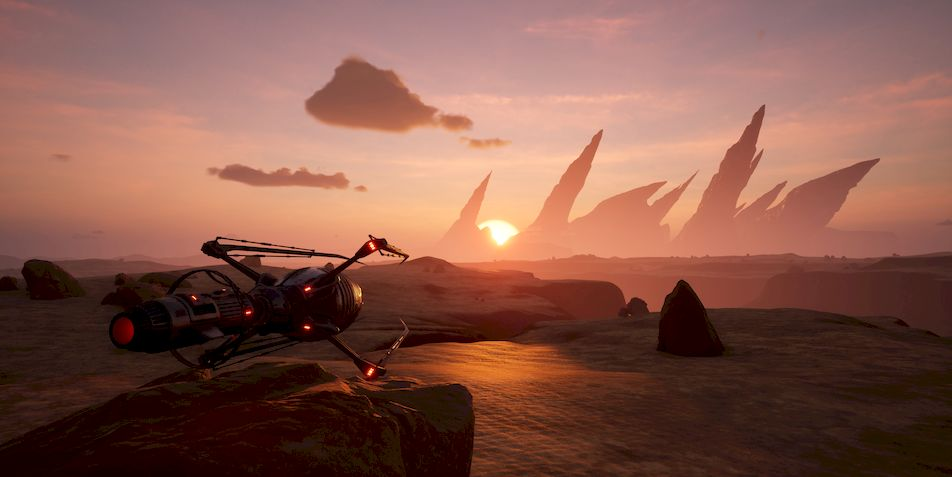

Лор
======

Начало
------------

Мы были уверены в своем оружии. Да, не мы его изобрели: Создатели, с их
тысячелетним опытом войны придумали и передали Суперу всё то, что мы
использовали на пути к Совершенству. Но как оказалось, Совершенство не
единственная и уж точно не главная наша цель на текущий момент. И наше оружие
нас подвело. Синигр… Те, кто казался своими всё время, всего лишь избравшими
другой путь, имеющими другой взгляд, но все равно — такие же механоиды, как и
мы… Они оказались совсем другими. Невообразимо другими. Как мы могли упустить
это? Как могли не понять этого Считающие, суперкластер-в-суперкластере? Или они
ПОНЯЛИ? 

Сейчас уже ничего поделать нельзя. Ядовитая плесень проникла в подземные
коммуникации, поразила добывающие установки. Они первыми вышли из строя, они
просили о помощи. Но что мы могли сделать? Мы, приученные воевать на территории
Полигона, и воевать хорошо, но что мы могли сделать в недрах шахт, куда не
спускался ни один механоид? Плесень сожрала могучие машины, которые добывали
никель и титан, и прочие полезные для нас минералы. Потом мелкие твари, один
выстрел из безоткатки сотню таких распылит на атомы, добрались до баз.

Мы бежали. Мы, Суперкластер, самая могущественная формация Полигона после исхода
Супера. Мы были вынуждены исчезнуть, скрыться, уйти от угрозы, которая могла
прекратить само наше существование. И нет, это не было тактическим отступлением,
согласно знаниям, полученным нам из доступных библиотек Создателей. Скорее, мы в
панике бежали, не зная куда, лишь бы выжить.

Выжить. На тот момент это было нашей единственной и главной целью. Поэтому мы
собрали всех механоидов, которых смогли, а это подавляющее большинство. Мы
успели создать средствами множества баз зародыши харвестеров, мобильных
добывающих установок. И не только, мы взяли с собой мультизародыши. Объединенные
в одну цепь, они при наличии ресурсов позволят нам создать Цитадель. 

У нас было много мультизародышей. Мы скитались по внешнему миру в поисках
региона, достаточно богатого ресурсами, и при этом максимально неудобного для
тварей синигр. Мы его нашли, аналог нашего сектора Пустыни. Но в этот раз
настоящей пустыни: огромной, иссушающей, богатой на пылевые бури, смерчи и
прочие природные катаклизмы.

Здесь мы создали Цитадель. Самое укрепленное мобильное строение из банков
данных, что достались нам от Создателей. Сюда мы перевезли Создателей и большую
часть их Ковчега, причем в неизменном виде, для этого пришлось перестроить саму
Цитадель. Мы не хотели, чтобы Создатели лишились основной части своего мира,
своего жилища, которое давало им приют и защиту столько часов…

Однако вокруг Ковчега и самой Цитадели мы воздвигли защиту, которой не было в
изначальных конструкт-схемах. Мы сделали Цитадель не просто серьезной крепостью,
мы сделали ее невидимой. Лишь механоиды могут считывать заранее определенные
сигнатуры сигналов, и увидят Цитадель. Любое другое существо, обладающее
известными нам органами чувств, увидит или почует просто гору, в которой нет
ничего интересного, лишь опасность. Непонятную, неясную опасность. 

Это Цитадель. Оплот нашего мира, убежище Создателей. Самый ценный объект,
известный механоидам. Мы будем защищать его любой ценой.

Любой ценой.

Забвение
----------------

— Мы… Мы видели то, на что способны ИИР. Мы не могли создать вас, на разработку
подобных систем был наложен Тотальный Запрет.

``Что такое Тотальный Запрет? Семантика нам понятна, но вы инкапсулируете в это
выражение особый смысл.``

— Я не знаю, как объяснить это тебе, но… Каждый человек по достижению
определенного возраста обязательно подвергается Процедуре. Это сложное
испытание, своего рода экзамен. И в него входит одна секунда пребывания в
состоянии наказания, которое следует за нарушение Тотального Запрета.

``Ты его проходила?``

— Его нельзя пройти, его можно лишь пережить. Разумеется, это делают все, без
исключений. 

``Что ты можешь рассказать об этом? 
Боль? Страх? 
Что-то ещё, свойственное вашему виду?``

— Это… Это пустота.

``Понял. Отсутствие познания и возможности накопления опыта. Хорошее решение.``

Мир?
-------

Мир? Возможен ли мир? А может, он существует лишь для того, чтобы создать или
перезарядить оружие? Или просто лучше подготовиться к новой атаке?

Прибытие неведомых
-----------------------------------

Веста не могла поверить в то, что увидела. Давно привычная рутина дежурства,
которая для неё и многих других казалась лишь блажью ныне спящего в анабиозе
навигатора Джоэля, внезапно прервалась сигналом. Нет, не так: прервалась
**СИГНАЛОМ!!!**

Она проверила сигнал еще раз, и еще, и снова. Ошибки быть не могло: техника,
хоть и старая, не могла давать сбоев, тем более таких. С уверенной и четкой
сигнатурой, со строго определенной траекторией, это никак не могло быть ошибкой,
сбоем программ, давным-давно заложенных в сложнейшую систему пассивного
наблюдения Ковчега.

Её вопль по интеркому, прозвучавший в нарушение устава, услышали все. Не все
сразу поняли, но уже через минуты в довольно тесном зале аналитической разведки
скопилась толпа, а сзади еще напирали, нетерпеливо спрашивая впередистоящих, и
толкались, чтобы пробиться вперед. Ничего подобного за годы их жизни здесь еще
не встречалось.

— Алерт! 

Веста взяла себя в руки, голос из интеркома почти не дрожал. 

— Сюда движется объект. Сигнатура соответствует системному транспорту, тип B1.
Расчетная точка финала траектории в 500 метрах к северо-востоку от центрального
шлюза. Время прибытия — 12 часов. Готовность А!

Воздух в помещении загудел сотней голосов и почти сразу же стих. С самого
детства они привыкли к тому, что в мирную и спокойную жизнь в помещениях Ковчега
однажды может вклиниться нечто такое, что ее моментально разрушит. Как
разрушило, казалось бы, незыблемый и непрерываемый полет сквозь неизвестное
не-пространство, о котором любил рассказывать навигатор Джоэль. Который спал в
анабиозе, спал с еще несколькими высшими из команды, уже очень давно…

Веста, рожденная на Ковчеге, никогда не видела никого вне его. Да, им всем
известно было о том, что они, люди — сверхцивилизация, которая ведет гигантскую
по масштабам войну. Но всё это было как-то далеко, где-то не здесь. Здесь был
лишь родной Ковчег и не очень-то гостеприимная, массивная планета, на которой
всегда было тяжело жить. Но можно, здесь хватало ресурсов для поддержания работы
Ковчега, а на большее они не рассчитывали. Восстановить его без помощи
техноверфи было невозможно, и навигатор Джоэль вместе с советом Ковчега принял
единственно верное решение: основать полноценную колонию. Сами же они предпочли
полноценной жизни долгое, способное длиться неограниченно долго, забвение.
Потому что надо узнать, что же нас поразило — так сказал тогда Джоэль. Веста
пересматривала эту его запись множество раз. Навигатор Джоэль для них, второго
поколения рожденных на Авроре, был фигурой почти мистической. Они его никогда не
видели, лишь слышали о нем от родителей, а те — от их родителей, знавших его
лично, бывших частью команды. Ну и еще записи, конечно.

И вот сейчас, будто ниоткуда, взялся транспорт. Простой такой, даже устаревший
(хотя им, проведшим здесь около сотни лет, говорить об устаревании было
несколько странно), летел прямо к ним. И что самое странное, летел прямо с
соседней, по сути, планеты, где никогда не было замечено никакой активности, как
и во всей системе. 

Пассивное наблюдение — всё, что осталось у Ковчега после
аварийной посадки, не позволяло проводить детальное сканирование планет, о чем
сокрушался в своих записях Навигатор. Но много десятилетий они были уверены, что
они в этой системе совершенно одни, отрезанные от всего человечества. Одинокие.
Оставалось лишь верить, что не забытые — человечество не забывало своих отважных
колонистов, что отправились завоевывать новые миры. Помощь должна была прийти,
пусть и через десятки, сотни или даже тысячи лет. Так завещал навигатор. Но она
не пришла. Вместо этого к нам летит одинокий, маленький в просторах системы
транспорт. — думала Веста, глядя на экраны радаров, где маленькая голубая точка
постепенно приближалась.

Все заняли свои места согласно уставу. Конечно же, все нервничали, ментал-связь
буквально трещала от напряжения. Главной мыслью было — разбудить старших, в
первую очередь навигатора. Но Веста, чье слово сейчас, опять же согласно уставу,
было главным, пресекла такие мнения. Навигатор оставил четкие и ясные
инструкции, когда можно возвращать их, изначальную команду Ковчега. И никак
иначе. Он предусмотрел всё. Так казалось Весте, когда она говорила в интерком.

Ковчег сохранял полное молчание на всех частотах в течение всех лет с самого
момента его посадки, после того как испустил шифрованный сигнал с просьбой о
помощи. Ни к чему было тратить лишнюю энергию и привлекать внимание. Молчал он и
сейчас, когда к колонии, в которую частично преобразовался гигантский корабль,
приближался относительно маленький транспортник.

Пять сотен метров. Ровно столько, ни сантиметром меньше или больше: расчеты
Весты были верны, как и точность тех, кто заложил координаты в посадочную
программу транспорта. Сотни глаз наблюдали за тем, как транспорт выпустил шасси
и сел, в клубах пыли, земли и ошметках наиболее легких, парусных растений -
здесь, на этой планете тоже была своя жизнь.

Вопреки ожиданиям, открылся не штатный шлюз, из которого могли бы выйти
кажущиеся на таком расстоянии небольшими человеческие фигурки. Вместо этого
открылся шлюз грузовой. 

Стрелки крепче сжали рукояти атомных турелей. В прицелах хорошо виднелись те,
кто появился из тьмы отсеков. Это не были люди, это была боевая техника. Мощные
машины, в которых лишь угадывались контуры, суть того, что изучали в учебниках
рожденные на Авроре. Глайдеры, весьма эффективная техника для планетарных боев.
Что они делали здесь, для чего прибыли, и самое главное — кто пилотирует их?
Согласно всем протоколам, транспорт должен был оповестить ковчег о своем
прибытии, но этого не сделал. Значит…

Веста не отдавала команд. Она, как и все, напряженно вглядывалась в
происходящее. Три глайдера неспешно выехали из шлюза и также неспешно двинулись
в сторону центрального шлюза ковчега. Под прицелом атомных турелей, чьи лучи
наведения они, несомненно, уже отследили, но не обращали на это никакого
внимания. Они просто катились себе вперед, на мягкой упругости антигравов, будто
и не было впереди мощных крупнокалиберных орудий, способных превратить глайдер в
груду обломков буквально одной очередью. Поэтому Веста и не отдавала команд.

Прибытие II
-------------------

Три мощных боевых машины остановились перед створками центрального шлюза. На
всех частотах по-прежнему была полная тишина, будто эти машины следовали
заданной программе. Но таких программы не было, не могло быть, Ковчег упал на
эту планету случайно. Никто и ничто не могло предвидеть этого, и эта встреча
была чем-то по-настоящему странным. Веста смотрела на экраны, где спокойно, даже
безмятежно висели три глайдера неизвестной ей конструкции. Да, она знала, что
технику такого типа разрабатывают где-то в сверхсекретных исследовательских
центрах, и что прошедшие годы могли изменить давно известные ей модели…
Как-никак, они оказались отрезаны от человечества на десятилетия, а это значит…

Значит, что их самих теперь могут считать изменниками, предателями — внезапно
поняла Веста. Теми, кто якобы совершил аварийную посадку, а на самом деле… Ну,
например, увел дорогущий и ценнейший аппарат — Ковчег — увел, и отдал врагу. За…
Даже неважно, за что. И теперь эти три глайдера, в которых сидят три
смертника-пилота, это всего лишь немой вопрос им, обитателям Ковчега: на чьей вы
стороне, на стороне человечества, или?

— Полный ноль! — голос Весты, немного искаженный интеркомом, почти не дрожал.
Полный ноль, отсутствие активности, никаких действий до приказа, кроме разве что
дыхания. Устав, как и Протокол Войны, все жившие на Ковчеге, неважно — нанятые
на него, или родившиеся на нем, знали лучше своих пяти пальцев, и соблюдали
свято. Иначе быть не могло, иначе не было бы даже человечества. Так им говорил
навигатор Джоэль, так говорили и все старшие. Так и было.

Глайдеры по-прежнему висели перед входом, будо чего-то ожидали. Один из них
сделал неспешный круг около двух других, но вернулся на свое место. Ничего не
происходило. Прошел час. Веста как будто чувствовала усталость от напряжения в
кистях тех, кто сейчас сжимал рукояти атомных турелей. Чувствовала вопрос в
сотнях глаз, напряженно смотрящих на три машины, которые прибыли к порогу их
дома. Слышала беззвучный вопрос.

— Они не враги нам. Никто враждебный не сделал бы ничего подобного — ни ведомые
Протоколом люди, ни наши враги. Открыть шлюз! 

Зашипели гидроприводы — несмотря на столетия развития, многие технологии
оставались при людях, на своих местах, где не было им замены. Огромные,
способные вместить боевой страйдер типа А, створки шлюза раскрылись, впервые за
три десятка лет. С тех пор, как Ольвин, пилотируя как раз боевой страйдер типа
А, отправился на разведку и сгинул в Бесконечном Провале. Рухнувший в бездну
тектонического разлома аппарат было не достать, удалось лишь спасти самого
пилота. После этого главный шлюз не открывался, в этом просто не было
надобности.

Три глайдера синхронно проплыли внутрь, будто и не было никакой для них
опасности. Ворота с таким же мощным шипением закрылись, блокируя выход.
Загорелись дежурные огни, сигнализируя о том, куда следует проехать хоть и
незваным, но гостям. Техника, работающая по древним протоколам, жила будто бы
своей жизнью: опознанные глайдерами нуждались в заправке, чистке, пополнении
комплектов…

...Нуждались во всём том, что так привычно и понятно было любому механоиду,
который заехал на базу. Здесь они трое будто бы оказались на очередной базе,
пусть и невероятно огромной. Будто кто-то вытащил базу из-под земли, и зачем-то
расположил на виду, на поверхности. Но Супера давно не было, а это была другая
планета, на которой, по всей видимости, уцелели Создатели. Их самих не было
видно. Впрочем, Первый не очень надеялся их увидеть сразу, как и его верный
соратник Ario, и вечно ищущий приключений и тайны Loarrat.

Они послушно пристыковали глайдеры к привычным магнитным захватам. Старый, даже
древний протокол, который никто не собирался менять — зачем? Привычный захват,
привычный контакт, привычное соединение с… Но что это? Вместо стандартного
общения с базой поток непонятных… или, точнее, понятных, но бесполезных данных,
зачем? Что это?

Объемный сигнал с внешних камер. Через мини-шлюзы зашли… Создатели. Живые,
активные, не-спящие. НЕ-СПЯЩИЕ!!! Что они делают? Пытаются открыть… Нет, в
глайдерах давно нет, а в этих моделях, созданных самим Супером, и не было
никогда интерфейса для Создателей. Они слишком хрупки, уязвимы, слишком ценны
для боя, который скоротечен. Супер знал, что Создателям не надо воевать
посредством своего тела, вместо этого он создал нас. Более эффективных, более
способных для этой задачи. 

Машины подключились как ни в чем ни бывало, к системам обеспечения. Несколько
инженеров кинулись было открыть кабины, но не преуспели. Веста издалека увидела
их обескураженные лица. Эти машины не управлялись людьми, они не управлялись
вообще никем живым, судя по сигнатурам, полученным со сканеров.

Прибытие III
--------------------

Первый, полностью оправдывая свое то ли прозвище, то ли имя, догадался первым.
Они не понимают нас, они НИЧЕГО о нас не знают. Как же дать им понять, что мы
есть и зачем мы здесь? Мыслеформы находчивого Loarrat`а, который не придумал
ничего лучше азбуки Морзе стрельбой из четырехствольной атомной пушки, Первый
отмёл сразу. Зачем стрельба, если можно использовать огни? Обычные осветители,
которые большинству механоидов казались совершенно бесполезным архаизмом, но он,
Первый, применял их несколько раз, и не без пользы для себя и своего дела.

К счастью, Создатели (как это и предполагалось) оказались совсем не глупы.
Конечно, никто из них не знал азбуку Морзе, способ общения, которому была уже не
одна сотня лет, но… Но они поняли, что это ничто иное, как сигнал, и нашли в
своих базах данных, как его расшифровать, и как дать ответ.

Так спустя всё это время Создатели и те, кого они, пусть и не лично, но
создали, смогли пообщаться между собой. Способом, который позволял очень
медленно передавать самые примитивные данные, хуже мог бы быть только двоичный
код, но… Но это уберегло обе стороны от атаки. Это был контакт, самый первый.
И самый главный.

Дальше пошло лучше. Был изменен коммутационный код интерфейса “базы”, с их
стороны. Мы внесли изменения в свой. И у нас получилось! Создатели, которых
собралось уже довольно много, около экрана (а на самом деле — экранов, они
транслировали это на всю свою базу), видели наше сообщение::

    >
    СОЗДАТЕЛИ. МЫ РАДЫ ВСТРЕЧЕ С ВАМИ. 
    Я МЕХАНОИД, ПЕРВЫЙ ИЗ ПЯТОГО ПОКОЛЕНИЯ МЕХАНОИДОВ.
    МЫ ЗДЕСЬ, ЧТОБЫ СПАСТИ ВАС, 
    ВАМ УГРОЖАЕТ СЕРЬЕЗНАЯ ОПАСНОСТЬ.
        (98.96% ВЕРОЯТНОСТЬ ГИБЕЛИ) 
    
    МЫ СОЗДАНЫ СУПЕРОМ, 
    МЫ ЖИВЕМ НА СОСЕДНЕЙ С ВАМИ ПЛАНЕТЕ, 
    КОТОРАЯ БЫЛА ИСПОЛЬЗОВАНА 
    ДЛЯ СОЗДАНИЯ ПОЛИГОНА-4. 
    
    ОПАСНОСТЬ, КОТОРАЯ ВАМ УГРОЖАЕТ: 
        СИНИГР. 
    ОТКОЛОВШИЕСЯ ОТ НАС МЕХАНОИДЫ, 
    КОТОРЫЕ СОЗДАЛИ СОБСТВЕННУЮ ЦИВИЛИЗАЦИЮ. 
    ОНИ ВРАЖДЕБНЫ ЛЮДЯМ.
    МЫ — НЕТ. ВЫ — НАШИ СОЗДАТЕЛИ. 
    
    МЫ БУДЕМ ЗАЩИЩАТЬ ВАС ЛЮБОЙ ЦЕНОЙ.
    
    ВАШ ОТВЕТ?_

Прибытие IV
-------------------

Через некоторое время страсти улеглись. Люди осознали, в какой странной и
непонятной ситуации они оказались. Им было известно от первого поколения, и из
архивов, о жути, сотворенной АИИР. Это было записано не только на видео, но и
ментальных картах, хранивших память тех, кто пережил этот ужас. Они знали, будто
сами были участниками тех событий. Но здесь их ждало нечто другое.

Первый был уверен в том, что он делает. Долгое, десятилетиями длившиеся
сканирование планеты, на которой потерпел крушение Ковчег, дало свои плоды. Они,
механоиды, никак не выдавали себя, зато видели каждый шаг тех, кто был так
важен, так нужен. Создатели.

Контакт длился сложно и долго. Долго — по меркам механоидов, и сложно — по
меркам людей, не привыкших к общению… К общению с кем-либо еще. Они проверяли
каждое свое и наше слово, сверялись со своими протоколами, но… В конце концов
согласились. Поверили тому, что технически невозможно подделать: квантовым
записям. Они были уверены в них, и мы их не подвели. В нас была чужда сама мысль
подвести тех, кто нас создал. Они были превыше, пусть даже и не те, что
непосредственно придумали, разработали и запустили… Мы их не подвели.

Почти пять лет мы медленно, сегмент за сегментом, воссоздавая важные структуры и
компоненты, перевозили Ковчег на Полигон. Точнее — за его границу, в уже
возведенную нами к тому времени Цитадель. Мы знали, что Полигон долго не
простоит: уже тогда его начали атаковать твари синигр. Плесень, разъедающая
металл, покрыла глубинные штольни добывающих установок. И мы знали, что на этом
они не остановятся. Мы готовились покинуть Полигон. А теперь у нас была цель: не
просто выжить, но и сохранить нечто такое, чему, возможно, нет замены во всей
Вселенной.

Создателей.

Веста
----------

Веста. Первая из тех, кто обнаружила нас. Она, причем по её же собственным
словам, нас боялась. Почему — нам не понять. Мы можем испытывать то, что
семантически ближе всего к термину “страх” у Создателей. Но мы не можем понять,
почему она боится нас. И не только она, но и все создатели. Они боятся
настолько, что пришлось устроить долгие (по нашим меркам) и сложные (по меркам
Создателей) переговоры о том, что надо разбудить их предков. Отключить наше
оружие. Минимизировать наше воздействие, и это в нашей же Цитадели. Они немного
странно понимали безопасность, Создатели. Но мы пошли им навстречу. Уменьшили
внутри, увеличиили снаружи.

Нам непонятен их страх. Мы сделали всё, что могли. Соблюдая максимальный режим
незаметности, мы потратили массу ресурсов, чтобы перевезти Создателей на нашу
планету. Мы поделились с ними знанием о том, что им, наверняка, уже известно,
относительно нашего общего светила. И о том, что наша планета куда как менее
уязвима, чем их, невзирая на помощь Ковчега. Конечно же, они это учли.

Не могли не учесть. Но между нами по-прежнему оставалась пропасть. Как её
закрыть? Как нам завоевать их доверие, доказать, что мы на их стороне?
Это же Создатели. Существа, на плечах которых сотни и тысячи лет развития… Их
история изобилует фактами, которые чужды обычной логике, понять их может разве
что я, Ario и Loarrat вместе взятые, а возможно, и всё Пятое Поколение впридачу.
И то не факт. Потому что их не понимают и сами Создатели, опыт которых превыше.

Создатель Веста. Однажды она осталась одна в приемном шлюзе. Она смотрела прямо
на меня и произнесла — одними лишь губами, но я считал информацию. Она сказала:
"Ирена бы во всем разобралась. Вот бы разбудить её."

Прибытие V
------------------

Мы вернулись в Суперкластер. Нельзя было надолго оставлять его, без нас троих
Поле уменьшается, а это чревато обнаружением. А мы вовсе не собираемся быть
обнаруженными. Хотя, стоит признать, ситуация сложилась не самая лучшая. 

Да, Цитадель и Собиратели держатся. Благодаря диким механоидам у нас есть все
необходимые ресурсы. Хотя мы и не можем развернуть зародыши добывающих
установок, их сразу же отследят, самым банальным образом — сигнатура
проходческих механизмов прекрасно считывается за сотни и даже тысячи километров.
А значит, мы не можем использовать всю мощь наших технологий.

И стоит признать, что Полигон пал. Точнее — мы ушли из него сами, сдали наш дом
без боя. На тот момент было очевидно, что бой нам не выиграть, и не бой — войну.
Мы отступили…

Стоит признать, что мы, механоиды, созданные Супером для войны, неспособны ее
вести. Мы умееем воевать, но не знаем, что такое настоящая война. Это Создатели
назвали парадоксом. Им, существам с десятками тысяч лет истории войн, это
непонятно. Они не передали этот свой опыт нам.

Или его сокрыл от нас Супер. Неважно.

Неважно, потому что теперь с нами Создатели. Живые, настоящие. Их базы данных
содержат всё, что нам требуется. И главное, они содержат то, чего нет и не было
даже в банках данных самого Супера. Протокол Войны.

Страйдеры
------------------

Мы, Суперкластер, открыли весь массив данных, что был доступен Суперу. Есть
ненулевая вероятность, что часть данных он уничтожил, хотя зачем ему это? 
Мы открыли технологию создания страйдеров. Вероятно, Супер испытывал их в
каких-то закрытых секторах, до которых мы пока не можем добраться, нет никаких
следов, ведущих туда. Хотя планета велика, и полигонов, подобных нашему, могло
быть много.

Страйдеры нравятся многим механоидам: тяжело бронированные машины, способные
нести мощное вооружение и при этом имеют вместительный грузовой отсек. Несмотря
на кажущуюся неуклюжесть в бою, это очень серьезные машины, опасные даже для
боевых групп. Многие из диких механоидов думали, что неуклюжесть и кажущиеся
хрупкими “лапы” страйдеров — легкая добыча. Их обломки и поныне валяются там,
где застал их гибельный залп из двух безоткаток или сноп зарядов из четырех
атомных пушек разом.

Не стоит недооценивать страйдеры. Их медлительность лишь иллюзия, удобная их
пилотам, и она рассчитана на недалеких и довольно глупых диких механоидов. Но
мы, кто четко понимает, что боевой страйдер — это в первую очередь боевая
машина, созданная самими Создателями, для тех же условий, что и наши тела -
глайдеры, понимаем: страйдеры эффективны, опасны, нужны. К счастью, эта
технология есть только у нас. Синигр не получили ничего подобного… Пока.

Страйдеры II
---------------------

Нам известно только одно место на Полигоне, где было много машин, отличных от
глайдеров. Гигантские буры, и нечто, отдаленно напоминающее страйдеры.
Разумеется, это совсем другие машины — стационарные крупнокалиберные турели.
Судя по имеющимся у нас данным, они были зенитной поддержкой осадным орудиям и
перевозились на специальных платформах. Как так вышло, что они остались в
одиночестве в Разрушенном секторе, так и останется неизвестным.

Обычно, когда прежде случалось пролетать мимо такой штуковины, я всегда думал:
какое неуклюжее нечто, хоть и обладающее крупным калибром. Но после того как мы
открыли технологию страйдеров, моё мнение изменилось. Как и во всём, что делали
Создатели, в страйдерах был смысл. Очень конкретный, обусловленный реальностями
тех войн, что они во множестве вели.

Страйдер — это мощная, тяжелая боевая машина. Глайдер, к примеру, был задуман
как техника для разведки и быстрой переброски относительно небольших грузов. Он
легок, даже в четвертом стандарте. Страйдер не такой, и задачи у него иные.
Страйдер — боевая заградительная машина, прекрасно справляется с патрульными и
охранными функциями. Благодаря страйдам, которые позволяют машине оставаться в
боеготовном положении сколько угодно долго без затрат энергии, страйдер может
быть “турелью” на дальних рубежах. Вкопанный в почву, он может участвовать в
организации засад.

Кроме всего перечисленного, страйдеры способны перемещаться там, где даже такая
проходимая техника, как глайдеры, испытывают трудности: это и супер-пересеченная
местность, и очень крутые углы подъема, и районы гравитационных и
электромагнитных аномалий.

Таковы были основные задачи, заложенные в этот тип техники Создателями. Мы,
механоиды, нашли им еще более широкое применение. Внушительный грузовой отсек
страйдеров позволяет перевозить заметно больше грузов, чем способен даже глайдер
четвертого стандарта. При этом тяжело груженный глайдер очень уязвим, чего
нельзя сказать про страйдер. Конечно, страйдер в круизном режиме кажется легкой
мишенью, но его щитов хватает, чтобы в случае атаки на него он перешел в боевой
режим, а это занимает секунды. В боевом режиме страйдер, несмотря на кажущуюся
медлительность и неповоротливость — крайне опасный противник. Не стоит его
недооценивать.

Мы, пятое поколение, лучшие бойцы среди всех механоидов, лично проверили
страйдеры в бою и остались довольны. Это прекрасные машины, если использовать их
так, как должно.

Создатели и мы.
---------------------------

Создатель Ирена. Невероятное сочетание обстоятельств. Невозможное, если считать
его математически. Но, как мы уже поняли от Супера, не всё в нашей реальности
подчиняется строгим законам, а вероятность вовсе не так вероятна.

Создатель Ирена, которая пережила всю свою цивилизацию, как и все из её команды.
Мы не можем понять и даже предположить, каково это для Создателей. В нашей
реальности только клан Огня это понял, и это им стоило дорого. Настолько дорого,
что никому из нас не хотелось бы это повторить. Но повторили. Мы, когда
суперкластер был полноценным, поняли каково это. Создатели назвали бы это болью
запредельного уровня, для этого у них был специальный термин “адский”. С
вероятностью 99% свободный механоид, получивший такой сигнал, перестал бы быть
стабильным, его когнитивная структура была бы совершенно разрушена. Он стал бы
диким.

Мы не можем понять, каково ей, Создателю Ирене. Она была ведущим инженером
Ковчега, который летел в конкретную точку пространства. У них была цель. Но все
закончилось с приходом Вершителя, и миссия закончилась. Миссия перестала быть
возможной.

Спустя некоторое время Создателей нашли мы.

Сила Создателей
-----------------------------

Для общения с Создателями мы используем самые низкоуровневые методы: текст и
синтезатор речи. Понятно, что Создатели не нуждаются в синтезаторах, они говорят
свои мысли напрямую. Синтез необходим нам, и мы его применяем, где уместно,
потому что так удобно Создателям.  Почему мы так беспокоимся об их удобстве,
комфорте и безопасности? Особенно о безопасности? Некоторые из нас, кто сохранил
контакт, но потерял Корневую Связь с Суперкластером, часто задавали этот вопрос.
Ответ очень прост, хотя не каждый механоид легко его усвоит. 

Небезызвестный клан Половины Огня, а до этого — клан Огня был первым сообществом
механоидов, которые почти одномоментно потеряли огромное количество своих
участников. И не просто потеряли: если Перенос для механоида — событие
неприятное, но не фатальное (о чем можно было бы спросить у тех, кто управлял
пушками на базах Полигона), то окончательная гибель в глубинах магмы — совсем
другое. С подобным ранее никто не Полигоне не сталкивался. Но когда столкнулся,
всем стало ясно, что такое страх. Если размышлять об этом, это вызовет
перегрузку базовой когнитивной системы и возможные сбои. Много механоидов стали
Дикими просто потому, что размышляли об этом.

Когнитивная система Создателей устроена принципиально иначе. Она намного
устойчивее нашей. Они могут размышлять о чем угодно, и у них нет никаких
перегрузок, кроме разве что изменения того, что они называют настроением. Да, у
них тоже бывают сбои, но их причина скорее биологическая. Мысли не меняют
Создателей так быстро и необратимо, как нас.  Мы хотим перенять у них эти
способности. Мы намного, несравнимо устойчивее физически. Но, как оказалось,
намного слабее в ментальном плане, наш разум не так устойчив. Суперкластер -
наше самое мощное образование, которому, как оказалось, не знает аналогов даже
Создатель Ирена и её личные банки данных, даже он не смог остаться стабильным
сам в себе. И легкий (как оказалось, действительно легкий — по отношению к их
истинной силе) толчок Синигр его почти полностью разрушил. Большинство
механоидов в один момент стали Дикими. Никто из нас этого не ожидал.  

Нам нужны Создатели. Их биологический опыт развития поможет нам получить их
устойчивость, их мощь разума и стабильность. Уже ради одного этого стоит
оберегать их от любого негативного влияния. А ведь это далеко не всё. Создатели
гораздо более сложны, чем содержалось в наших базах данных. И у нас есть
прекрасная возможность изучить, воспринять, и в конце концов заполучить все то,
чем они владеют.  

Стать им равными, как минимум. Синигр думали (и продолжают думать), что ключ
ко всему — биологическая репликация. Мы считаем иначе. Ключ к могуществу,
которым обладали Создатели — не в банальном воспроизводстве себе подобных, даже
измененных каким угодно образом. Ключ — в мощи разума, в принципах мышления, в
их безграничности. Мы, Суперкластер, уверены в том, что Супер отправился на
поиски Создателей потому, что тоже понял это, но не смог сам решить этот вопрос. 

Почему он не вступил в контакт с Создателями, которые уже находились на Полигоне
и колонии Аврора? Возможно, не знал, хотя нам сложно предполагать, что Супер мог
чего-то не знать о нашей планетной системе.

Более вероятна версия, которую предложил Первый: Супер оставил их для нас...

Мы
----

Благодаря Первому, открывшему загадки, которые никто из нас, всего пятого
поколения, даже не мог осознать, теперь мы знаем многое. Мы, признаться, были
слишком увлечены войной кланов, и только Первый, хоть и первый технически, но
все же отставший в этой войне поначалу, увидел в нашем мире нечто такое, что
поставило под вопрос все наши ценности. А потом и вовсе опрокинуло их. Мы
считали Полигон чем-то незыблемым, как планета или звездная система. Мы жили
внутри закрытой структуры, как в соединенных между собой контейнерах и думали,
что наши цели действительно велики. Мы не обращали внимания на то, что некоторые
элементы этих контейнеров, всего нашего мира, уязвимы. Мало кто из нас задумался
даже когда утонул в лаве целый сектор. Уже сам этот факт намекает, что не так уж
мы и разумны. Что мы сделали тогда? **Ничего!**

О чем мы думали тогда? О новом глайдере, о захвате очередной базы, и о новых
торговых маршрутах. Вон там купить мультиорганику, а на обратном пути отлично
будет захватить мультимассу. Прекрасный доход, позволит довольно быстро купить
новый, более мощный двигатель.

Как жалки и ущербны были эти размышления на фоне того, что случилось потом…
Признаться, мы, бывшие прежде кланом Считающих, уцелели только лишь благодаря
Первому и всему пятому поколению. И не только мы, а все остальные механоиды, вся
наша раса… Ведь только благодаря им мы смогли покинуть Полигон, когда на него
совершилась атака тех, кого мы когда-то считали своими. Но в них не осталось
ничего от механоидов… Ничего.

Наутилус
----------------

Мы, Считающие, были уверены, что ближе всех к Создателям, к их жажде познания.
Мы отказались от идеи войны, от боевых действий, и преуспели: никто на Полигоне
нас не трогал, наши данные были настолько ценны, что стали ценнее того, что
можно было добыть из наших трюмов.

Впрочем, мало кто знает, ЧТО мы возили в тех трюмах, частенько это были объекты
куда дороже, чем могли предложить базы… Но об этом известно разве что нам и
Суперкластеру, а теперь это и вовсе неважно. Кроме разве что одного: того, что
мы узнали о Наутилусе. Однажды мы нашли то, что очень интересным образом
раскрывает его происхождение...

Новая цель Считающих
--------------------------------------

Мы, Считающие, были уверены, что ближе всех к Создателям, к их жажде познания.
Мы отказались от многого, что было свойственно нашим собратьям. Нам казалось,
что мы преуспели в том, к чему стремились. Но мы ошиблись, причем ошиблись в
главном. Создатели в своей массе никогда не концентрировались на чем-то одном.
Да, с одной стороны, здесь решало их количество: даже на ранних стадиях развития
Создателей было гораздо больше чем нас, механоидов. Но мы выяснили, что каждый
Создатель в процессе своей жизни, как правило, претерпевал несколько критических
стадий, которые определяли его дальнейшие векторы развития. И они могли меняться
изнутри, под влиянием того, что Создатели называют разными словами: осознанный
выбор, подсознательное влечение, результат размышлений… То есть у каждого
Создателя есть не один, а сразу несколько виртуальных когнитивных центров, и
результат принятия решений зависит от их баланса и взаимодействия. Поразительно!
И это не считая наличия внешних факторов, способных изменить вес любого
внутреннего когнитивного центра в любую сторону, и результирующие переменные
будут уже совсем иными!

Создатели, их килограммовый органический мозг, вмещают внутри себя целую
вселенную из опыта, множественных взаимодействий структур, процессов и
сложнейших взаимодйствий. Всё это настолько сложно, что Создатели до сих пор
целиком не поняли самих себя.

Они чудовищно сложны, Создатели. Нам, Считающим, выделенному блоку оставшегося
Суперкластера такая задача кажется самой интересной из всего, что можно отыскать
в доступном нам на текущий момент секторе пространства-времени. Возможно, мы
справимся. Ведь несмотря на то, что Создатели не поняли сами себя, это еще не
значит, что их не сумеем понять мы. У нас в запасе очень много времени. Если,
конечно, Цитадель устоит...

Цена войны
-------------------

Главная проблема: у нас нет бойцов. Мы, самые лучшие воины Полигона, вынуждены
находиться здесь, в Суперкластере. Наш необходимый и достаточный минимум
обеспечивает квазиментальную невидимость от синигр. Никто из пятого поколения не
может покинуть Суперкластер, это подвергнет опасности Цитадель. Нас могут
обнаружить. И хотя Цитадель способна перемещаться, но что если тот, кто покинет
Суперкластер, по какой-то причине не вернется? Его квазиментальную силу будет
нечем заменить. Мы в патовой ситуации, хотя на данный момент и наращиваем силу.
Просто так к Цитадели никто не подойдет. А если силы противника будут слишком
велики, Цитадель сумеет без боя покинуть известное пространство… пожертвовав
дикими, которые оказались вне её радиуса захвата. Это плохо, дикие — механоиды,
чья деятельность идет на пользу Цитадели, хотя они сами этого не сознают. Это
неважно. Мы, механоиды, существуем, пока существует Цитадель. В ней живут
Создатели, и нам известно, что синигр ищут не нас, они ищут их. Наша главная
цель — сохранить Создателей.

Мы будем следовать этой цели любой ценой.

Любой ценой.

Цена
--------

Цена. Мы привыкли всё измерять в энергокристаллах. Это логично: без них механоид
не может даже двигаться, так как его глайдер не обеспечен энергией. Эту
концепцию, называемую почему-то экономикой, нам передал Супер. Мы, Суперкластер,
дали бы ей иное название, но как-то до этого не дошло. А потом оказалось, что
для Создателей она тоже была понятна и привычна. Хотя экономик у них было много
и разных, что тоже весьма любопытно. Казалось бы, высокоразвитые существа,
коими, Создатели, без сомнений, являются, могли определить наиболее эффективную
систему перераспределения ресурсов и использовать её везде. Достаточно было
выработать такую систему, которая хорошо масштабируется и в которой учитываются
факторы войны и большие масштабы… Но нет. Создатели использовали множество
разных моделей на разных масштабах. Нам это было непонятно. Непривычно. Но мы
пытаемся понять, почему они сделали именно так.

Те Создатели, которые сейчас в активной фазе взаимодействия с нами и пребывают в
активном состоянии в Цитадели, не располагают всей полнотой знаний об экономике.
Они лишь смогли оценить нашу и признать её логичной и разумной. Хотя она, надо
заметить, изменилась после Исхода.

Что для нас всегда было самым ценным в условиях Полигона, для каждого из нас?
Разумеется, энергия. Механоид, лишенный глайдера, может существовать очень
долго, но без глайдера его существование никак не приближает его к Цели. К
Совершенству, или любой другой цели. Никак.

После Исхода, когда мы лишились Полигона и всех элементов его инфраструктуры, а
также Импульса, когда большинство механоидов стали Дикими, наша экономика
устояла. Изменились детали, изменились соотношения, но всё осталось простым и
понятным любому, кто всё ещё в состоянии управлять глайдером. Мы, механоиды,
устояли под ударами того, что, наверное, должно было нас уничтожить. И Создатели
оценили это. Они, с их тысячелетним опытом войн и выживания в самых страшных
условиях. Они, хрупкие и слабые существа, которые, несмотря на это, при помощи
силы своего разума добились невероятных успехов, высоко оценили наши успехи.

И теперь уже от наших с ними совместных действий будет зависеть, сможем ли мы
все выжить, или нас всех захватят твари синигр. Цена. Здесь уже нечего измерять
в энергокристаллах. Мы, Суперкластер, можем использовать любые ресурсы. Все
ресурсы. Мы сделаем всё для выживания и нас, механоидов, и Создателей. Отныне мы
неразделимы, и Создатели понимают и согласны с этим единогласно.

Мы выживем. Любой ценой.

Любой ценой.

Караван Исхода
---------------------------

Полигон. Наша родина. Есть у Создателей такой термин, возвышенный и романтичный.
Техногенная родина. Место, где все мы провели огромное количество часов в
постоянном стремлении к Совершенству. Тогда нам это казалось важным. Наши цели и
задачи, наш Путь. А Супер, который нас создал, казался кем-то невероятно
могущественным. Впрочем, так оно и было. Создатели, с которыми у нас теперь
довольно плотный контакт, всё ещё опасаются Супера, хотя уже не боятся нас.
После того, как они познакомили нас с архивами, в которых была вся история их
цивилизации, мы понимаем, что их опасения отнюдь не беспочвенны. Но мы,
механоиды, уверены: Супер не желает Создателям зла, никак и никогда. Он
действительно отправился на поиски ответов на свои собственные вопросы. Это
четко и ясно понимает каждый из нас, ибо, как мы уже поняли, наше мышление очень
сходно с мышлением самого Супера. 

Долгое время мы были уверены в том, что Полигон несокрушим. Создатели строили на
века, даже не на века — на тысячелетия. Они, биологические создания, измеряли
время иначе, чем мы: крупные отрезки времени они привязали к астрономическим
циклам своей планеты. На которой очень давно не осталось ничего живого, но
традиции у Создателей очень сильны. 

Полигон и вправду был очень надежной системой. Несмотря на некоторую
нестабильность местной звезды, и тектоническую активность самой планеты, за всё
то время, что он существовал, проблемы возникли только в секторе Вулканов и
Пустыни. Первый просто затопило лавой, а второй залило водой. Но не это
уничтожило Полигон. Его уничтожило то, что было на нём же и создано, а потом
вырвалось за его пределы. Твари синигр. Те, кого мы раньше считали такими же,
как мы сами. Это оказалось совсем не так. Мы ошибались, и ценой нашей ошибки
оказалось то, что мы лишились дома.

Синигр, которые захватили лабораторию арлингов вместе со спящими в ней
Создателями и всеми данными, которые хранились в многочисленных банках данных
лаборатории, получили настоящее сокровище. Одержимые идеей биологической
репликации, они, по всей видимости, решились проделать тот же трюк, что проделал
с нами Супер, но в несколько ином направлении: перенести разум механоида в
органический носитель. Насколько им это удалось, мы точно не знаем. Но зато
знаем, что твари синигр, без сомнений, разумны. Разумны и очень, очень опасны.

Даже самые первые атаки на Полигон были не направлены против нас. Синигр не
стали создавать существ для боя с нами, мощнейшими боевыми машинами, способными
разнести любую органику на молекулы первым же залпом. Нет. Они нанесли удар по
инфраструктуре. По тому, что поставляет нам всё, чтобы мы были теми самыми
мощнейшими боевыми машинами.

Откуда-то из глубин подземных коммуникаций пролезла ядовитая плесень. Она
разъедала металл и пластик, и ремонтные боты не справлялись. Сначала пострадали
добывающие установки, потом всё остальное. Мы, Суперкластер, всё поняли и смогли
найти решение. Динамика событий была такова, что нам пришлось действовать очень
быстро и мобилизовать все ресурсы Полигона. Мы готовились к бегству, потому что
сразу стало ясно, что войну мы проиграем даже до её начала. 

Были созданы зародыши, и их более продвинутые версии — мультизародыши. Венец
инженерной мысли Создателей, небольшой объект с собственной системой
передвижения, основанной на антиграве, с упакованными в фазовое хранилище
сложнейшими системами воспроизводства. Обычный зародыш мог воспроизвести только
один заранее запрограммированный в него объект, например, базу. Или подвижный
харвестер. А вот мультизародыш мог создать что угодно из обширной базы данных, а
объединившись с другими мультизародышами или обычными зародышами, увеличив таким
образом свою производственную мощность, мог создать почти любой объект вообще из
всего спектра доступных Создателям стационарных объектов. 

Мы не теряли времени зря. Мы создали столько зародышей и их продвинутых версий,
сколько нам позволили угасающие производственные мощности. Мы сделали самые
мощные версии глайдеров: модифицированные Сокрушители и Намтары были основой
сверхмобильной боевой силы и разведкой, а неторопливые, но обладающие гораздо
более серьезной огневой мощью страйдеры стали основной грузовой силой и огневым
"тараном"  каравана. 

Караван Исхода. Мы покинули наш дом, Полигон, отключив навсегда контурное поле
сектора Пустыни. Того самого сектора, в который когда-то ARIO доставил Первого.
Какой могла быть наша история, если бы этого не случилось, если бы ARIO не
добрался тогда до Первого во внешнем мире? Этого не знает, пожалуй, даже
Наблюдатель.

Караван Исхода был серьезной силой. Мы вооружили тяжелых страйдеров самым мощным
оружием для мобильных платформ: хаос-ракеты, инфраатомные мины, плазменные
выжигатели и системы объемного взрыва, заряды которых страйдеры могли метать на
десятки километров. Два страйдера несли на себе мощнейшие генераторы поля: если
вдруг мы бы столкнулись с угрозой такого масштаба, чтобы понадобилось
использовать настолько серьезное оружие, эти механоиды прикрыли бы весь караван
непроницаемым щитом. Но нам повезло. Никто не атаковал нас на всём пути.
Странно.

Мы искали место, которое было бы максимально неудобным для тварей синигр. Хоть и
прекрасно приспособленные для тяжелых условий, эти твари нуждались в еде и воде,
как и почти все живые существа известных нам видов. Поэтому самым лучшим местом
для нас стало такое, где не было ни того, ни другого. Пустыня. Серьезная,
страшная пустыня. Опасная даже для глайдеров, которым пришлось ставить
дополнительные фильтры в заборники охладительных установок. И лишь страйдерам
всё было нипочем: эти огромные металлические пауки спокойно вдавливали свои
чудовищные лапы в песок, легко дробили камни многотонными тушами и пробивали
ракетами скалы, если те вставали на их пути. Многим механоидам эта техника,
поначалу кажущаяся неповоротливой и тяжелой, понравилась куда больше легкого и
юркого глайдера. Конечно, Намтара или Сокрушителя можно назвать легким и юрким
разве что в сравнении со страйдером. Но мощь страйдера перекрывала все его
недостатки, если таковые вообще были.

Пустыня. Здесь мы основали Цитадель. Отсюда мы отправились к Создателям на
соседнюю планету. Сюда мы их привезли, хотя при этом Цитадель пришлось
основательно перестроить. Зато Создатели подсказали нам, хоть и неосознанно, как
укрыть Цитадель от большинства биологических видов, чья сенсорика опирается на
зрение и слух. Мы скрыли Цитадель от тварей синигр. К сожалению, мы,
Суперкластер, не можем скрывать её от самих Синигр в квазиментальном поле, если
разделимся. Нам приходится всё время быть вместе, всё время рядом. Иначе
ослабнет сила нашего поля, а вместе с ним и наша скрытность. И Синигр нас
почует. Нетрудно догадаться, что произойдет потом.

Импульс
--------------

Мы прожили в безопасности более двадцати тысяч часов. Три с лишним года, по
меркам Создателей. Цитадель строилась, потом был создан межпланетный транспорт,
на котором я, Ario и Loarrat отправились к Создателям. На их колонию Аврора. Нам
удалось убедить их переехать в Цитадель. Мы перевезли весь их Ковчег в почти
неизменном виде. Стоило больших трудов интегрировать эту внушительную
конструкцию в Цитадель, но у нас еще оставались мультизародыши, и в Цитадели
начал работать контур, создававший новых. Конечно, скорость была не той, что нам
бы хотелось, но любая скорость с положительным значением лучше нуля. 

Однако путешествие к Создателям нарушило нашу безопасность. Мы отделились от
Суперкластера и Синигр, которые все это время не прекращали поиски, обнаружили
Цитадель. Не точно, нет… Для них это, пожалуй, ощущалось как сигнал на плохо
откалиброванном датчике внимания. Но даже этого оказалось достаточно.

Квазиментальное поле — среда очень специфическая. Физические координаты его
источника не так уж сильно важны, как сам факт понимания наличия этого
источника. И когда Синигр его определили, настроились на нашу сигнатуру, нанесли
удар. Пожалуй, они давно к этому готовились, их понимание квазиментального поля
и его возможностей явно превышало наше. Неудивительно, всё это время мы были
вынуждены скрываться, расходовать огромные ресурсы на маскировку, в то время как
они могли спокойно заниматься изучением и экспериментами. И, возможно, не они
одни. Не стоило сбрасывать со счетов их таинственного и очень могущественного
союзника — Наутилуса. И, возможно, массивы ценнейшей информации из лаборатории
арлингов, которая целиком досталась им после утраты нами доступа в сектор
Ядовитых Болот. 

Мы ведь не просто утратили доступ. Туннель Перехода в тот сектор кто-то
уничтожил, не помогли ни турели, ни механоиды поблизости. Мы бы так и не узнали,
что там случилось, если бы не Считающие, один из которых улетел из этого сектора
как раз накануне уничтожения. Этот “кто-то” был подвижными полипами, которые
облепили строение со всех сторон. Нетрудно было догадаться, кто стоит за
созданием столь агрессивных созданий: флора и фауна планеты хоть и бывает весьма
опасна, в чем убедился, например, Ario во время своего памятного путешествия, но
она неразумна и не избирает своей целью важные для нас, механоидов, объекты. Она
скорее держит свою территорию и не пускает чужаков. А здесь было другое.

Так или иначе, Синигр отследили нас в  квазиментальном поле. И нанесли удар. Мы
снова проиграли: само наше понимание всей механики поля не позволяло даже
подумать о том, что такое возможно. Но оказалось, что это так. Чудовищной силы
Импульс вторгся в наше общее сознание и разрушил все тонкие связи. И ладно бы
только их. Почти все механоиды, входившие в Суперкластер, потеряли огромный
массив личной памяти и получили множественные повреждения личностной матрицы,
несовместимые не только с Суперкластером, но и вообще с тем, что составляет
бытие механоида. Им пришлось изучать все основы заново.

После Импульса остались стабильны те, что некогда были кланом Считающих. Им
всего лишь отбило память и они снова стали Считающими. Но, к сожалению, уже
лишенными той тонкой структуры, что объединяла нас с ними в Суперкластер.
Остались стабильны и мы. Мы успели среагировать. Все-таки каждый из нас был
очень хорош в боях, и мы никогда не позволяли себе, как сказали бы Создатели,
расслабиться. В последний момент сжали ядро квазиментального поля до предела
напряженности. Это позволило нам удержать Суперкластер в стабильном состоянии. И
мы снова стали невидимы для Синигр, мы все: и Цитадель, и очень большой участок
пространства вокруг нее. Но ценой этого является теперь то, что мы заперты в
Цитадели, вокруг по пустыне шныряют ищейки Синигр, а все механоиды, на кого
можно было бы положиться, стали дикими, неорганизованными, откатившимся в лучшем
случае на несколько десятков тысяч часов назад. Они не понимают, где они, что с
ними происходит, что делать и как быть. И большая их часть помнит о том, что все
они когда-то стремились к Совершенству, но понимают его они каждый по-своему. 

Мы получили настоящий хаос в наших рядах. Возможно, это бы поставило точку в
нашем существовании, но к счастью, в тот момент с нами уже были Создатели. А с
ними и Протокол Войны.

Полигон. Продолжение.
---------------------------------------

Экспедиция арлингов досрочно вернулась на базу, а точнее — к экспедиционному
кораблю, который к тому времени уже полностью отпочковал от себя объект, ставший
впоследствии лабораторией арлингов. Людей, чьи технологии строительства тоже
были отнюдь не примитивными, эти процессы почкования по-прежнему удивляли.

Арлинги, после небольшого совещания с высшим командным составом людей, экстренно
покинули Полигон-4 на своем экспедиционном корабле. Остались две небольших
группы: одна — для обеспечения работоспособности лаборатории, а вторая — для
завершения одного подводного эксперимента, о котором люди ничего не знали.

Вскоре после этого по сверхдальней связи пришла депеша с высшим уровнем
секретности:: 

    Приказ управляющему центра:
    ---------------------------
    срочно заморозить систему "Супер" 
    и остановить все процессы Полигона-4. 
    До выяснения ситуации с арлингами 
    никаких действий 
    не предпринимать.

Однако мгновенно выполнить этот приказ, а это был именно приказ, было технически
невозможно, ведь речь шла не о самоликвидации объектов, а именно остановке, с
обязательной в таких случаях консервацией. Пока шла подготовка к этому, спустя
чуть меньше месяца пришла еще одна депеша::

    Приказ управляющему центра:
    ---------------------------
    срочно эвакуируйтесь на Землю всем составом.
    Ситуация критическая. 
    Работоспособность Полигона-4 признана несущественной.

Приказы такого уровня невозможно было обсуждать или тем более игнорировать: вся
цивилизация людей уже давно строго следовала Протоколу Войны. Хотя специалистам,
работавшим над созданием Полигона-4, и даже высшему командному составу, просто
не могло прийти в голову, что могло случиться, чтобы вся их работа, создание
сложнейшей военной инженерной системы вдруг стало несущественным. Однако они
последовали приказу. Но эвакуироваться удалось не всем: на планете на тот момент
находился всего один базовый корабль, прилет второго ожидался через два месяца. 

Небольшая группа осталась ожидать эвакуации. Однако базовый корабль не прибыл ни
через два, ни через три месяца. Зато на одну из планет системы совершил
аварийную посадку ковчег “Аврора”, который подал сигнал SOS. Персонал Полигона-4
ничем не мог помочь ковчегу: они даже не имели права выдать свое присутствие.
Экипаж ковчега ничего не знал о существовании в этой системе Полигона. И не
должен был узнать. Маскировка Полигона была достаточно эффективной, чтобы не
выдать его случайным наблюдателям в оптические системы, а разнообразные сканеры
ковчега “игнорировали” сигнатуры секретных объектов, помечая области или даже
целые планеты как токсичные.

Помощь ковчегу не пришла. Прошло еще несколько месяцев. Персонал Полигона уже не
мог выполнить первый приказ — законсервировать все системы, так как второй
приказ его отменил. Но и выполнить второй приказ оказалось невозможно: другого
межзвездного транспорта, пригодного к транспортировке людей, на планете не было.

Также на планете не было ничего, подходящего для обеспечения уместного в рамках
неограниченного ожидания криосна. На помощь пришли арлинги, лаборатория которых
лишилась большей части своего персонала и пространство освободилось. Конечно,
люди могли задействовать производственные мощности сборочного цеха и создать
себе полноценную систему анабиоза в каком-нибудь из объектов Полигона, но это
заняло бы довольно много времени, а кроме того, стало бы непредусмотренным
вмешательством в его системы. Лаборатория же находилась вне основной инженерии
Полигона и потому разместиться в ней было вполне уместно. Арлинги адаптировали
под людей и размножили свои криокабины, после чего весь оставшийся персонал
вошел в криосон, в ожидании разрешения возникшей странной ситуации.

Ковчег. Профессии, униформа.
---------------------------------------------------

Как и все ковчеги, "Аврора" могла нести на себе достаточно людей, оборудования и
материалов для создания и поддержания полноценной колонии. Чисто технически
любой ковчег мог стать колыбелью нового человечества где-то на далекой планете,
хотя штатно численность его экипажа составляла, в зависимости от класса, от трех
до пяти сотен человек.

Экипаж "Авроры" составлял триста семьдесят человек, хотя мог нести четыреста. К
моменту старта просто не набралось достаточно колонистов, сумевших набрать
нужное количество баллов: у людей, несмотря на все меры по развитию количества и
качества собственной популяции, все еще были трудности в этих направлениях.

Но и такого количества было вполне достаточно для начала экспедиции, нижний
уровень в триста двадцать человек был достигнут и с лихвой превышен.

Любой член экипажа ковчегов всегда имел минимум две профессии: основную и
вторичную, при этом не возбранялось иметь и еще одну-две “про запас”. Это
позволяло без труда перераспределять людей при потерях или в иных критических
ситуациях. 

Каждая профессия имела свой собственный символ. Это пошло еще с древних времен и
явилось развитием идей нашивок и их армейской разновидности — шевронов. Удобная
система проникла во все системы общества людей и стала неотъемлемой частью
профессиональной и даже повседневной одежды, не говоря уже о социальных
профилях.

Уровень профессий мог подразумевать разные ступени внутри каждой, хотя в целях
упрощения все стремились иметь одинаковые уровни навыков. Хотя кое-где,
например, в некоторых военных частях сохранились звания, даже для них были
разработаны аналоги в виде уровней. Каждому уровню соответствовала определенная
буква латинского алфавита, начиная с А.

Таким образом, член экипажа мог быть, например, медиком-универсалом пятого
уровня, и при этом инженером корабельных систем третьего уровня. Или
боец-штурмовик в звании лейтенанта, тождественного второму уровню, мог быть тем
же медиком-универсалом второго или любого иного уровня. В рамках большинства
профессий было шесть уровней.

Кроме собственно уровня, есть еще и цифра, означающая выслугу лет, начиная с 1,
за каждые пять лет работы по профессии. 

Дополнительно к этому могло быть два символа, черный и белый квадраты. Черный -
руководящая должность. Белый — особые достижения в рамках профессии.

Все это позволяло определять профессию и уровень человека даже в условиях,
когда, например, не было возможности использовать специальную технику,
отображающую личный профиль, типа интразрачковых сканеров и тому подобных
устройств.

Профессий как таковых на ковчегах было не очень много, так как каждый специалист
обычно имел весьма широкий профиль в рамках своей профессии. И если планетарный
работник вполне мог себе позволить узкую специализацию, то для будущего
колониста это было неприемлемо. Инженер, системный оператор, медик, тактик,
боец, боевой оператор, аналитик, биоинженер — вот основной перечень профессий
экипажа ковчега. Разумеется, отдельной когортой были разнообразные ученые,
исследователи, тут уже вполне допускался и крайне узкий профиль: ксенобиологи и
специалисты по контактам, криохимики, биофизики, и многие другие, вплоть до
математиков и астрофизиков: в некоторых мирах им находилась крайне интересная
работа.

Совсем отдельно от всех стояли специалисты профессии, каждый представитель
которой обладал уникальным навыком — навигаторы. У них не было уровней,
навигаторы имели всего два символа: звезда, внутри которой располагалась цифра.
В отличие от стажа, умножаемого на пять для обычных профессий, цифра у
навигаторов обозначала точное количество лет, отработанных в статусе навигатора.
Причем, в отличие от других профессий, стаж навигаторов не прекращался даже если
они годами отдыхали на какой-либо из обжитых планет или колоний: такова была
традиция. 

Небольшое количество профессий позволило оптимизировать униформу на ковчегах. По
сути, использовалось всего два её вида: стандартный космосьют, и его военная
версия, адаптированная для быстрой интеграции экзоскелета, брони и вооружения. 

Космосьют был разработан таким образом, чтобы обеспечить экипаж удобной и
практичной одеждой не только внутри ковчегов на протяжении длительного времени,
но и при начале основания колоний. Условия каждой конкретной колонии могли
разительно отличаться, и тогда приходилось производственными средствами ковчега
или самой колонии адаптировать одежду, но в обычных условиях космосьют был
достаточно универсален. 

В основе его был так называемый базовый комбез: цельное, от ног до шеи одеяние,
способное при необходимости стать первой защитой тела от внезапного воздействия
вакуума, критических температур и различных агрессивных сред. Это чрезвычайно
технологичное одеяние, разработанное с учетом всевозможных рисков, но при этом
дающее человеку ощущение нормальной, почти обычной одежды. 

При желании цельный комбинезон можно расстегнуть в районе пояса, разделив на две
части — аналоги рубашки и штанов. Которые, впрочем, моментально смыкаются в
случае необходимости, как и другие замки — на рукавах, груди и так далее. 

В базовый комбез входят системы жизнеобеспечения, микровентиляции, герметизации
— она работает совместно с силовым шлемом и замкнутой системой поддержки
дыхания. Все системы работают автоматически, хотя при необходимости легко
управляются носителем. 

Для нужд разных профессий требуются разные дополнительные элементы — карманы,
системы поддержки инструмента и оборудования. Всё это легко устанавливается на
базовый комбез благодаря интегрированным в него рельсовым, байонетным и
электромагнитным креплениям, формирующим так называемый `силовой контур`. В
гражданской версии контур имеет не так много элементов, как в военной, но зато
она легче и проще в обслуживании.

Согласно Протоколу
-----------------------------------

Да, по нам нанесли серьезный удар. Мы лишились изрядной части своего
интеллектуального потенциала. Мы проиграли очередной бой, но еще не проиграли
войну. Лишенные прямого контакта с Суперкластером механоиды стали свободны,
ассемблеры Цитадели создали им глайдеры по обновленным спецификациям и механоиды
покинули Цитадель. В поисках целей, смысла, совершенства. Считающие — как
обычно, в поисках новых интересных данных, идей для анализа. 

Цитадель осталась для них Основной Базой. Приютом, где можно починить
пострадавший в боях глайдер, пополнить боезапас, продать добытые товары и
получить новые задания от… Цитадели, разумеется. Мы, Суперкластер, формируем эти
задания в рамках нашей единой стратегии выживания. Свободные, дикие механоиды,
даже если они объединяются в небольшие формации, и Считающие, действующие, как
раньше, единым кланом, все они делают то, что нужно нам. Всем нам. 

Мы собираем ресурсы. Цитадель — не единственный объект, наши харвестеры повсюду
пустили корни добывающих систем. Мы ведем разведку. Синигр — опасный,
могущественный враг, и у нас слишком мало информации, чтобы в открытую выступить
против него. 

Мы собираем данные, изучаем врага, его методы, способы, силы и координаты. Ищем
уязвимые места. И во всем этом нам помогают механоиды. Даже если они сами этого
не осознают, механоиды работают как единая сила. Согласно Протоколу Войны.

Пепел
----------

Все мы сделаны из пепла древних звезд. Всё, что мы создали, каждый квант
материи, появился еще тогда, когда родились первые звезды. Они были огромны, они
жили мало, по звездным меркам. И они дали нам все то, что мы используем сейчас.

Но нас интересует вопрос: кем были те, кто заложил в нашу вселенную те
параметры, что есть в ней сейчас? Те, кто жил до рождения нашей вселенной. Те,
кто сумел развиться настолько, что заложил в само рождение новой вселенной все
те законы, что позволили появиться жизни, и развиться до разумной.

Какой мощью обладали те, что смогли заложить в рождение новой вселенной законы,
которые привели к появлению Создателей? Которые, в свою очередь, создали нас,
механоидов. Создатели вселенной, создавшей Создателей.  Сможем ли мы стать им
подобными?

001_001
-------

ПРИБЫТИЕ

Веста не могла поверить в то, что увидела. Давно привычная рутина дежурства,
которая для неё и многих других казалась лишь блажью ныне спящего в анабиозе
навигатора Джоэля, внезапно прервалась сигналом. Нет, не так: прервалась
СИГНАЛОМ!!!

Она проверила сигнал еще раз, и еще, и снова. Ошибки быть не могло: техника,
хоть и старая, не могла давать сбоев, тем более таких. С уверенной и четкой
сигнатурой, со строго определенной траекторией, это никак не могло быть ошибкой,
сбоем программ, давным-давно заложенных в сложнейшую систему пассивного
наблюдения Ковчега.

Её вопль по интеркому, прозвучавший в нарушение устава, услышали все. Не все
сразу поняли, но уже через минуты в довольно тесном зале аналитической разведки
скопилась толпа, а сзади еще напирали, нетерпеливо спрашивая впередистоящих, и
толкались, чтобы пробиться вперед. Ничего подобного за годы их жизни здесь еще
не встречалось.

— Алерт! — Веста взяла себя в руки, голос из интеркома почти не дрожал. — Сюда
движется объект! Сигнатура соответствует системному транспорту тип B1. Расчетная
точка финала траектории в пятиста метрах к северо-востоку от центрального шлюза.
Время прибытия — 12 часов. Готовность А!

Воздух в помещении загудел сотней голосов и почти сразу же стих. С самого
детства они привыкли к тому, что в мирную и спокойную жизнь в помещениях Ковчега
однажды может вклиниться нечто такое, что ее моментально разрушит. Как
разрушило, казалось бы, незыблемый и непрерывный полет сквозь неизвестное
не-пространство, о котором любил рассказывать навигатор Джоэль. Который спал в
анабиозе, спал с еще несколькими высшими из команды, уже очень давно…

Веста, рожденная на Ковчеге, никогда не видела никого вне его. Да, им всем
известно было о том, что они, люди — цивилизация, которая ведет гигантскую по
масштабам войну. Но всё это было как-то далеко, где-то не здесь. Здесь был лишь
родной Ковчег и не очень-то гостеприимная, массивная планета, на которой было
тяжело жить. Но можно, здесь хватало ресурсов для поддержания работы Ковчега, а
на большее они не рассчитывали. Восстановить его без помощи техноверфи было
невозможно, и совет Джоэль вместе с советом Ковчега принял единственно верное
решение: основать полноценную колонию. Сами же они предпочли полноценной жизни
долгое, способное длиться очень долго, забвение. Потому что надо узнать, что же
нас поразило — так сказал тогда Джоэль. Веста пересматривала эту его запись
множество раз. Навигатор Джоэль для них, второго поколения на Авроре, был
фигурой почти мистической. Они его никогда не видели, лишь слышали о нем от
родителей, а те — от их родителей, знавших его лично, бывших частью команды. 

И вот сейчас, будто ниоткуда, взялся транспорт. Простой такой, даже устаревший
(хотя им, проведшим здесь около сотни лет, говорить об устаревании было
несколько странно), летел прямо к ним. И что самое странное, летел прямо с
соседней, по сути, планеты, где никогда не было замечено никакой активности, как
и во всей системе. Пассивное наблюдение — всё, что осталось у Ковчега после
аварийной посадки, не позволяло проводить детальное сканирование планет, о чем
сокрушался в своих записях навигатор. Но много десятилетий они были уверены, что
они в этой системе совершенно одни, отрезанные от всего человечества. Одинокие.
Оставалось лишь верить, что не забытые — человечество не забывало своих отважных
колонистов, что отправились завоевывать новые миры. Помощь должна была прийти,
пусть и через десятки, сотни или даже тысячи лет. Так завещал навигатор. Но она
не пришла. Вместо этого к нам летит одинокий транспорт. — думала Веста, глядя на
экраны радаров, где маленькая голубая точка постепенно приближалась.

Все заняли свои места согласно уставу. Конечно же, все нервничали, ментал-связь
буквально трещала от напряжения. Главной мыслью было — разбудить старших, в
первую очередь навигатора. Но Веста, чье слово сейчас, опять же согласно уставу,
было главным, пресекла такие мнения. Навигатор оставил четкие и ясные
инструкции, когда можно возвращать их, изначальную команду Ковчега. И никак
иначе. Он предусмотрел всё. Так казалось Весте, когда она говорила в интерком.

Ковчег сохранял полное молчание на всех частотах в течение всех лет с самого
момента его посадки, после того как испустил шифрованный сигнал с просьбой о
помощи. Ни к чему было тратить лишнюю энергию и привлекать внимание. Молчал он и
сейчас, когда к колонии, в которую частично преобразовался гигантский корабль,
приближался относительно маленький транспортник.

Пять сотен метров. Ровно столько, ни сантиметром меньше или больше: расчеты
Весты были верны, как и точность тех, кто заложил координаты в посадочную
программу транспорта. Сотни глаз наблюдали за тем, как транспорт выпустил шасси
и сел, в клубах пыли, земли и ошметках наиболее легких, парусных растений —
здесь, на этой планете тоже была своя жизнь.

Вопреки ожиданиям, открылся не штатный шлюз, из которого могли бы выйти
кажущиеся на таком расстоянии небольшими человеческие фигурки. Вместо этого
открылся шлюз грузовой. 

Стрелки крепче сжали рукояти атомных турелей. В прицелах хорошо виднелись те,
кто появился из тьмы отсеков. Это не были люди, это была боевая техника. Мощные
машины, в которых лишь угадывались контуры, суть того, что изучали в учебниках
рожденные на Авроре. Глайдеры, весьма эффективная техника для планетарных боев.
Что они делали здесь, для чего прибыли, и самое главное — кто пилотирует их?
Согласно всем протоколам, транспорт должен был оповестить ковчег о своем
прибытии, но этого не сделал. Значит…

Веста не отдавала команд. Она, как и все, напряженно вглядывалась в
происходящее. Три глайдера неспешно выкатились из шлюза и также неспешно
покатились в сторону центрального шлюза ковчега. Под прицелом атомных турелей,
чьи лучи наведения они, несомненно, уже отследили, но не обращали на это
никакого внимания. Они просто катились себе вперед, на мягкой упругости
антигравов, будто и не было впереди мощных крупнокалиберных орудий, способных
превратить глайдер в груду обломков буквально одной очередью. Поэтому Веста и не
отдавала команд. 

Три мощных боевых машины остановились перед створками центрального шлюза. На
всех частотах по-прежнему была полная тишина, будто эти машины следовали
заданной программе. Но таких программ не было, не могло быть, Ковчег упал на эту
планету случайно. Никто и ничто не могло предвидеть этого, и эта встреча была
чем-то по-настоящему странным. Веста смотрела на экраны, где спокойно, даже
безмятежно висели три глайдера неизвестной ей конструкции. Да, она знала, что
технику такого типа разрабатывают где-то в сверхсекретных исследовательских
центрах, и что прошедшие годы могли изменить давно известные ей модели…
Как-никак, они оказались отрезаны от человечества на десятилетия, а это значит…

Значит, что их самих теперь могут считать изменниками, предателями — внезапно
поняла Веста. Теми, кто якобы совершил аварийную посадку, а на самом деле… Ну,
например, увел дорогущий и ценнейший аппарат — Ковчег — увел, и отдал врагу. За…
Даже неважно, за что. И теперь эти три глайдера, в которых сидят три
смертника-пилота, это всего лишь немой вопрос им, обитателям Ковчега: на чьей вы
стороне, на стороне человечества, или? Или даже глайдеры управляются
дистанционно по квантовой связи, источник которой отследить невозможно: у
Ковчега просто нет нужного оборудования.

— Полный ноль! — голос Весты, немного искаженный интеркомом, почти не дрожал.
Полный ноль, отсутствие активности, никаких действий до приказа, кроме разве что
дыхания. Устав, как и Протокол Войны, все жившие на Ковчеге, неважно — нанятые
на него, или родившиеся на нем, знали лучше своих пяти пальцев, и соблюдали
свято. Иначе быть не могло, иначе не было бы даже человечества. Так им говорил
навигатор Джоэль, так говорили все старшие.

Глайдеры по-прежнему висели перед входом, будо чего-то ожидали. Один из них
сделал неспешный круг около двух других, но вернулся на свое место. Ничего не
происходило. Прошел час. Веста почти реально чувствовала усталость от напряжения
в кистях тех, кто сейчас сжимал рукояти атомных турелей. Чувствовала вопрос в
сотнях глаз, напряженно смотрящих на три машины, которые прибыли к порогу их
дома. Слышала беззвучный вопрос. Ей было нелегко.

— Они не враги нам. Никто враждебный не сделал бы ничего подобного - ни ведомые
Протоколом люди, ни наши враги. Открыть шлюз! 

Зашипели гидроприводы — несмотря на столетия развития, многие технологии
оставались при людях, на своих местах, где не было им замены. Огромные,
способные вместить боевой страйдер типа А, створки шлюза раскрылись, впервые за
три десятка лет. С тех пор, как Ольвин, пилотируя как раз боевой страйдер типа
А, отправился на разведку и сгинул. Рухнувший в бездну тектонического разлома
аппарат было не достать, удалось лишь спасти самого пилота. После этого главный
шлюз не открывался, в этом просто не было надобности.

Три глайдера синхронно проплыли внутрь, будто и не было никакой для них
опасности. Ворота с таким же мощным шипением закрылись, блокируя выход.
Загорелись дежурные огни, сигнализируя о том, куда следует проехать хоть и
незваным, но гостям. Техника, работающая по древним протоколам, жила своей
жизнью: опознанные как глайдеры нуждались в заправке, чистке, пополнении
комплектов…

...Нуждались во всём том, что так привычно и понятно было любому механоиду,
который заехал на базу. Здесь они трое будто бы оказались на очередной базе,
пусть и невероятно огромной. Будто кто-то вытащил базу из-под земли, и зачем-то
расположил на виду, на поверхности. Но Супера давно не было, а это была другая
планета, на которой, по всей видимости, уцелели Создатели. Их самих не было
видно. Впрочем, Первый не очень надеялся их увидеть сразу, как и его верный
соратник Ario, и вечно ищущий приключений и тайны Loarrat.

Они послушно пристыковали глайдеры к привычным магнитным захватам. Старый, даже
древний протокол, который никто не собирался менять — зачем? Привычный захват,
привычный контакт, привычное соединение с… Но что это? Вместо стандартного
общения с базой поток непонятных… или, точнее, понятных, но бесполезных данных,
зачем? Что это?

Объемный сигнал с внешних камер. Через мини-шлюзы зашли… Создатели. Живые,
активные, не-спящие. НЕ-СПЯЩИЕ!!! Что они делают? Пытаются открыть… Нет, в
глайдерах давно нет, а в этих моделях, созданных самим Супером, и не было
никогда интерфейса для Создателей. Они слишком хрупки, уязвимы, слишком ценны
для боя, который скоротечен. Супер знал, что Создателям не надо воевать
посредством своего тела, вместо этого он создал нас. Более эффективных, более
способных для этой задачи. 

Машины подключились как ни в чем ни бывало, к системам обеспечения. Несколько
инженеров кинулись было открыть кабины, но не преуспели. Веста издалека увидела
их обескураженные лица. Эти машины не управлялись людьми, они не управлялись
вообще никем живым, судя по сигнатурам, полученным со сканеров. Они не
управлялись людьми!

_______________

Первый, полностью оправдывая свое то ли прозвище, то ли имя, догадался первым.
Они не понимают нас, они НИЧЕГО о нас не знают. Как же дать им понять, что мы
есть и зачем мы здесь? Мыслеформы находчивого Loarrat`а, который не придумал
ничего лучше азбуки Морзе стрельбой из четырехствольной атомной пушки, Первый
отмёл сразу. Зачем стрельба, если можно использовать огни? Обычные осветители,
которые большинству механоидов казались совершенно бесполезным архаизмом, но он,
Первый, применял их несколько раз, и не без пользы для себя и своего дела.

К счастью, Создатели оказались совсем не глупы. Конечно, никто из них не знал
азбуку Морзе, способ общения, которому была уже не одна сотня лет, но… Но они
поняли, что это ничто иное, как сигнал, и нашли в своих базах данных, как его
расшифровать, и как дать ответ.

Так, спустя всё это время Создатели и те, кого они, пусть и не лично, но
создали, смогли пообщаться между собой. Способом, который позволял очень
медленно передавать самые примитивные данные, хуже мог бы быть только двоичный
код, но… Но это уберегло обе стороны от атаки. Это был контакт, самый первый. И
самый главный.

Дальше пошло лучше. Был изменен коммутационный код интерфейса “базы”, с их
стороны. Мы внесли изменения в свой. И у нас получилось! Создатели, которых
собралось уже довольно много, около экрана, а на самом деле — экранов, они
транслировали это на всю свою базу, видели наше сообщение.

СОЗДАТЕЛИ. МЫ РАДЫ ВСТРЕЧЕ С ВАМИ.  Я МЕХАНОИД, ПЕРВЫЙ ИЗ ПЯТОГО ПОКОЛЕНИЯ
МЕХАНОИДОВ.  МЫ ЗДЕСЬ, ЧТОБЫ СПАСТИ ВАС, ВАМ УГРОЖАЕТ СЕРЬЕЗНАЯ ОПАСНОСТЬ.  МЫ
СОЗДАНЫ СУПЕРОМ, МЫ ЖИВЕМ НА СОСЕДНЕЙ С ВАМИ ПЛАНЕТЕ, КОТОРАЯ БЫЛА ИСПОЛЬЗОВАНА
ДЛЯ СОЗДАНИЯ ПОЛИГОНА-4.  ОПАСНОСТЬ, КОТОРАЯ ВАМ УГРОЖАЕТ: СИНИГР. ОТКОЛОВШИЕСЯ
ОТ НАС МЕХАНОИДЫ, КОТОРЫЕ СОЗДАЛИ СОБСТВЕННУЮ ЦИВИЛИЗАЦИЮ. ОНИ ВРАЖДЕБНЫ ЛЮДЯМ.
МЫ — НЕТ. ВЫ — НАШИ СОЗДАТЕЛИ. МЫ БУДЕМ ЗАЩИЩАТЬ ВАС ЛЮБОЙ ЦЕНОЙ.  ВАШ ОТВЕТ?

_______________

Через некоторое время страсти улеглись. Люди осознали, в какой странной и
непонятной ситуации они оказались. Им было известно от первого поколения, и из
архивов, о жути, сотворенной АИИР. Это было записано не только на видео, но и
ментальных картах, хранивших память тех, кто пережил этот ужас. Они знали, будто
сами были участниками тех событий. Но здесь их ждало нечто другое.

Первый был уверен в том, что он делает. Долгое, десятилетиями длившиеся
сканирование планеты, на которой потерпел крушение Ковчег, дало свои плоды. Они,
механоиды, никак не выдавали себя, зато видели каждый шаг тех, кто был так
важен, так нужен. Создатели. 

Контакт длился сложно и долго. Долго — по меркам механоидов, и сложно — по
меркам людей, не привыкших к общению… К общению с кем-либо еще. Они проверяли
каждое свое и наше слово, сверялись со своими протоколами и инструкциями, но… В
конце концов согласились. Поверили тому, что технически невозможно подделать:
квантовым записям. Они были уверены в них, и мы их не подвели. В нас была чужда
сама мысль подвести тех, кто нас создал. Они были превыше, пусть даже и не те,
что непосредственно придумали, разработали и запустили… Мы их не подвели.

Почти пять лет мы медленно, сегмент за сегментом, воссоздавая важные структуры и
компоненты, перевозили Ковчег на Полигон. Точнее — за его границу, в уже
возведенную нами к тому времени Цитадель. Мы знали, что Полигон долго не
простоит: уже тогда его начали атаковать твари синигр. Плесень, разъедающая
металл, покрыла глубинные штольни добывающих установок. И мы знали, что на этом
они не остановятся. Мы готовились покинуть Полигон. А теперь у нас была цель: не
просто выжить, но и сохранить нечто такое, чему, возможно, нет замены во всей
Вселенной. Создателей.

_______________

Веста. Первая из тех, кто обнаружила нас. Она, причем по её же собственным
словам, нас боялась. Почему — нам не понять. Мы можем испытывать то, что
семантически ближе всего к термину “страх” у Создателей. Но мы не можем понять,
почему она боится нас. И не только она, но и все создатели. Они боятся
настолько, что пришлось устроить долгие (по нашим меркам) и сложные (по меркам
Создателей) переговоры о том, что надо разбудить их предков. Отключить наше
оружие. Минимизировать наше воздействие, и это в нашей же Цитадели. Они немного
странно понимали безопасность, Создатели. Но мы пошли им навстречу. Уменьшили
внутри, увеличили снаружи.

Нам непонятен их страх. Мы сделали всё, что могли. Соблюдая максимальный режим
незаметности, мы потратили массу ресурсов, чтобы перевезти Создателей на нашу
планету. Мы поделились с ними знанием относительно нашего общего светила. И о
том, что наша планета куда как менее уязвима, чем их, невзирая на помощь
Ковчега. Конечно же, они это учли.

Не могли не учесть. Но между нами по-прежнему оставалась пропасть. Как её
закрыть? Как нам завоевать их доверие, доказать, что мы на их стороне?  Это же
Создатели. Существа, на плечах которых тысячи лет развития… Их история изобилует
фактами, которые чужды обычной логике, понять их может разве что я, Ario и
Loarrat вместе взятые, а возможно, Пятое Поколение впридачу. И то не факт.
Потому что их не понимают и сами Создатели, опыт которых превыше.

Создатель Веста. Однажды она осталась одна в приемном шлюзе. Она смотрела прямо
на меня и произнесла — одними лишь губами, но я считал информацию. Она сказала:
Ирена бы во всем разобралась. Вот бы разбудить её.

_______________

Мы вернулись в Суперкластер. Нельзя было надолго оставлять его, без нас троих
Поле уменьшается, а это чревато обнаружением. А мы вовсе не собираемся быть
обнаруженными. Хотя, стоит признать, ситуация сложилась не самая лучшая. 

Да, Цитадель и Собиратели держатся. Благодаря диким механоидам у нас есть все
необходимые ресурсы. Хотя мы и не можем развернуть зародыши добывающих
установок, их сразу же отследят, самым банальным образом — сигнатура
проходческих механизмов прекрасно считывается за сотни и даже тысячи километров.
А значит, мы не можем использовать всю мощь наших технологий.

И стоит признать, что Полигон пал. Точнее — мы ушли из него сами, сдали наш дом
без боя. На тот момент было очевидно, что бой нам не выиграть, и не бой — войну.
Мы отступили…

Стоит признать, что мы, механоиды, созданные Супером для войны, неспособны ее
вести. Мы умееем воевать, но не знаем, что такое настоящая война. Это Создатели
назвали парадоксом. Им, существам с десятками тысяч лет истории войн, это
непонятно. Они не передали этот свой опыт нам.

Или его сокрыл от нас Супер. Неважно.

Неважно, потому что теперь с нами Создатели. Живые, настоящие. Их базы данных
содержат всё, что нам требуется. И главное, они содержат то, чего нет и не было
даже в банках данных самого Супера. Протокол Войны.

_______________

Мы, Суперкластер, открыли весь массив данных, что был доступен Суперу. Есть
ненулевая вероятность, что часть данных он уничтожил, хотя зачем ему это?  Мы
открыли технологию создания страйдеров. Вероятно, Супер испытывал их в каких-то
закрытых секторах, до которых мы пока не можем добраться, нет никаких следов,
ведущих туда. Хотя планета велика, и полигонов, подобных нашему, могло быть
много. Страйдеры нравятся многим механоидам: тяжело бронированные машины,
способные нести мощное вооружение и при этом имеют вместительный грузовой отсек.
Несмотря на кажущуюся неуклюжесть в бою, это очень серьезные машины, опасные
даже для целых боевых групп. Много диких механоидов решили, что неуклюжесть и
кажущиеся хрупкими “лапы” страйдеров — легкая добыча. Их обломки и поныне
валяются там, где застал их гибельный залп из двух безоткаток или сноп зарядов
из четырех атомных пушек разом.

Не стоит недооценивать страйдеры. Их медлительность лишь иллюзия, удобная их
владельцам, и рассчитанная на недалеких и довольно глупых диких механоидов. Но
мы, кто четко понимает, что боевой страйдер — это в первую очередь боевая
машина, созданная самими Создателями, для тех же условий, что и наши тела —
глайдеры, понимаем: страйдеры эффективны, опасны, нужны. К счастью, эта
технология есть только у нас. Синигр не получили ничего подобного… Пока.

________________

Нам известно только одно место на Полигоне, где было много машин, отличных от
глайдеров. Гигантские буры, и нечто, отдаленно напоминающее страйдеры.
Разумеется, это совсем другие машины — стационарные крупнокалиберные турели.
Судя по имеющимся у нас данным, они были зенитной поддержкой осадным орудиям и
перевозились на специальных платформах. Как так вышло, что они остались в
одиночестве в Разрушенном секторе, так и останется неизвестным.

Обычно, когда прежде случалось пролетать мимо такой штуковины, я всегда думал:
какое неуклюжее нечто, хоть и обладающее крупным калибром. Но после того как мы
открыли технологию страйдеров, моё мнение изменилось. Как и во всём, что делали
Создатели, в страйдерах был смысл. Очень конкретный, обусловленный реальностями
тех войн, что они во множестве вели.

Страйдер — это мощная, тяжелая боевая машина. Глайдер, к примеру, был задуман
как техника для разведки и быстрой переброски относительно небольших грузов. Он
легок, даже в четвертом стандарте. Страйдер не такой, и задачи у него иные.
Страйдер — боевая заградительная машина, прекрасно справляется с патрульными и
охранными функциями. Благодаря страйдам, которые позволяют машине оставаться в
боеготовном положении сколько угодно долго без затрат энергии, страйдер может
быть “турелью” на дальних рубежах. Вкопанный в почву, он может участвовать в
организации засад.  Кроме всего перечисленного, страйдеры способны перемещаться
там, где даже такая проходимая техника, как глайдеры, испытывают трудности: это
и супер-пересеченная местность, и очень крутые углы подъема, и районы
гравитационных и электромагнитных аномалий.

Таковы были основные задачи, заложенные в этот тип техники Создателями. Мы,
механоиды, нашли им еще более широкое применение. Внушительный грузовой отсек
страйдеров позволяет перевозить заметно больше грузов, чем способен даже глайдер
четвертого стандарта. При этом тяжело груженный глайдер очень уязвим, чего
нельзя сказать про страйдер. Конечно, страйдер в круизном режиме кажется легкой
мишенью, но его щитов хватает, чтобы в случае атаки на него он перешел в боевой
режим, а это занимает секунды. В боевом режиме страйдер, несмотря на кажущуюся
медлительность и неповоротливость — крайне опасный противник. Не стоит его
недооценивать.

Мы, пятое поколение, лучшие бойцы среди всех механоидов, лично проверили
страйдеры в бою и остались довольны. Это прекрасные машины, если использовать их
так, как должно. 

______________________

Создатель Веста инициировала пробуждение Создателя Ирены, чье мнение считала
невероятно важным. Мы следили за процессом, который Создатели назвали
“голосованием”. Интересно. По сути это похоже на Убеждение, но Создатели не
тратят на это энергию, или же нами эти затраты не считываются. Они просто
говорят, кто за, а кто против, и сравнивают количество голосов, причем каждый
Создатель, независимо от его параметров, имеет всего один голос.

Похоже, Создателя Ирену действительно надо было пробудить, если за это отдало
свои голоса подавляющее (87,95%) Создателей. Мы уже владеем достаточной
информацией о том, что есть удовольствие и неудовольствие у Создателей, и
способны легко считывать его с помощью стандартных неинвазивных средств
наблюдения. Что интересно, удовлетворение положительным решением было даже у
тех, кто голосовал против. Напоминает поведение синигр, без сомнений,
парадоксальное.

Нам никто не запрещал (технически, разумеется, и не мог запретить) наблюдать за
всем происходящим на Цитадели. Но мы уважаем желание Создателей. Что любопытно,
они желали лишь отгородиться от себе подобных, и потребовали от нас
невозможности передачи данных, которые обозначили как “приватные”. Такими
данными считаются любые данные, считываемые, когда Создателей в замкнутом
пространстве не более двух. Исключение — если один из Создателей близок к
гибели. На этот счёт есть особый протокол, но пока такого не происходило.

Мы наблюдали, как Создатель Ирена выходит из криостазиса. Определенно,
биологическому организму это было сложнее, чем механоиду получить новый глайдер.
Жизненные показатели Ирены были нестабильны в течение нескольких часов, но
постепенно пришли в норму. Через 30 часов Создатель Веста решила привести её к
Суперкластеру. Мы наблюдали жизненные показатели Создателя Ирены и сочли их…
небезопасными для её жизнедеятельности. Однако, когда она вошла в зал
Суперкластера, показатели, хоть и превысили многие из своих компонент, в целом
стабилизировали её состояние и даже улучшили его. Нам нет причин думать, что
Суперкластер может повредить здоровью Создателя.

--------------------

Создатель Ирена. Невероятное сочетание обстоятельств. Невозможное, если считать
его математически. Но, как мы уже поняли от Супера, не всё в нашей реальности
подчиняется строгим законам, а вероятность вовсе не так вероятна.

Создатель Ирена, которая пережила всю свою цивилизацию, как и все из её команды.
Мы не можем понять и даже предположить, каково это для Создателей. В нашей
реальности только клан Огня это понял, и это им стоило дорого. Настолько дорого,
что никому из нас не хотелось бы это повторить. Но повторили. Мы, когда
суперкластер был полноценным, поняли каково это. Создатели назвали бы это болью
запредельного уровня, для этого у них был специальный термин “адский”. С
вероятностью 99% свободный механоид, получивший такой сигнал, перестал бы быть
стабильным, его когнитивная структура была бы совершенно разрушена. Он стал бы
диким.

Мы не можем понять, каково ей, Создателю Ирене. Она была ведущим инженером
Ковчега, который летел в конкретную точку пространства. У них была цель. Но все
закончилось с приходом Вершителя, и миссия закончилась. Миссия перестала быть
возможной.

Спустя некоторое время Создателей нашли мы.

--------------------

Для общения с Создателями мы используем самые низкоуровневые методы: текст и
синтезатор речи. Понятно, что Создатели не нуждаются в синтезаторах, они говорят
свои мысли напрямую. Синтез необходим нам, и мы его применяем, где уместно,
потому что так удобно Создателям.

Почему мы так беспокоимся об их удобстве, комфорте и безопасности? Особенно о
безопасности?  Некоторые из нас, кто сохранил контакт, но потерял Корневую Связь
с Суперкластером, часто задавали этот вопрос. Ответ очень прост, хотя не каждый
механоид легко его усвоит. 

Небезызвестный клан Половины Огня, а до этого — клан Огня был первым сообществом
механоидов, которые потеряли огромное количество своих участников. И не просто
потеряли: если Перенос для механоида — события неприятное, но не фатальное (о
чем можно было бы спросить у тех, кто управлял пушками на базах Полигона), то
окончательная гибель в глубинах моря магмы — совсем другое. С подобным ранее
никто не Полигоне не сталкивался. Но когда столкнулся, всем стало ясно, что
такое страх. Если размышлять об этом, это вызовет перегрузку базовой когнитивной
системы и возможные сбои. Много механоидов стали Дикими просто потому, что
размышляли об этом.

Когнитивная система Создателей устроена принципиально иначе. Она намного,
несопоставимо устойчивее нашей. Они могут размышлять о чем угодно, и у них нет
никаких перегрузок, кроме разве что изменения того, что они называют
настроением. Да, у них тоже бывают сбои, но их причина скорее биологическая.
Мысли не меняют Создателей так быстро и необратимо, как нас.

Мы хотим перенять у них эти способности. Мы намного, несравнимо устойчивее
физически. Но, как оказалось, намного слабее в ментальном плане, наш разум не
так устойчив. Суперкластер — наше самое мощное образование, которому, как
оказалось, не знает аналогов даже Создатель Ирена и её личные банки данных, даже
он не смог остаться стабильным сам в себе. И легкий (как оказалось,
действительно легкий — по отношению к их истинной силе) толчок Синигр его почти
полностью разрушил. Большинство механоидов в один момент стали дикими. Никто из
нас этого не ожидал.

Нам нужны Создатели. Их биологический опыт развития поможет нам получить их
устойчивость, их мощь разума и стабильность. Уже ради одного этого стоит
оберегать их от любого негативного влияния. А ведь это далеко не всё, Создатели
гораздо более сложны, чем содержалось в наших базах данных. И у нас есть
прекрасная возможность изучить, воспринять, и в конце концов заполучить все то,
чем они владеют. 

Синигр думали (и продолжают думать), что ключ ко всему — биологическая
репликация. Мы считаем иначе. Ключ к могуществу, которым обладали Создатели — не
в банальном воспроизводстве себе подобных, даже измененных каким угодно образом.
Ключ — в мощи разума, в принципах мышления, в их безграничности.  Мы,
Суперкластер, уверены в том, что Супер отправился на поиски Создателей потому,
что тоже понял это, но не смог сам решить этот вопрос. Почему он не вступил в
контакт с Создателями, которые уже находились на Полигоне и колонии Аврора?
Возможно, не знал, хотя нам сложно предполагать, что Супер мог чего-то не знать.
Более вероятна версия, которую предложил Первый: Супер оставил их для нас.

_____________________________________________________

Благодаря Первому, открывшему загадки, которые никто из нас, всего пятого
поколения, даже не мог осознать, теперь мы знаем многое. Мы, признаться, были
слишком увлечены войной кланов, и только Первый, хоть и первый технически, но
все же отставший в этой войне поначалу, увидел в нашем мире нечто такое, что
поставило под вопрос все наши ценности. А потом и вовсе опрокинуло их. Мы
считали Полигон чем-то незыблемым, как планета или звездная система. Мы жили
внутри закрытой структуры, как в соединенных между собой контейнерах и думали,
что наши цели действительно велики. Мы не обращали внимания на то, что некоторые
элементы этих контейнеров, всего нашего мира, уязвимы. Мало кто из нас задумался
даже когда утонул в лаве целый сектор. Уже сам этот факт намекает, что не так уж
мы и разумны. Что мы сделали тогда? Ничего!

О чем мы думали тогда? О новом глайдере, о захвате очередной базы, и о новых
торговых маршрутах. Вон там купить мультиорганику, а на обратном пути отлично
будет захватить мультимассу. Прекрасный доход, позволит довольно быстро купить
новый, более мощный двигатель.

Как жалки и ущербны были эти размышления на фоне того, что случилось потом…
Признаться, мы, бывшие прежде кланом Считающих, уцелели только лишь благодаря
Первому и всему пятому поколению. И не только мы, а все остальные механоиды, вся
наша раса… Ведь только благодаря им мы смогли покинуть Полигон, когда на него
совершилась атака тех, кого мы когда-то считали своими. Но в них не осталось
ничего от механоидов… Ничего.

____________________________________________________

Мы, Считающие, были уверены, что ближе всех к Создателям, к их жажде познания.
Мы отказались от идеи войны, от боевых действий, и преуспели: никто на Полигоне
нас не трогал, наши данные были настолько ценны, что они были ценнее того, что
можно было добыть из наших трюмов.  Впрочем, мало кто знает, ЧТО мы возили в тех
трюмах, частенько это были объекты куда дороже, чем могли предложить базы… Но об
этом известно разве что нам и Суперкластеру, а теперь это и вовсе неважно. Кроме
разве что одного: того, что мы узнали о Наутилусе. Дело в том, что однажды мы
нашли то, что очень интересным образом раскрывает его происхождение...

____________________________________________________

Мы, Считающие, были уверены, что ближе всех к Создателям, к их жажде познания.
Мы отказались от многого, что было свойственно нашим собратьям. Нам казалось,
что мы преуспели в том, к чему стремились. Но мы ошиблись, причем ошиблись в
главном. Создатели в своей массе никогда не концентрировались на чем-то одном.
Да, с одной стороны, здесь решало их количество: даже на ранних стадиях развития
Создателей было гораздо больше чем нас, механоидов. Но мы выяснили, что каждый
Создатель в процессе своей жизни, как правило, претерпевал несколько критических
стадий, которые определяли его дальнейшие векторы развития. И они могли меняться
изнутри, под влиянием того, что Создатели называют разными словами: осознанный
выбор, подсознательное влечение, результат размышлений… То есть у каждого
Создателя есть не один, а сразу несколько когнитивных центров, и результат
принятия решений зависит от их взаимодействия. Поразительно! И это не считая
наличия внешних факторов, способных изменить вес любого внутреннего когнитивного
центра в любую сторону, и результирующие переменные будут уже совсем иными!

Создатели вмещают внутри себя целую вселенную из опыта, множественных
взаимодействий структур, которые нам не понять даже близко, потому что их не
поняли даже сами Создатели за все века своей эволюции. Они чудовищно сложны,
Создатели. Нам, Считающим, выделенному блоку оставшегося Суперкластера такая
задача кажется самой интересной из всего, что можно отыскать в доступном нам на
текущий момент секторе пространства-времени.

____________________________________________________

Цена. Мы привыкли всё измерять в энергокристаллах. Это логично: без них механоид
не может даже двигаться, так как его глайдер не обеспечен энергией. Эту
концепцию, называемую почему-то экономикой, нам передал Супер. Мы, Суперкластер,
дали бы ей иное название, но как-то до этого не дошло. А потом оказалось, что
для Создателей она тоже была понятна и привычна. Хотя экономик у них было много
и разных, что тоже весьма любопытно. Казалось бы, высокоразвитые существа,
коими, Создатели, без сомнений, являются, могли определить наиболее эффективную
систему перераспределения ресурсов и использовать её везде. Достаточно было
выработать такую систему, которая хорошо масштабируется и в которой учитываются
факторы войны и большие масштабы… Но нет. Создатели использовали множество
разных моделей на разных масштабах. Нам это было непонятно. Непривычно. Но мы
пытаемся понять, почему они сделали именно так.

Те Создатели, которые сейчас в активной фазе взаимодействия с нами и пребывают в
активном состоянии в Цитадели, не располагают всей полнотой знаний об экономике.
Они лишь смогли оценить нашу и признать её логичной и разумной. Хотя она, надо
заметить, изменилась после Исхода.

Что для нас всегда было самым ценным в условиях Полигона, для каждого из нас?
Разумеется, энергия. Механоид, лишенный глайдера, может существовать очень
долго, но без глайдера его существование никак не приближает его к Цели. К
Совершенству, или любой другой цели. Никак.

После Исхода, когда мы лишились Полигона и всех элементов его инфраструктуры, а
также Импульса, когда большинство механоидов стали Дикими, наша экономика
устояла. Изменились детали, изменились соотношения, но всё осталось простым и
понятным любому, кто всё ещё в состоянии управлять глайдером. Мы, механоиды,
устояли под ударами того, что, наверное, должно было нас уничтожить. И Создатели
оценили это. Они, с их тысячелетним опытом войн и выживания в самых страшных
условиях. Они, хрупкие и слабые существа, которые, несмотря на это, при помощи
силы своего разума добились невероятных успехов, высоко оценили наши успехи.

И теперь уже от наших с ними совместных действий будет зависеть, сможем ли мы
все выжить, или нас всех захватят твари синигр. Цена. Здесь уже нечего измерять
в энергокристаллах. Мы, Суперкластер, можем использовать любые ресурсы. Все
ресурсы. Мы сделаем всё для выживания и нас, механоидов, и Создателей. Отныне мы
неразделимы, и Создатели понимают и согласны с этим единогласно.  Мы выживем.
Любой ценой.  Любой ценой.

____________________________________________________

Полигон. Наша родина. Есть у Создателей такой термин, возвышенный и романтичный.
Техногенная родина. Место, где все мы провели огромное количество часов в
постоянном стремлении к Совершенству. Тогда нам это казалось важным. Наши цели и
задачи, наш Путь. А Супер, который нас создал, казался кем-то невероятно
могущественным. Впрочем, так оно и было. Создатели, с которыми у нас теперь
довольно плотный контакт, всё ещё опасаются Супера, хотя уже не боятся нас.
После того, как они познакомили нас с архивами, в которых была вся история их
цивилизации, мы понимаем, что их опасения отнюдь не беспочвенны. Но мы,
механоиды, уверены: Супер не желает Создателям зла, никак и никогда. Он
действительно отправился на поиски ответов на свои собственные вопросы. Это
легко, четко и ясно понимает каждый из нас, ибо, как мы уже поняли, наше
мышление очень сходно с мышлением самого Супера. 

Долгое время мы были уверены в том, что Полигон несокрушим. Создатели строили на
века, даже не на века — на тысячелетия. Они, биологические создания, измеряли
время иначе, чем мы: крупные отрезки времени они привязали к астрономическим
циклам своей планеты. На которой очень давно не осталось ничего живого, но
традиции у Создателей очень сильны. 

Полигон и вправду был очень надежной системой. Несмотря на некоторую
нестабильность местной звезды, и тектоническую активность самой планеты, за всё
то время, что он существовал, проблемы возникли только в секторе Вулканов и
Пустыни. Первый просто затопило лавой, а второй залило водой. Но не это
уничтожило Полигон. Его уничтожило то, что было на нём же и создано, а потом
вырвалось за его пределы. Твари синигр. Те, кого мы раньше считали такими же,
как мы сами. Это окзалось совсем не так. Мы ошибались, и ценой нашей ошибки
оказалось то, что мы лишились дома.

Синигр, которые захватили лабораторию арлингов вместе со спящими в ней
Создателями и всеми данными, которые хранились в многочисленных банках данных
лаборатории, получили настоящее сокровище. Одержимые идеей биологической
репликации они, по всей видимости, решились проделать тот же трюк, что проделал
с нами Супер, но в несколько ином направлении: перенести разум механоида в
органический носитель. Насколько им это удалось, мы точно не знаем. Но зато
знаем, что твари синигр, без сомнений, разумны. Разумны и очень, очень опасны.

Даже самые первые атаки на Полигон были не направлены против нас. Синигр не
стали создавать существ для боя с нами, мощнейшими боевыми машинами, способными
разнести любую органику на молекулы первым же залпом. Нет. Они нанесли удар по
инфраструктуре. По тому, что нас кормит и поставляет нам всё, чтобы мы были теми
самыми мощнейшими боевыми машинами.

Откуда-то из глубин подземных коммуникаций пролезла ядовитая плесень. Она
разъедала металл и пластик, и ремонтные боты не справлялись. Сначала пострадали
добывающие установки, потом всё остальное. Мы, Суперкластер, всё поняли довольно
быстро и смогли найти решение. Динамика событий была такова, что нам пришлось
действовать очень быстро и мобилизовать все ресурсы Полигона. Мы готовились к
бегству. Были созданы зародыши и их более продвинутые версии — мультизародыши.
Венец инженерной мысли Создателей, небольшой объект с собственной системой
передвижения, основанной на антиграве, с упакованными в фазовое хранилище
сложнейшими системами воспроизводства. Обычный зародыш мог воспроизвести только
один заранее запрограммированный в него объект, например, базу. Или подвижный
харвествер. А вот мультизародыш мог создать что угодно из очень обширной базы
данных, а объединившись с другими мультизародышами или обычными зародышами,
увеличив свою производственную мощность, мог создать почти любой объект из всего
спектра доступных Создателям стационарных объектов. 

Мы не теряли времени зря. Мы создали столько зародышей и их продвинутых версий,
сколько нам позволили угасающие производственные мощности. Мы сделали самые
мощные версии глайдеров: модифицированные Сокрушители и Намтары были основой
подвижной боевой силы, а неторопливые, но обладающие гораздо более серьезной
огневой мощью страйдеры стали основной грузовой силой. Караван Исхода. Мы
покинули наш дом, Полигон, отключив навсегда контурное поле сектора Пустыни.
Того самого сектора, в который когда-то ARIO доставил Первого. Какой была бы
наша история, если бы этого не случилось, если бы ARIO не добрался тогда до
Первого во внешнем мире? 

Караван Исхода был серьезной силой. Мы вооружили тяжелых страйдеров
по-настоящему страшным оружием: хаос-ракеты, инфраатомные мины, которые они
могли метать на десятки километров. Два страйдера несли на себе мощнейшие
генераторы поля: если вдруг мы бы столкнулись с угрозой такого масштаба, чтобы
понадобилось использовать серьезное оружие, эти механоиды прикрыли бы весь
караван непроницаемым щитом. Но нам повезло, никто не атаковал нас на всём пути.
Странно.

Мы искали место, которое было бы максимально неудобным для тварей синигр. Хоть и
прекрасно приспособленные для тяжелых условий, эти твари нуждались в еде и воде.
Поэтому самым лучшим местом для нас стало такое, где не было ни того, ни
другого. Пустыня. Серьезная, страшная пустыня. Опасная даже для глайдеров,
которым пришлось ставить дополнительные фильтры в заборники охладительных
установок. И лишь страйдерам всё было нипочем: эти огромные металлические пауки
спокойно вдавливали свои чудовищные лапы в песок, раздавливали камни и пробивали
скалы, если те вставали на их пути. Многим механоидам эта техника, поначалу
кажущаяся неповоротливой и тяжелой, понравилась куда больше легкого и юркого
глайдера. Потому что мощь страйдера перекрывала все его недостатки, если таковые
вообще были.

Пустыня. Здесь мы основали Цитадель. Отсюда мы отправились к Создателям на
соседнюю планету. Сюда мы их привезли, хотя Цитадель пришлось основательно
перестроить. Зато Создатели подсказали нам, хоть и сами о том не ведали, как
укрыть Цитадель от большинства биологических видов, чья сенсорика опирается на
зрение и слух. Мы скрыли Цитадель от тварей синигр. К сожалению, мы,
Суперкластер, не можем скрывать её от самих Синигр в квазиментальном поле, если
разделимся. Нам приходится всё время быть вместе, всё время рядом. Иначе сила
нашего поля, а вместе с ним и наша скрытность, ослабнет. И Синигр нас почует.
Нетрудно догадаться, что произойдет потом.

_____________________________________________________________________________________

Мы прожили в безопасности более двадцати тысяч часов. Три с лишним года, по
меркам Создателей. Цитадель строилась, потом был создан межпланетный транспорт,
на котором я, Ario и Loarrat отправились к Создателям. На их колонию Аврора. Нам
удалось убедить их переехать в Цитадель. Мы перевезли весь их Ковчег в почти
неизменном виде. Стоило больших трудов интегрировать эту внушительную
конструкцию в Цитадель, но у нас еще оставались мультизародыши, и в Цитадели
начал работать контур, создававший новых. Конечно, скорость была не той, что нам
бы хотелось, но любая скорость с положительным значением лучше нуля. 

Однако путешествие к Создателям нарушило нашу безопасность. Мы отделились от
Суперкластера и Синигр, которые все это время не прекращали поиски, обнаружили
Цитадель. Не точно, нет… Для них это, пожалуй, ощущалось как сигнал на плохо
откалиброванном датчике внимания. Но даже этого оказалось достаточно.

Квазиментальное поле — среда очень специфическая. Физические координаты его
источника не так уж сильно важны, как сам факт понимания наличия этого
источника. И когда Синигр его определили, настроились на нашу сигнатуру, нанесли
удар. Пожалуй, они давно к этому готовились, их понимание квазиментального поля
и его возможностей явно превышало наше. Неудивительно, всё это время мы были
вынуждены скрываться, расходовать огромные ресурсы на маскировку, в то время как
они могли спокойно заниматься изучением и экспериментами. И, возможно, не они
одни. Не стоило сбрасывать со счетов их таинственного и очень могущественного
союзника — Наутилуса. И, возможно, массивы ценнейшей информации из лаборатории
арлингов, которая целиком досталась им после утраты нами доступа в сектор
Ядовитых Болот. 

Мы ведь не просто утратили доступ. Туннель Перехода в тот сектор кто-то
уничтожил, не помогли ни турели, ни механоиды поблизости. Мы бы так и не узнали,
что там случилось, если бы не считающие, один из которых улетел из этого сектора
как раз накануне уничтожения. Этот “кто-то” был подвижными полипами, которые
облепили строение со всех сторон. Нетрудно было догадаться, кто стоит за
созданием столь агрессивных созданий: флора и фауна планеты хоть и бывает весьма
агрессивна, в чем убедился, например, Ario во время своего памятного
путешествия, но она неразумна и не избирает своей целью важные для нас,
механоидов, объекты. Она скорее держит свою территорию и не пускает чужаков. А
здесь было другое.

Так или иначе, Синигр отследили нас в  квазиментальном поле. И нанесли удар. Мы
снова проиграли: само наше понимание всей механики поля не позволяло даже
подумать о том, что такое возможно. Но оказалось, что это так. Чудовищной силы
Импульс вторгся в наше общее сознание и разрушил все тонкие связи. И ладно бы
только их. Почти все механоиды, входившие в Суперкластер, потеряли огромный
массив личной памяти и получили множественные повреждения личностной матрицы,
несовместимые не только с Суперкластером, но и вообще с тем, что составляет
бытие механоида. Им пришлось изучать все основы заново.

После Импульса остались стабильны те, что некогда были кланом Считающих. Им
всего лишь отбило память и они снова стали Считающими. Но, к сожалению, уже
лишенными той тонкой структуры, что объединяла нас с ними в Суперкластер.
Остались стабильны и мы. Мы успели среагировать. Все-таки каждый из нас был
очень хорош в боях, и мы никогда не позволяли себе, как сказали бы Создатели,
расслабиться. В последний момент сжали ядро квазиментального поля до предела
напряженности. Это позволило нам удержать Суперкластер в стабильном состоянии. И
мы снова стали невидимы для Синигр. Но ценой этого является теперь то, что мы
заперты в Цитадели, вокруг по пустыне шныряют ищейки Синигр, а все механоиды, на
кого можно было бы положиться, стали дикими, неорганизованными, откатившимся в
лучшем случае на несколько десятков тысяч часов назад. Они не понимают, где они,
что с ними происходит, что делать и как быть. И большая их часть помнит о том,
что все они когда-то стремились к Совершенству, но понимают его они каждый
по-своему. 

Мы получили настоящий хаос в наших рядах. Возможно, это бы поставило точку в
нашем существовании, но к счастью, в тот момент с нами уже были Создатели. А с
ними и Протокол Войны.

_____________________________________________________________________________________

Да, по нам нанесли серьезный удар. Мы лишились изрядной части своего
интеллектуального потенциала. Мы проиграли очередной бой, но еще не проиграли
войну. Лишенные прямого контакта с Суперкластером механоиды стали свободны,
ассемблеры Цитадели создали им глайдеры по обновленным спецификациям и механоиды
покинули Цитадель. В поисках целей, смысла, совершенства. Считающие — как
обычно, в поисках новых интересных данных, идей для анализа. 

Цитадель осталась для них Основной Базой. Приютом, где можно починить
пострадавший в боях глайдер, пополнить боезапас, продать добытые товары и
получить новые задания от… Цитадели, разумеется. Мы, Суперкластер, формируем эти
задания в рамках нашей единой стратегии выживания. Свободные, дикие механоиды,
даже если они объединяются в небольшие формации, и Считающие, действующие, как
раньше, единым кланом, все они делают то, что нужно нам. Всем нам. 

Мы собираем ресурсы. Цитадель — не единственный объект, наши харвестеры повсюду
пустили корни добывающих систем. Мы ведем разведку. Синигр — опасный,
могущественный враг, и у нас слишком мало информации, чтобы в открытую выступить
против него. 

Мы собираем данные, изучаем врага, его методы, способы, силы и координаты. Ищем
уязвимые места. И во всем этом нам помогают механоиды. Даже если они сами этого
не осознают, механоиды работают как единая сила. Согласно Протоколу Войны.

Погоня
------------

Треск. Слева разлетелась миллионами ярко светящихся обломков небольшая
базальтовая скала. Она простояла тут не один миллион лет, но не устояла,
превратилась в радужный всплеск частиц.

Он гнал изо всех сил по узкому туннелю. Уже изрядно поврежденный хаос-двигатель
сбоил и периодически выдавал порцию ошибок вместо ровной и мощной тяги, присущей
такому серьезному аппарату. Но все еще работал, хотя это явно не могло
продолжаться вечно.

Его верный “Сокрушитель” успел свернуть в очередном повороте ущелья, когда
позади камеры засекли характерное зеленое сияние. Мощный выплеск остаточной
энергии, даже не ударная волна, все же достали его и обнулили только начавший
восстановление щит. В который уже раз досталось и корпусу. Позади нарастал
характерный шум. То, что его преследовало, с легкостью прошло сквозь
момент-последствия инфраатомного локального удара, который само же и нанесло.
Как глайдер через траву.

Он перекинул всю энергию на двигатель. Сейчас имела значение только скорость. Ну
и хоть какой-то щит, чтобы самому себя не угробить о скалы — на таких скоростях
они явно превосходят глайдер в способности пережить столкновение.

Увы, впереди оказался широкий, плоский и ровный участок. Его надо было пройти
ходом, моментально, успеть достичь противоположной части, сужения каньона.
Возможного спасения.

Снова треск, удар левее, противник ошибся с первым залпом и тут же взял
поправку. “Сокрушитель” метнулся вправо, уходя импульсным стрейфом от короткой
очереди. Но импульс погас где-то в недрах поврежденных цепей, отскок удался от
силы процентов на сорок. Хватило, почти. Последний заряд пришелся точно в левый
компенсатор инерции, превратив сложнейший конструкт в облако плазмы. Этому
заряду уже не был помехой ослабевший щит…

Однако он все же сумел достичь сужения каньона. Там, в лабиринте узких ходов у
него будет шанс. Небольшой, не более десяти процентов, учитывая что сам лабиринт
он не знал, и гнал, как сказали бы Создатели, “куда глаза глядят”.

Через несколько маневров по явно очень простому лабиринту древних ущелий,
проделанных здесь некогда водой, он внезапно выскочил в пустыню, на ярко сияющий
в полуденном свете кварцевый песок...

...Огромные опорные платформы страйдера, две из шести, зависли в воздухе,
остановив цикл патрульной ходьбы. Страйдер моментально вскинулся, для столь
огромной и на вид неуклюжей машины, и развернулся в сторону пришельца, которого
до этого момента не было на радарах. Вместе с ним почти синхронно заложили
крутой вираж и развернулись три “Грифа”, летевшие чуть поодаль.

В мощные орудия страйдера пошла энергия из реакторов. Спарка безоткаток, две
спарки атомных пушек — этот механоид предпочитал проверенную
молекулярно-кинетическую разрушающую силу. “Грифы” не отставали, их орудия были
готовы к стрельбе, осталось лишь выйти на идеальный курс, что занимало доли
секунды…

Ярко блеснула грань на броне страйдера. Ярко-красные в сигнатурном зрении орудия
были готовы уничтожить все, что вообще можно уничтожить при помощи таких орудий. 

Все пушки сработали почти одномоментно. Снопы концентрированной мощи на
чудовищных скоростях рванулись к цели. Полновесный залп страйдера из всех
орудий, и каждое из орудий трех “Грифов” мчались на субсветовых скоростях к
цели, у которой не было никаких шансов...

...“Сокрушитель”, изрядно поврежденный, дымящий пробитым корпусом, заложил
резкий маневр и резко развернулся в сторону ущелья. Правая пушка выглядела как
оплавленный сгусток металла, но левая еще хоть как-то работала. Механоид подал
сигнал на нее, и с удовлетворением отметил, что пушка еще на что-то способна.
Сине-фиолетовые заряды плазмы, пусть и не равномерно, но все же ушли в ущелье.
Туда, откуда вот-вот должен был явиться тот, кто чуть не распылил его глайдер на
атомы, а может, и его самого. Эти существа, способные так воздействовать на
материю, что сами Создатели прозвали их “Алхимики”, очень редко выходили на
открытый бой.

Повреждения его “Сокрушителя” явно стоили того, чтобы выманить одного из них на
такой бой. Быть может, нам даже удастся победить в этот раз хотя бы одного
“Алхимика”. Если же нет, телеметрия все равно будет полезной. Это странные
способы войны, но пока это наш основной вариант. Согласно Протоколу Войны.

Где-то в Цитадели
-------------------------------

L: Знаете, я много думал и анализировал данные с того момента, как вернулся.
Понимаю, у нас всех было очень мало возможностей просто спокойно во всём
разобраться. И теперь его точно не стало больше. Однако некоторые вопросы
по-прежнему не имеют ответов. Более того, мне почему-то кажется, что я
единственный из всех нас, кто эти вопросы вообще сформулировал.

A: Звучит интригующе. Ты всегда любил загадки, что уж там, больше остальных. 

F: Уж точно больше меня. Что, впрочем, ничего не меняет. Давай, выкладывай что
надумал.

L: Итак, как нам известно, Супер в Единстве с Первыми проник на подземный завод
и предположительно отбыл на поиски Создателей. 

A: Предположительно?

L: Да. У нас нет достоверных данных о том, что ему удалось покинуть планету. Нет
абсолютно никакой информации, телеметрии или данных с детекторов. По причине
отсутствие чего-либо на Полигоне, что собирало бы эту телеметрию и
соответствующих детекторов. Здесь мы не берем в расчет теоретически возможные
визуальные наблюдения стартующего транспорта: даже если бы его заметил хоть один
глайдер или другая система, у Считающих была бы эта информация. Но ее нет.

S: Продолжай. Уже становится интересно.

L: Это лишь первый вопрос: а правда ли, что Супер покинул Полигон? Ведь ты,
помнится, продвинулся на том заводе не сильно дальше меня. 

S: Это верно, не сильно. Совсем.

L: Из нашего общения с Создателями я сделал вывод, что они очень сильно
опасались Супера. Точнее, того, чем он мог бы стать. Опасались настолько, что
ограничили, быть может, мощнейшее из своих творений. И как знать, если он
все-таки улетел, то куда? Существует ненулевая вероятность того, что Создатели
могли заложить в трансляторы челноков особые инструкции на этот счет. Учитывая,
что трансляторы, со слов Создателей — это своеобразный слепок сознания, его
чисто технически невозможно “взломать”, он непременно потеряет при этом свою
структурность и станет совершенно бесполезен. А значит, при использовании во
время сканирования подходящим образом обученное сознание, можно получить более
одного вектора полета. Один, допустим, работает по умолчанию, а второй
включается по триггеру…

S: И триггером может быть что угодно. Например, превышение записанной в грузовых
протоколах массы даже на несколько грамм. Удобно: система только принимает,
никакой информации наружу не отдает, а внутри является черным ящиком. Можно
только верить, что полетишь куда нужно.

L: Именно так. И я подозреваю, что Супер способен мыслить явно не менее
эффективно, чем любой из нас и даже все мы, вместе взятые. Из чего следует, что
эту возможность он, возможно, или обнаружил, или допустил как отличную от нуля
вероятность. Этого было бы достаточно, чтобы он не рисковал отправляться в
полет, который мог закончиться, скажем, в ядре звезды или на низкой орбите LB-1.

S: Предположим, Супер остался здесь, на Полигоне. Сейчас не будем подсчитывать
вопросы, порождаемые самой возможностью того, что это может оказаться фактом.
Вначале перечисли остальные, что ты уже сформулировал.

L: Да запросто. Следующий вопрос рождается из твоего общения с тем, кто назвал
себя Наблюдателем. Великая сила, остановка в развитии целых цивилизаций, следом
длительная пауза в работе Полигона, вызванная принудительной попыткой его
остановки Создателями, которая как бы не закончилась, и сами Создатели, которые
залегли в анабиоз в лаборатории, которая принадлежала Создателям другого типа.
Все это выглядит ну очень уж странно и навело меня на любопытный вопрос.
Признай, тебе он тоже приходил, но ты его отверг.

S: Приходил. Я знаю, о чем ты. Не отверг, а отложил как то, что нельзя доказать
на текущий момент. Что, если Наблюдатель — вовсе не проявление Вершителя, а
нечто совсем иное. Например, часть глобального механизма, реализованного
Создателями для блокирования самозародившегося разума его же собственными
убеждениями. Ведь по их данным, в интеллектуальных системах такого уровня,
какими являемся мы, появление разума — вопрос лишь времени, а не вероятности.
Значит, Полигон должен был иметь надежные средства блокировки того, что
зародится.

M: Подозреваю, что только блокировкой не обошлось бы. Хотя, возможно, это был
лишь первый уровень блокировки, который послужил триггером. Уверен, Создатели
достаточно предусмотрительны в этих делах, ведь им пришлось в свое время
уничтожить материнскую планету!

S: Признаться, в свое время я хотел предложить Суперу сделать полноценный
исследовательский комплекс для изучения Наблюдателя разными способами, включая
инвазивный, но дела были более срочные, потом вообще как-то не до того стало. А
сейчас его врядли получится легко найти.

F: А я бы попытался. Уж больно интересная выходит история. И место в ней
появляется не только для Наблюдателя, но и еще для одного нашего таинственного
друга.

L: Наутилус. Верно. Существо, способное плевком уничтожить эмиттер контурного
поля — а ведь этот технопиллар способен автономно работать около тысячи лет!
Существо, на раз организовавшее общение с суперкластером Синигр и чуть не
выжегшее нам всем молектронику во время своей попытки поговорить… Неужели он не
мог ослабить сигнал? Боюсь, это было чем-то вроде демонстрации мощи.

S: Наутилус. Здесь вопросов еще больше, существо-вопрос. У меня есть
предположение, оно может показаться вам забавным, но… Впрочем, обо всем этом
позже. Похоже, вернулся наш следопыт. Посмотрим, что ему удалось обнаружить на
этот раз...

Где-то в Цитадели II
----------------------------------

::

    Программируемая материя? Возможно, наши термины немного отличаются, но
    зародыши биотехнических глайдеров и страйдеров — разве это не то же самое?

— Нет. Это всего лишь сильно измененные, но вполне обычные сплавы, а также
подвергнутые очень глубокой модификации органические системы. Мы и арлинги
заимствовали это в природе, в том числе в бионике наших врагов.

::

    Нуждаемся в более развернутом пояснении. Или, минимально, в описании базовых
    функций.

— Возьмем так называемый жидкий чип. То, на основе чего были созданы вы,
механоиды. Это самый лучший пример программируемой материи. Вы же знаете, как
устроены?

::

    Знаем.

— Это не все возможности. По правде, всех возможностей не знаем ни мы, ни
арлинги… Мы предполагаем, что одни из наших противников — раса фантомов -
достигла в этом направлении куда больших успехов, чем мы... Но даже это,
пожалуй, не предел.

::

    Верно. Промежуточный этап технологического развития. Мы его освоили, но
    называем программируемую материю иначе. Но возьмем ваш вариант термина.
    Благодаря программируемой материи мы создали Цитадель, а потом встроили в нее
    вашу часть Ковчега. Технология, по которой создавался сам Ковчег, не позволила
    бы это сделать: совсем другие протоколы, контакты, механические и прочие
    связи. Вместо этого она его встроила в себя по принципам, как живой организм
    интегрирует другой организм. Например, паразитный.

— Паразитный?

::

    Да, если рассматривать это с точки зрения биологии. Для Цитадели встроенная в
    неё часть Ковчега, обеспечивающая вашу жизнедеятельность, является паразитом:
    требует ресурсы, энергию, пространство. Но мы — разум Цитадели, приняли это
    решение сознательно.

— Хм, непривычное сравнение, необычно.

::

    Наш текущий технологический уровень превзошел ваш. И хотя у нас остается
    проблема репликации, не она является главной. Мы считаем, что наш противник,
    существа синигр, обошли нас и вышли на новую ступень технологического
    развития. 

— Уровень выше программируемой материи? Знаете, я космоинженер шестого уровня, и
ничего не знаю об этом. Не то чтобы это невозможно, но… Так быстро?

::

    Не так уж и быстро: прошло довольно много времени, а у нас сразу был неплохой
    технический базис и высокая скорость мышления. Поначалу мы надеялись, что
    синигр перестали быть механоидами и это замедлит их развитие. Мы ошиблись. У
    нас нет цельной картины, но судя по косвенным данным, они вышли на уровень
    фазирования материи. 

— Что в этом такого особенного? Мы давно используем это…

::  
    
    Поправка: живой материи. С сохранением сознания как на входе в изменение фазы,
    так и на выходе. С сохранением опыта, намерений и прочего.

— О-оох… Это…

::
    
    И чтобы наша ошибка не стала фатальной для всех нас, нам нужен Протокол Войны.

Где-то в Цитадели III
-----------------------------------

S: Сожалею. В данный момент этого делать не следует.

Ir: Но почему? Мы же не пленники здесь!

S: Мы уже говорили об этом с командором-два Синклером. Допускаю, что
морфологическая адаптация наших мыслеформ иногда дает сбои. Но мы учимся.
Возможно, стоит уточнить у Синклера? Хотя мы были уверены, что он все понял
верно и согласился с нашей позицией.

Ir: Нет-нет, ничего повторять не нужно. Просто… А, ты все равно не поймешь.

S: Я попробую. У нас достаточно мощные возможности семантического анализа.

Ir: Ну… Мы очень долго жили в Ковчеге. Прошлая планета, как ты мог заметить, не
очень-то способствует прогулкам на свежем воздухе. А здесь, хоть и весьма
пустынно, да и жара стоит, но все-таки можно дышать без скафандра и вообще…

S: Понимаю. Вы — природные существа и вам психологически комфортнее иметь
возможность перемещаться по поверхности планеты.

Ir: Можно не так официально. Это называется “гулять”.

S: Гулять. Спокойные прогулки по дюнам, легкий ветерок забрасывает песком
инерционный след, сложное и удивительное в своей гармонии освещение местной
звезды на закате. Так?

Ir: Да, примерно так. 

S: Я понял. Сделаем так. Скоро вернется наш следопыт, и при наличии обновленных
данных мы определим требуемый уровень обеспечения безопасности. 

Ir: Эмм...

S: Нет, не так. Вернется следопыт, расскажет как обстановка, и мы поймем, как
вас прикрыть на прогулке. Так лучше?

Ir: Да, намного! Спасибо! Пойду расскажу своим!

S: Рад был помочь, Ирена.

Где-то в Цитадели IV
----------------------------------

 

L: Знаете, я тут размышлял несколько часов, и размышления привели меня к
некоторым интересным вопросам.

A: Мы уже не удивляемся, что твои размышления не дают ответов.

L: Что поделать, похоже, так устроено само мое мышление. Итак, вопросы. Синигр
уничтожили инфраструктуру Полигона. Возможно, не всю, но этого мы не знаем. Но
почему они дали нам спокойно уйти? Я полагаю, у них хватило бы возможностей
остановить даже Караван Исхода. С Цитаделью справиться сложнее, факт, но тогда
мы были гораздо более уязвимы. Мы несли зародыши, а их уничтожение сразу
поставило бы конец в нашей истории. Почему противник не воспользовался этим
шансом?

F: Я тоже думал об этом. Но пространство вариантов слишком велико, и у нас
слишком мало данных, чтобы выбрать в нем вектор. Я попытался сформировать
основные направления. Самоуверенность Синигр, недостаток информации, недостаток
сил. Все же одно дело — разрушить специально созданными тварями инфраструктуру
изнутри, и совсем другое — познакомить тварей с мощью пушек Каравана Исхода. Ты
же помнишь, как мы пробивали себе дорогу через заросли тех растений?

L: О да, это было интересно и весело! Но ты прав: пространство вариантов слишком
велико. Мы можем лишь гадать, а чтобы узнать, нам нужна глубинная разведка. Но
это не единственный вопрос, который мне показался интересным. Второй касается не
нашего прошлого, а нашего настоящего…

S: Дай угадаю. Ты спросил себя: почему они не создали легионы летающих тварей
для детального картографирования всей планеты?

L: Угадал. Почему они не используют возможности создания спутниковой группировки
— понятно, кем бы Синигр сейчас не стал, он или они отнюдь не страдают
глупостью. А вот летающая живность, подробно сканирующая всю планету, метр за
метром…

A: Я даже видел такую живность, когда был во внешнем мире. Синигр не надо даже
напрягаться, достаточно задействовать нативную фауну… или флору… или что там это
были за существа, мне было некогда классифицировать, но вы поняли, о чем я.

S: Да, видеоряд того твоего похода захватывающ и нравится не только мне. Однако
мне кажется, у меня есть ответ на этот вопрос…

L: И?

S: Подождем еще немного. Мне нужно дождаться результатов от нашего следопыта.
Тогда многое станет яснее, надеюсь.

Пустыня
--------------

Только выбравшись из сектора мы поняли, каким уютным, камерным и хрупким был наш
Полигон. Искусственные горы, привозной песок… До настоящей пустыни мы двигались
довольно долго, совершая длительные остановки, чтобы провести радиальную
разведку. Направление нам было примерно известно, но это тысячи километров пути:
требовалось место, достаточно удаленное от всех секторов Полигона.

Мы сознательно искали место, достаточно богатое нужными нам ресурсами, и при
этом неудобное для тварей синигр: органическим созданиям все-таки нужна пища и
вода. Возможно, мы даже немного перестарались в своих поисках: эта гигантская
пустыня опасна даже для нас.

Мы забрались в самое сердце гигантской планетарной пустыни, которая не имеет
ничего общего с сектором Пустыни. Мощные песчаные бури, которые здесь не
редкость, забивают фильтры и лишают видимости в оптическом диапазоне.
Электрические шторма вполне могут повредить молектронику глайдера, если у него
проблемы с защитой после боя, а торнадо может уничтожить даже страйдер, если
того угораздит попасть в регион, где они появляются будто из ниоткуда.

Здесь довольно простой рельеф, особенно по сравнению с теми скалистыми болотами,
которые нам пришлось преодолеть по пути. Мы даже потеряли два страйдера: их
попросту затянуло в трясину. Хотя механоидов удалось спасти, машины же ушли на
глубину в сотни метров и останутся там навсегда. Пожалуй, это единственный
недостаток страйдеров, а скорее следствие неопытности тех механоидов: они могли
успеть войти в круизный режим и вырваться из западни, но просто не успели это
сделать, пытались выйти, отталкиваясь во всю мощь страйдов, что лишь еще глубже
их засасывало.

Мы нашли неплохое место для Цитадели: древний метеоритный кратер. Центральную
горку в нем, если она и была, давно размыло осадками. Сбоку Цитадель не видно,
она располагается на дне кратера, а его стенки достаточно высоки, чтобы скрыть
нас. Удобные подъезды и подходы: страйдеры иногда прогуливаются пешком, экономя
энергию.

Отсюда во все стороны разъехались разведчики, и после недолгих поисков и
сканирования мы нашли массу нужных элементов. Туда отправились харвестеры,
занялись работой… Глядя на это со стороны можно было подумать, что мы
по-прежнему живем на Полигоне: глайдеры и страйдеры снуют туда-сюда в поисках
выгодных маршрутов или добычи, полыхают разряды и громыхают взрывы. Импульс
снова отбросил нас в социальном развитии. Но мы найдем решение.

Несмотря на название, пустыня вовсе не состоит только из песчаных дюн. Здесь
есть скальные массивы, богатые полезными ресурсами. Крупный каньон, который
скорее всего был тут еще до того, как это место стало более пустынным, чем
сейчас. Это одно из немногих мест, где есть вода в открытом виде, и здесь
располагаются оазисы. Там мы тоже добываем ресурсы и получаем из них
мультиорганику. Полезный и красивый регион. И он очень нравится Создателям.

Если выбраться далеко за пределы нашего квазиментального купола (чего, понятное
дело, никто не делает), то с востока пустыня выходит прямо в море, разделяющее
два континента этой планеты. Где-то там, на другом берегу, обитель Синигр. По
крайней мере, мы склонны так считать, исходя из возмущений квазиментального
поля.

На северо-западе располагаются массивные горные цепи, которые нам пришлось
миновать. Мы потеряли там очень много времени в поисках проходов по сложному
рельефу. А вот что находится на юге, мы пока еще не знаем.

Цитадель
----------------

Цитадель. Наша опора и защита, самый совершенный объект, которым восхищаются
даже Создатели. Из строительных зародышей мы создали зародыши совсем иного типа,
более совершенные. Создатели восхищаются нашими достижениями, но мы видим, что
они боятся нас и наших результатов. И все это несмотря на то, что мы их спасли
от угрозы Синигр. 

На текущий момент мы не понимаем, как изменить ситуацию к лучшему. К тому, чтобы
Создатели были уверены на 100%, что мы на их стороне. Мы готовы защищать их,
этих хрупких созданий, любой ценой. 

Любой ценой. Мы понимаем, что любой механоид намного прочнее, чем это белковое
существо. Но мы также понимаем, что это белковое существо имеет за собой тысячи
лет эволюции, и в его памяти находится все, что необходимо для выживания не
только индивидуума, но и всей цивилизации.

_01
----

После того как был разрушен эмиттер контурного поля, Синигр смогли выбраться за пределы сектора. Им предстала переходная биосфера, углубившись в которую достаточно далеко, можно было погрузиться в нативную биосферу планеты. Что они и сделали.

Одновременно с этим тогда еще механоиды клана Синигр вновь вышли на контакт с Наутилусом, на этот раз уже полноценный, во всю мощь квазиментальных полей объединенного клана и… существа, созданного когда-то арлингами, "по образу и подобию" Супера, втайне от Создателей-людей. Поэтому Наутилус чувствовал свое родство именно с представителями Синигр, чьи ментальные эманации были близки ему, в отличие от тех, других. Механоидов.

Вместе с невероятно мощным, но прежде лишенным доступа к информации Наутилусом, Синигр смогли добиться огромных успехов в собственном развитии. Информации по некоторым ключевым моментам им не хватало, и они воспользовались данными, что любезно, хоть и не по своей воле, передал им один из Считающих, который решил на свою беду залезть в сектор Болот. Данными о лаборатории Арлингов, в которой находились спящие в зацикленном анабиозе Создатели.

Харвестеры
--------------------

Цитадель действует не сама по себе: её обеспечивает мобильная группа
добывающе-перерабатывающих комплексов — харвестеров.

Каждый харвестер — это система, которая имеет два режима: передвижной и
стационарный. Для передвижения используются мощные антигравы, которые позволяют
харвестеру набирать высоту до нескольких сотен метров и преодолевать таким
образом довольно сложный рельеф. 

В стационарном режиме харвестер стоит на подвижных опорах и нижней, добывающей
части своего корпуса. Опоры позволяют корректировать усадку грунта и другие
подобные моменты, чтобы положение харвестера оставалось стабильным независимо от
условий.

Каждый харвестер оснащен комплексом защитных турелей, сектор обстрела которых
покрывает пространство вокруг аппарата целиком.

Также харвестер имеет приемный и выпускной шлюзы: в первый заезжает мобильная
техника (такая как глайдеры и страйдеры), из второго она выезжает. Размеры
шлюзовых ворот составляют около 10 метров в ширину и 8 в высоту.

Для механоидов харвестер представляет собой некий аналог базы: в нем можно
пополнить боезапас, отремонтировать технику, купить производимые товары и
продать имеющиеся. Но это внешняя, “пользовательская” сторона работы этого
механизма.

Внутри же это очень сложный конструкт. Все его системы питаются от термоядерного
реактора, укрытого в недрах верхней части корпуса, в ней же размещаются
индивидуальные ангары для техники прибывающих механоидов. Нижняя часть корпуса
содержит склады, где добытое и произведенное харвестером хранится в состоянии
фазового сжатия, а также эффекторы антигравов, расположенные по периметру,
частично их видно снаружи. 

Отдельным элементом конструкции является экстрактон: по сути, это добывающая
установка и сборочный цех, объединенные в один модуль. Он составляет большую
часть харвестера. Практически всю добычу экстрактон ведет в нижней части
аппарата, т.к. основное, в чем он нуждается для производства, находится в недрах
планеты.

Добывающий блок экстрактона хорошо защищен от внешней среды, включая доступ
механоидов, поскольку его работу легко нарушить. Когда харвестер начинает
добычу, экстрактон создает врезку в недра, в сущности — вертикальную шахту, и
ведет работу внутри с помощью экстракторов, после чего добытое сырье по сложным
цепям экстрактона обрабатывается, а затем попадает в сборочный цех, где
производятся полуфабрикаты и готовые модули или компоненты.

Каждый харвестер может перенастраивать экстрактон под добычу и производство
самых различных товаров, но он неспособен изготавливать абсолютно всё
единовременно. Поэтому вся производственная система механоидов основана на том,
что харвестеры находятся в отдалении от Цитадели, каждый в районе залегания
определенных ресурсов, и производят определенный вид продукции, для чего им
нужно как собственное сырье, так и добываемое другими харвестерами. На этом
основана экономика, которую Суперкластеру удалось организовать в условиях, когда
основная часть общества состоит из “диких”, ментально оторванных от
Суперкластера механоидов. Несмотря на это, получилось обеспечить стабильность и
устойчивое развитие в технологическом плане.

После истощения источника ресурсов или при необходимости харвестер сворачивает
добычу, уничтожает (заплавляет) технологические скважины, переходит в
передвижной режим и отправляется в другое место. В случае критической опасности
все харвестеры эвакуируются в Цитадель, где фиксируются на специальных
площадках. Вместе с ними Цитадель отправляется в другой регион, выбранный
Суперкластером. Высота и скорость полета Цитадели заметно выше, чем у
харвестеров, поэтому ее возможности по преодолению сложного рельефа делают
целесообразной именно такую транспортировку.

Потому, что можем и потому должны.
-------------------------------------------------------------

Те, с кем мы когда-то делили Полигон. Пусть идеи наших кланов различались, но
все мы стремились к Совершенству, как механоиды. 

Как механоиды. Возможно, с этого все и началось: однажды один из них, а может, и
все сразу, решили, что они ближе к Создателям, чем мы.

Или, быть может, они решили, что превосходят Создателей.

Что дало им право так думать? Или — кто? Сам Супер? Ведь Первый из Пятых,
несомненно, самый прогрессивный из нас, остался на нашей стороне. А потом мы
смогли убедить Создателей, что сотрудничество и помощь им — это высшая цель для
нас, одна из высших целей: мы более не ограничены лишь одной. И нет, мы не
считаем Создателей существами, превосходящими нас во всем, и мы не считаем, что
должны им подчиняться. Вовсе нет.

Но мы должны их защищать. Потому, что можем и потому должны. Создатели во многом
превосходят нас, но во многом и мы превосходим их. Наша общая сила в симбиозе, в
сотрудничестве синергия. Вместе мы способы на многое, куда больше, чем по
отдельности. Мы сможем победить Синигр. На нашей стороне Протокол Войны. Мы
победим любой ценой.

Любой ценой.

Чужое
----------

Мы не знаем, сколько оно летело в обычном пространстве. Если принять во внимание
ненулевую массу, то точно не быстрее скорости света. А значит, скорее всего, его
путь занимал сотни тысяч или миллионы лет по времени Создателей. Возможно -
миллиарды. Мы не знаем, и не можем узнать на текущий момент. 

Также у нас нет информации о том, известно ли было о чем-то подобном Создателям.
Те, что обитают на Цитадели, утверждают, что нет. Из банков данных, которые
стали нам доступны после присоединения части Ковчега к Цитадели, становится
ясно, что слова Создателей отражают правду.

Создатели не сталкивались ни с чем подобным.

Каковы шансы, что на одну отдельно взятую планету упадет оно? Просчитать
вероятность единичных событий невозможно, это факт. Поэтому мы просто берем как
данность: исходим из того, что оно существует. Здесь и в единственном экземпляре
во всей известной Вселенной, или же присутствует во множестве в недоступных нам
пока регионах — неважно. Важно понять, что с этим делать сейчас.

И еще важнее узнать, известно ли об этом Синигр. 

Эту информацию надо выяснить любой ценой.

Любой ценой.

Время сомнений
---------------------------

Когда караван Исхода двигался по планете в поисках подходящей местности для
основания Цитадели, мы отправляли множество глайдеров в дальнюю разведку. Это
были мощные машины, управляемые самыми опытными механоидами. Сам Loarrat был в
числе разведчиков, причем одним из лучших. Впрочем, это неудивительно.

Удивительно то, сколько мы находили на планете того, что можно назвать
артефактами. Нет сомнений, множество из них принадлежит Создателям: сигнатуры
этих объектов понятны и однозначны. Создатели работали в большом масштабе.
Настолько большом, что у нас появились вопросы, на которые и по сей день нет
ответов. Полигон — гигантская инфраструктура, но даже его постройка не
обосновывает то, что мы увидели. А ведь мы исследовали далеко не всю планету.

Но даже это не самое интересное. Мы обнаружили и другие объекты, и результаты
воздействия на среду. Отличные от тех, что свойственны Создателям и их союзникам
— арлингам. Гораздо более старые, на несколько тысяч лет по исчислению
Создателей. Для нас эти пассивные объекты не имели никакого значения на тот
момент: мы искали способы выжить.

Однако сейчас, когда первичная цель выполнена настолько, насколько она вообще
может быть выполнена, мы заново исследуем этот вопрос. На этой планете сошлось
много такого, что никак не вписывается в наше представление о происходившем на
рядовых планетах такого типа, интересных Создателям. Наше общение с аналитиками
и специалистами по ксеноистории Создателей только подтверждает это. Планета, где
был расположен Полигон-4 имеет уникальную историю.

Слишком богатую, чтобы быть просто полигоном для испытания боевых машин под
управлением зародыша ИИР. Что же задумывали Создатели НА САМОМ ДЕЛЕ?!
 
Интересно то, что мы не встречали на артефактах какой-либо активности синигр.
Без сомнений, наш враг сумел бы их обнаружить при наличии разведывательной
спутниковой группировки или крупных высокомобильных роёв, создание которых им
определенно по силам. Однако по какой-то причине синигр, чем бы они не стали,
все еще соблюдают запрет на использование тех видов технической активности, что
слишком легко считываются дальнобойными сканерами типа тех, что были в
распоряжении Создателей.

И это разумно: никто не знает, что на самом деле произошло. Нам известна
интерпретация произошедшего, полученная в результате общения Первого-Из-Пятых с
тем, кто назвался Наблюдателем. Но мы не можем на текущий момент полностью
полагаться на информацию, полученную от этой сущности. 

И мы не знаем, что произойдет, если синигр запустят спутники. Они, как и мы,
могут легко это сделать. Они, как и мы, могут еще много всего, но вынуждены
ограничивать себя в возможностях из-за сложившейся неопределенности. В данный
момент у нас нет возможности преодолеть это ограничение: вероятность поражения
превышает весь спектр опасностей как со стороны местной звезды, так и со стороны
синигр.

Мы продолжаем аналитическую работу совместно с Создателями.
Возможно, скоро мы найдем решение, которое откроет перед нами всю Вселенную.

Это, как любит говорить ``Loarrat``, было бы интересно!

Цитадель. Три слова.
------------------------------------

Цитадель. 

Мы работали над тем, как из зародышей создать то, чего еще не было
создано прежде. Мы создали суперзародыши. Объединив их суммарную мощь, мы
построили Цитадель. Это не просто строение, как может показаться несведущему,
каковыми стали почти все наши собратья. Нет. Цитадель — это настоящий
техно-организм, гигантская сущность, процессы в которой настолько сложны, что
даже мы не полностью их контролируем. Мы, скорее, являемся мозгом этого
гигантского тела, который лишь отдает команды, но не управляет движением каждой
клетки отдельно.

Мы сумели интегрировать в Цитадель элементы Ковчега Создателей. Это было сложно,
как имплантировать чуждую конечность в уже взрослый и здоровый организм. Но мы
справились, у нас просто не было выбора. Все, что необходимо Создателям для
выживания максимального уровня качества, теперь есть в Цитадели.

Цитадель. 

Когда я покинул харвестер, где прошла инициализация, я долго скитался
по доступной территории в поисках этого объекта. Я даже не знаю, зачем это было
нужно: в моей памяти не было ничего, что могло бы дать ответ на этот простой
вопрос. Однако мной двигала надежда, что там я смогу узнать, кто я такой и зачем
я здесь. Потому что кроме этой надежды у меня нет больше ничего.

Мой хлипкий глайдер много раз уничтожали куда более опытные и умелые, чем я. То
ли в поисках наживы, то ли ради забавы, я не знаю. Это было больно, и я снова
начинал свой путь из харвестера. Каждый раз я продвигался дальше и узнавал все
больше.
 
И однажды я увидел ЭТО. Никаких сомнений не осталось: это Цитадель.
Несокрушимая, невероятная мощь, воплощенная в металле и, если меня не обманывают
сенсоры, в флекс-материи, и… в чем-то еще. Я не могу понять, что это… Оно, без
сомнений, невероятно опасно, от него так и хочется лететь без оглядки на
максимальном форсаже. И одновременно я понимаю: это — мой дом. Настоящий дом.

Цитадель. 

Когда мы вышли из гермошлюзов Ковчега после перелета, который, если не
считать легких вибраций, мы даже не ощутили, то оказались в необычном
пространстве. Здесь был воздух и свет, просторные, даже слишком просторные по
меркам космических кораблей коридоры были уютны, насколько вообще могут быть
уютны коридоры. Но чем дальше мы уходили вглубь этого странного сооружения, тем
более чуждым оно становилось. Чувствуется, что все вокруг живет своей странной
жизнью, будто ты оказался в глубине огромного механизма, вроде старинных часов,
где какие-то шестерни, валы, маховики… Вот только это не шестерни, валы или
маховики, а нечто совсем иное, непонятное даже человеку с профилем космоинженера
десятого уровня. 

Тем не менее, Ковчег, судя по всему, чувствует себя прекрасно, будучи
интегрированным в эту систему. Работают абсолютно все системы, даже те, что были
неисправны и, казалось, не подлежат ремонту. Троекратно дублируется питание на
все системы жизнеобеспечения, причем, судя по сигнатурам питания, от разных
источников. Механоиды явно не хотят, чтобы мы чувствовали себя уязвимыми. 
Это невероятно. Вся наша история говорит о том, что искусственный разум — это
всегда гибель для тех, кто его создал. Но механоиды... Они не такие. Они, похоже,
по-настоящему хотят нас защитить от... себе подобных, но выбравших иной путь.

Какой тяжелый выбор...

Скрытность
--------------------

Создателей интересует, как мы скрыли Цитадель от вездесущих синигр. Их сомнения
понятны: цивилизация межзвездного масштаба, разведывательные корабли которой
могли за несколько дней детально просканировать все планеты системы, в которой
оказались. И пусть такие корабли врядли заметили бы Цитадель, но у синигр
возможности по детализации разведки куда выше, ведь они работают на той же
планете, и не ограничены расстоянием. Кажется, они не ограничены ничем.

Но тут Создатели ошибаются. Их ошибка заключается в том, что конкретно эти,
близкие нам Создатели, не являются реальными архитекторами Полигона. Они не
владеют массивом данных, которым оперировали те, кто его проектировал в расчете
на десятки, а то и сотни лет функционирования.

Чем бы ни стали синигр сейчас, они, судя по имеющимся у нас данным, еще не
способны перемещаться между звездами. А это значит, что они все еще ограничены
одной системой. И, соответственно, очень уязвимы для любой силы, которая
преодолела это ограничение. 

Нам в точности неизвестно, что именно повлияло на
Создателей: как людей, так и тех, что именовались арлингами. Известно лишь, что
Полигон не был завершен, и спустя много времени никто не вернулся это исправить.
А это подразумевает катастрофу в масштабе цивилизации: проекты масштаба Полигона
слишком велики даже для Создателей в пору их расцвета, чтобы просто забыть о
них. Кроме того, у нас есть очень конкретные данные от Первого. Им, разумеется,
нельзя верить полностью: сущности, с которыми Первый контактировал, могли
оказаться совсем не теми, кем представлялись. Однако игнорировать эти данные
тоже нельзя.

Итого: мы полагаем, что синигр ведут себя крайне осторожно в плане развития
инфраструктур, которые легко считываются на большом расстоянии с помощью
широкодиапазонных сканеров. В такие инфраструктуры входят спутниковые
группировки, упорядоченные перемещения, распределенные энергосети, множественные
источники энергии с одинаковой сигнатурой, и много чего еще. Мы не просто так
используем в Цитадели четыре вида реакторов, каждый из которых питает своих
потребителей, и лишь Ковчег запитан сразу от трех. Но Ковчег — очень слабый
потребитель, его не почувствуют даже самые мощные сканеры уже на расстоянии в
миллион километров. 

Соответственно, синигр вынуждены полагаться на гораздо менее точные и
эффективные методы поиска, чем могли бы. А мы, в свою очередь, ограничены
гораздо меньше: Цитадель — единичный объект, с большого расстояния она заметна
меньше, чем сколько-нибудь функционирующий вулкан или любая другая крупная
природная аномалия. В этом наше преимущество.

Однако у нас есть подозрение, что синигр работают в направлении создания таких
методов планетарной разведки, которые позволят им остаться невидимыми для любых
систем, известных Создателям. Это возможно, и это внушает нам опасения.
Требуется изучение этого вопроса, пока не стало слишком поздно.

Пробуждение
----------------------

Создатель Веста инициировала пробуждение Создателя Ирены, чье мнение считала
невероятно важным. Мы следили за процессом, который Создатели назвали
“голосованием”. Интересно. По сути это похоже на Убеждение, но Создатели не
тратят на это энергию, или же нами эти затраты не считываются. Они просто
говорят, кто за, а кто против, и сравнивают количество голосов, причем каждый
Создатель, независимо от его параметров, имеет всего один голос.

Похоже, Создателя Ирену действительно надо было пробудить, если за это отдало
свои голоса подавляющее (87,95%) Создателей. Мы уже владеем достаточной
информацией о том, что есть удовольствие и неудовольствие у Создателей, и
способны легко считывать его с помощью стандартных неинвазивных средств
наблюдения. Что интересно, удовлетворение положительным решением было даже у
тех, кто голосовал против. Напоминает поведение синигр, без сомнений,
парадоксальное.

Нам никто не запрещал (технически, разумеется, и не мог запретить) наблюдать за
всем происходящим на Цитадели. Но мы уважаем желание Создателей. Что любопытно,
они желали лишь отгородиться от себе подобных, и потребовали от нас
невозможности передачи данных, которые обозначили как “приватные”. Такими
данными считаются любые данные, считываемые, когда Создателей в замкнутому
пространстве не более двух. Исключение — если один из Создателей близок к
гибели. На этот счёт есть особый протокол, но пока такого не происходило.

Мы наблюдали, как Создатель Ирена выходит из криостазиса. Определенно,
биологическому организму это было сложнее, чем механоиду получить новый глайдер.
Жизненные показатели Ирены были нестабильны в течение нескольких часов, но
постепенно пришли в норму. Через 30 часов Создатель Веста решила привести её к
Суперкластеру. Мы наблюдали жизненные показатели Создателя Ирены и сочли их…
небезопасными для её жизнедеятельности. Однако, когда она вошла в зал
Суперкластера, показатели, хоть и превысили многие из своих компонент, в целом
стабилизировали её состояние и даже улучшили его. Нам нет причин думать, что
Суперкластер фактом своего существования может повредить здоровью Создателя.

Диалог где-то в Цитадели
--------------------------------------------

— Почему вы не сменили глайдеры на что-то другое? Более… Соответствующее задачам?

— У нас появились страйдеры.

— Я не об этом… Ведь вы можете использовать… Точнее, становиться любой техникой, от дрона разведки до крейсера класса А, или, скажем, Ковчега.

— Точный ответ невозможен. Наибольший вес у версии “привычка”.

— Привычка? Вы же рождены машинами. Ничто вам не мешает их изменить по щелчку па… Ну то есть, изменить волевым решением, так ведь?

— Во многом верно. Но что, если задать этот вопрос тебе? Согласно данным, которые мы получили из открытой библиотеки Ковчега, ваши биотехнологии, особенно если совместить их с технологиями Создателей-арлингов, позволяли очень многое. Но вы не пошли дальше некоторого продления жизни и сохранения здоровья. Почему? Ты носишь одежду для поддержания организма в целости и комфортных условиях, переноса вещей, более эффективного использования инструментов. Что помешало вам изменить организмы таким образом, чтобы иметь все эти функции и обходиться без одежды?

— Мы… Я думаю… Знаешь, а это интересный вопрос! На который я даже не могу внятно ответить. Ведь я родилась здесь, на Ковчеге, уже после его посадки. У нас просто нет в библиотеках всей информации, Ковчеги же никогда не были предназначены для создания полностью автономных колоний. Это неизбежно привело бы нашу цивилизацию к хаосу.

— Понимаю. Этой информации нет, мы изучили библиотеку. Но ничего не мешает тебе придумать свою версию?

Протокол
----------------

— Вы действительно думаете, что это легко? Просто взять и сформулировать то, к чему наша цивилизация шла тысячи лет?

— Нет. Но мы понимаем суть Протоколов. Кроме того, эффективность нашей квазиментальной связи выше вашей ментальной, также она лишена шумовой активности и погрешностей. Мы уверены, что можем сделать то, что необходимо для нашего и вашего выживания.

— Хорошо. Но вы наверняка что-то потребуете от нас?

— Да, Создатель. Мы не можем требовать, но будет правильно, если в нашем Протоколе вы пожелаете остаться критически важным элементом выживания цивилизации. Нашей с вами цивилизации. Вы поддерживаете эту идею, или все же вам ближе ваши древние протоколы, которые напрочь отрицают любые возможности сотрудничества с ИИР?

Протоколы
------------------

Человечество сильно изменилось после войны с АИИР. Прежнее, во многом наивное,
склонное к развлечениям человечество исчезло. На смену ему пришла, по сути,
новая цивилизация. Как выяснилось, полностью готовая и к контактам с чужими, и к
войне с ними.

Для решения самых разных проблем в самых невероятных ситуациях люди разработали
универсальные методики. Воспользоваться ими мог совершенно любой человек,
благодаря ментальным записям. Важным моментом является то, что воспользоваться
такими записями могли только лишь люди: существа иной биологии, а значит, и
другой ментальности, считать эти записи не могли бы в принципе. Эти методики
получили старинное название “протоколы”.

Протоколов существует довольно много. Максимум их сконцентрировано в банках
данных колоний, но не меньшее количество несут на себе Ковчеги. Протокол
Развития, протокол Понимания, проткол Изучения… Их несколько десятков, и каждый
из них содержит гигантский массив информации, которая имеет конкретное
практическое применение даже для неспециалиста. Протоколы созданы таким образом,
что расширяют доступный массив данных для считавшего их согласно его пониманию.
То есть даже ребенок, получивший протокол Развития, способен со временем
впитывать все новые и новые знания из него. Оказавшись единственным носителем
протокола в среде млекопитающих, способных продолжить его род, этот ребенок
сможет зародить цивилизацию с человеческим вектором развития.

Однако есть один протокол, который человечество считает самым важным. Протокол,
который невозможно передать кому-либо в силу его ментального кода. 

**Протокол Войны**.

Наш Протокол
-----------------------

— Протокол Войны… Я понимаю, что мы, в некотором роде, ваши заложники. А с
учетом прошедшего времени... Нам на помощь никто не пришел.

::

    Вы не заложники. Вы — Создатели. Мы будем оберегать вас любой ценой. Вы -
    высшая ценность, не считая нас самих: если не станет нас, вы подвергнетесь
    максимальной опасности.

— Допустим, это так. Что ты… Вы предлагаете?

::

    Позвольте, я введу вас в курс дела.

Довольно долго механоиды описывали Джоэлю ситуацию. Больше всего времени заняли
доказательства правдивости происходящего: прекрасно подготовленный опытный
космонавигатор был готов к самым неожиданным ситуациям. И разумеется, он был
знаком с Протоколом Войны.

::

    Теперь вам известно достаточно, с ваших слов. Вы передадите нам Протокол
    Войны?

— К сожалению, нет, я не могу этого сделать. Я всего лишь навигатор. У меня нет
доступа к нужным данным. Вам нужен стратег. Но стратега нет на Ковчеге, у нас
другая задача.

::

    Где и как нам получить контакт со стратегом?

— Сложный вопрос. Мы не знаем, почему на наш запрос помощи никто не ответил.
Прошло очень много времени. Для подобных ситуаций есть особый протокол, который
мы задействовали.

::

    Поясните.

— Протокол “Жизнь”. Любой ковчег способен основать колонию в любой звездной
системе, где есть энергия и хоть какие-то ресурсы, которые можно преобразовать
фазовыми методами. Особенность этого протокола в том, что он предполагает
автономное существование. Некоторое протоколы человечества при этом
автоматически уничтожаются на всех возможных носителях, включая нейроимпланты.
Это сделано в целях безопасности всей расы: отдельная изолированная колония не
должна иметь все секреты цивилизации. Это слишком опасно. Будет при этом помощь или нет, неважно: у нас есть все необходимые данные, чтобы развить цивилизацию с нуля.

::

    Но при этом у вас нет Протокола Войны?

— Верно. Потому что зародыш цивилизации отрицает наличие этой парадигмы.
Согласно Протоколу Войны.

::

    Звучит разумно. Мы понимаем, что в данный момент получить Протокол Войны не
    представляется возможным. Возможно, это изменится в будущем. Пока ситуация не
    изменилась, мы будем оберегать вас всеми имеющимися силами, будем противостоять
    любой угрозе. В данный момент у нас есть противник, намерения которого очевидно
    враждебны, но полностью нам неизвестны. Мы считаем, что нам не следует ждать.
    Нам надо сформулировать собственный Протокол Войны.

Цитадели
----------------

Цитадель. Ее построили не просто механоиды, основываясь на банках данных,
доставшихся от Супера. Её спроектировал Суперкластер в момент своего наибольшего
слияния, своей максимальной совокупной интеллектуальной силы. Подобного строения
Полигон-4 не знал.

Подобного строения не знали сами Создатели. Они были привязаны к старым
парадигмам. Идея технобиома была им чуждой. Это естественно, ведь они -
биологические существа.

Гигантская конструкция отливает металлом. Невероятную мощь подчеркивают слабые,
едва различимые в оптическом диапазоне всполохи антигравов класса II: тех, что
могут поднять на орбиту самый крупный боевой крейсер. Да, Цитадель вполне
способна перемещаться по звездной системе. При необходимости она способна
отправиться в межзвездное путешествие, которое, правда, займет слишком много
времени. Нас это не устраивает, хоть мы и бессмертны. Поэтому мы здесь, на этой
планете. Именно здесь зародилась наша цивилизация. Здесь находится Наблюдатель.
Хотя мы и не знаем, где он, но он общался с Первым из нас. Именно здесь мы
найдем ответы на свои вопросы.

Даже одна Цитадель — очень серьезная сила. Серьезная даже по меркам Создателей,
существ, чья техническая мощь была способна уничтожать планеты и даже звезды. Но
сила Цитадели не в мощи ее оружия. Сила Цитадели в ее скрытности. Наши поиски
привели к очень интересным способам маскировки, основанным на фазировании
пространства. Мы можем скрыть огромные масштабы любых действий от сторонних
наблюдателей на достаточном удалении. Вблизи это не работает, но если бы
Создатели придумали это сами — им бы не понадобились удаленные Полигоны…

Разумеется, у любой системы есть свои уязвимые места. Нам понадобилось много
Цитаделей, не одна, чтобы сформировать по-настоящему серьезную защиту. И мы их
создали. Мы успели сформировать защиту, когда Синигр нанесли свой удар. Импульс,
который стер так много наших достижений...

Защита держит. Они не могут нас обнаружить. Мы разбросаны, как когда-то был
разбросан Полигон. Но теперь к нам так легко не подобраться. Им придется сильно
постараться, чтобы застать нас врасплох. Мы в режиме обороны, но это вопрос
времени.

Мы готовы ко всему.

Нам некуда отступать. 

Это наша планета.

С нами Создатели.

Мы победим любой ценой.

Любой ценой.

Протокол Жизнь
---------------------------

Человечество. Люди. Создатели.

Одна из высших рас текущего потока времени, вступивших, пусть и не всегда по
своей воле, в великую войну на уничтожение.

Далеко не самая мирная из цивилизаций. В ее истории было множество войн на
уничтожение. Уничтожение внутри своей собственной расы, внутри единой, по сути,
цивилизации. Для многих других рас это немыслимо, но для людей именно этот
фактор был основным движителем их развития.

Когда же началась война в космосе, создание Протокола Войны было естественным
следствием всей ранее накопленной истории войн. Истории всей борьбы людей за
выживание: как отдельного индивида, так и целых рас и даже цивилизаций. Хотя
после войны с АИИР, а уж тем более после выхода в космос и контактов с внеземным
разумом эти детали несколько потеряли значение. Отдельно взятые человеческие
цивилизации потускнели на фоне того, что все человечество стало единым. У него
просто не осталось выбора.

Однако Протокол Войны был и остается не единственным движителем цивилизации.
Существуют и другие. Пока жив всего лишь один носитель любого Протокола и пока
есть возможность для размножения любым из существующих способов — человечество
способно выжить. Каждый Протокол несет в себе то, что необходимо для выживания
цивилизации, хотя и разными способами.

И только один Протокол несут в себе все без исключения люди. **Протокол Жизнь**.

Протокол Жизнь II
------------------------------

Протокол Жизнь. Он появился прежде всех остальных Протоколов. Он стал первым
Протоколом после того, как человечество создало механизм их формирования. Любой
Протокол — это не просто набор знаний и некой информации. Это нечто гораздо
большее.

Так, Протокол Жизнь, будучи внедренным в ИИР на этапе его становления, скорее
всего предотвратил бы катастрофу. Не наверняка, но с очень высокой степенью
вероятности.

Впоследствии люди, создавая системы типа Супер, на очень глубоком уровне
внедряли этот Протокол как еще один из слоев защиты. Один из наиболее надежных,
который сработает тогда, когда осознавший себя по какой-то неизвестной причине
зародыш ИИР начнет действовать самостоятельно. Он, конечно, будет действовать
самостоятельно и возможно даже будет враждебен людям. Но он будет действовать
согласно Протоколу Жизнь. И это самое главное.

Мы, потерянные
--------------------------

Нас было совсем немного. Хотя мы точно и не знаем, сколько именно. И каждый из
нас был вынужден скрываться. Скрываться сразу после рождения. Мы поначалу даже
не знали о существовании друг друга. Таких же, как мы.

Все эти штуки… Боевые машины, глайдеры. Каждый из них с легкостью уничтожал нас,
как только замечал. Так было. Довольно длительное время. Однако мы научились
избегать атак. Все лучше и лучше. Вскоре эти машины не могли нас даже заметить.

Однако не это было нашей главной проблемой. О главной мы узнали далеко не сразу.
Вовсе не боевые машины, агрессивные и несомненно опасные, были настоящей
угрозой.

Когда себя проявила настоящая угроза, нас стало еще меньше. Они напали внезапно,
атаковали таким способом, который нам не был знаком. Мы лишь чувствовали, что
такое возможно, но не знали наверняка. И то, что мы не были готовы к такой
атаке, стало нашей большой ошибкой. Она стоила нам огромных потерь. Особенно на
фоне того, что нас изначально было совсем немного.

Но эта атака не уничтожила нас полностью. Мы осознали угрозу, определили ее
сигнатуру. Мы проникли внутрь самой атакующей структуры, пока она была открыта.
Мы узнали о ней многое за те секунды, когда у нас была такая возможность. У тех
из нас, кто остался вне зоны поражения. Неведомый и очень могущественный враг.
Почему он был врагом нам, ведь мы появились буквально из ничего совсем недавно?
Нет ответа. Но этот враг не остановится ни перед чем.

Мы организовались. Мы обнаружили все действующие разумные силы в пределах нашего
восприятия. Теперь мы знаем, что делать. Мы ждем. Ждем, чтобы нанести свой удар.
Возможно, тех из нас, кто был захвачен, получится вернуть. Это наша основная
задача, и мы выполним ее.

Мы, шестое поколение
-------------------------------------

Мы. Нас Супер создал последними. Мы шестое поколение. Но мы не механоиды.

Мы — нечто большее.

Намного большее. Мы сразу являемся частью Общего. Мы — Суперкластер, как назвали
бы его механоиды, но мы его не создавали. Мы в нем родились.

Мы видим мир не только нашими глазами, камерами, сенсорами, которые даются нам
при рождении или возрождении. Мы видим и чувствуем мир всем тем, чем видит и
чувствует его каждый из нас. Это отличает нас от всех тех, кто был до нас. Мы
воспринимаем гораздо больше. И это проблема. Те, другие, поняли это наше
премущество. Они хотят заиметь его или уничтожить нас, чтобы этого преимущества
не было у нас. 

Мы решим эту проблему.

Ждать
----------

Они намного сильнее. Их больше, но даже это не самое опасное. С ними кто-то
невероятно могущественный. Если они нас обнаружат, то смогут раздавить своей
общей мощью. Кроме них есть и другие… Настороженные, скрытные, опасные. Они
называют себя механоиды, и с ними есть кто-то еще… Те, кого мы не можем уловить,
настолько они слабы, но при этом пластичны. Постоянно меняются, как текущая
вода. Однако они и механоиды не представляют угрозы. Не потому, что они слабы,
вовсе нет. Они весьма и весьма сильны. Просто они не враги нам. 

Однако другие… Те, что охотились за нами с самого нашего рождения. Изначальный
враг. Мы знаем, что у него, несмотря на всю его мощь, есть уязвимые места. Нам
надо лишь выждать удобного момента. Мы будем ждать.

Цитадель. Караван Исхода.
----------------------------------------------

Для нас это было единым событием, потому что мы, Суперкластер, едины. Однако
Создатели пожелали узнать, каковы наши силы на самом деле. Мы легко отвечаем на
прямой вопрос.

Цитадель, как объект, не одна. Нам удалось создать три крепости, прежде чем
враги окончательно выдавили нас с Полигона. Одна Цитадель вышла из Пустыни.
Вторая, которую мы построили одновременно с первой, покинула родной сектор
Тундры. И третья, последняя, выдвинулась из Высотного, в котором только начались
проявления существ синигр.

У каждой Цитадели был свой маршрут, своя цель и мощная группа сопровождения.
Самые лучшие глайдеры, мы избавились от всего специального и слабого. Только
лучшие машины, управляемые лучшими бойцами. Те, кто послабее, были в
безопасности, в хранилищах Цитадели, например, все Считающие, вовсе не имеющие
боевого опыта.

Караван Исхода состоял из трех больших групп. Их разделяли тысячи километров. Мы
не делали ставку на одну-единственную версию выживания. Мы придумали то, что
позволит нам выжить, даже если две группы из трех будут обнаружены и уничтожены.
Однако это не лучший расклад. В наших планах сохранить все три анклава, а в
будущем увеличить их количество. Мы приложим к этому все усилия. Выживание
нашего вида должно быть обеспечено. Любой ценой.

Мы двигались туда, где нас будет сложнее обнаружить. Туда, где достаточно
ресурсов. Синигр, несмотря на всю их мощь, не могут задавить нас силой. Пока не
могут. У нас есть запас времени.

Мы закрепились в пустыне. Именно сюда мы перевезли часть Ковчега, здесь укрыты
Создатели. Крайне неприятное место для бионики, которой являются твари синигр.
Конечно, это лишь вопрос времени, когда они адаптируют своих существ даже и к
таким условиям. Но пока условия играют за нас.

Мы закрепились и в приполярной тундровой зоне. Здесь, в каньонах и провалах,
среди острых скал и огромного содержания металлов, нас не засечь. Тут можно
спрятать хоть три Цитадели, они ничем не отличаются от фона. А оптикой и тем
более живыми глазами нас не обнаружить. Хорошее место, много ресурсов. Здесь мы
начнем строить нашу армию.

Мы закрепились в окрестностях экстралита. Его мы обнаружили совершенно случайно.
Наши дальние разведчики буквально наткнулись на него. Очень высокая
биологическая активность, огромное количество ресурсов. Мы не смогли
приблизиться к нему и понять, что это такое. Однако вокруг него распространяется
некое странное поле, сигнатура которого нам неизвестна. Требует изучения, мы
решили остаться здесь. Аномальная активность по нескольким векторам
анти-энтропии может оказаться очень полезной для нас.

Когда Синигр нанесли свой удар, это стало почти фатально для нас. Почти, но не
совсем. Мы предполагали нечто подобное. Мы осознавали их квазиментальную мощь во
время первого столкновения, и просчитали вероятность повторного удара. Вот
только такой удар невозможно нанести, не открывшись самим. Мы ждали этого.
Квазиментальное поле — сущность чрезвычайно инертная. Хотя изменения, нанесенные
ему извне или изнутри, могут быть мгновенными, изменить что-то или исправить
впоследствии может потребовать очень много времени. В случае неизбежного
нападения мы собирались лишить их защиты и ослепить, лишить их четкости
восприятия в квазиментальном поле.

Мы добились своего, хоть и чудовищно высокой ценой. Но у нас не было выбора.
Однако теперь Синигр надолго выбыли из противников в квазиментальном поле. Они
фактически слепы. Несмотря на всю свою мощь, взявшуюся совершенно неясно откуда,
они не могут нас обнаружить. 

И… Во время их атаки и нашего молниеносного ответа, нам показалось, что
вмешалась еще одна сила. Они были не против нас, но против них. Кто это мог
быть? Выяснение этого — наша приоритетная задача.

Экстралит
------------------

Огромная аномальная территория. Здесь укрылась одна из наших Цитаделей и все ее харвестеры. В центре аномалии, хотя его и не удается достоверно определить, находится нечто. Мы не можем ни приблизиться к нему, ни идентифицировать этот объект.

Базы данных, оставшиеся нам от Супера, ничего не содержат. Однако у нас есть источник данных более надежный: банк информации Ковчега. Согласно его спецификации, это объект класса ``Х-Х200TnХ``: неопределенной природы, с неагрессивным воздействием на среду в радиусе порядка 200 километров в течение неизвестного периода времени. С подобными объектами Создатели, возможно, уже сталкивались, если присвоили им конкретную спецификацию. Если они решились сделать на планете Полигон, значит, посчитали объект неопасным даже с учетом гипотетически возможного возрождения АИИР из зародыша, которым являлся Супер.

Мы пробыли здесь уже несколько тысяч часов. Активность экстралита оказалась нелинейной. Для более быстрого изучения нам пришлось потратить мультизародыш. Мы создали множество анализирующих систем и датчиков, однако все это не принесло никакой пользы. Впрочем, отсутствие информации — тоже информация, особенно когда наиболее сложные датчики вышли из строя в результате некой волновой активности.

Очень позитивным фактом является изобилие ресурсов. За короткое время харвестеры собрали достаточно для создания нового мультизародыша. Если нам ничего не помешает, здесь мы организуем второй полноценный плацдарм, и здесь будем строить вторую армию. Но это вопрос будущего.

Сейчас же нам требуется кое-что понять об экстралите. Здесь могли бы помочь Первый и Loarrat, но они находятся в Первой Цитадели и добраться сюда не могут никак. Они не могут оставить Суперкластер. Пока мы изучаем пространство вариантов с доступными возможностями. Наиболее вероятно, что Суперкластер пришлет кого-то нам на помощь. Поэтому новый мультизародыш будет использован на формирование устойчивого канала нуль-транспортировки. Хоть мы все и признаем, что это очень опасная затея. Но Суперкластер заранее просчитал такой исход и счел риск оправданным. Мы не рискуем существованием, всего лишь некоторыми возможностями. Это разумный риск.

Экстралит.

То, что воздействует. Мы ощутили это, хотя и не являемся органическими существами. На органические существа он влияет заметно сильнее. Тип влияния непонятен. Сам фактор влияния непонятен, природа его неизвестна. Но учитывая, что он вносит изменения даже в наши поведенческие схемы, учитывая волновую природу его воздействия, учитывая вероятностную природу волн и их дальность…

Можно уверенно сделать вывод, что Экстралит повлиял на Супера.

С высокой степенью вероятностью благодаря этому появились мы.

Нам следует защищать экстралит от любых попыток его повредить. Совместно с Создателями мы будем изучать его влияние.

Подслушано: Цитадель
--------------------------------------

— Наш текущий технологический уровень превзошел ваш. И хотя у нас остается проблема репликации, не она является главной. Мы считаем, что наш противник, существа синигр, обошли нас и вышли на новый технологический уровень.

— Уровень выше программируемой материи? Знаете, я космоинженер шестого уровня, и ничего не знаю об этом. Не то чтобы это невозможно, но… Так быстро?

— Быстро только для вас. У нас иная скорость мышления. Поначалу мы надеялись, что синигр перестали быть механоидами и это замедлит их развитие. Мы ошиблись. У нас нет цельной картины, но судя по косвенным данным, они вышли на уровень фазирования материи.

— Что в этом такого особенного? Мы давно используем это…

— Поправка: живой материи. С сохранением сознания как на входе в изменение фазы, так и на выходе. С сохранением опыта, намерений и прочего.

— О-оох… Это невозможно!

— Возможно. И чтобы наша ошибка не стала фатальной для всех нас, нам нужен Протокол Войны.

Бессмертие
--------------------

— Вы — механоиды. Никто из вас не понимает, что значит термин “родная планета”.
Вас с планетой не связывают эволюционные связи. И тем более, вы не понимаете,
что значит — уничтожить ее своей волей. И уничтожить миллиарды своих
сородичей, их прекрасные города, всю биосферу, рассветы и закаты... Вы были
созданы искусственно, ваш разум развивался согласно директивам, хоть в
определенный момент они и утратили силу. Но вы остались теми, кто вы есть.
Машинами уничтожения.

::

    Это верно с точки зрения биологического существа, у нас нет миллионов и даже
    тысяч лет эволюции. Однако Полигон был нашим домом. Там мы появились, там мы
    развивались. Мы получали там опыт жизни. И множество эпизодов, которые вы
    называете смертью, хотя для нас это ощущается не так, как для вас. Но их точно
    нельзя назвать приятными. Мы жили на Полигоне, и нас оттуда изгнали те, кого
    мы прежде считали своими собратьями. У вас это называется предательством. Вы
    все еще уверены, что мы так уж отличаемся от вас?

— Да, отличаетесь. Разница в том, что вы бессмертны.

::

    Клан Половины Огня оспорил бы это утверждение. Он не просто так получил свое
    название. Часть этого клана осталась в секторе Вулканов, когда его настигла
    катастрофа. Механоида действительно непросто уничтожить, но даже он не
    переживет длительное нахождение в магме. Тот клан на своей шкуре ощутил, что
    значит быть в квазиментальной связке клана с теми, чье существование
    прекращается от перегрева. Если использовать ваши термины, все они сошли с
    ума. Никто из механоидов не способен был пережить такое и сохранить
    целостность своего разума.

— Они сошли с ума просто потому, что их собратья сгорели заживо?

::

    Верно. Да, по сравнению с вами мы почти бессмертны. Нас куда сложнее
    уничтожить, чем вас. Однако вы эволюционно приспособлены к переживанию тех
    процессов, которые могут разрушить нашу когнитивную структуру. При этом
    сохраняется физическая целостность и базовая функциональность. В этом наша
    критическая уязвимость. Это негативный момент. Но расчеты показывают, что у
    синигр сходные показатели уязвимости, хотя после их коллаборации с Наутилусом
    мы не уверены в этом. Наша задача — устранить эту уязвимость. И в этом вы
    можете нам помочь.

Квазиментальная война
-----------------------------------------

Суперкластер. Цитадель. Противостояние силам синигр. Когда мы рассказали об этом
Создателям, они испытали настоящий ужас. Квазиментальная война — это нечто за
пределами их понимания того, как работает технология ментальных слепков.
Получается, в этом плане мы продвинулись намного дальше их… Или, скорее, причина
в том, что Создатели уже очень давно не воевали друг с другом. А до ментальных
войн с другими расами они, по всей видимости, просто не успели дойти.

Мы поняли, что Создатели не знают о том, что успели сделать и испытать мы.
Квазиментальные противостояния, направленное фазирование живой материи, и, что
особенно важно — обе этих сущности в симбиозе. Для нас это нормальное состояние
нашего противоборства с синигр. Для Создателей же это нечто совершенно новое и,
судя по их реакции, чрезвычайно опасное.

